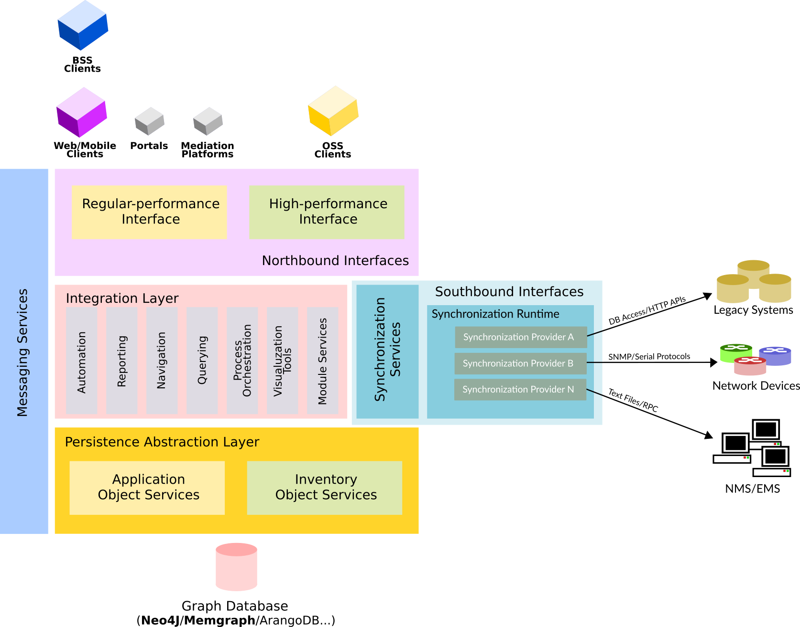

# Table of Contents
- [Table of Contents](#table-of-contents)
- [Introduction](#introduction)
- [Installation](#installation)
  - [Standalone](#standalone)
    - [Requirements](#requirements)
      - [Java Development Kit](#java-development-kit)
      - [The Server Application Bundle](#the-server-application-bundle)
  - [Deploying on an Existing Application Server](#deploying-on-an-existing-application-server)
  - [Docker](#docker)
    - [Using an External Database](#using-an-external-database)
- [Appendix A. Securing the Server](#appendix-a-securing-the-server)
  - [Recommendations](#recommendations)
- [Appendix B. Starting the Server on Boot](#appendix-b-starting-the-server-on-boot)
- [Appendix C. Using a Reverse Proxy](#appendix-c-using-a-reverse-proxy)
- [Appendix D. Accessing the Database](#appendix-d-accessing-the-database)
# Introduction
*This documentation applies to version **2.1.x***

**Kuwaiba** is an enterprise-ready network inventory platform geared towards the Telecommunications industry, but easily adaptable to other domains. It was designed to not only serve as an asset repository, but also to orchestrate complex business processes such as Service Provisioning, Activation, Modification and Termination, and to greatly speed the creation and integration of OSS (as in Operation Support Systems) applications. 

# Installation
## Standalone
### Requirements
#### Java Development Kit
JDK 11 is recommended, newer versions have not been tested and might not work. We recommend [OpenJDK](https://www.openjdk.org) and it's available in most distros, however, if you are struggling to find the right version on your package repository, Several vendors offer pre-compiled builds (including [Microsoft](https://learn.microsoft.com/en-us/java/openjdk/), [Amazon](https://docs.aws.amazon.com/corretto/latest/corretto-11-ug/downloads-list.html) and [OpenLogic](https://www.openlogic.com/openjdk-downloads)). We will use Amazon's JDK in this manual, but the instructions should apply to any other distribution. Unzip the installation package and copy it to your preferred location or install it using your package manager tools if a suitable installer is provider. This guide will assume you did the former.
#### The Server Application Bundle
Download the latest 2.1.x installation package from [SourceForge](https://sourceforge.net/projects/kuwaiba/files/Version%202.x/). Let's take a look at the contents:

   

* **data:** Contains the directory structure where the database and other files are stored by default. This structure can be customized via configuration variables later. If you don't want to make changes to the default configuration, create the directory `/data`, copy the contents of `data` inside, and make sure the user running Kuwaiba has read and write permissions.
* **dbs:** Contains sample databases used to bootstrap the system. The `database 01` is completely empty, save for the default data model. It has no containment structure, sample objects or list types. This database is recommended for those already familiar with the platform and those who are ready to run a production instance. The `database 02` is no longer maintained and will be most likely removed in the future. It contains the same as the `database 02` plus a basic containment structure. `The database 03` is recommended for those willing to explore the features in Kuwaiba. It contains examples of several technologies, layouts, list types, validators, filters, configuration variables, topologies, views, reports and automated tasks, among many other goodies.
* **kuwaiba_server_2.1.x-stable.jar:** This file is the actual application. It has an embedded Tomcat server, so you don't need any other third-party software to run it. The extension of this file is `.jar`, but it's a regular `.zip` file, and you can open it with the archive manager of your preference. Inside you will find all the stylesheets and images to change the appearance of the UI.

The most important file is `application.properties`. It contains several configuration variables that govern the behavior of Kuwaiba as shown in the table below. You can change the values to your convenience and pack the `.jar` file again (most archive managers will repack the file when you save the text file).

| Variable Name | Default Value   |Description   |
| ------------- | ------------- | ------------- |
| ws.port | 8080 |The port where the server will run. Note that this port is used to serve the UI, but it is different from that used to serve the web service |
| spring.devtools.add-properties | false |Enable/disable Spring devtools. They're disabled automatically for all `jar` builds, but not for `war` files |
| general.corporate-logo | http://neotropic.co/img/logo_small.png | Corporate Logo URL. To be used primarily in reports and branding-related features |

## Deploying on an Existing Application Server
## Docker
### Using an External Database
# Appendix A. Securing the Server
## Recommendations
* Make sure the user running the server only has access to the data directories and has as little other privileges as possible. Also, disable its shell access as instructed in the [installation section](#installation).
* Install a firewall (ufw works pretty well) and restrict access to non-necessary ports.
* Disable SSH user/password authentication and favor key-based authentication.
# Appendix B. Starting the Server on Boot
# Appendix C. Using a Reverse Proxy
# Appendix D. Accessing the Database
