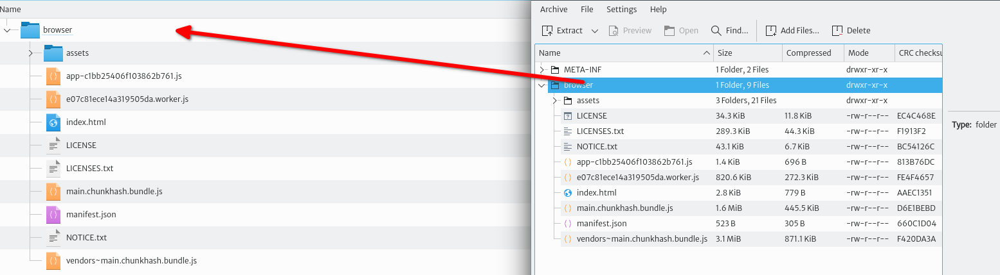
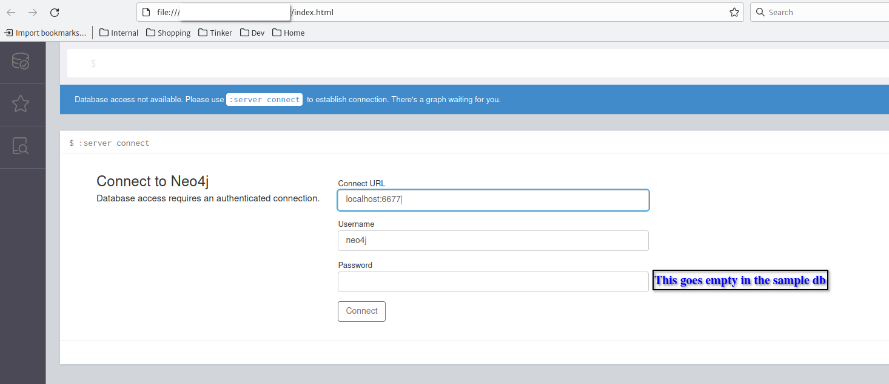
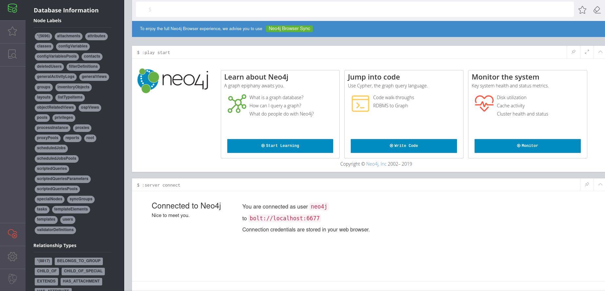

# Appendix D. Accessing the Database 
The reference implementation of the Persistence API (the layer in Kuwaiba that abstracts the access to the database, so changing the DMBS is transparent to upper layers) in Kuwaiba 2.1.1 uses [Neo4J](https://www.neo4j.org) 3.5.5. You can make your own implementation to support other backends, and the project actually intends to support other graph databases in the mid-term. In this reference implementation, Neo4J works in [embedded mode](https://neo4j.com/docs/java-reference/current/java-embedded/), which means that a mini database server runs on the same virtual machine as the application. This provides important performance improvements, but somehow limits the scalability of the system, so the current development version of Kuwaiba (2.5) will drop its support in favor of a more scalable serve mode. If you want to access the database directly, you can only do it from the same machine the server is running, as external connections are refused in embedded mode. This can be fixed by using an [SSH tunnel](https://www.ssh.com/academy/ssh/tunneling), as we will see later. Having said that, we will review the procedure to connect the official Neo4J browser to the database of a running instance of Kuwaiba.

The Neo4J server includes a javascript client that works just fine and never fails to connect. We will extract it from the standard installer and use it on a regular browser:

1. Download Neo4J 3.5. Neo Technologies goes through great lengths to hide the open source versions behind several "Get Our Cloud/Enterprise Products" pages. The actual download page is [this one](https://neo4j.com/deployment-center/?ref=subscription#community). Neo Technologies also remove older versions of their products (Kuwaiba 2.5 uses Neo4J 4.4). Thankfully, the download link is composed by the name of the version, so we can [infer it](https://neo4j.com/artifact.php?name=neo4j-community-3.5.5-windows.zip) from the other downloads.

2. Inside the file, go to `lib` and search for the file `neo4j-browser-3.2.18.jar`. Jar are simple .zip files with another extension. Unzip that file.

3. The client application is inside a folder called `browser` as shown in the picture below. Open `index.html` with your preferred browser.

4. This will open a log in page. Use `localhost:6677` in the **Connect URL** field and leave the password empty.

5. Verify it worked if the left panel shows all the labels and relationship types. You are ready to start executing cypher queries in the text field at the top.

> **Note**
> 
> You can use a copy of the Kuwaiba database and use it on an actual N4J server and run tests without disturbing the inventory application.

