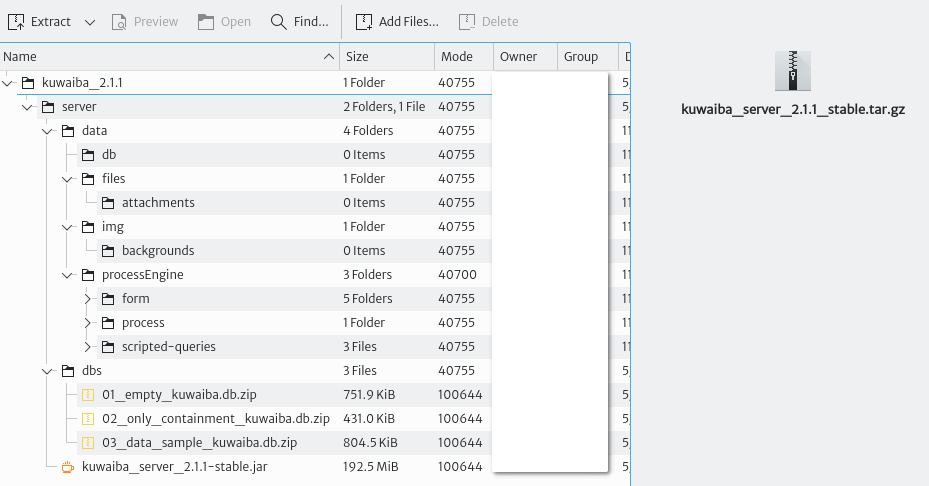
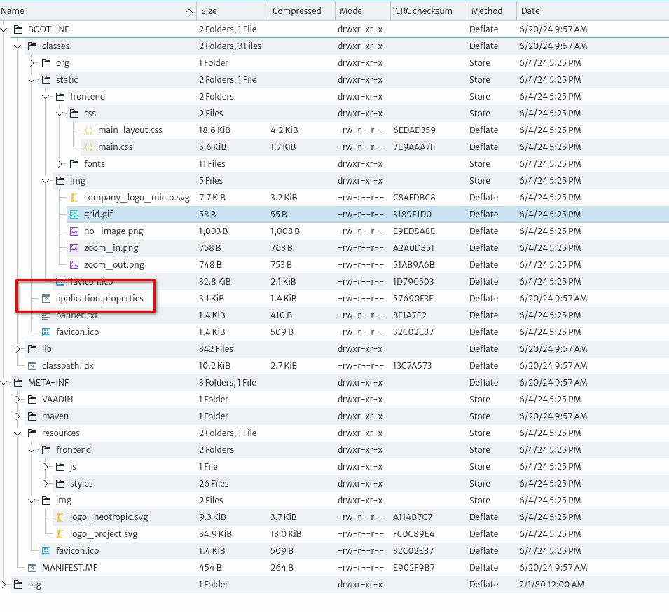
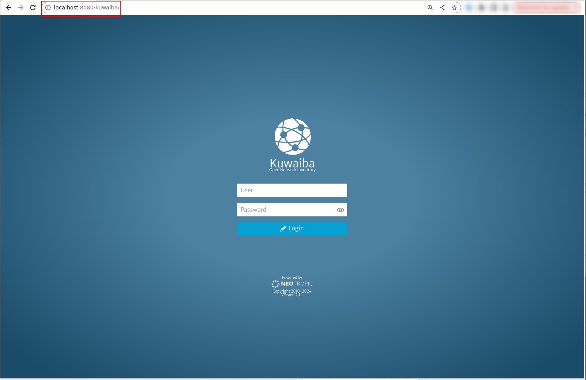

# Installation

## Standalone

### Requirements

#### Java Development Kit

JDK 11 is recommended, newer versions have not been tested and might not work. We recommend [OpenJDK](https://www.openjdk.org) and it's available in most distros, however, if you are struggling to find the right version on your package repository, Several vendors offer pre-compiled builds (including [Microsoft](https://learn.microsoft.com/en-us/java/openjdk/), [Amazon](https://docs.aws.amazon.com/corretto/latest/corretto-11-ug/downloads-list.html) and [OpenLogic](https://www.openlogic.com/openjdk-downloads)). We will use Amazon's JDK in this manual, but the instructions should apply to any other distribution. Unzip the installation package and copy it to your preferred location or install it using your package manager tools if a suitable installer is provider. This guide will assume you did the former.

#### The Server Application Bundle

Download the latest 2.1.x installation package from [SourceForge](https://sourceforge.net/projects/kuwaiba/files/Version%202.x/). Let's take a look at the contents:

   

* **data:** Contains the directory structure where the database and other files are stored by default. This structure can be customized via configuration variables later. If you don't want to make changes to the default configuration, create the directory `/data`, copy the contents of `data` inside, and make sure the user running Kuwaiba has read and write permissions.
* **dbs:** Contains sample databases used to bootstrap the system. The `database 01` is completely empty, save for the default data model. It has no containment structure, sample objects or list types. This database is recommended for those already familiar with the platform and those who are ready to run a production instance. The `database 02` is no longer maintained and will be most likely removed in the future. It contains the same as the `database 02` plus a basic containment structure. `The database 03` is recommended for those willing to explore the features in Kuwaiba. It contains examples of several technologies, layouts, list types, validators, filters, configuration variables, topologies, views, reports and automated tasks, among many other goodies.
* **kuwaiba_server_2.1.x-stable.jar:** This file is the actual application. It has an embedded Tomcat server, so you don't need any other third-party software to run it. The extension of this file is `.jar`, but it's a regular `.zip` file, and you can open it with the archive manager of your preference. Inside you will find all the stylesheets and images to change the appearance of the UI.



The most important file is `application.properties`. It contains several configuration variables that govern the behavior of Kuwaiba as shown in the table below. You can change the values to your convenience and pack the `.jar` file again (most archive managers will repack the file when you save the text file).

| Variable Name | Default Value   |Description   |
| ------------- | ------------- | ------------- |
| server.port | `8080` |The port where the server will run. Note that this port is used to serve the UI, but it is different from that used to serve the web service |
| ws.port | `8081` |The port where the SOAP-based web service will listen |
| db.port | ``6677`` | Database port, if applicable. The default value is not the same default Neo4J's server port. Connections to this port from other hosts rather than localhost will be denied |
| spring.devtools.add-properties | `false` |Enable/disable Spring devtools. They're disabled automatically for all `jar` builds, but not for `war` files |
| general.corporate-logo | `http://neotropic.co/img/logo_small.png` | Corporate Logo URL. To be used primarily in reports and branding-related features |
| db.path | `/data/db/kuwaiba.db` | Database path |
| aem.backgrounds-path | ``/data/img/backgrounds`` | Path of the folder where background images for Object Views are saved |
| bem.attachments-path | ``/data/files/attachments`` | Path of the folder where files attached to inventory objects are stored |
| spring.scheduler.enabled | ``true`` | Enables/disables the job scheduler service |

### Running the Server

The simplest method starts the server in foreground and logs in the standard output:

```bash
/path/to/java/installation/dir/bin/java -jar /path/to/kuwaiba/kuwaiba_server_2.1.x-stable.jar
```

The [nohup](https://en.wikipedia.org/wiki/Nohup) command allows you to launch the server so that it is not terminated once you logout from the terminal. In this case, unless you redirect the output, the application will log to `/home/<user>/nohup.out`:

```bash
nohup /path/to/java/installation/dir/bin/java -jar kuwaiba_server_2.1-stable.jar&
```

In production environments it is highly recommended to create a special, restricted user to run the server. To run the server as that user, you can use the following command (application messages will be logged in `/home/YOURUSER/nohup.out`):

```bash
sudo runuser -u YOURUSER -- nohup /path/to/java/installation/dir/bin/java -jar kuwaiba_server_2.1-stable.jar&
```

[Appendix B](#appendix-b-starting-the-server-on-boot) discusses how to configure the server to start on boot.

## Deploying on an Existing Application Server

### Requirements

|Tool | version |
| ------ | ------ |
| Java | 11 |
| Apache Tomcat | 9.0.37 |

### Process Description

1. After you have installed Apache Tomcat in the requested version, generate the .war file of the project and place it in the `/webapps` folder inside tomcat.
   1.1. If you want to set a specific path for the .war file when deploying. You can do this by modifying the `server.xml` file as follows.
   It is important to set the `autoDeploy` and `deployOnStartup` attributes to false. Automatic deployment allows for easier management but also makes it easier for an attacker to deploy a malicious application. Only the contexts defined in `server.xml` will be deployed and any changes will require a restart of Tomcat.

   ```bash
   <Host name="localhost"  appBase="webapps"
      unpackWARs="true" autoDeploy="false" deployOnStartup="false">
      <Context path="/kuwaiba" docBase="kuwaiba.war"/>
      <Context path="" docBase="sa.war"/>

      <Valve className="org.apache.catalina.valves.AccessLogValve" directory="logs"
            prefix="localhost_access_log" suffix=".txt"
            pattern="%h %l %u %t &quot;%r&quot; %s %b" />
   </Host>
   ```

2. Remove the default tomcat applications as these are unsafe applications from `/tomcat/webapps`.
3. If you need to create a management user, you can edit the `tomcat-users.xml` file, usually located in `tomcat/conf`.
Note: It is important to limit access to users. Since some roles allow modifications to the deployed files or tomcat configurations.
In case you find it necessary to create a user, make sure that their credentials are secure.

```bash
<role rolename="manager-status"/>
<role rolename="manager-jmx"/>
<role rolename="manager-script"/>
<user username="admin" password="admin123" roles="manager-status"/>
 ```

4. After the above settings, you can start tomcat manually `./opt/tomcat/bin/startup.sh`

### Configure Tomcat as a Startup Task

1. To configure tomcat as a startup task, you create a systemd service file in `/etc/systemd/system/tomcat.service`:

>Note: It is recommended to run Tomcat with a specific user for security reasons.

```bash
[Unit]
Description=Apache Tomcat Web Application Container
After=network.target

[Service]
Type=forking

Environment=JAVA_HOME=/route/java
Environment=CATALINA_HOME=/opt/tomcat/
ExecStart=/opt/tomcat/bin/startup.sh
ExecStop=/opt/tomcat/bin/shutdown.sh

User=tomcat user
Group=tomcat group
Restart=always

[Install]
WantedBy=multi-user.target
```

1. After creating the service file, reload the systemd daemon so that it recognizes the new service:

```bash
sudo systemctl daemon-reload
```

### Installation of Self-signed Certificates in Tomcat

1. Modify the server.xml file as follows to use the self-signed certificate

```bash
<Connector port="8443" protocol="org.apache.coyote.http11.Http11NioProtocol"
           maxThreads="150" SSLEnabled="true">
    <SSLHostConfig>
        <Certificate certificateKeystoreFile="conf/certificate.jks"
        certificateKeystorePassword="certificate password"
        type="RSA" />
    </SSLHostConfig>
</Connector>
```

When restarting Tomcat and accessing <https://localhost:8443/kuwaiba> the browser will warn you that the certificate is untrusted, and you can then see the kuwaiba interface.

### Configure User Permissions

If you run kuwaiba from apache tomcat with a specific tomcat user. You have to give read and write permissions to the tomcat user to some paths designated by kuwaiba.

* `/opt/tomcat/*`
* `/data/db`
* `/data/processEngine/`
* `/data/files/attachments`
* `/data/img/backgrounds`

Tomcat is added to your user's group. To allow your user access to the logs and files generated at runtime by the user tomcat.

```bash
sudo usermod -aG groupName tomcat
```

Then change the permissions so that users belonging to the same group can access the specified files.

```bash
sudo chmod -R g+rwx /data
```

In this way, Kuwaiba will be deployed to the address where the Tomcat server is running (port 8080, by default), as follows



## Docker

### Pulling the Image

For nightly builds (which are not really generated nightly, but at least once a week), use:

```bash
docker pull neotropic/kuwaiba:v2.1-nightly
```

### Deployment

#### Starting the Container

The container exposes 2 ports: 8080 (application) and 8081 (SOAP-based web service). You can use the following command to run the container and map those ports to the host machine.

```bash
docker run -dp 8080-8081:8080-8081 --name kuwaiba-server neotropic/kuwaiba:v2.1-nightly
```

Now it's possible to access the application by going to <http://localhost:8080/kuwaiba⁠>, or to access the SOAP-based web service API WSDL at <http://localhost:8081/kuwaiba/KuwaibaService?wsdl⁠>

#### Using a Custom Database

To avoid losing information across containers when you update an image, you can mount a custom database (thus overriding the stock one) located in your host machine and reuse it in different containers:

```bash
docker run -dp 8080-8081:8080-8081 --name kuwaiba-server -v /path/to/your/custom/database:/data/db/kuwaiba.db neotropic/kuwaiba:v2.1-nightly
```

Make sure the user used to run the container has write access on ``/path/to/your/custom/database``. You can download empty or sample databases from the [Sourceforge repository](https://sourceforge.net/p/kuwaiba/code/HEAD/tree/server/trunk/dbs/)⁠

#### Additional Information

* **Default Server Credentials:** admin/kuwaiba. There are several other users used to showcase the Process Manager capabilities in ``database 03``. You can check them out in the **User Manager** module. Their passwords are also ``kuwaiba``.
* **Data Directory:** /data
* **Application Directory:** /opt/programs

### Generate Your Own Image

* Fetch the Dockerfile from the [project repository⁠](https://sourceforge.net/p/kuwaiba/code/HEAD/tree/server/trunk/docker/) on SourceForge. Alternatively, you can also download the docker compose file from the same repository⁠
* Customize the Dockerfile depending on your needs.
* Build the image with:

```bash
docker build -t REPOSITORY_NAME:TAG .
```

where REPOSITORY_NAME is the name of the repository where the image will be placed and TAG is the tag for such container. Instead, you can also use the docker compose file like this:

```bash
docker compose -f kuwaiba.yaml up
```
