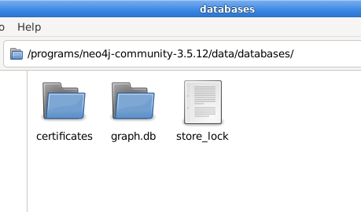
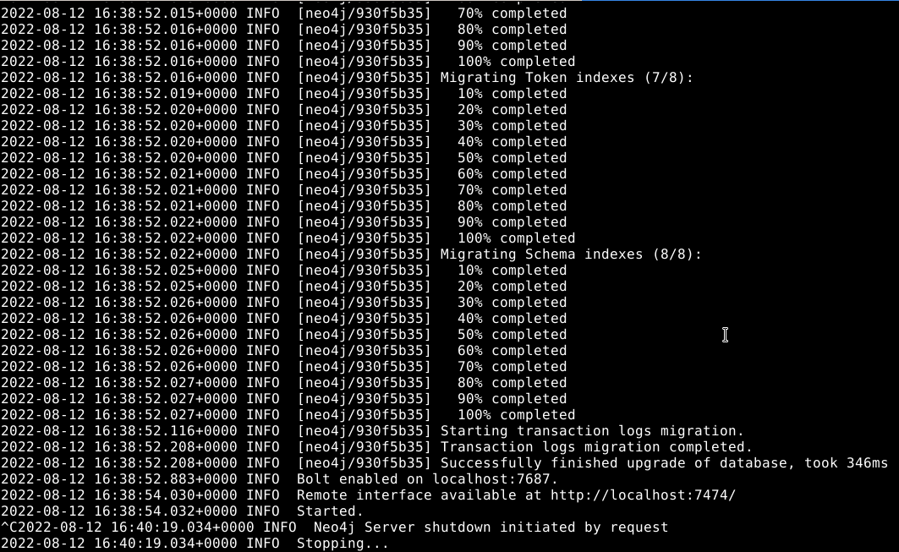
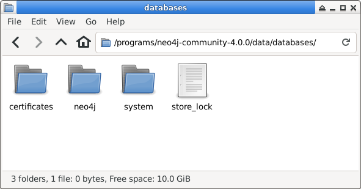
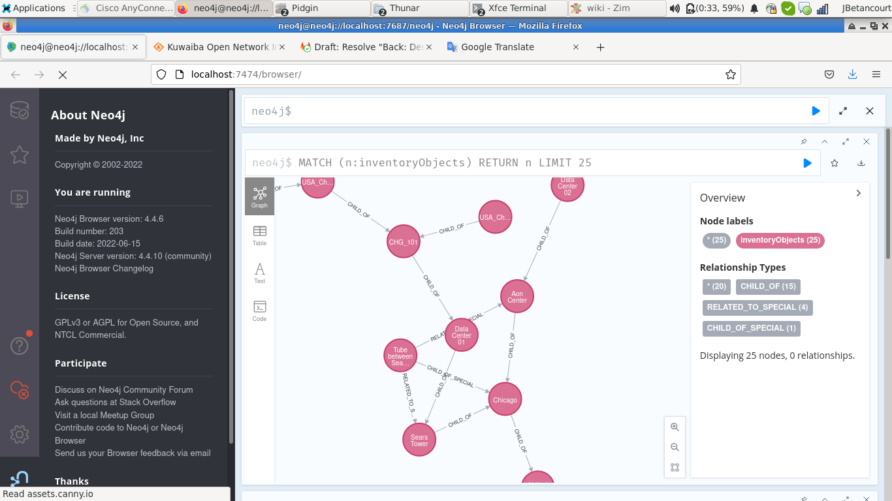
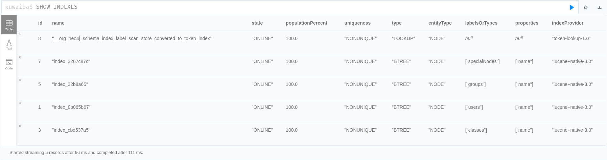
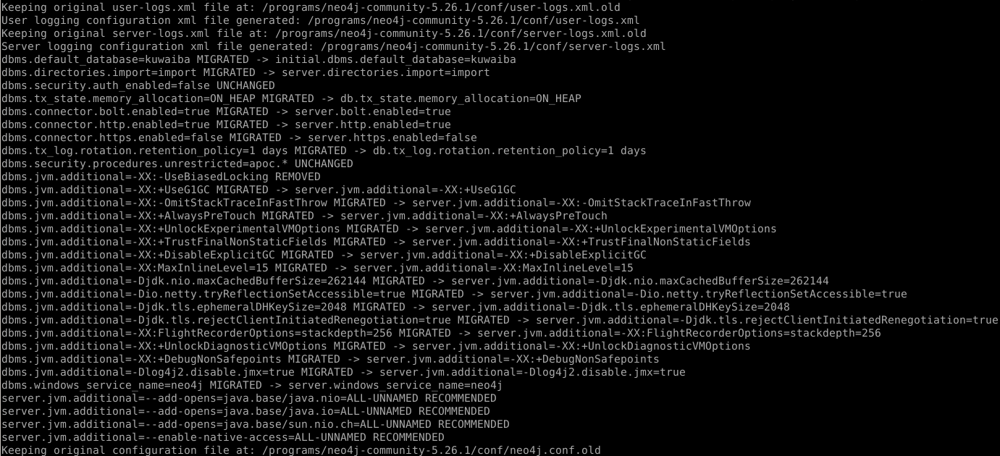
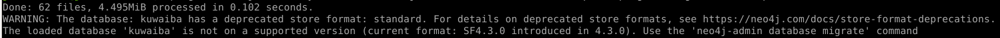
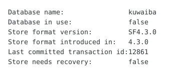
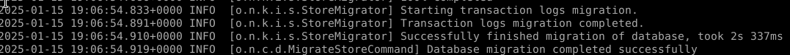
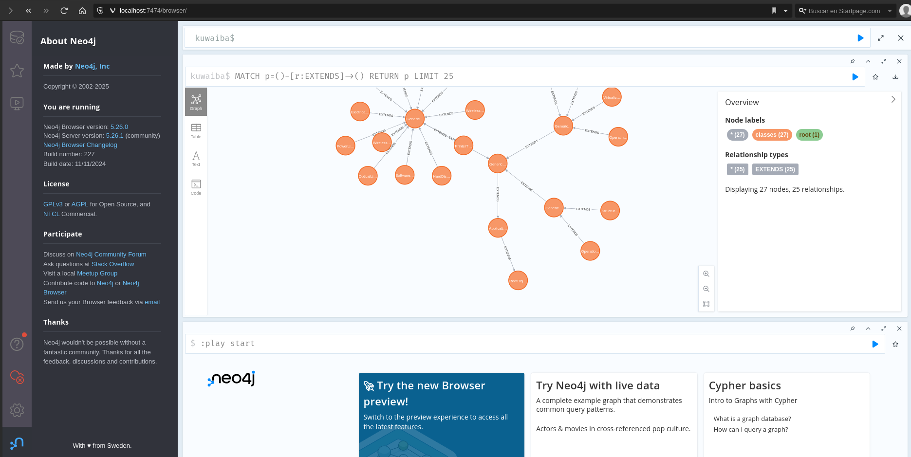

# Upgrading Database from Kuwaiba 2.1.1

Neo4j migration is the process of migrating an existing single deployment to a newer MAJOR version. Such migrations require a review of the Neo4j configurations. 

## Upgrading Database from Neo4j 3.5.x to 4.4.x

The migration process of Neo4j from version 3.x.x to 4.4.x is possible through two methods:

* **Direct migration (Neo4j Enterprise Edition)**

* **Sequential migration (Neo4j Community Edition)**

The focus will be on the **sequential migration** process available for the community edition of Neo4j.

### Sequential migration

Following the sequential patch migrate Neo4j deployment from 3.5.lastest to 4.0.lastest then sequentially upgrade it to 4.1.lastest, 4.2.lastest, 4.3.lastest and 4.4.lastest

#### Migration from Neo4j 3.5.5 to 3,5,12

During the migration process, we will work with the following directories:

- **`$Neo4j_HOME`**: Refers to the directory of the currently installed Neo4j version (e.g., version 3.5.5).
- **`$New_Neo4j_HOME`**: Refers to the directory of the new Neo4j version to which the system will be upgraded (e.g., version 3.5.12).

We start the migration from neo4j-community-3.5.5 to 3.5.12, this due to compatibility issues from version 3.3.5 to 4.0.0.

1. **Backup Current Database Files**  
   Create a backup of your current database files located in `$Neo4j_HOME/data`.

2. **Install Neo4j Community Version 3.5.12**  
   Download and install [Neo4j Community 3.5.12](https://neo4j.com/download-thanks/?edition=community&release=3.5.12&flavour=unix&_gl=1*1d1w708*_ga*NzMzOTU0MDMwLjE2MzE3MTkwODQ.*_ga_DL38Q8KGQC*MTY2MDE2MTI3MS4yNi4xLjE2NjAxNjE2MDEuMA..&_ga=2.67751121.1383424675.1660148212-733954030.1631719084).
   

3. **Copy and Replace the Data Folder**  
   - Take the entire contents of the `data` folder (including the `databases` and `dbms` directories) from `$Neo4j_HOME/data`.  
   - Copy these contents and paste them into the `$New_Neo4j_HOME/data` folder, replacing all its contents.

4. **Rename the Database Folder**  
   Rename your database folder to `graph.db` within `$New_Neo4j_HOME/data/databases/` seen in Figure 1 .
    
|  |
|:--:|
| ***Figure 1.** Replace and rename database* |

5. **Prepare the neo4j.conf** 
   In the file `neo4j.conf` into the (**$New_Neo4j_HOME/conf**) uncomment the next lines:
	* `Set dbms.allow_upgrate=true`
	* `Set dbms.default_database=graph.db `

6. **Start migration** 
  Start the migration process by running the following command: (**$New_Neo4j_HOME/bin/neo4j console**). This command starts the database migration process and launches the Neo4j server. Once complete, the server will be accessible at [http://localhost:7474](http://localhost:7474).  

|  |
|:--:|
| ***Figure 2.** Migration process* |

7. **Stop the server**
   Stop the server to continue the migration (Ctrl + C ).

#### Migration from 3.5.12 to 4.4.17

Once the database has been migrated to version 3.5.12, it is possible to migrate to version 4.0.0

> **Note**: Before preparing for migration, it is essential to verify that Java 11 is installed. While Neo4j 3.5.x uses Java 8, upgrading to version 4.0.x requires Java 11 as a mandatory prerequisite.

During the migration process, we will work with the following directories:

- **`$Neo4j_HOME`**: Refers to the directory of the currently installed Neo4j version (e.g., version 3.5.12).
- **`$New_Neo4j_HOME`**: Refers to the directory of the new Neo4j version to which the system will be upgraded (e.g., version 4.0.0).

1. **Backup Current Database Files**  
   Create a backup of your current database files located in `$Neo4j_HOME/data`.

2. **Install Neo4j Community Version 4.0.0**  
   Download and install [Neo4j Community 4.0.0](https://neo4j.com/download-thanks/?edition=community&release=4.0.0&flavour=unix&_gl=1*1d1w708*_ga*NzMzOTU0MDMwLjE2MzE3MTkwODQ.*_ga_DL38Q8KGQC*MTY2MDE2MTI3MS4yNi4xLjE2NjAxNjE2MDEuMA..&_ga=2.67751121.1383424675.1660148212-733954030.1631719084).
   

3. **Copy and Replace the Data Folder**  
   - Take the entire contents of the `data` folder (including the `databases` and `dbms` directories) from `$Neo4j_HOME/data`.  
   - Copy these contents and paste them into the `$New_Neo4j_HOME/data` folder, replacing all its contents.

4. **Rename the Database Folder** 
   Rename your database folder to `neo4j` within `$New_Neo4j_HOME/data/databases/` From this new version onwards we have the concept of multi databases and `graph.db` is not a valid name, the databases have to follow a naming convention and can not contain special characters including dots as seen in Figurw 3. 

|  |
|:--:|
| ***Figure 3.** New format databases* |

5. **Prepare the neo4j.conf** 
   In the file `neo4j.conf` into the (**$New_Neo4j_HOME/conf**) uncomment the next lines:
	* `Set dbms.allow_upgrate=true`
	* `Set dbms.default_database=neo4j`

6. **Start migration** 
  Start the migration process by running the following command: (**$New_Neo4j_HOME/bin/neo4j console**). This command starts the database migration process and launches the Neo4j server. Once complete, the server will be accessible at [http://localhost:7474](http://localhost:7474).  

7. **Stop the server** 
   Stop the server to continue the migration (Ctrl + C ).
 
Once the migration to version 4.0.0 is complete, it is essential to follow a sequential migration path to avoid potential issues. This process involves upgrading through intermediate versions step by step, repeating steps 1 to 7 after each upgrade. The recommended sequential migration path is outlined below:

> **Note**: Starting from version 4.0.0, the default database name must be **neo4j**. Ensure that the database name is correctly set before proceeding with the migration to avoid compatibility issues.

1. **Neo4j 4.0.0 → Neo4j 4.1.12**
   - Download [Neo4j 4.1.12.](https://neo4j.com/download-thanks/?edition=community&release=4.1.12&flavour=unix&_gl=1*1d1w708*_ga*NzMzOTU0MDMwLjE2MzE3MTkwODQ.*_ga_DL38Q8KGQC*MTY2MDE2MTI3MS4yNi4xLjE2NjAxNjE2MDEuMA..&_ga=2.67751121.1383424675.1660148212-733954030.1631719084)
   - Repeat steps 1 to 7.
   - Completed the migration to version 4.1.12.  

2. **Neo4j 4.1.12 → Neo4j 4.2.19**
   - Download [Neo4j 4.2.19.](https://neo4j.com/download-thanks/?edition=community&release=4.2.19&flavour=unix&_gl=1*1d1w708*_ga*NzMzOTU0MDMwLjE2MzE3MTkwODQ.*_ga_DL38Q8KGQC*MTY2MDE2MTI3MS4yNi4xLjE2NjAxNjE2MDEuMA..&_ga=2.67751121.1383424675.1660148212-733954030.1631719084)
   - Repeat steps 1 to 7.
   - Completed the migration to version 4.2.19.

3. **Neo4j 4.2.19 → Neo4j 4.3.12**
   - Download [Neo4j 4.3.12.](https://neo4j.com/download-thanks/?edition=community&release=4.3.12&flavour=unix&_gl=1*1d1w708*_ga*NzMzOTU0MDMwLjE2MzE3MTkwODQ.*_ga_DL38Q8KGQC*MTY2MDE2MTI3MS4yNi4xLjE2NjAxNjE2MDEuMA..&_ga=2.67751121.1383424675.1660148212-733954030.1631719084)
   - Repeat steps 1 to 7.
   - Completed the migration to version 4.3.12.

4. **Neo4j 4.3.12 → Neo4j 4.4.10**
   - Download [4.4.10.](https://neo4j.com/download-thanks/?edition=community&release=4.4.10&flavour=unix&_gl=1*1d1w708*_ga*NzMzOTU0MDMwLjE2MzE3MTkwODQ.*_ga_DL38Q8KGQC*MTY2MDE2MTI3MS4yNi4xLjE2NjAxNjE2MDEuMA..&_ga=2.67751121.1383424675.1660148212-733954030.1631719084)
   - Repeat steps 1 to 7.
   - Completed the migration to version 4.4.10

5. **Neo4j 4.4.10 → Neo4j 4.4.17**
   - Download [4.4.17.](https://neo4j.com/download-thanks/?edition=community&release=4.4.17&flavour=unix&_gl=1*1d1w708*_ga*NzMzOTU0MDMwLjE2MzE3MTkwODQ.*_ga_DL38Q8KGQC*MTY2MDE2MTI3MS4yNi4xLjE2NjAxNjE2MDEuMA..&_ga=2.67751121.1383424675.1660148212-733954030.1631719084)
   - Repeat steps 1 to 7 one last time.
   - Completed the migration to version 4.4.17.

By following this sequential migration process and repeating steps 1 to 8 at each stage, you can ensure a smooth transition to Neo4j version 4.4.17 without encountering migration errors.

Finally we will have migrated from Neo4j 3.5.5 to 4.4.17, to run the server use (**$New_Neo4j_HOME/bin/neo4j start**).

|  |
|:--:|
| ***Figure 4.** Neo4j server version 4.4.17* |

## Upgrading Database from Neo4j 4.4.17 to 5.26.1

The migration to Neo4j version 5.x.x is **only possible** from version 4.4.x. The migration process of Neo4j from version 4.4.x to 5.26.1 is possible through two methods:

* **Using Backups command (Neo4j Enterprise Edition)**

* **Through Backup Dump command  (Neo4j Community Edition)**

The focus will be on the **Backup Dump Command** process available for the community edition of Neo4j.

### Backup Dump Migration

> **Note**: Before you start preparing for migration , it is very important verify that you have installed Java 17 because under Neo4j 5.x.x Java 17 is used, when you upgrade to 5.x.x it has a hard requirement on Java 17.

During the migration process, we will work with the following directories:

- **`$Neo4j_HOME`**: Refers to the directory of the currently installed Neo4j version (4.4.17 - JAVA 11).
- **`$New_Neo4j_HOME`**: Refers to the directory of the new Neo4j version to which the system will be upgraded (5.26.1 - JAVA 17).

#### Prepare database

Before performing the migration, it is necessary to make changes to the database to ensure compatibility with Neo4j 5.

##### Create Index
Since the index system used in the major versions of Neo4j has been modified in version 5.x.x, it is necessary to create new indexes for each of the currently existing indexes in the database. 
In Neo4j versions 4.1.x, the indexes are of type BTREE, which has been replaced in version 5.x.x with RANGE, POINT, and TEXT types.

* **Range indexes**: Neo4j’s default index. Supports most types of predicates.
* **Text indexes**: solves predicates operating on STRING values. Optimized for queries filtering with the STRING operators CONTAINS and ENDS WITH.
* **Point indexes**: solves predicates on spatial POINT values. Optimized for queries filtering on distance or within bounding boxes.
* **Token lookup indexes**: only solves node label and relationship type predicates (i.e. they cannot solve any predicates filtering on properties). Two token lookup indexes (one for node labels and one for relationship types) are present when a database is created in Neo4j.

Start the process by checking the current indexes in the database using the Neo4j console, run (**$Neo4j_HOME/bin/neo4j start**) and use the (**SHOW INDEXES**) command. 
This command will display the existing indexes as seen in the Figure 5. Review this information and create the new indexes according to their respective types.

|  |
|:--:|
| ***Figure 5.** SHOW INDEXES Command* |

To create indexes in the Neo4j console, use the following command:
**CREATE `index_type` INDEX `new_index_name` FOR (`n:label`) ON (`n.property`)**

For example, to create a TEXT index to property name and label special nodes:
**CREATE `TEXT` INDEX `text_index_specialNodes_name` FOR (`n:specialNodes`) ON (`n.name`)**

Once the indexes have been created, verify that they are online, and then proceed to delete obsolete BTREE indexes using the following command in the Neo4j console: **DROP INDEX index_name**

##### Backup Database
To ensure data security during the migration process, a backup of the database is performed by generating a `.dump` file using the following command:

**$Neo4j_HOME/bin/neo4j-admin dump --database=**`database_name` **--to=**/`path-to-file/file.dump`

In this example: **$Neo4j_HOME/bin/neo4j-admin dump --database=**`kuwaiba` **--to=**`/neo4j/migration/kuwaiba.dump`

#### Install Neo4j 5
Download the last [Neo4j Server 5.x.x](https://neo4j.com/docs/operations-manual/5/installation/) version, actually current version is [5.26.1](https://neo4j.com/download-thanks/?edition=community&release=5.26.1&flavour=unix).

##### Migrate the Neo4j configuration file
Starting from version 5.x.x, it is possible to migrate the Neo4j configuration from version 4.4.x. To do so, use the following command:

**`New_Neo4j_HOME/bin/`neo4j-admin server migrate-configuration --from-path=**/`$Neo4j_HOME/conf` **--to-path=**/`$New_Neo4j_HOME/conf/`

> **Note**: To execute the Neo4j 5.x.x version requirement Java 17.

|  |
|:--:|
| ***Figure 6.** Migrate configuration command* |

Once the configuration migration is complete as seen in Figure 6, the default configuration of Neo4j 5 will be saved in `New_Neo4j_HOME/conf/neo4j.conf.old` in case you wish to restore it.

Verify that in `New_Neo4j_HOME/conf` the file `neo4j.conf` has the following configuration or else add it:
* `Uncomment and set dbms.allow_upgrate=true`
* `Uncomment and set initial.dbms.default_database=kuwaiba` 

#### Migrate Database
Once Neo4j Server 5.x.x is installed and configured, we proceed to migrate the database. To do so, we use the following command, which will load and adjust the database to version 5.x.x:

**New_Neo4j_HOME/bin/neo4j-admin database load --from-path=**`/path/to/dump/ file dump_file_name`

In this example: 

**New_Neo4j_HOME/bin/neo4j-admin database load --from-path=**`/neo4j/migration/ kuwaiba`

If there is already a database in `New_Neo4j_HOME/data` with the same name as the one you wish to migrate, use the --overwrite-destination=true flag to replace it.

If additional configurations are required for the migration, refer to the options available for [Neo4j version 5.x.x](https://neo4j.com/docs/operations-manual/5/backup-restore/restore-dump/#_options).

|  |
|:--:|
| ***Figure 7.** Warning migrating database* |

When migrating the database as seen in Figure 7, a warning will appear indicating that the **storage format** is deprecated. This is because, starting with Neo4j version 5.x.x, the storage format was changed. However, the format change is not possible directly from version 4.4.x, as this update was introduced in later versions.

##### Chance Store Format
The storage format describes how information is written to disk. Starting with version 5.x.x, the supported formats include `block`, `aligned`, `standard` and `high_limit`. For the **Community edition of Neo4j**, the recommended format is **aligned**, so we will proceed to change it. Before doing so, you can check the current database format in version 4.4.x using the following command:
 
**`$Neo4j_HOME/bin`/neo4j-admin store-info `$Neo4j_HOME/data/databases/`**`data_base_name`

|  |
|:--:|
| ***Figure 8.** Neo4j 4.4.17 store format* |

As can be seen in Figure 8, the storage format in version 4.4.17 is `SF4.3.0`, not compatible with 5.xx, we proceed to change the format with:

**`New_Neo4j_HOME/bin/ddneo4j-admin` database migrate --to-format=**`store_format data_base_name`

In this example:

**`New_Neo4j_HOME/bin/neo4j-admin` database migrate --to-format=**`aligned kuwaiba`

|  |
|:--:|
| ***Figure 9.** Migrate completed* |

As shown in Figure 9, this concludes the migration process from Neo4j 4.4.17 to 5.26.1. To run the server, use the following command: **`$New_Neo4j_HOME/bin/neo4j start`**

|  |
|:--:|
| ***Figure 10.** Warning migrating database* |