# Introduction to 5G Modeling in Kuwaiba: Application  in IoT and Mobile Internet

This manual is designed for anyone interested in modeling 5G networks and IoT applications using the **Kuwaiba** tool. **This model is one of many possible versions** and does not aim to be a definitive recipe, as Kuwaiba allows for a multitude of different approaches.

The objective is to provide a step-by-step guide on how to structure and manage the network resources (RFS) that support customer-facing services (CFS), in these cases, the operation of smart traffic lights and the provision of **mobile internet** connectivity over a 5G network. This approach not only helps visualize the network topology but also understand how different components interact to ensure efficient and reliable services.

Throughout the manual, we will explore how Kuwaiba facilitates the configuration and modeling of these elements, allowing telecommunications companies to leverage the advanced capabilities of 5G to enable **IoT** and **mobile internet** applications with precision and flexibility.

# Table of Contents

- [1. Introduction to 5G Modeling in Kuwaiba: Application in IoT and Mobile Internet](#1-introduction-to-5g-modeling-in-kuwaiba-application-in-iot-and-mobile-internet)
  - [1.1 Required RFS for 5G Smart Traffic Lights and Mobile Internet Service](#11-required-rfs-for-5g-smart-traffic-lights-and-mobile-internet-service)
    - [1.1.1 Network Connectivity](#111-network-connectivity)
      - [1.1.1.1 Radio Access Network (RAN)](#1111-radio-access-network-ran)
      - [1.1.1.2 Fronthaul](#1112-fronthaul)
      - [1.1.1.3 Network Backhaul](#1113-network-backhaul)
    - [1.1.2 Edge Computing](#112-edge-computing)
    - [1.1.3 5G Core Network](#113-5g-core-network)
      - [1.1.3.1 User Plane Function (UPF)](#1131-user-plane-function-upf)
      - [1.1.3.2 Session Management Function (SMF)](#1132-session-management-function-smf)
      - [1.1.3.3 Access and Mobility Management Function (AMF)](#1133-access-and-mobility-management-function-amf)
    - [1.1.4 Network Slicing](#114-network-slicing)
      - [1.1.4.1 Dedicated Network Slice for IoT (Smart Traffic Lights)](#1141-dedicated-network-slice-for-iot-smart-traffic-lights)
      - [1.1.4.2 Dedicated Network Slice for Mobile Internet](#1142-dedicated-network-slice-for-mobile-internet)
    - [1.1.5 IoT Platforms](#115-iot-platforms)
      - [1.1.5.1 IoT Device Management Platform](#1151-iot-device-management-platform)
      - [1.1.5.2 Mobile Device Management Platform](#1152-mobile-device-management-platform)
    - [1.1.6 Security Infrastructure](#116-security-infrastructure)
      - [1.1.6.1 Virtual Firewalls](#1161-virtual-firewalls)
      - [1.1.6.2 Authentication and Authorization Functions](#1162-authentication-and-authorization-functions)
    - [1.1.7 Sensor Networks and Data Feeds](#117-sensor-networks-and-data-feeds)
      - [1.1.7.1 IoT Sensors](#1171-iot-sensors)
      - [1.1.7.2 Mobile Device Location and Data Feeds](#1172-mobile-device-location-and-data-feeds)
- [2. DATA MODEL](#2-data-model)
  - [2.1 RAN](#21-ran)
  - [2.2 Edge Computing / 5GCN / IMS /RIC](#22-edge-computing-5gcn-ims-ric)
  - [2.3 Applications](#23-applications)
  - [2.4 Connections](#24-connections)
  - [2.5 Slicing](#25-slicing)

# 1. Required RFS for 5G Smart Traffic Lights and Mobile Internet Service

To model **smart traffic lights** and **mobile internet** services on a **5G network** using the **RFS (Resource Facing Service)** concept, we need to understand the physical and virtual elements that make these services possible. These include the connectivity infrastructure, processing units, and platforms that support the operation of IoT devices (smart traffic lights) and mobile services.

Below, we'll dive into each module and explain how it contributes to the overall architecture of 5G IoT services.

---
### 1.1 Network Connectivity

**Network Connectivity** is the backbone of the 5G system, ensuring data is transmitted efficiently between devices, sensors, and the central network. The two key components here are **Radio Access Network (RAN)** and **Backhaul**:

### 1.2 Radio Access Network (RAN)
- **What it is**: The **RAN** is the part of a mobile network that connects user devices, like smartphones or IoT devices (e.g., smart traffic lights), to the core network. It includes key elements such as **antennas**, **Remote Radio Units (RRUs)**, and **Distributed Units (DUs)**.
- **For smart traffic lights**: RAN provides wireless connectivity between the traffic lights and the 5G network.
- **For mobile internet**: RRUs and antennas allow mobile devices (smartphones, tablets) to connect to the network, supporting high-speed data transmission.

### 1.3 Fronthaul
- **What it is**: The **fronthaul** connects the Radio Unit (RU) to the Distributed Unit (DU) in the 5G RAN, facilitating the communication between antennas and the rest of the network.
- **Importance**: Ensures low-latency communication between the antennas and the core network for both smart traffic lights and mobile users.

### 1.4 Network Backhaul
- **What it is**: **Backhaul** is the infrastructure that links the RAN (base stations) to the core network. Typically, it uses **fiber optic** or **microwave** links to carry data.
- **For both services**: Backhaul is crucial for transporting data from smart traffic lights and mobile devices to the network core, where the data is processed or forwarded to the internet.

### 1.5 Edge Computing

**Edge Computing** brings computation closer to the location where it's needed, reducing latency by processing data near the devices (IoT or mobile). This is essential for real-time operations like traffic control or high-speed internet delivery.

### Edge Computing Nodes
- **What they are**: These are localized processing units that perform computations near the IoT devices or mobile users, reducing the need to send data to centralized servers.
- **For smart traffic lights**: The edge nodes process traffic data locally, enabling real-time decisions for controlling traffic flow (e.g., changing light timings based on vehicle flow).
- **For mobile internet**: Edge nodes improve the speed of data delivery for mobile users by caching content locally and reducing the load on the central network.

### 1.6 5G Core Network

The **5G Core Network** is responsible for routing, managing sessions, and controlling user mobility. This section includes the critical network functions that manage IoT and mobile services.

### User Plane Function (UPF)
- **What it is**: The **UPF** is responsible for routing and forwarding user data traffic.
- **For smart traffic lights**: It routes IoT traffic between the smart traffic lights and control systems.
- **For mobile internet**: It handles high-volume user data and ensures proper routing to external networks (e.g., the internet).

### Session Management Function (SMF)
- **What it is**: The **SMF** manages sessions and tunnels, establishing, modifying, and terminating network connections.
- **For smart traffic lights**: It manages stable connections between the traffic lights and central control systems.
- **For mobile internet**: It ensures proper **Quality of Service (QoS)** by managing the sessions of millions of mobile devices.

### Access and Mobility Management Function (AMF)
- **What it is**: The **AMF** manages access and mobility, ensuring seamless connection and authentication for devices.
- **For smart traffic lights**: It handles mobility for IoT devices (smart traffic lights), allowing continuous connectivity.
- **For mobile internet**: It manages mobile user handovers between different cells, ensuring uninterrupted service for users on the move.

### 1.7 Network Slicing

**Network Slicing** is a feature of 5G that allows the network to be partitioned into multiple virtual networks (or slices) to meet specific service requirements, such as low-latency for IoT or high throughput for mobile data.

### Dedicated Network Slice for IoT (Smart Traffic Lights)
- **What it is**: A network slice configured to support the low-latency, high-reliability demands of smart traffic lights.
- **Why it's needed**: Ensures that traffic control systems can operate without delays, preventing accidents or traffic jams.

### Dedicated Network Slice for Mobile Internet
- **What it is**: A slice designed to handle large data volumes for mobile users, ensuring fast internet access.
- **Why it's needed**: Provides high bandwidth and efficient allocation of resources for mobile internet users.

### 1.8 IoT Platforms

### IoT Device Management Platform
- **What it is**: A platform that manages IoT devices (e.g., smart traffic lights), providing real-time monitoring and firmware updates.
- **For smart traffic lights**: This platform allows operators to configure and manage the operational parameters of the traffic lights remotely, ensuring optimal performance.

### Mobile Device Management Platform
- **What it is**: This platform manages mobile devices, ensuring secure access, authentication, and device enrollment.
- **For mobile internet**: It provides mobile operators with control over user devices, enhancing security and device tracking.

### 1.9 Security Infrastructure

### Virtual Firewalls
- **What they are**: Firewalls that secure communication between IoT devices (smart traffic lights) and control systems or between mobile devices and the core network.
- **For smart traffic lights**: Protects sensitive data from unauthorized access or cyber-attacks.
- **For mobile internet**: Ensures the security of user data and protects the core network from external threats.

### Authentication and Authorization Functions
- **What they are**: These functions ensure that only authorized devices can access the network.
- **For both services**: Guarantees that only trusted IoT or mobile devices can connect to the network, preventing unauthorized usage.

### 1.10 Sensor Networks and Data Feeds

### IoT Sensorssudo 
- **What they are**: Sensors that collect data from the environment, such as traffic flow or pedestrian activity, and feed this data to the network.
- **For smart traffic lights**: These sensors gather real-time information about traffic, which is used to adjust traffic light timings dynamically.

### Mobile Device Location and Data Feeds
- **What it is**: Location data from mobile devices that help optimize network coverage or provide location-based services.
- **For mobile internet**: This data helps the network optimize coverage and offer services tailored to a user’s location.

# 2. DATA MODEL

The Data Model Manager will be used to create all the necessary objets for the model. For an overview of what will be generated, see Figure 1

### Figure 1: High Level Diagram
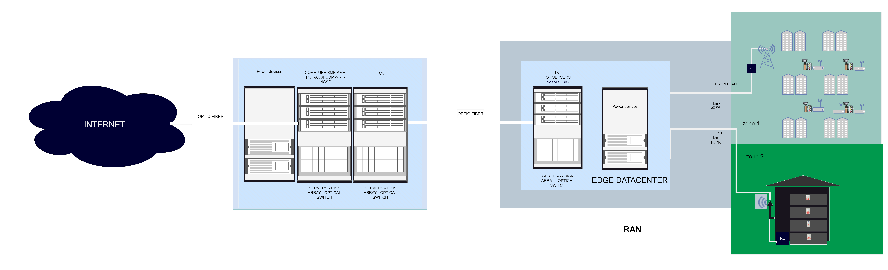  

Next, we will create all the necessary objects according to the proposed diagram.

### 2.1 RAN 

- **RRU (Remote Radio Unit)**, which will be connected via **fiber optic**.
- We also need **poles**, **towers**, or **indoor/outdoor assembly kits** for installation and infrastructure support. ## No differentiation will be made between the 5G antennas of Zones 1 and 2, but the connected devices (which must be added) will change, including cameras, smart traffic lights, indoor antennas, and embedded systems with sensors.

### Figure 2: RAN Objets
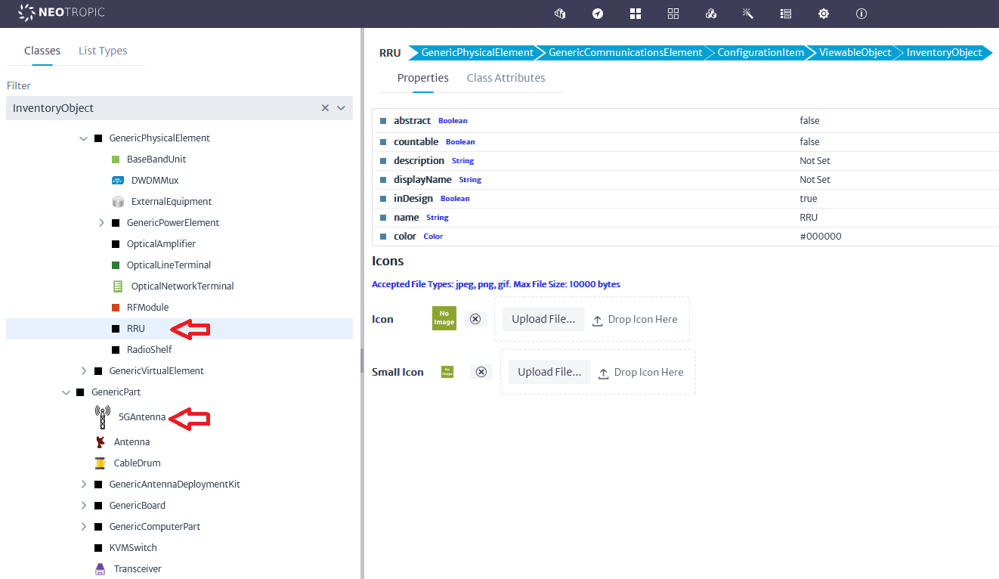  
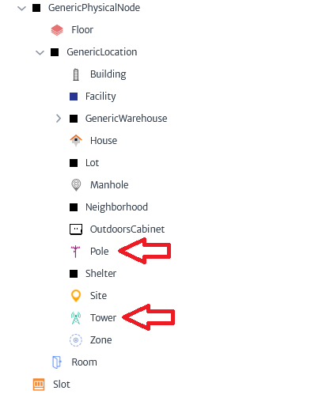  
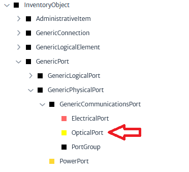

### 2.2 Edge Computing / 5GCN / IMS /RIC

In 5G, the approach shifts away from proprietary hardware with specialized interfaces. Instead, we leverage powerful servers that host **virtualized network functions (VNFs)** or **Network Functions Virtualization Infrastructure (NFVI)**. These VNFs are modular software components designed to perform specific, specialized functions within the network.

This new architecture enables greater flexibility and scalability, as the same physical infrastructure can support multiple functions through software rather than relying on dedicated hardware for each task. For our model, we will define several classes that will be used across different modules, each representing distinct software components or functions.

By using virtualized resources, we achieve a more efficient and adaptable network architecture, allowing us to quickly implement, manage, and scale network services as needed, without the limitations of traditional hardware-based solutions.

### Location or Facility

- **Container**: Could be a physical room, micro data center, or enclosed cabinet. It could even be housed in an outdoor environment, depending on how distributed the Edge is intended to be.
- **Rooms or datacenters**

### Servers

- **General-purpose compute servers**: These will process local data.
- **Storage arrays**: These could include high-performance SSDs to store relevant data closer to the source.

### Figure 3: Edge Computing 1.
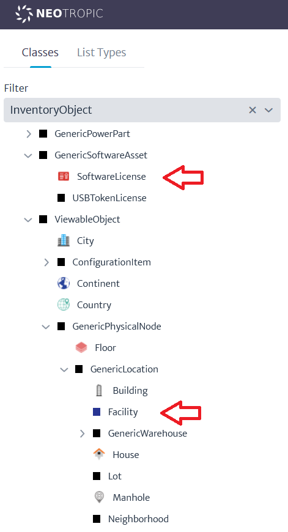  
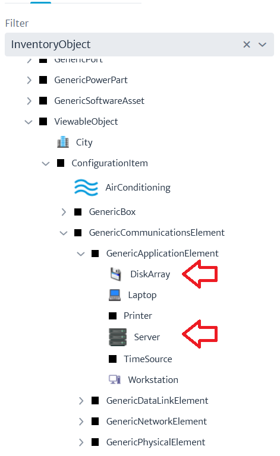 

### IOT devices
- **Cameras-5GRouters-Smart traffic lights**

### Figure 4: IOT Devices.
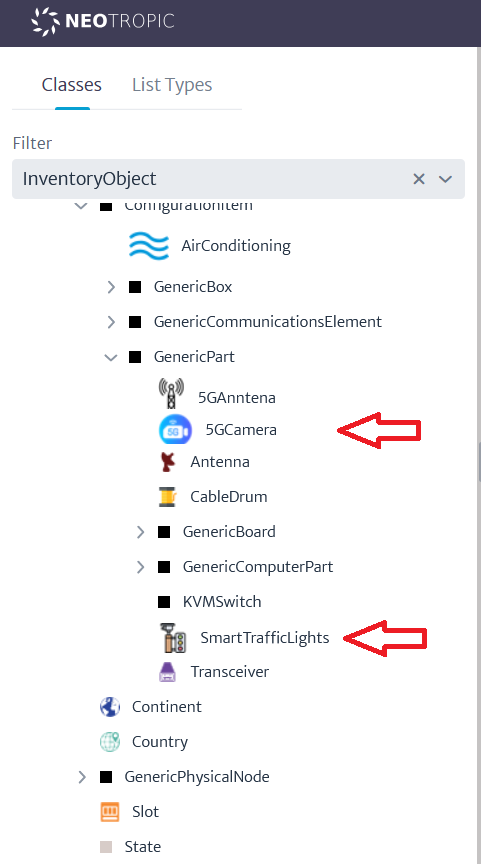  

### 2.3 Applications

#### Edge apps:
- **V2X applications (Vehicle-to-Everything)**: These would include software systems to manage vehicle communication with infrastructure, such as traffic lights.
- **Real-time analytics**: Applications that process IoT data from sensors, traffic cameras, and other devices at the Edge, enabling immediate decision-making.
- **DU software (Distributed Unit software)**: Handles functions related to the 5G network (e.g., signal processing, radio link management).
- **MEC (Multi-access Edge Computing) software**: A key part of many 5G deployments, it enables low-latency services and optimizes data processing at the Edge.
- **AI/ML inference engines**: For real-time decision-making, particularly if traffic monitoring and adaptive responses are a core part of the system.

#### 5GCN (5G Core Network) apps:
- **User Plane Function (UPF)**: Routing and forwarding of user data traffic.
- **Session Management Function (SMF)**: Management of sessions and network tunnels.
- **Access and Mobility Management Function (AMF)**: Management of device access and mobility.
- **Policy Control Function (PCF)**: Application and control of quality of service (QoS) policies.
- **Authentication Server Function (AUSF)**: Authentication of devices and users.
- **Unified Data Management (UDM)**: Management of subscription data and user profiles.
- **Network Repository Function (NRF)**: Registration of available network functions.
- **Network Slice Selection Function (NSSF)**: Selection and management of network slices.

### IMS (IP Multimedia Subsystem) apps:
- **Call Session Control Function (CSCF)**: Control of multimedia sessions (voice, video, messaging).
- **Multimedia Resource Function (MRF)**: Management of multimedia resources and voice/video mixing.
- **Home Subscriber Server (HSS)**: Management of subscriber information.
- **Media Gateway (MGW)**: Gateway for voice and multimedia traffic between IP and circuit networks.
- **Breakout Gateway Control Function (BGCF)**: Selection of network gateway for outgoing calls.

### RIC (RAN Intelligent Controller) apps:
- **Near-Real Time RIC (Near-RT RIC)**: Near-real-time control and optimization of the RAN

The first step will be to create a list of the software products that will be used under a fictional provider called 5GInc (for detailed information on the following steps, refer to the user manual, section on lists and software manager).

### Figure 5: List Type.
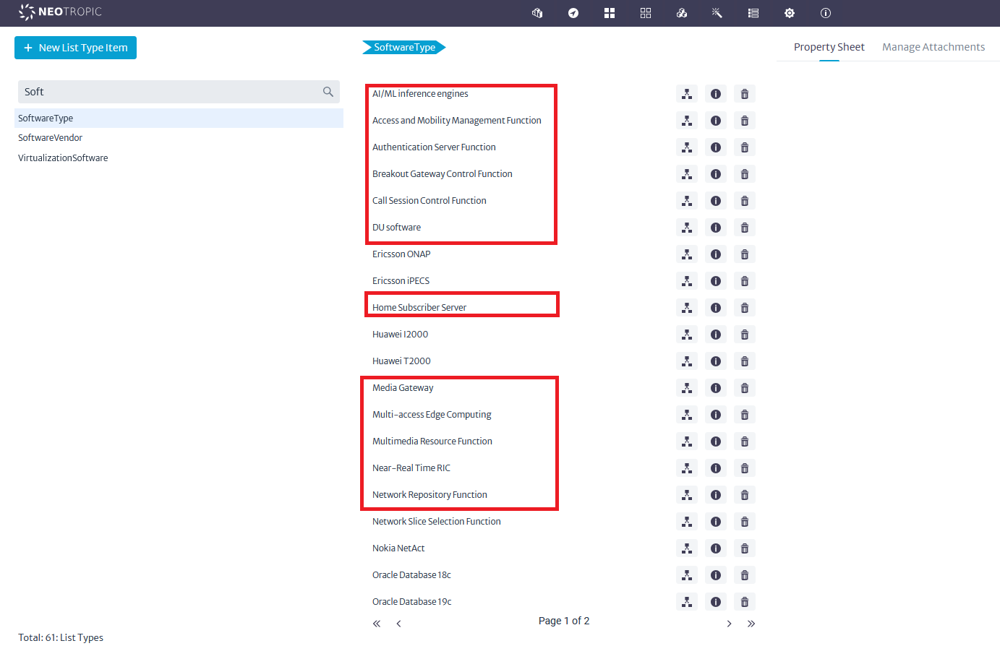
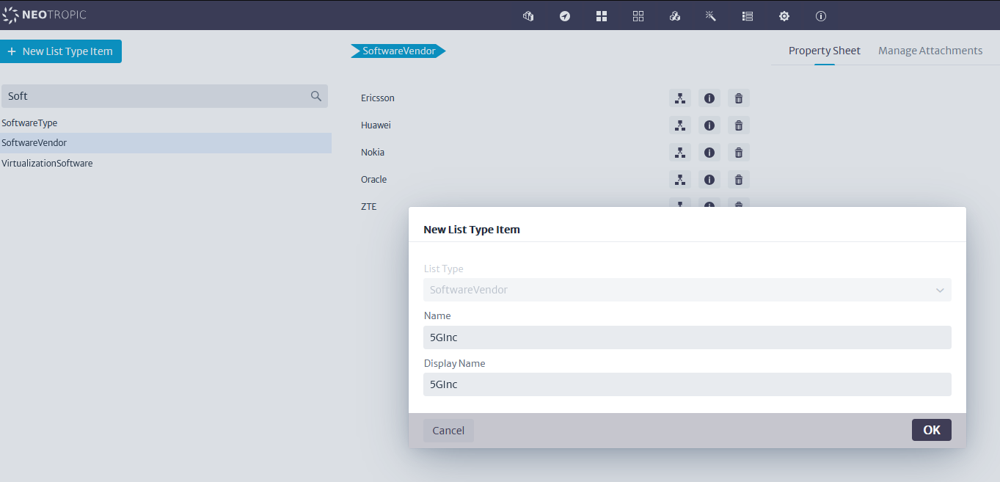 

The license management module will now be used to create a centralized license pool for 5G software.
### Figure 6: Software Manager.

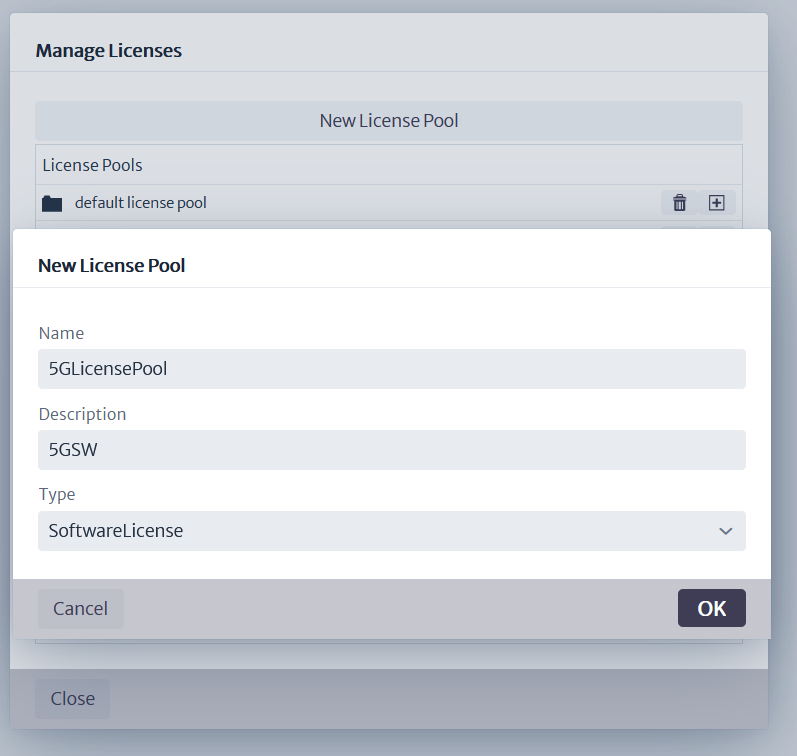 
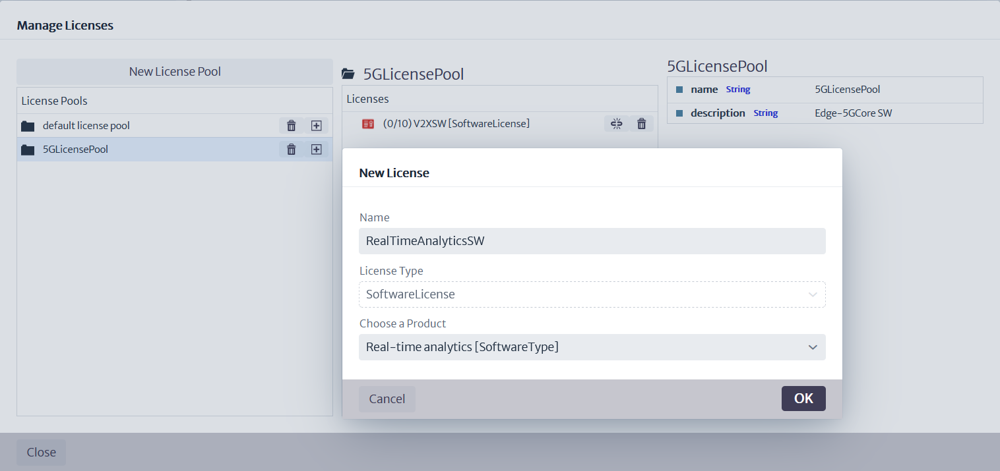 
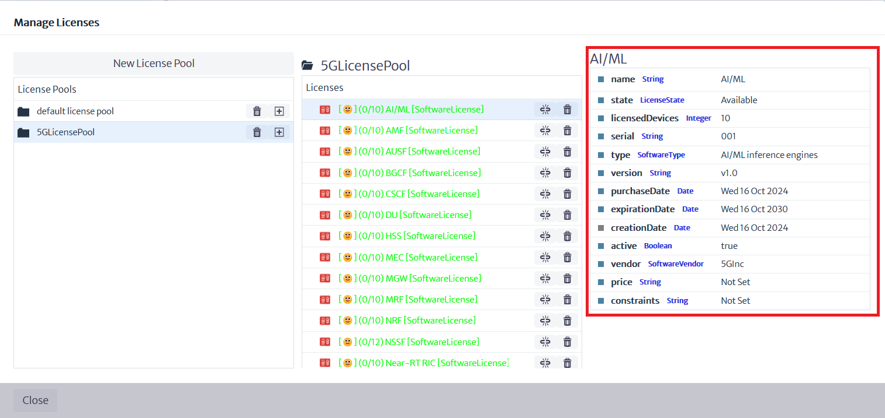 

Now, using the browser, ensure that the object trees are structured as follows.

RAM Zone 1:
- **America**
  - **Fruncia**
    - **FrunciaCity**
      - **Zone1**
        - Pole1 - ZoneX[Pole]
        - 5GRouterStreetX + SmartTrafficLightStreetX
        - Pole5
          - Antenna5G
            - RU
              - opticalPort

RAM Zone 2:
- **America**
  - **Fruncia**
    - **FrunciaCity**
      - **Zone2**
        - Building
          - Antenna5G
            - RU
              - opticalPort

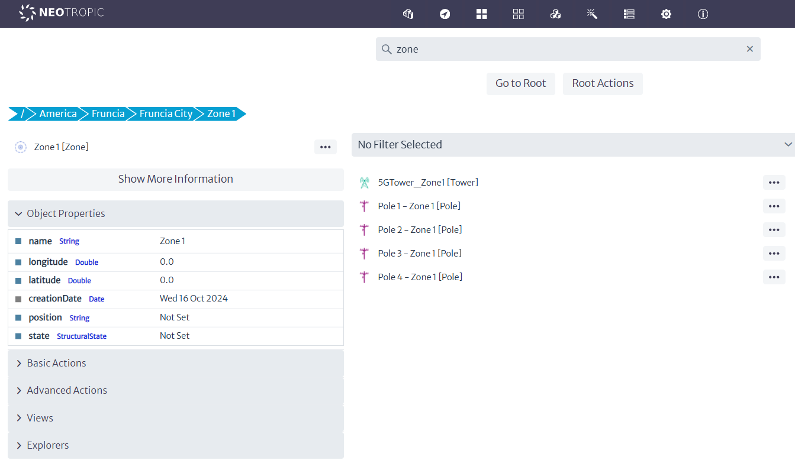

Edge Computing

- **RAM Zone 2:**
  - **America**
    - **Fruncia**
      - **FrunciaCity**
        - **EdgeDatacenter**
          - **Floor_1**
            - **EdgeRoom**
              - **EdgeRack**
                - (Servers/opticalPort-DiskArray/OpticalPort-OpticalSwitch)
            - **PowerRack**
              - UPS
                - PowerPort

### Figure 7: Software Manager.

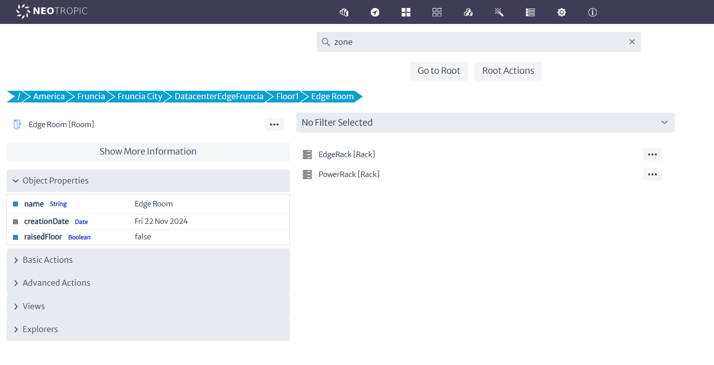 

Core Equipments
- **America**
  - **Fruncia**
    - **FrunciaCity**
      - **CoreDatacenter**
        - **Floor_1**
          - **CoreRoom**
            - **CoreRack**
              - (Servers/opticalPort-DiskArray/OpticalPort-OpticalSwitch)
          - **CURack**
            - (Servers/opticalPort-DiskArray/OpticalPort-OpticalSwitch)
          - **PowerRack**
            - UPS
              - PowerPort

Now we will associate the licenses with the servers. To do this, use the advanced actions menu of each server object, select the %G pool created, and assign the license to each server.

### Figure 8: Linking Licenses.

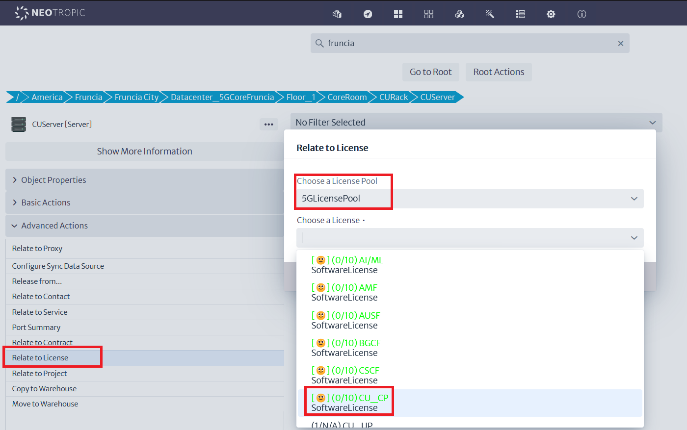 

We can now verify the result using the explorer:

### Figure 9: Explore relationships.
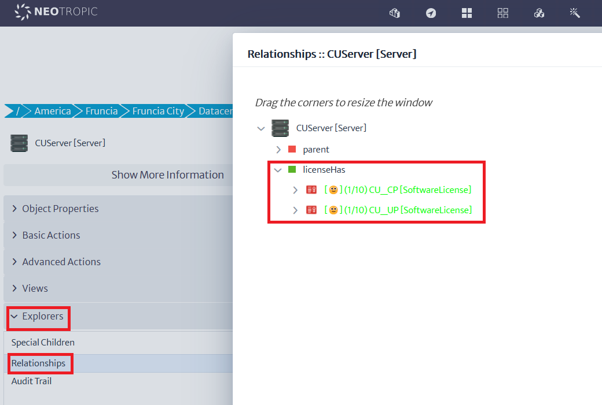 

### 2.4 Connections

Through the Object View option in the Views menu, we will create the internal connections of the racks, from the servers to the switch in each rack.

### Figure 10: Internal Physical Connections
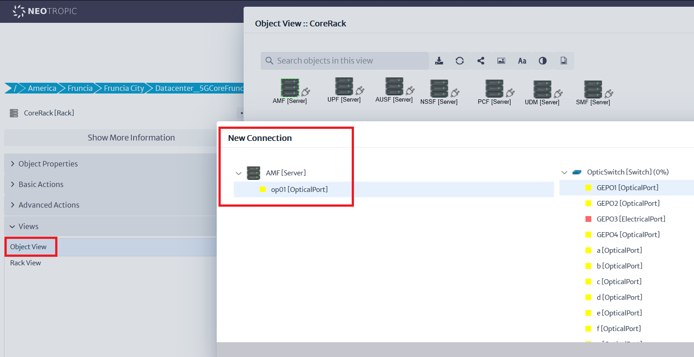 
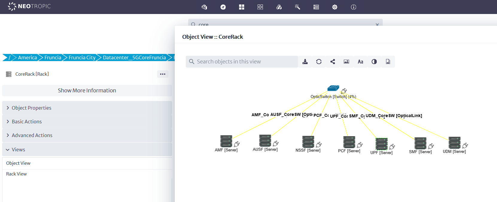 

---
We will now create wireless connections between the antennas and the traffic lights. To do this, we must ensure that ports exist at each end.  

###FALTA!!!
---

Electrical connections should be handled in the same way, except they are connections between electrical ports. Let's, for example, connect the Edge 
servers to a PDU within the rack, which would then connect to the power rack, a UPS, and a primary AC power source

### Figure 11: Power Connections
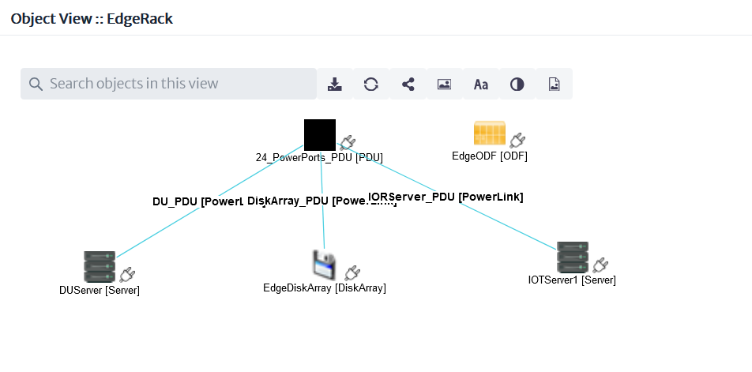 
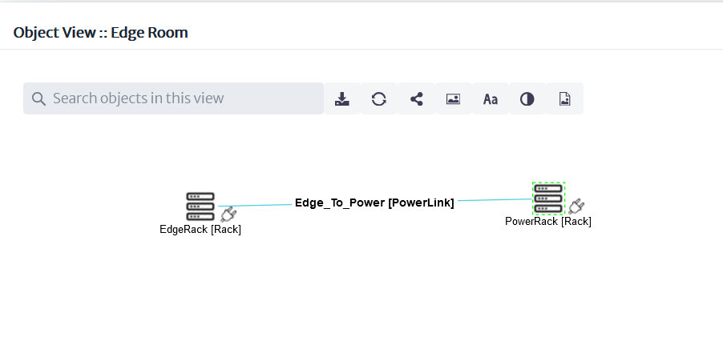 

### 2.5 Slicing

In this section, our goal is to represent the interactions between different software modules. It's important to remember that 5G introduces the concept of **network slicing**, which enables the creation of isolated virtual networks tailored to specific service requirements. Using this concept, we aim to design flexible and efficient network architectures.

By leveraging **special relationships** between modules, we can define how different parts of the system interact. For example, we can model a **Radio Access Network (RAN)** interacting with a single **Access and Mobility Management Function (AMF)**, which, in turn, may interact with different **Session Management Function (SMF)** and **User Plane Function (UPF)** modules, depending on the service being modeled. 

This allows us to **slice the network** in a way that provides optimal performance and resource allocation for various use cases, such as low-latency IoT services or high-throughput mobile data.

The relationships and virtual ports created between these modules represent the flow of data and control across the network, ensuring that each slice meets its unique requirements. These interactions between modules are fundamental to the flexibility and scalability of a 5G network, enabling a range of applications from IoT to mobile internet with varying performance and reliability needs.

As a reference, we will use Figure 12.

### Figure 12: Module "Connections"
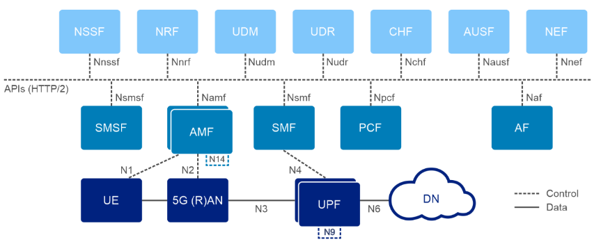 

Using the explorer, we can visualize the established relationships:

### Figure 13: Special Relationships
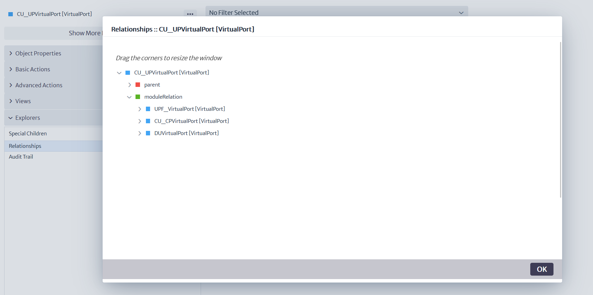

