# Creating a New Module
Modules in **Kuwaiba** help structure and organize various aspects of the system, facilitating the management of a wide range of resources and functionalities. They adapt to the changing requirements of the business and technological environment. Additionally, you can model any aspect relevant to everyday life.

- [Creating a New Module](#creating-a-new-module)
  - [Create a Module](#create-a-module)
    - [Kuwaiba Modules](#kuwaiba-modules)
    - [Web Client](#web-client)
  - [Module Structure:](#module-structure)
    - [Persistence API](#persistence-api)
  - [Consume the Kuwaiba service:](#consume-the-kuwaiba-service)
    - [BusinessObject and BusinessObjectLight](#businessobject-and-businessobjectlight)
    - [Entity Manager Interfaces](#entity-manager-interfaces)
    - [Internationalization and Localization Module](#internationalization-and-localization-module)
    - [Translation Service](#translation-service)
    - [Using Business Entity Manager](#using-business-entity-manager)
  - [Enable your Module](#enable-your-module)


## Create a Module

### Kuwaiba Modules

Application modules are located in the **Modules** folder of the main application.

**Kuwaiba** handles 3 types of modules:

- **Core Modules:** Main modules of the application.
- **Optional Modules:** These are additional modules specific for telecommunications management that are not essential for the basic operation of    **Kuwaiba**. Although **Kuwaiba** can operate without these modules, they can be useful for users who need telecommunication-related functionalities.
- **Commercial Modules:** Modules designed to be licensed commercially and that will not be open source, providing functions for more specific telecommunications technologies.

In the **Modules** folder you can create your own module:

| 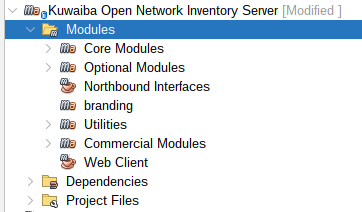 | 
|:--:|
| ***Figure 1: Kuwaiba Modules*** |

Create a Java application with Maven and name it as you prefer  (In this example, it was named **RentHouse**):

| 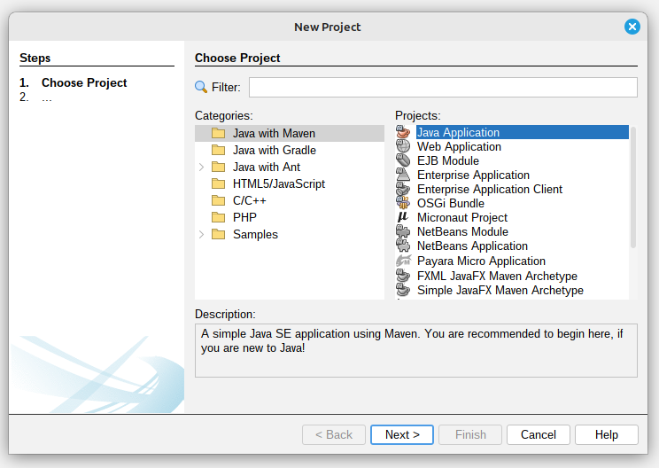 |
|:--:|
| ***Figure 2: Creating a New Project*** |

Your Project:

| 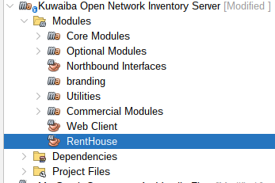 |
|:--:|
| ***Figure 3: Module Created*** |

### Web Client

In the main **Kuwaiba** application, we also have the **Web Client**, which serves as the entry point for the entire project.

Open the **Web Client** Application in the Main **Kuwaiba** Application:

| 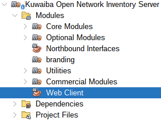 |
|:--:|
| ***Figure 4: Web Client*** |

Right-click on `Dependencies` and then click on `Add Dependency`:

| 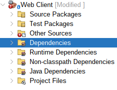 |
|:--:|
| ***Figure 5: Web Client Dependencies folder*** |

Select your project and add it to dependencies:

| 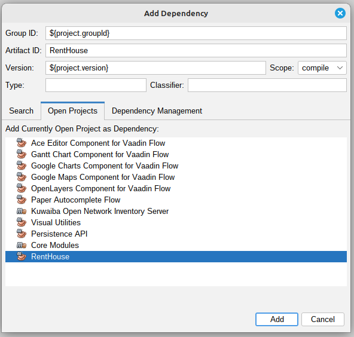 |
|:--:|
| ***Figure 6: Web Client Dependency Added*** |

> **Note**
>
> You can also add the dependency directly by editing the pom.xml file. 
>

## Module Structure:

Create the following Packages within the `Source Packages` of your Module:
- persistence.
- (`Your module name`), for this example renthouse.

> **Note**
>
>   Verify that your Packages follow this structure:
> 
>   org.neotropic.kuwaiba.modules.YOUR_PACKAGE
>


| 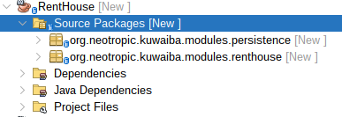 |
|:--:|
| ***Figure 7: Rent House Packages Structure*** |

Create the following Classes within the previously created Packages:

| 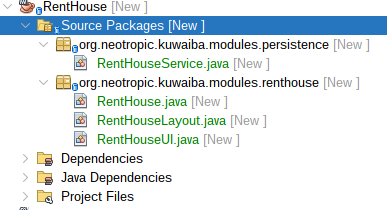 |
|:--:|
| ***Figure 8: Classes of each Package*** |

- persistence
  - `RentHouseService`: The RentHouseService class is a Spring service component to facilitate interaction with inventory objects.
- renthouse
  - `RentHouse`: The RentHouse class is a Spring component to define a specific module within the Kuwaiba application.
  - `RentHouseLayout`: This class is designed to define the layout structure for the Rent House module.
  - `RentHouseUI`: The RentHouseUI class is a Vaadin UI component designed to provide the user interface for the Rent House module.

Later, we will write the code that should go into each class.

### Persistence API

Contains the definition of the classes and interfaces necessary for communication with the database. For this purpose, **Kuwaiba** uses the **Persistence API**, which allows you to manage data in the database.

Open the **Persistence API** Application in the **Core Modules** of the Main **Kuwaiba** Application:

| 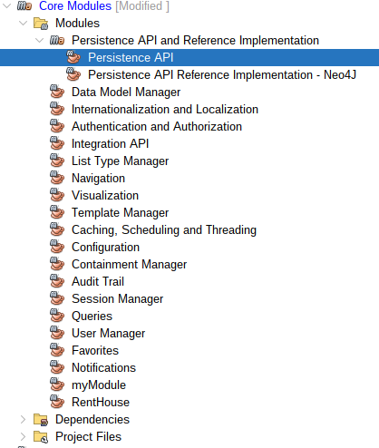 |
|:--:|
| ***Figure 9: Persistence API*** |

Add **Persistence API** to your module dependencies, right-click on `Dependencies` and then click on `Add Dependency`:

| 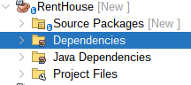 |
|:--:|
| ***Figure 10: RentHouse Dependencies folder*** |

Select **Persistence API** and add it to dependencies of your Module:

| 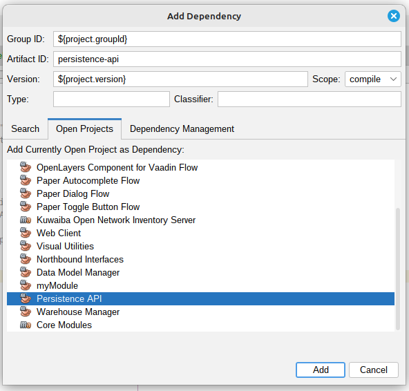 |
|:--:|
| ***Figure 11: Persistence API Dependency Added*** |

> **Note**
>
> You can also add the dependency directly by editing the pom.xml file. 
>

## Consume the Kuwaiba service:

### BusinessObject and BusinessObjectLight

Since Kuwaiba's data model is dynamic, the system allows you to create any object you need to manage your inventory, providing high flexibility and customization in its administration.

In **Kuwaiba** there are two types of Classes to create inventory objects:

- `BusinessObject`: It's a class that is used to map the inventory objects.
- `BusinessObjectLight`: It's the super class of Business Object.

`BusinessObjectLight` allows you to manage objects with the essential attributes of an entity in the database, such as ID, name, and class type. On the other hand, `BusinessObject` also includes these basic attributes and allows you to create objects with additional attributes, such as the creation date.

For the implementation of the example, we will use `BusinessObjectLight` to display the houses registered in the inventory, along with their basic attributes: id, name, and className. But first, we must understand some other concepts, which will be explained later.

### Entity Manager Interfaces

They are interfaces that define fundamental operations and interactions with different aspects of the system. In **Kuwaiba**, there are three types of **Entity Managers**, each serving a distinct purpose:
 
- `MetadataEntityManager`:Responsible for data model manipulation.
- `BusinessEntityManager`: Used to manipulate inventory objects, including adding, removing, updating, and retrieving items from the inventory.
- `ApplicationEntityManager`:Responsible for everything related to the application, such as user management and session handling 

### Internationalization and Localization Module

It's used to manage and adapt the content of **Kuwaiba** to different languages and regions.

| 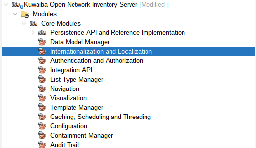 |
|:--:|
| ***Figure 12: Internationalization and Localization Module*** |

Modify `messages_en_US.properties` and `messages_es_CO.properties` files:

| 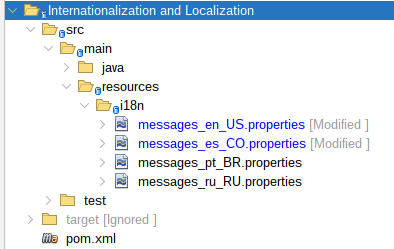 |
|:--:|
| ***Figure 13: Internationalization and Localization Module Structure*** |

Add the following content in the `messages_en_US.properties` file:

``` bash
    module.rent.house.name=Rent House Module
    module.rent.house.description=Rent House Module description...
    module.rent.house.title=Rent House :: Kuwaiba Open Network Inventory
```

Add the following content in the `messages_es_CO.properties` file:

``` bash
    module.rent.house.name=Renta de casas
    module.rent.house.description=Renta de casas descripcion...
    module.rent.house.title=Renta de casas :: Kuwaiba Open Network Inventory
```

### Translation Service

This interface provides translation services.

``` java
    @Autowired
    private TranslationService ts;
```
Use the `Translation Service`:

``` java
    public String getTranslation() {
        //Use the key from the internationalization file that you added
        return ts.getTranslatedString("module.rent.house.name");
    }
```

We will need the steps used in [Internationalization and Localization Module](#internationalization-and-localization-module) and [Translation Service](#translation-service) later.

### Using Business Entity Manager

Now that we have covered the previous concepts, let's begin writing the code for each class.

Consume the service through `BusinessEntityManager` interface. Insert the following code into your service Class:

``` java
    @Service
    public class RentHouseService {
        
        @Autowired
        private BusinessEntityManager bem; 
        
        public RentHouseService(){
            
        }
        
        public List<BusinessObjectLight> findAllBusinessObjectLight(String className,long page,int maxLimit ) 
                throws MetadataObjectNotFoundException, InvalidArgumentException{
            List<BusinessObjectLight> listObject = new ArrayList();
            listObject = this.bem.getObjectsOfClassLight(className, page, maxLimit);
            return listObject;
        }
    }
```

You can access the `BusinessEntityManager` interface to explore other services that Kuwaiba provides for managing inventory objects.

Insert the following code into your Module Class:

``` java
    @Component 
    public class RentHouse extends AbstractModule{

        public static final String MODULE_ID = "renthouse";
    
        @Autowired
        private ModuleRegistry moduleRegistry;
        
        @Autowired
        private TranslationService ts;
        
        @PostConstruct
        public void init() {
            // Register the module itself
            this.moduleRegistry.registerModule(this);
        }

        @Override
        public String getName() {
            return this.ts.getTranslatedString("module.rent.house.name");
        }

        @Override
        public String getDescription() {
            return this.ts.getTranslatedString("module.rent.house.description");
        }

        @Override
        public String getVersion() {
            return "2.1.1";
        }

        @Override
        public String getVendor() {
            return "Neotropic SAS <contact@neotropic.co>";
        }
        
        @Override
        public String getId() {
            return MODULE_ID;
        }

        @Override
        public AbstractModule.ModuleType getModuleType() {
            return AbstractModule.ModuleType.TYPE_OPEN_SOURCE;        
        }

        @Override
        public int getCategory() {
            return CATEGORY_ADMINISTRATION;
        }
    }
```

Insert the following code into your Layout Class:

``` java
    // Use the basic Kuwaiba layout
    public class RentHouseLayout extends ModuleLayout{ }
```

Create your view inside your UI Class:

``` java
    // renthouse is the route of your view
    @Route(value = "renthouse", layout = RentHouseLayout.class)
    public class RentHouseUI extends VerticalLayout implements HasDynamicTitle,AbstractUI{
        
        private final String MODULE_NAME = "RENT HOUSE BY: Neotropic SAS";
        
        @Autowired
        private RentHouseService rhs;
        
        @Autowired
        private TranslationService ts;
        
        private H3 title;
        
        private Grid<BusinessObjectLight> gridObjects;
        
        public RentHouseUI(){
            super();
            setSizeFull();
        }
        
        @Override
        public void initContent() {
        createTitle();
        createGridObjects();
        }
        
        private void createTitle(){
            this.title = new H3(MODULE_NAME);
            add(this.title);
        }
        
        private void createGridObjects(){
            try{
                List<BusinessObjectLight> objects = new ArrayList();
                
                objects = this.rhs.findAllBusinessObjectLight("House", 1, 10);
                
                this.gridObjects = new Grid<>(BusinessObjectLight.class, false);
                
                this.gridObjects.addColumn(BusinessObjectLight::getId).setHeader("ID");
                this.gridObjects.addColumn(BusinessObjectLight::getClassName).setHeader("Class Name");
                this.gridObjects.addColumn(BusinessObjectLight::getName).setHeader("Name");
                
                this.gridObjects.setItems(objects);
                
                add(this.gridObjects);
                
            }catch(InvalidArgumentException | MetadataObjectNotFoundException ex){
                new SimpleNotification(ts.getTranslatedString("module.general.messages.error"), ex.getLocalizedMessage(),
                        AbstractNotification.NotificationType.ERROR, ts).open();
            }
        }

        @Override
        public String getPageTitle() {
            return this.ts.getTranslatedString("module.rent.house.title");
        }
    }
```
## Enable your Module

Go to **User Manager**:

| 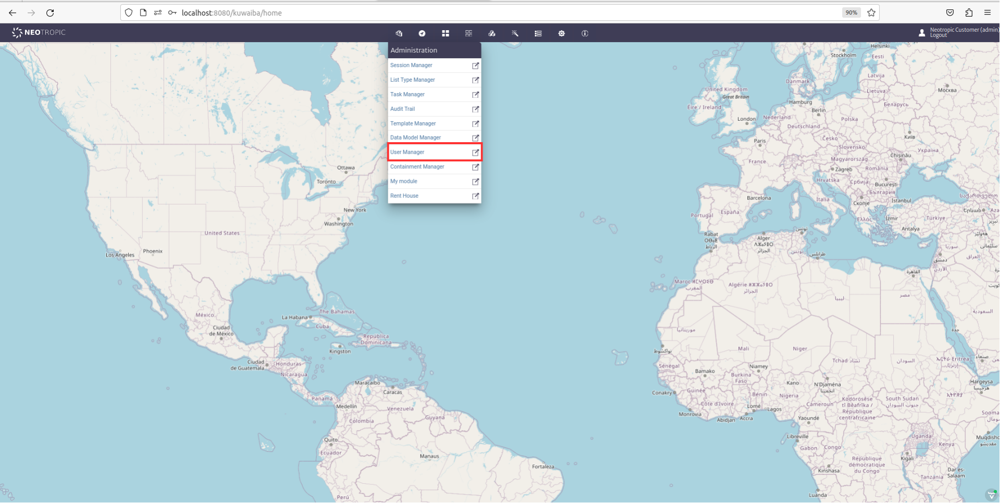 |
|:--:|
| ***Figure 14: User Manager*** |

In the Administrators section, look for and enable your module for the Neotropic Customer (admin):

|  |
|:--:|
| ***Figure 15: Enable the Module*** |

Navigate to your view:

| 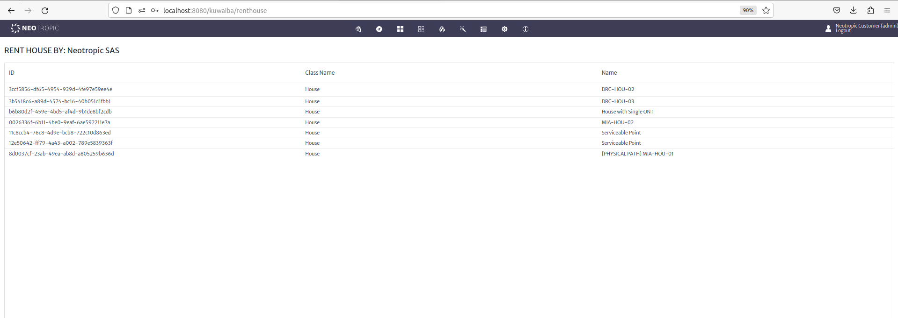 |
|:--:|
| ***Figure 16: Rent House View*** |


    


