# DWDM Ring
- [DWDM Ring](#dwdm-ring)
  - [Configuring the Templates](#configuring-the-templates)
  - [Creating the Devices](#creating-the-devices)
  - [Connecting the Devices](#connecting-the-devices)
  - [Summary](#summary)
  - [Cloning the Original Site](#cloning-the-original-site)
  - [Connecting the Sites](#connecting-the-sites)
    - [Using the Object View](#using-the-object-view)
    - [Using the OSP Module](#using-the-osp-module)

## Configuring the Templates
Templates are predefined, reusable containment structures. They can be created for any kind of element in the inventory, even physical connections, logical structures or services (as in [Customer or Resource Facing Services](https://passionateaboutoss.com/differences-between-cfs-and-rfs/)). The [Template Manager](https://kuwaiba.org/docs/manuals/user/templateman/index.html) is available in the Administration menu. In this example, we are going to create a basic template for [this multiplexer](https://e.huawei.com/en/products/optical-transmission/osn-1800), which happens to have 15 slots in its biggest flavor.

First, open the Template Manager and search for the class you are going to create a template for, in this example, `DWDMMux`.

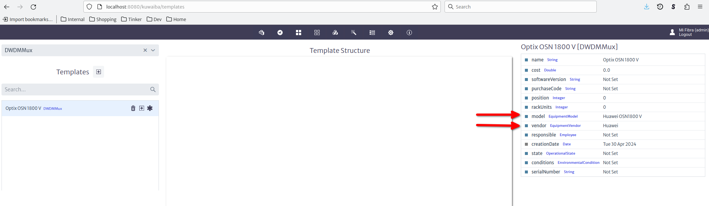

Set the default attribute values in the property sheet on the right. For this example, we had previously created a **Huawei OSN1800 V** entry in the `EquipmentModel` [list type](https://kuwaiba.org/docs/manuals/user/administration/ltman/index.html). To create the slots, use the "+" button next to your new template. Choose single or multiple according to your needs. If you chose multiple, use a pattern as [instructed in the user manual](https://kuwaiba.org/docs/manuals/user/appendix_a.html). The inner elements are created from the "..." menu next to the parent object. In this example, we will create a control board in the first slot, and communications boards with single ports in the next 2. 

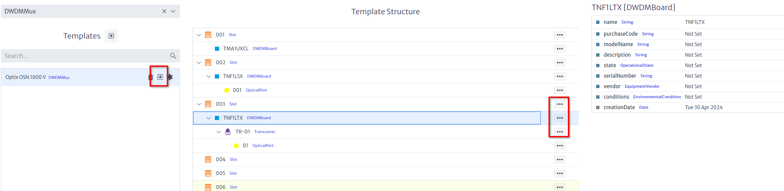

If you require [SFPs](https://en.wikipedia.org/wiki/Small_form-factor_pluggable_transceiver), create them as `Transceiver` instances under the boards, and create a regular port under them. Change the [containment configuration](https://kuwaiba.org/docs/manuals/user/administration/containment/index.html) if required.

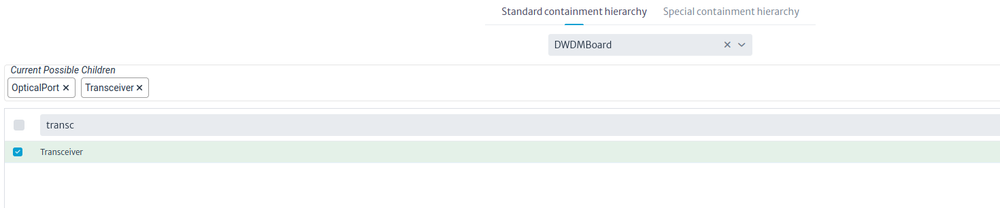

## Creating the Devices
Now that we have a template, we are going to create three multiplexers in three different buildings. Note that we will just create one of them using a template, the other buildings will be copied and renamed from the original. The figure below shows a building with a room and a rack.

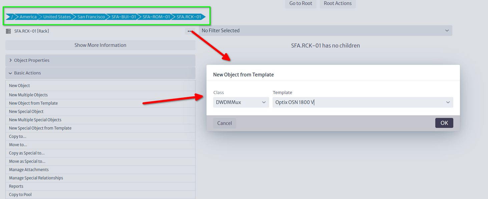

Now, from the rack we can launch the **Create from Template** action from the **Basic Actions** section, or the **...** button next to the rack, and actually create the multiplexer. In the same rack we will place an ODF, also created from a template.

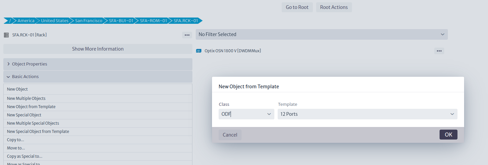

ODFs (and D/MDF for that matter) deserve a special mention. In Kuwaiba, distribution frames are modeled as elements with the same number of input and output ports, this emulates the [tray that it's inside the ODF](https://www.shutterstock.com/shutterstock/photos/1833565222/display_1500/stock-photo-fiber-optic-pigtail-arrangement-in-an-odf-tray-1833565222.jpg) that serves as splicing point between the inbound fiber strands and the pigtails connected to the ports in the front of the panel. By default, input and output ports are disconnected, you have to connect them using what we call a **mirror** (see more details in the [Physical Connections](https://kuwaiba.org/docs/manuals/user/physical/physcon/index.html) chapter of the User's Manual). This mirror, back-to-back connection between ports is useful to model several scenarios, but for now, we will use them only to represent a splicing function. Mirrors can be created in the template, but this feature is disabled in this version of Kuwaiba (it might be back later, but for now it's only available in the development version 2.5), so we'll have to create the mirrors once the ODF is created. Naming the ODF ports FRONT-XX/BACK-XX is not mandatory, but will simplify things later, as we will see.

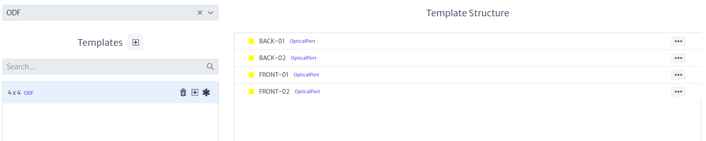

Now that the template is ready, we can create the ODF as a sibling of the multiplexer inside the rack.

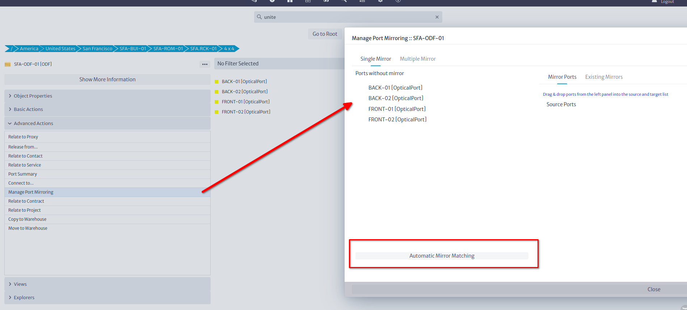

After the ODF has been created, we can mirror the ports by launching the **Manage Port Mirroring** action from the **Advanced Actions** menu. Click the **Automatic Mirror Matching** button and confirm the operation. This step is not precisely intuitive, but we'll re-evaluate UI in coming versions. This will leave the ODF ready to be connected.

## Connecting the Devices
There are two types of connections in Kuwaiba: **Containers** and **Links**. The latter are anything that can connect two ports (fibers, coaxial/ethernet cables, telephonic pairs, power cables, etc). The former, as its name indicates, can contain other containers and links. To put it graphically, [these](https://esen.com/wp-content/uploads/2020/12/microduct-pipes.jpg) are containers and [these](https://www.lanshack.com/images/tutorial/fiberstrands.jpg) are links. You can find more information about both in the [User's Manual](https://kuwaiba.org/docs/manuals/user/physical/physcon/index.html). You can create your own types of both, but we won't get into that today. Suffice to say, that we will use **containers** (with fibers -`OpticalLinks`- inside) to connect buildings, and simple **links** (fibers) to connect devices in the same rack.

Let's start with the inside plant. There are several ways to create connections in Kuwaiba, but we are going to use the simplest method: The **Object View**. Select the rack and open the **Views** section, and click on **Object View**

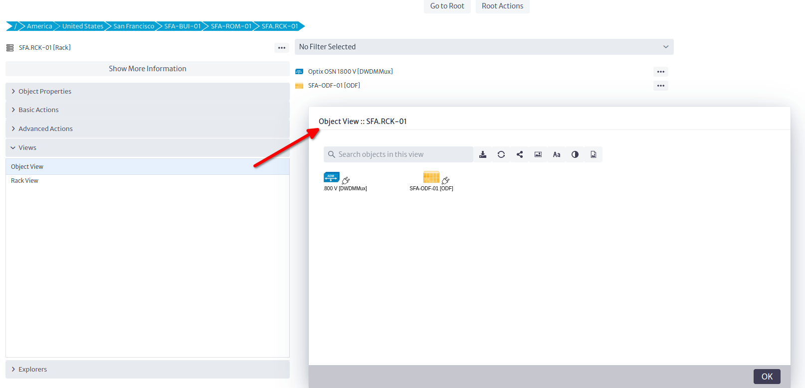

**Views** are graphical representations of selected objects (Other views are discussed in the [User's Manual](https://kuwaiba.org/docs/manuals/user/navman/index.html#views)). The **Object View** is the simplest of these views, and shows the direct children of a given object, as well as their connections. You can add background images (for example floor plans in inside plant scenarios), connect elements and export the view, among other things. To connect the ODF and the multiplexer, click on the plug icon of any of the end points, and drag it to the target.

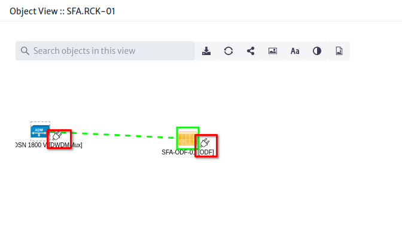

That will launch a quick wizard where you can name the connection, select its type, and optionally, choose a template as shown in the picture below.

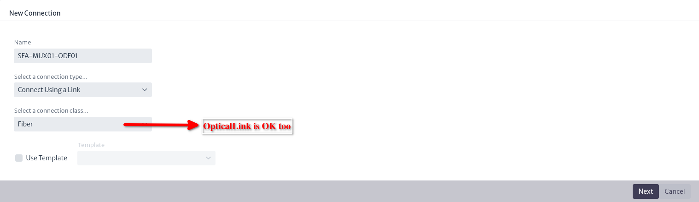

> **Note:** 
> The screenshot says `Fiber`, but that was just the display name of `OpticalLink` in the database used for these examples.

In the final steps, choose the ports

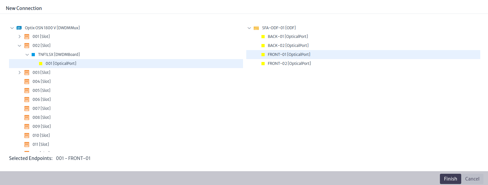

That's it. If you see a yellow line between the ODF and the multiplexer, you did it correctly (the connection color is customizable. It's the color assigned to the class `OpticalLink` in the [Data Model Manager](https://kuwaiba.org/docs/manuals/user/dmman/index.html)). Now we can launch a **Physical Path**, which is a view that shows the physical continuity from a given port. Select the port in the multiplexer you chose to connect and click on **Physical Path** in the **Views** section.

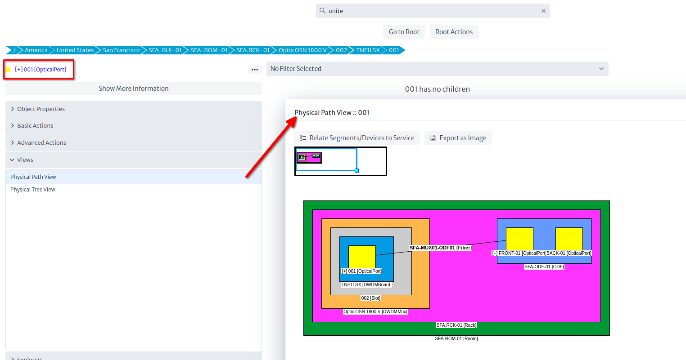

>**Note:** The port appears blue, with a `[+]` in its name. That can be done with [Validators](https://kuwaiba.org/docs/manuals/user/validators/index.html). **Validators** are customizable pieces of logic that check for a condition you code, and can influence the way inventory objects are displayed in the GUI. You can do some pretty neat things with them, but that will be discussed in another tutorial. The sample database has a few validators in it. The empty database has none.

## Summary
So far, we have created a single site with a DWDM multiplexer and an ODF, and connected them using an `OpticalLink` (fiber) by opening the parent rack's **Object View** and using the physical connection tool. We also learned to create **Templates**, and the concept of **mirror** as a way to *bridge* two ports back-to-back to provide continuity to a connection. In the next section, we will clone this site two more times, rename the relevant objects, and connect all the sites using containers in order to 
form a ring.

## Cloning the Original Site
We will use the **Copy to...** operation available in the **Basic Actions** section or the **...** button next to the object we want to copy. This will open a so-called *Simple Object Selector*.

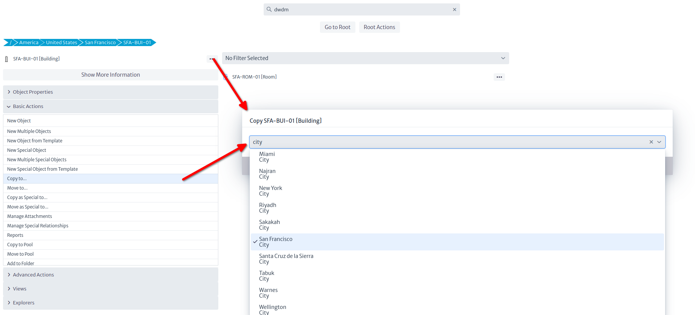

This *Simple Object Selector* is used in several contexts. Just type the first letters of the name of the target object or its class and pick it from the drop-down menu. In this case, we want to copy the original building inside its parent object (the city). Note that although you can pick any object in the selector, only objects allowed by the containment configuration will result in a successful copy (i.e. if you try to copy the `Building` to, say, a `Router`, an error message will be displayed). After renaming the relevant objects (building, rack, mux and ODF at least), you should end up with three sites as depicted in the picture below.

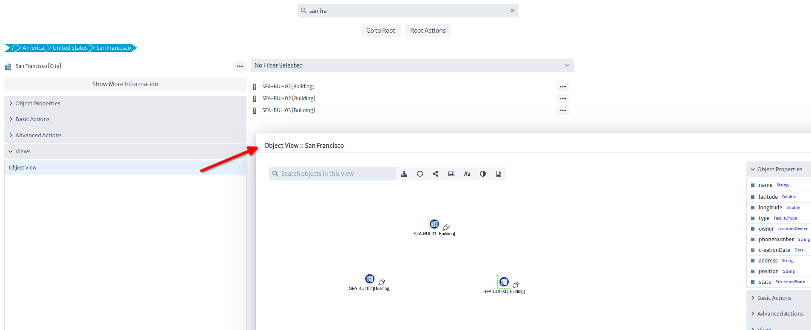

> **Tip:** You can rename an object using the property sheet by double clicking the field **name** or pressing `F2`.

## Connecting the Sites
### Using the Object View
Once the nodes have been copied, we are going to connect them. Open the **Object View** as instructed in picture above. We will now connect building **SFA-BUI-01** to **SFA-BUI-02** like we did in the [past section](#connecting-the-devices), but in this case, we are going to use a **Container** (that is, a conduit) instead of a **Link**. We will use a `WireContainer` (WireContainers are used to contain copper-based and optical connections, whereas `WirelessLinks` are used to contain wireless links (technically known as `RadioLinks`). You can create your own types of containers -though in most occasions this is not necessary- by subclassing `GenericPhysicalContainer` in the [Data Model Manager](https://kuwaiba.org/docs/manuals/user/dmman/index.html)). **Containers** and **Links**, like any other class in Kuwaiba, can have templates. In the sample database you will find two templates for `WireContainer`: One is a conduit that has 4 other smaller conduits inside, each of them with 4 fibers. The other is a cable with a single strand (might be a drop cable). You can create your own templates with real-life conduits (for example with 96+ fibers inside), just take into account that the physical connections model requires that everything inside a container is a so-called [special child](https://kuwaiba.org/docs/manuals/user/administration/containment/index.html#special-containment-hierarchy). We won't go into details here because this is a separate topic, just make sure you use the options indicated in the picture below.

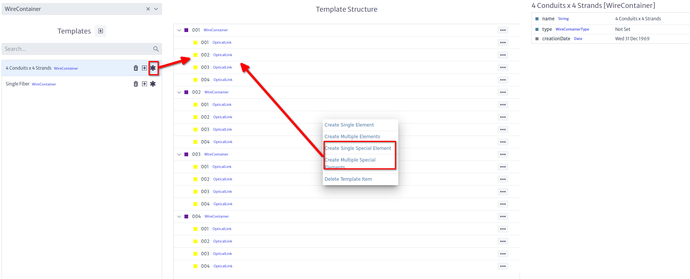

Connecting two buildings will bring up a familiar wizard, but this time, we'll be using a `WireContainer` and the template with sub-containers. 

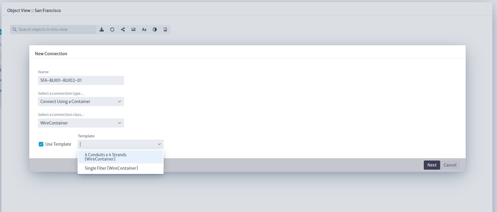

In the next step we select the two buildings

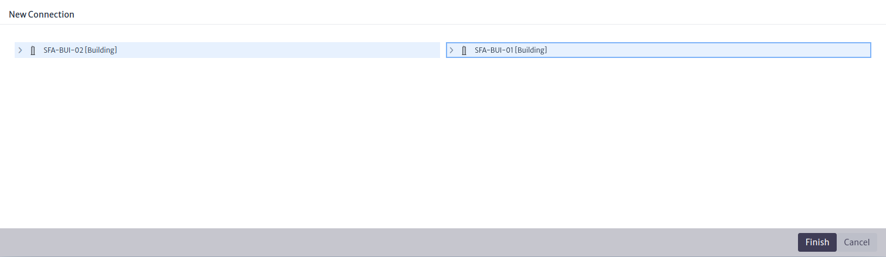

Repeat the procedure between **SFA-BUI-01** and **SFA-BUI-03**, but NOT between **SFA-BUI-02** and **SFA-BUI-03**. For these we'll use another way. If we followed the steps, the city's **Object View** should look like in the picture below. In case you are wondering, we will connect the fibers last.

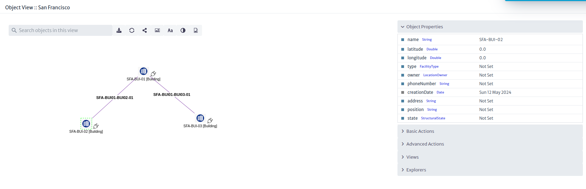

> **Note:** This time the connections are purple, not yellow. Again, this color correspond to the color of the class (`WireContainer` or `OpticalLink`).

### Using the OSP Module
For the third arm we could do it the same way, but instead of that, we are going to use the [Outside Plant Manager](https://kuwaiba.org/docs/manuals/user/physical/ospman/index.html). This module adds a spatial dimension to the inventory. First, we are going to create a new **OSP View**, and name it and center the map in San Francisco.

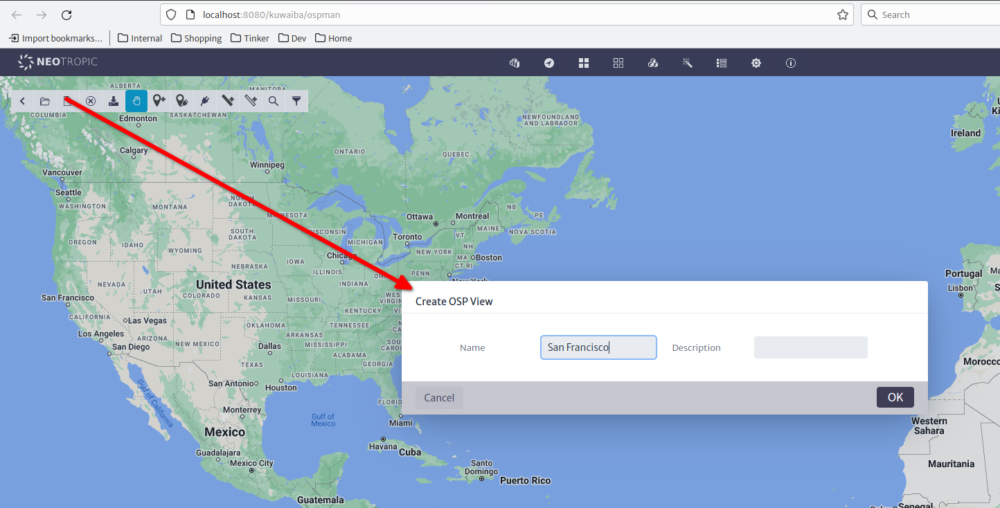

The default map provider is [OpenStreeMap](https://www.openstreetmap.org/), but we'll be using [Google Maps](https://maps.google.com) in the following screenshots. The behavior is the same for the sake of this example. Click the **Add Node** button, and in the filter text field, type **SFA-BUI** and hit *Enter*. If you followed the naming conventions, you should see the three buildings we created previously.

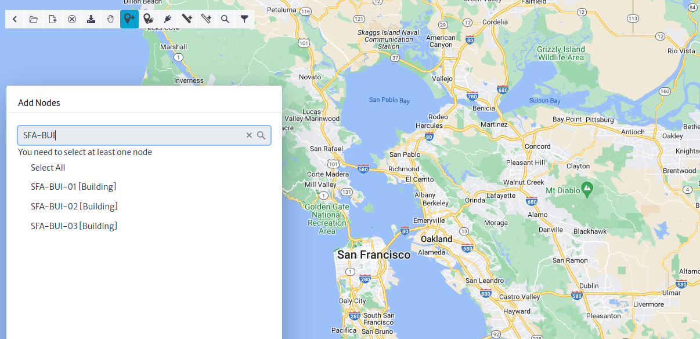

After selecting the nodes to be added, you will notice that the mouse pointer becomes a crosshair. If the building had geo-coordinates set previously, the system will ask you if you wish to override them or use them. Since we haven't set them yet, the nodes will be placed one after the other in the position you indicate.

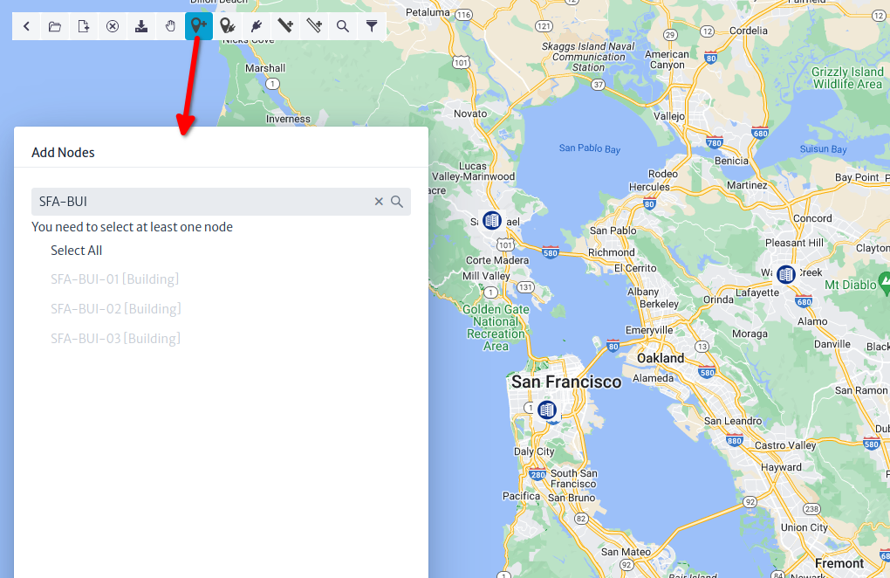

Now let's import the existing connections, and for this, use the button to the right of **Add Nodes**. In the form, select the endpoints of the connections you want to import. The system will detect the existing containers between the nodes.

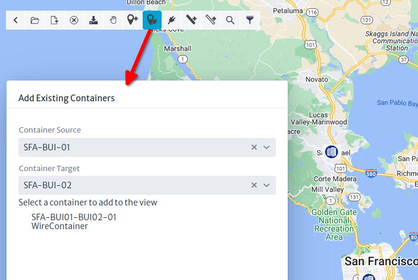

> **Important**
> 
> An OSP view can only contain nodes that are objects of subclasses of `GenericLocation`, such as `Buildings`, `Manholes`, `Poles`, `Houses` and connections that are subclasses of GenericPhysicalContainer, such as `WireContainer` or `WirelessContainer`.

If you click the container, it will be added automatically, and you will be asked if you want to connect the fibers inside (**Edit Connections**, in fact) as can be seen in the picture below.

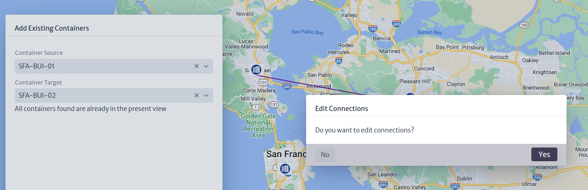

We want to connect the back ports of the ODFs on each side using the first fiber of the first subconduit. On the **SFA-BUI-01** side, you will notice that the front port is already connected, since we connected the devices to the corresponding front ports.

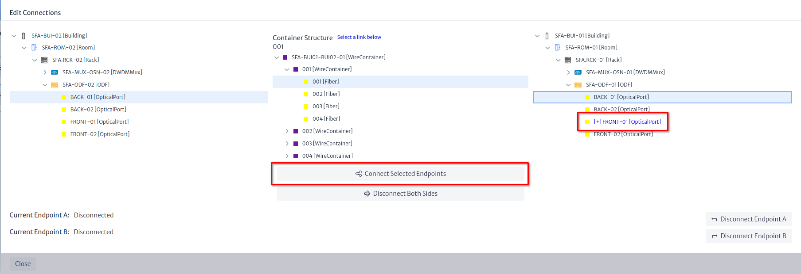

You don't have to connect both sides, but we'll do it in this example. With the **Selection Tool** (the button with the hand icon), you can select the container and change its route. Do the same with the container connecting **SFA-BUI-03**.

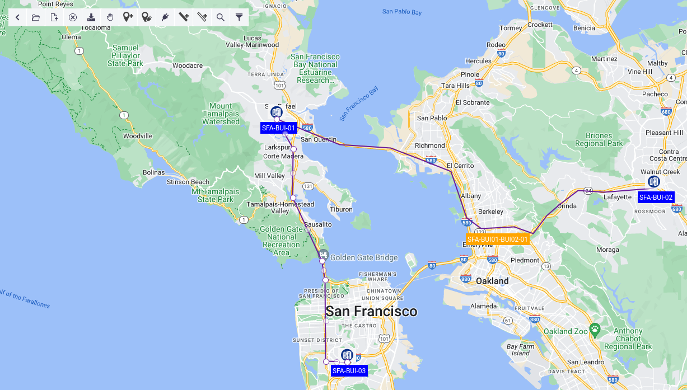

There are several [Configuration Variables](https://kuwaiba.org/docs/manuals/user/settings/configuration/variables/index.html)  that govern label colors and zoom levels at which labels are visible. Finally, we are going to create the final arm of the ring between **SFA-BUI-02** and **SFA-BUI-03**. To do this, we will select the **Connection Tool**, then select the source building and trace the route in the map until we reach the target node.

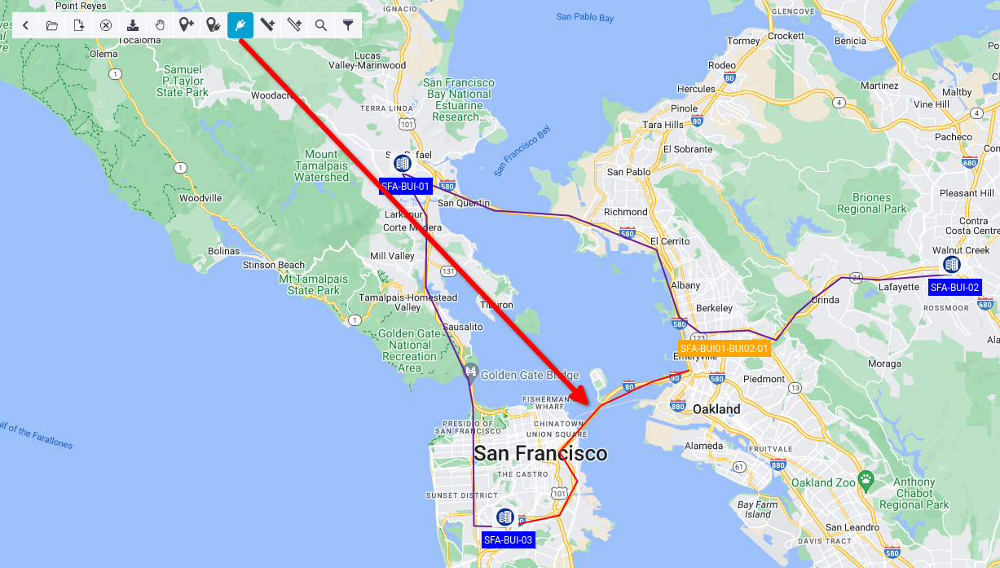

Clicking the target node will launch a similar wizard to the one we saw before, and by the end you will be offered to connect the fiber inside.

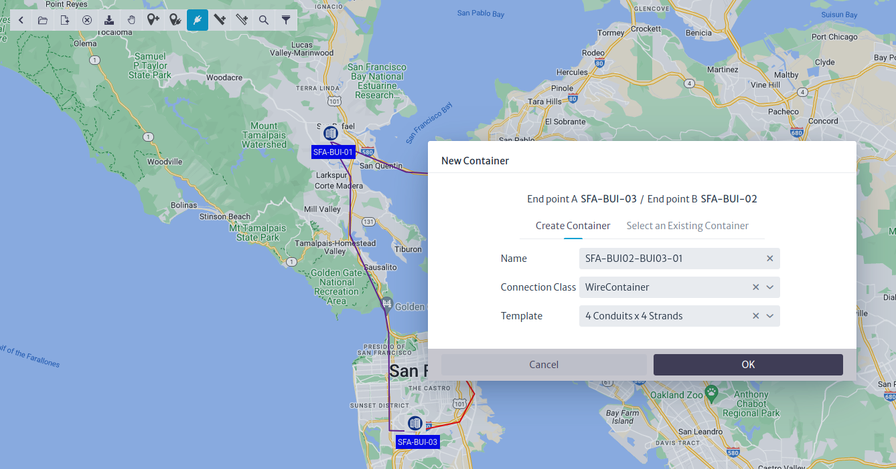

You can edit the connections of a given container at any moment by right-clicking it and selecting the option in the context menu. The ring should look like this:

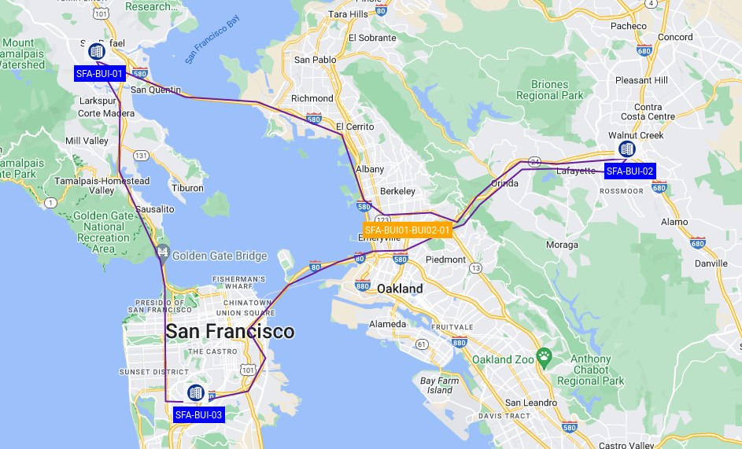

Finally, if you launch a **Physical Path** from the port of the first communication board of any multiplexer, you should be able to see how it reaches the next multiplexer through the ODFs on both sites and the fiber you selected in the **Edit Connections** action.

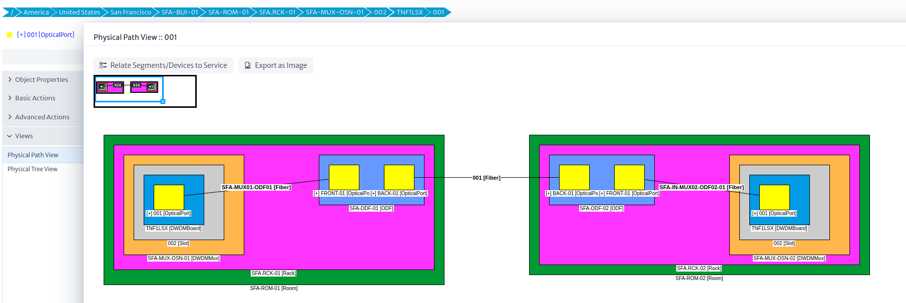