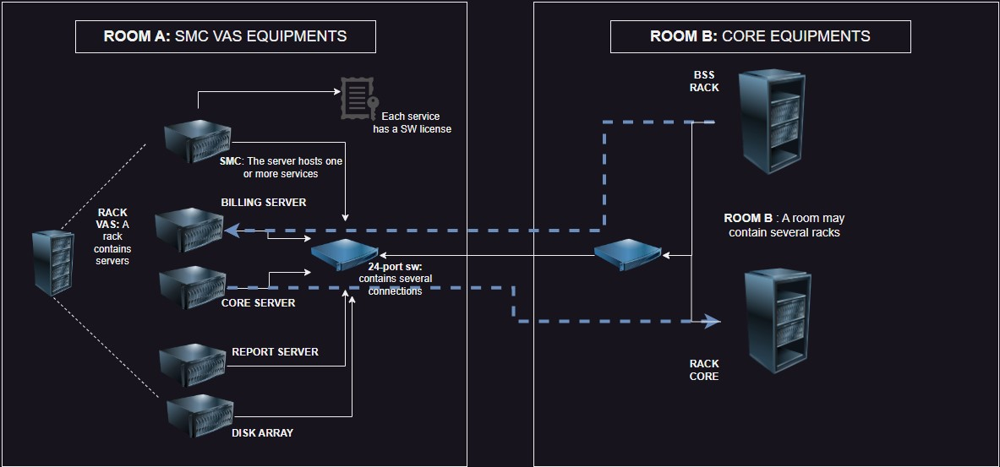

# Getting Started with Kuwaiba

This is a very basic tutorial. When you are faced with a new tool, perhaps the most direct way to understand how it works is by getting hands-on and creating something. This tutorial will help you model a basic short messaging system using Kuwaiba.

However, I recommend doing some preliminary work to ensure that your idea is effectively translated into the tool. The first thing we will do is list the key elements of your model. In my case, I will work on a classic VAS (Value-Added Service) system: a short messaging system connected to the core network via SIGTRAN and to the BSS (Business Support Systems) via APIs. I have chosen this system because it represents the basic functionality of many value-added services and other telematics-oriented services.

## Components

### Servers

**Physical Equipment**: These will host the services.

### Services

We will create four services:

1. **Short Message Center (SMC)**: Responsible for receiving, processing, routing, and storing text messages in memory for the cellular network (SMS messages of 160 characters as per the SMPP 3.4 protocol).  
2. **Billing Server**: Responsible for generating Call Detail Records (CDRs).  
3. **Reporting Server**: Handles the creation of various reports.  
4. **Core Network Communication Server**: This service manages the relationship with a Signaling Transfer Point (STP) in the core network using the SIGTRAN protocol to handle communication within a 3G/4G/5G network.

### Additional Equipment

To make this work, we will need other equipment such as databases, networking gear, fiber optics, and UTP cables.

Now, let's create a diagram that relates these elements. This will help us improve our model and possibly include elements that were not initially present but are necessary (such as a rack, a datacenter, or perhaps electrical equipment). This can take you to the level of detail you want, but for now, it will be something basic.

|  |
|:--:|
| ***Figure 1: Basic Diagram of Components*** |

Now we are going to start transferring this graphical model to Kuwaiba. As a first step, we will locate our racks (A-B) inside a room located in a building (Datacenter A) in an imaginary city called Fruncia.

To do this, we will use the "navigation" module:

|  |
|:--:|
| ***Figure 2: Navigation Module*** |

Let’s start from the root by clicking on "Go to root", which will display some "countries" or "continents" that were created earlier. At this point, we could create an imaginary continent or include Europe or any starting point by clicking on "root actions/new Object".

In our case, we will create Fruncia within America. So, we will click on America:

|  |
|:--:|
| ***Figure 3: Navigation from Root to America*** |

Then, we will click on the three dots in front of America and create a new object called Fruncia. 

Next, we will look for the three dots for the Fruncia object. A dialog will appear asking what kind of class we will create. We will choose the appropriate type for each case, such as a country. We will do the same by creating a building and then a datacenter:

|  |
|:--:|
| ***Figure 4: Creating Objects of Class*** |

This means we are creating a structure where a continent contains a country, that country contains cities and buildings, and those buildings contain datacenters.

Of course, I skipped many details (remember that this is a basic tutorial), but we could have a very detailed structure, with all kinds of details... region, district, neighborhood, floor, etc.

|  |
|:--:|
| ***Figure 5: Navigation While Creating Objects*** |

|  |
|:--:|
| ***Figure 6: Creating More Objects*** |

|  |
|:--:|
| ***Figure 7: More Objects Created*** |

|  |
|:--:|
| ***Figure 8: Continuing to Create Objects*** |

|  |
|:--:|
| ***Figure 9: Additional Object Creation*** |

I created several racks, thinking of a real example of a similar distribution, where in a single datacenter there were core equipment, networking equipment, VAS equipment, and OSS/BSS, all on different rows of racks, connected by 24-port L2 switches. In this case, we will have one rack with three servers connected to a switch, which is then connected to another switch in a different rack where the BSS and Core racks are located.

|  |
|:--:|
| ***Figure 10: Racks in Datacenter01*** |

Now, what we are going to do is place the servers in each of the racks. However, we need to take a preliminary step because the servers in the tool, by default, may contain optical ports, and I require that my design includes electrical ports. Therefore, I need to use the Containment Manager to modify the containment hierarchy of the servers.

|  |
|:--:|
| ***Figure 11: Containment Manager Interface*** |

To do this, I will search for the Server class and, using the search function, I will add electrical ports as children, as shown in the following image:

|  |
|:--:|
| ***Figure 12: Adding Electrical Ports to Server Class*** |
