# Creating a New Module

The modules in Kuwaiba help structure and organize various aspects of the system, facilitating the management of a wide range of resources and functionalities. They adapt to the changing requirements of the business and technological environment. Additionally, you can model any aspect relevant to everyday life.

1. Create a Module:

    Open the **Core Modules** Folder in the Main Kuwaiba Application:

    | 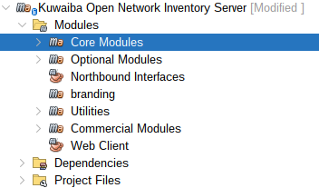 | 
    |:--:|
    | ***Figure 1: Kuwaiba Root folder*** |

    Create a new project inside the **Modules** folder:

    | 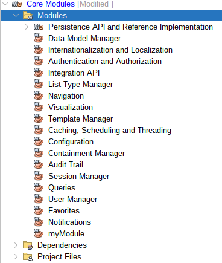 |
    |:--:|
    | ***Figure 2: Core Modules Root folder*** |

    Create a Java application with Maven and give it a name of your choice (In this example, the name given was **RentHouse**):

    | 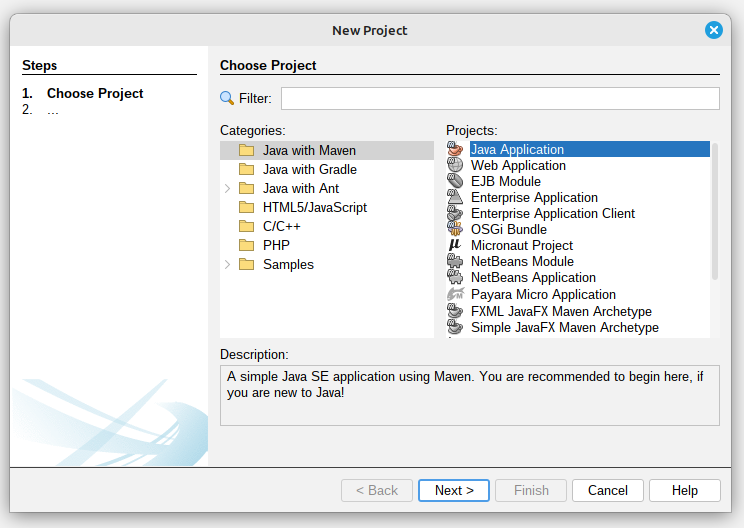 |
    |:--:|
    | ***Figure 3: Creating a New Project*** |

    Your project:

    | 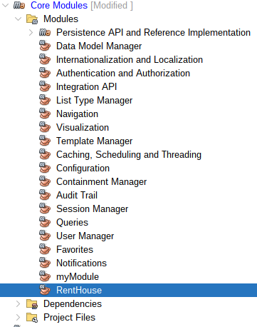 |
    |:--:|
    | ***Figure 4: Module Created RentHouse*** |

    Open the **Web Client** Application in the Main Kuwaiba Application:

    | 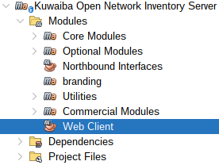 |
    |:--:|
    | ***Figure 5: Web Client*** |

    Right-click on `Dependencies` and then click on `Add Dependency`:

    | 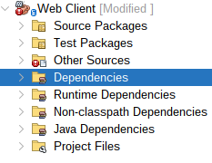 |
    |:--:|
    | ***Figure 6: Web Client Dependencies folder*** |

    Select your project and add it to dependencies:

    | 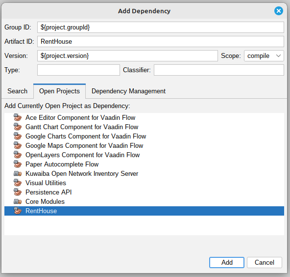 |
    |:--:|
    | ***Figure 7: Web Client Dependency Added*** |

    > **Note**
    >
    > You can also add the dependency directly by editing the pom.xml file. 
    >

2. Module Structure:

    Create the following Packages within the `Source Packages` of your Module:
    - persistence.
    - (`Your module name`), for this example renthouse.
   
    | 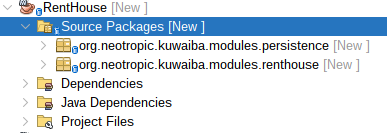 |
    |:--:|
    | ***Figure 8: Rent House Packages Structure*** |

    Create the following classes within the previously created packages:

    | 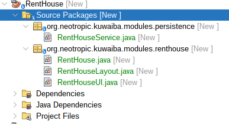 |
    |:--:|
    | ***Figure 9: Classes of each Package*** |

    Open the **Persistence API** Application in the **Core Modules** of the Main Kuwaiba Application:

    | 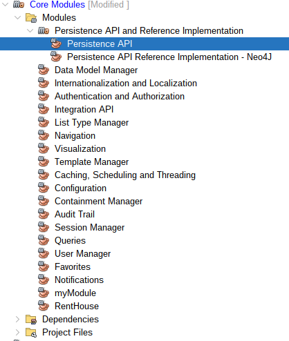 |
    |:--:|
    | ***Figure 10: Persistence API*** |

    Add **Persistence API** to your module dependencies, right-click on `Dependencies` and then click on `Add Dependency`:

     | 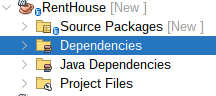 |
    |:--:|
    | ***Figure 11: RentHouse Dependencies folder*** |

    Select **Persistence API** and add it to dependencies of your Module:

    | 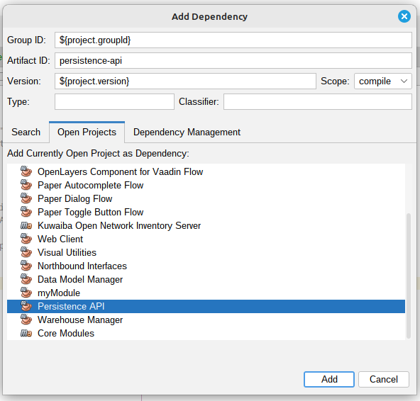 |
    |:--:|
    | ***Figure 12: Persistence API Dependency Added*** |

    > **Note**
    >
    > You can also add the dependency directly by editing the pom.xml file. 
    >

3. 

    

