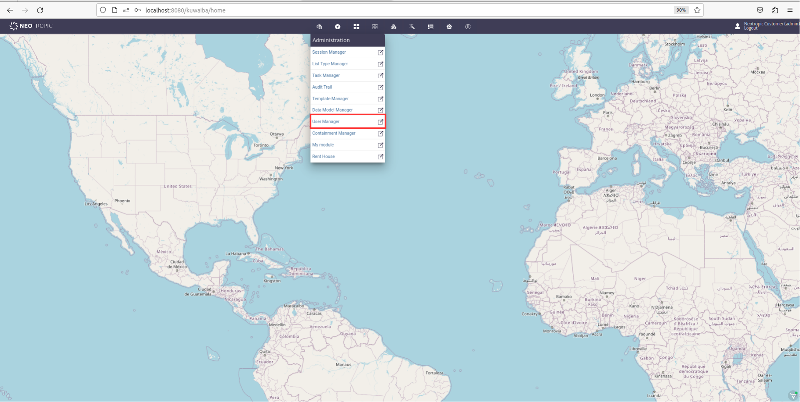

# Creating a New Module

The modules in Kuwaiba help structure and organize various aspects of the system, facilitating the management of a wide range of resources and functionalities. They adapt to the changing requirements of the business and technological environment. Additionally, you can model any aspect relevant to everyday life.

1. Create a Module:

    Open the **Core Modules** Folder in the Main Kuwaiba Application:

    |  | 
    |:--:|
    | ***Figure 1: Kuwaiba Root folder*** |

    Create a new project inside the **Modules** folder:

    |  |
    |:--:|
    | ***Figure 2: Core Modules Root folder*** |

    Create a Java application with Maven and name it as you prefer  (In this example, it was named **RentHouse**):

    |  |
    |:--:|
    | ***Figure 3: Creating a New Project*** |

    Your project:

    |  |
    |:--:|
    | ***Figure 4: Module Created RentHouse*** |

    Open the **Web Client** Application in the Main Kuwaiba Application:

    |  |
    |:--:|
    | ***Figure 5: Web Client*** |

    Right-click on `Dependencies` and then click on `Add Dependency`:

    |  |
    |:--:|
    | ***Figure 6: Web Client Dependencies folder*** |

    Select your project and add it to dependencies:

    |  |
    |:--:|
    | ***Figure 7: Web Client Dependency Added*** |

    > **Note**
    >
    > You can also add the dependency directly by editing the pom.xml file. 
    >

2. Module Structure:

    Create the following Packages within the `Source Packages` of your Module:
    - persistence.
    - (`Your module name`), for this example renthouse.
   
    |  |
    |:--:|
    | ***Figure 8: Rent House Packages Structure*** |

    Create the following Classes within the previously created packages:

    |  |
    |:--:|
    | ***Figure 9: Classes of each Package*** |

    Open the **Persistence API** Application in the **Core Modules** of the Main Kuwaiba Application:

    |  |
    |:--:|
    | ***Figure 10: Persistence API*** |

    Add **Persistence API** to your module dependencies, right-click on `Dependencies` and then click on `Add Dependency`:

     |  |
    |:--:|
    | ***Figure 11: RentHouse Dependencies folder*** |

    Select **Persistence API** and add it to dependencies of your Module:

    |  |
    |:--:|
    | ***Figure 12: Persistence API Dependency Added*** |

    > **Note**
    >
    > You can also add the dependency directly by editing the pom.xml file. 
    >

3. Consume the Kuwaiba service:

    Kuwaiba allows you to create any Objects you need and, from those Objects, generate the inventory objects you want. This process is independent of whether these Objects previously exist in the system, providing high flexibility and customization for your inventory management.

    In Kuwaiba there are two types of objects:

    - BusinessObjectLight
    - BusinessObject

    BusinessObjectLight allows you to manage objects with the basic attributes of an entity in the database, such as id, name, and class type. Since BusinessObject inherits from BusinessObjectLight, BusinessObject also includes these basic attributes but additionally allows you to manage created objects with extra attributes, such as the creation date.

    For the following implementation, we will use BusinessObjectLight to display the houses registered in the inventory, along with their basic attributes: id, name, and className.
  
    Consume the service through BusinessEntityManager interface. Insert the following code into your service Class:

    ``` bash
        @Service
        public class RentHouseService {
            
            //The Business EntityManager allows you to manipulate objects within the inventory.
            @Autowired
            private BusinessEntityManager bem; 
            
            public RentHouseService(){
                
            }
            
            public List<BusinessObjectLight> findAllBusinessObjectLight(String className,long page,int maxLimit ) 
                    throws MetadataObjectNotFoundException, InvalidArgumentException{
                List<BusinessObjectLight> listObject = new ArrayList();
                listObject = this.bem.getObjectsOfClassLight(className, page, maxLimit);
                return listObject;
            }
        }
    ```

    You can access the BusinessEntityManager interface to explore other services that Kuwaiba provides for managing inventory objects.

    Insert the following code into your Module Class:

    ``` bash
        @Component 
        public class RentHouse extends AbstractModule{

            // This id must have the same Package Name.
            public static final String MODULE_ID = "renthouse";
        
            @Autowired
            private ModuleRegistry moduleRegistry;
            
            @PostConstruct
            public void init() {
                // Register the module itself
                this.moduleRegistry.registerModule(this);
            }

            @Override
            public String getName() {
                return "Rent House";
            }

            @Override
            public String getDescription() {
                return "Description of Rent House";
            }

            @Override
            public String getVersion() {
                return "2.1.1";
            }

            @Override
            public String getVendor() {
                return "Neotropic SAS <contact@neotropic.co>";
            }
            
            @Override
            public String getId() {
                return MODULE_ID;
            }

            @Override
            public ModuleType getModuleType() {
                return ModuleType.TYPE_OPEN_SOURCE;        
            }

            @Override
            public int getCategory() {
                return CATEGORY_ADMINISTRATION;
            }
        }
    ```

    Insert the following code into your Layout Class:

    ``` bash
        // Use the basic Kuwaiba layout
        public class RentHouseLayout extends ModuleLayout{ }
    ```

    Create your view inside your UI Class:

    ``` bash
        // renthouse is the route of your view
        @Route(value = "renthouse", layout = RentHouseLayout.class)
        public class RentHouseUI extends VerticalLayout implements HasDynamicTitle,AbstractUI{
            
            private final String MODULE_NAME = "RENT HOUSE BY: Neotropic SAS";
            
            @Autowired
            private RentHouseService rhs;
            
            @Autowired
            private TranslationService ts;
            
            private H3 title;
            
            private Grid<BusinessObjectLight> gridObjects;
            
            public RentHouseUI(){
                super();
                setSizeFull();
            }
            
            @Override
            public void initContent() {
                createTitle();
                createGridObjects();
            }
            
            private void createTitle(){
                this.title = new H3(MODULE_NAME);
                add(this.title);
            }
            
            private void createGridObjects(){
                try{
                    List<BusinessObjectLight> objects = new ArrayList();
                    
                    //Use the service
                    objects = this.rhs.findAllBusinessObjectLight("House", 1, 10);
                    
                    this.gridObjects = new Grid<>(BusinessObjectLight.class, false);
                    
                    this.gridObjects.addColumn(BusinessObjectLight::getId).setHeader("ID");
                    this.gridObjects.addColumn(BusinessObjectLight::getClassName).setHeader("Class Name");
                    this.gridObjects.addColumn(BusinessObjectLight::getName).setHeader("Name");
                    
                    this.gridObjects.setItems(objects);
                    
                    add(this.gridObjects);
                    
                }catch(InvalidArgumentException | MetadataObjectNotFoundException ex){
                    new SimpleNotification(ts.getTranslatedString("module.general.messages.error"), ex.getLocalizedMessage(),
                            AbstractNotification.NotificationType.ERROR, ts).open();
                }
            }

            @Override
            public String getPageTitle() {
                return "Rent House :: Kuwaiba";
            }
        }
    ```
4. Enable your Module:

    Go to User Manager:

    |  |
    |:--:|
    | ***Figure 13: User Manager*** |
    
    In the Administrators section, look for and enable your module for the Neotropic Customer (admin):

    |  |
    |:--:|
    | ***Figure 14: Enable the Module*** |

    Navigate to your view:

    |  |
    |:--:|
    | ***Figure 15: Rent House View*** |


    


