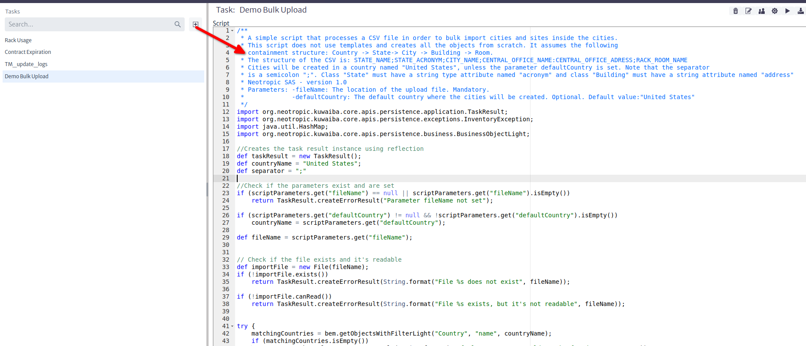
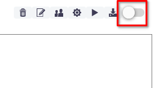
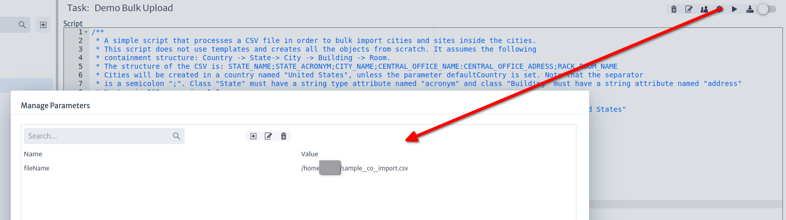
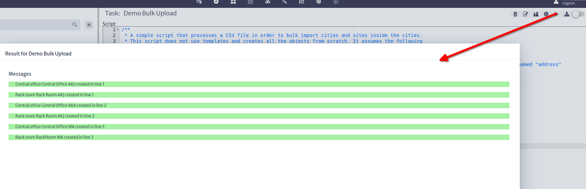

# Bulk Upload in Kuwaiba
## Introduction
There are several scenarios when you need to automated the creation of many objects from one or multiple sources. While [Neotropic SAS](https://www.neotropic.co) has a proven Migration Framework to deal with [ETL](https://en.wikipedia.org/wiki/Extract%2C_transform%2C_load) requirements in big network inventory projects, here you will learn how to create simple tasks for you day-to-day data ingestion needs in Kuwaiba.

In early versions of **Kuwaiba**, there used to be a Bulk Upload functionality. It defined a simple format of plain text file, and each line had a syntax that told the ingestion algorithm how to process it. It was useful, but pretty limited when more complex business rules were involved, and the processing of each line was stateless, limiting its performance when some lines used information from previous ones. Other optimizations were not possible, and direct access to the database was not allowed. This feature was dropped in version 2.0.x in favor of [Task Manager](https://kuwaiba.org/docs/manuals/user/administration/taskman/) scripts. The main objective of the **Task Manager** is to provide a way to automate tasks in Kuwaiba. Tasks are Groovy/Java scripts that leverage the different integration APIs in **Kuwaiba** (such as the **Persistence API**, that abstracts the access to the database and exposes methods to manipulate the inventory objects regardless their nature) in order to perform simple or complex actions. Having the possibility to use the full power of a programming language and direct access to the database, a system administrator can create, among other things, powerful and performant routines to process and ingest data. How to code scripts and use the available APIs is outside the scope of this document, but you can find a plethora of examples in the [official code repository](https://sourceforge.net/p/kuwaiba/code/HEAD/tree/server/trunk/scripts/) not only of tasks, but also validators, reports and filters. The following steps will guide you through the process to use an on-boarding script to import a basic containment structure.

## On-boarding Process
1. Download the sample script from the [repository](https://sourceforge.net/p/kuwaiba/code/HEAD/tree/server/trunk/scripts/tasks/TM_generic_bulk_import_example.groovy)
2. Go to the Task Manager module and click on **New**, and paste the contents of the script in the editor. make sure you read carefully the header with additional instructions and tips.

3. Download the sample import file from the [repository](https://sourceforge.net/p/kuwaiba/code/HEAD/tree/server/trunk/scripts/tasks/assets/sample_co_import.csv). This file contains a few lines representing Rooms inside Central Offices, inside Cities.
4. Place the sample file in a location readable by the server. If you are using Docker, inside the container filesystem (volatile), or on an external mounted volume (persistent).
5. Make sure the **Commit on Execute** option is unchecked. This will help you test the results before actually modifying the database. No changes will be committed until you set this option to true.

6. Set the *fileName* task parameter to your import file location.

7. Run the task. Running the task will save the script automatically. Once you see all messages in green, check the "Commit on Execute" and run the task again.

## Further Steps
* Most import scripts look like that, plus optimization routines (caching strategies, direct access to the database, etc). Make sure you take a good look at the [methods](https://kuwaiba.org/docs/dev/javadoc/current/org/neotropic/kuwaiba/core/apis/persistence/business/BusinessEntityManager.html) of the `BusinessEntityManager`, which is part of the Persistence API, and handles most of the basic inventory object manipulation logic. His siblings [MetadataEntitymanager](https://kuwaiba.org/docs/dev/javadoc/current/org/neotropic/kuwaiba/core/apis/persistence/metadata/MetadataEntityManager.html) and [ApplicationEntityManager](https://kuwaiba.org/docs/dev/javadoc/current/org/neotropic/kuwaiba/core/apis/persistence/application/ApplicationEntityManager.html) perform equally important tasks.
* The repository has [another example](https://sourceforge.net/p/kuwaiba/code/HEAD/tree/server/trunk/scripts/tasks/TM_basic_hardware_import_u2000.groovy) closer to a real-world scenario. This script processes the hardware export file of Huawei's U2000 DWDM NMS. Check it out, you will learn a couple of tricks from it.
* Kuwaiba 2.5's **Task Manager** brings important improvements in terms of API scope/structure and code management facilities. Stay tuned for further developments.