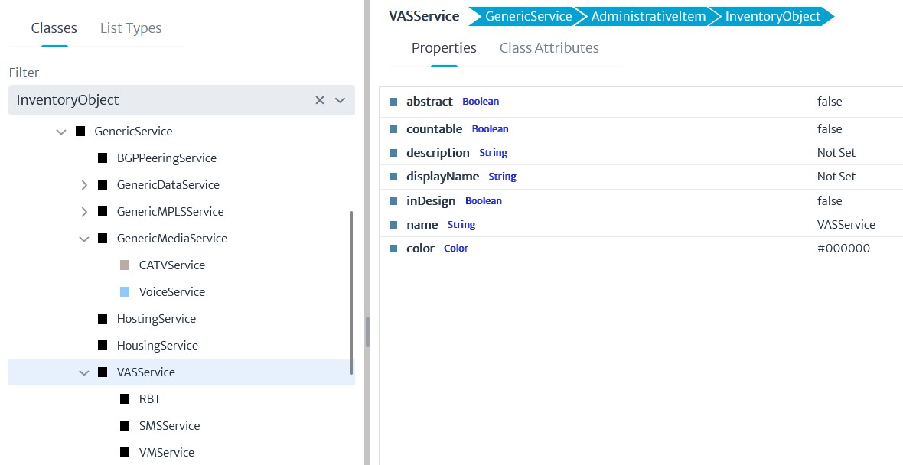
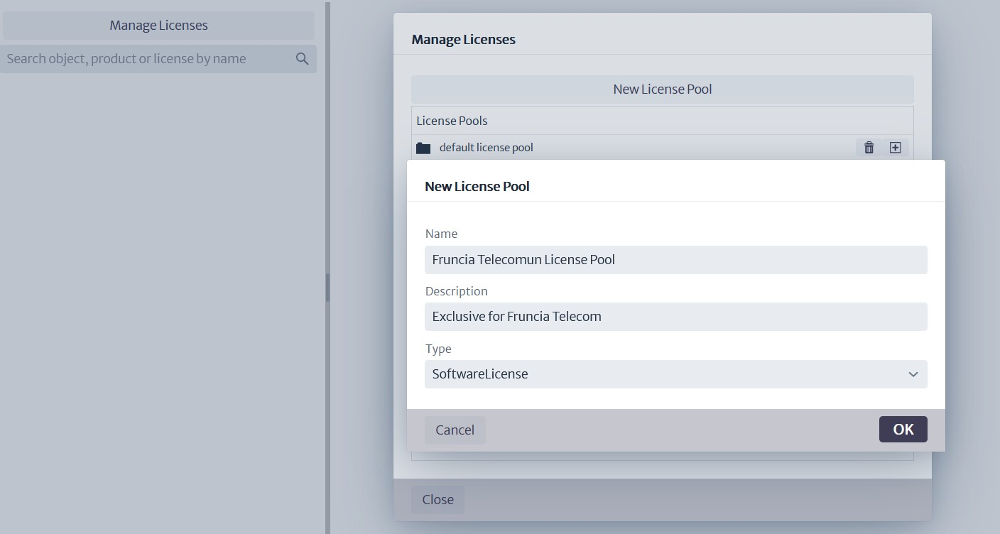

# Getting Started with Kuwaiba 

This is a very basic tutorial. When faced with a new tool, perhaps the most direct way to understand how it works is by getting hands-on and creating something. This tutorial will help you model a basic short messaging system using Kuwaiba.

However, some preliminary work is recommended to ensure that your idea is effectively translated into the tool. The first step is to list the key elements of your model. In this case, we will work on a classic VAS (Value-Added Service) system: a short messaging system connected to the core network via SIGTRAN and to the BSS (Business Support Systems) via APIs. This system was chosen because it represents the basic functionality of many value-added services and other telematics-oriented services.

## What is a VAS (Value-Added Service)?

**Value-Added Services (VAS)** in telecommunications are additional services offered beyond the basic voice or messaging features. Examples include SMS, mobile payments, or entertainment services like games and multimedia. VAS enhance user experience by providing extra features, driving customer satisfaction and new revenue streams for providers.

### Key Components of a VAS System

- **Application Platform**: Hosts applications like messaging, multimedia, or gaming.
- **Communication Interfaces**: Connect VAS to the core telecom network, BSS, and OSS.
- **Billing Systems and CDR**: Manage billing records for transactions.
- **Network Gateways**: Enable users to access the VAS services.

## An SMC Center in Kuwaiba 

Let's create a diagram that relates these elements (Figure 1). This will help improve the model and potentially include elements that were not initially considered but are necessary (such as a rack, a datacenter, or perhaps electrical equipment). The level of detail can be adjusted as needed, but for now, it will be kept basic.

|  |
|:--:|
| ***Figure 1: Basic Diagram of Components*** |

Follow the steps below:

1. Use the Data Model Manager by selecting **Administration -> Data Model Manager** from the options menu. Although there is a preloaded model for this case, some additional classes and attributes will need to be added.

2. Create containments based on the provided diagram (**Administration->Containment Manager**): a datacenter contains racks, a rack contains servers, and a server contains Ethernet interfaces, among others.

3. Use **Navigation -> Navigation** to create the necessary devices.

4. Utilize the Software Manager to establish relationships between the servers and the software licenses for the VAS platforms.

Begin by reviewing the diagram to confirm if all elements are present in the default structure. Evaluate whether their attributes can be used or if new classes need to be created from scratch, for example:

These devices are already in Kuwaiba (Figure 2):

|  |
|:--:|
| ***Figure 2: SMC Server*** |

In addition to the servers and racks, there are also other physical devices such as switches, cables, software licenses, services, rooms, and buildings. Kuwaiba provides all the tools needed to create any required components for the model. Navigate through the tree from **InventoryObject -> AdministrativeItem -> GenericService**. Create a new class by clicking the (+) sign (see Figure 4). Add the class VASServices, and then add three services using the same method (see Figure 5).

|  |
|:--:|
| ***Figure 4: VAS Service Creation*** |

|  |
|:--:|
| ***Figure 5: All Services Overview*** |

We will also create a class (**GenericNSSGSMElement**) for NSS equipment that would house any 3G, 4G, or 5G equipment from the GSM Core. Navigate the class tree as follows: **InventoryObject -> ViewableObject -> ConfigurationItem -> GenericCommunicationsElement**.

|  |
|:--:|
| ***Figure 6: Generic NSS GSM Element*** |

*Note: Icons were added to slightly customize the new classes.*

Now, each class has attributes. Kuwaiba offers the possibility to create more complex attributes. Although the "Software License" class exists, use the **Administration->List Type Manager** tool to create a VAS product of type SMC.

|  |
|:--:|
| ***Figure 7: Software type*** |

|  |
|:--:|
| ***Figure 8: Software type*** |

Next, use **Logical-->Software Manager** to create a special license pool for Fruncia Telecom. Proceed as follows: first, click on "Manage Licenses" and then on "New License Pool" (Figure 9). The license is then added to the SMC product that was previously created (Figure 10).

|  |
|:--:|
| ***Figure 9: License Pool 1*** |

|  |
|:--:|
| ***Figure 10: License Pool 2*** |

|  |
|:--:|
| ***Figure 11: License Pool 3*** |

## Using Container Management

Using **Administration->Containment Manager**, it is necessary to create any missing containment relationships. Many are already present, such as a city being contained within a country. In this case, additional relationships may need to be established, for example, Ethernet ports will be added to the servers, and STPs.

|  |
|:--:|
| ***Figure 12: Container Manager*** |

|  |
|:--:|
| ***Figure 13: STP Ethernet*** |

## Creating Devices

Now, use the **Navigator** to create a basic structure with a country in America named **Fruncia**, a city (**Fruncia City**), a **datacenter** within the city, two **Rooms** (A and B), and a couple of **racks** in each room to contain the servers and networking equipment. For further details on how to create this type of structure, refer to the manual [XXXXX].

|  |
|:--:|
| ***Figure 14: Country-City-Datacenter-Rooms*** |

Next, add servers and switches to each rack according to the base diagram. It's important to consider the object properties of the rack and servers to ensure proper visualization. The **RackUnits** have been set to 32, with the servers occupying two units, 10 units for the equipment interfacing between the applications and the GSM core, and 4 units for the disk array. The position of each server must also be specified.

|  |
|:--:|
| ***Figure 15: Rack Details*** |

|  |
|:--:|
| ***Figure 16: Server Details*** |

Now, link the created services with the corresponding servers. In **Figure 17**, by navigating and reviewing the **SMS service**, it is linked to the **SMC server**.

|  |
|:--:|
| ***Figure 17: Linking SMS Service to SMC Server 1*** |

|  |
|:--:|
| ***Figure 18: SMS Service Linked to SMC Server 2*** |

Finally, link the licenses to the SMC server by using the advanced options of the SMCServer object.

|  |
|:--:|
| ***Figure 19: Linking SMS License to SMC Server 1*** |

|  |
|:--:|
| ***Figure 20: Linking SMS License to SMC Server 2*** |

