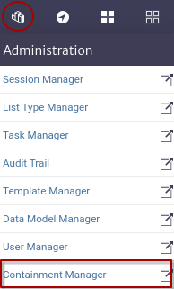
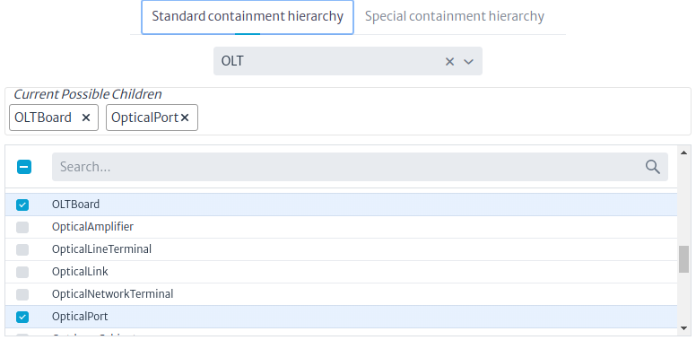
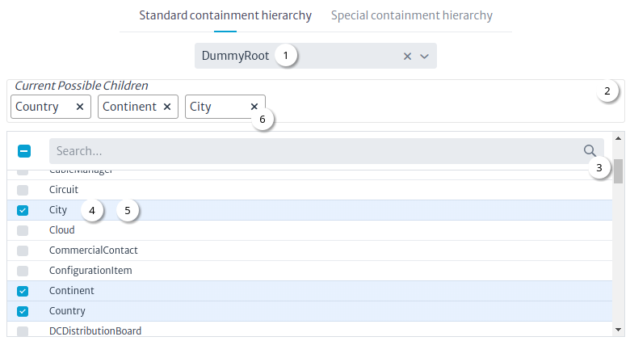
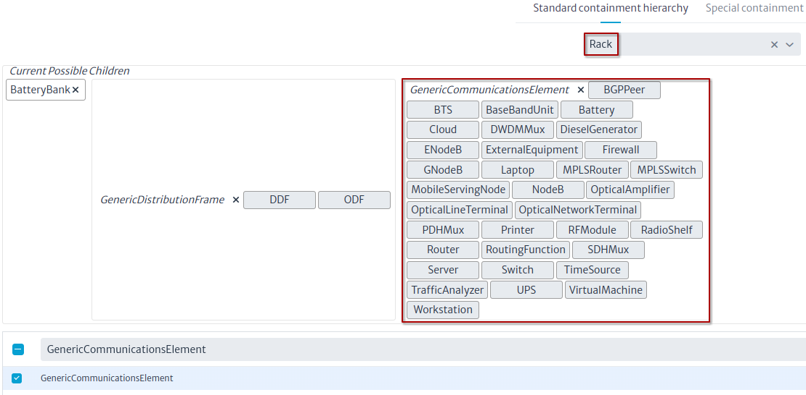
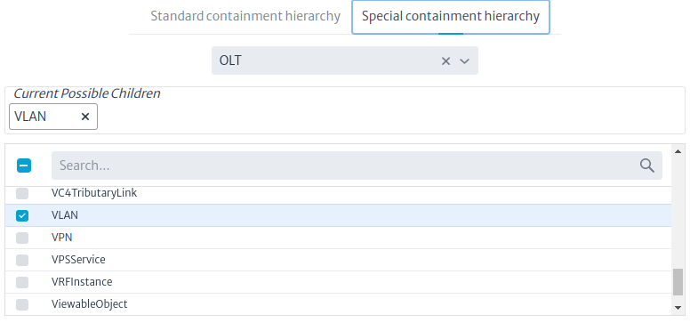

# Containment Manager

Another key concept in Kuwaiba is containment. It consists of the ability to define what kind of objects can be created within others. For example, a Country can be inside a Continent, but can not be inside a Rack. A Port is usually within a Board, and not inside a City. These business rules can be defined using the Containment Manager.

To access the module, click on the administration  category and select the Containment Manager Figure 1.

|  |
|:--:|
| ***Figure 1.** Containment Manager* |

There are two relevant concepts in this module [Standard Containment Hierarchy](./#standard-containment-hierarchy) and [Special Containment Hierarchy](./#special-containment-hierarchy) in the following sections we will address each of them.

## Standard Containment Hierarchy

This hierarchy is used to model physical containment, for example, OLTs contain OLT boards Figure 2.

|  |
|:--:|
| ***Figure 2.** OLT Standard Containment Hierarchy* |

Figure 3 shows the workflow for configuring the containment hierarchy.

|  |
|:--:|
| ***Figure 3.** Dummy Root Standard Containment Hierarchy* |

> **Note:** Figure 3 shows in the field to choose a class the `DummyRoot` that is not a class but is used as the root of the entire standard containment hierarchy.

### Workflow

1. Choose a class.
2. List of current possible children.
3. The search field is used to find classes to be possible children of the chosen class.
4. To add a class as a possible child, only check the class.
5. To delete a class as a possible child, simply uncheck the class.
6. It is also possible to delete a class from the possible children by clicking on the `x` button.

> **Note:** To avoid adding one by one many classes to a parent, you can use the flexibility of the data model as a hierarchical structure. For example, a `Rack` may contain within many types of equipment (routers, DDFs, switches, battery banks, etc). Instead of adding each of these classes one by one, you can add a common super class and all of them will be added automatically. For this example a common super class for most of those classes could be `GenericCommunicationsElement` Figure 4.
> |  |
> |:--:|
> | ***Figure 4.** Rack possible children* |

## Special Containment Hierarchy

This hierarchy is used to model non-physical containment, for example the VLANs of an OLT. VLANs are not physical elements like the OLT boards, but they are part of it and it is for these scenarios that the special containment hierarchy exists Figure 5.

|  |
|:--:|
| ***Figure 5.** OLT Special Containment Hierarchy* |

The flow to configure the special containment hierarchy is the same as shown in Figure 3.
