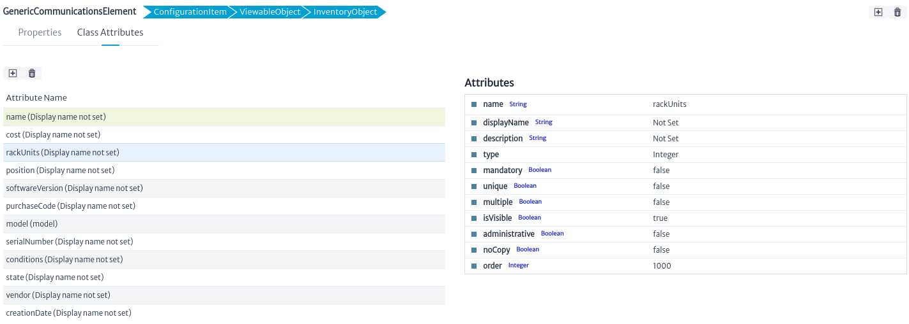
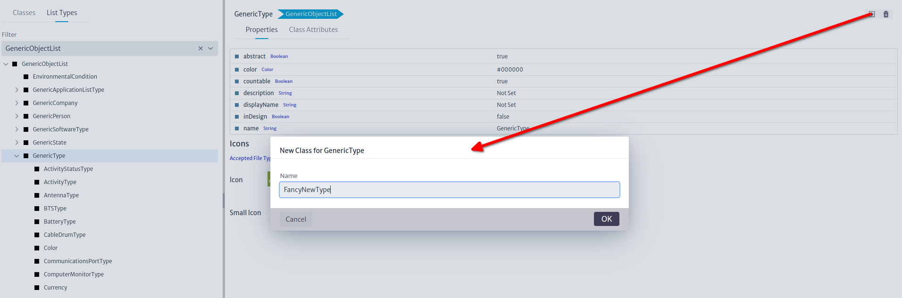

# Data Model Manager

Kuwaiba is a powerful modeling tool (understanding a model as a simplified representation of the real world, in this case a telecommunications network and all its business aspects). One of the key features of Kuwaiba is its completely [object-oriented](https://en.wikipedia.org/wiki/Object-oriented_programming) dynamic data model. Each inventory asset (router, city, port) is called an **Object**, and these objects are in turn, a product of an abstraction of reality called **Class**.

Likewise, each attribute is a **Field** in a class. The set of classes, attributes and relationships between them is called **Data Model**. Kuwaiba comes with a default data model that contains support for the most popular technologies and business models, but you can customize it depending on your needs by adding, removing, and modifying classes. To achieve this, use the **Data Model Manager** module.

To open the Data Model Manager module, select *Administration -> Data Model Manager* from the options menu.
||
|:--:|
| **Figure 1.** Data Model Manager module selection in the general menu |

## The Class Tree

Kuwaiba's data model has a tree-like structure due to its hierarchical nature. Technically, this is known as a [class hierarchy](https://en.wikipedia.org/wiki/Class_hierarchy). At the top of this hierarchy is `InventoryObject`, the most general item type in the data model, its highest level of abstraction. Its subclasses represent all possible items that will be considered inventory assets.

||
|:--:|
| **Figure 2.** Inventory object tree |

As you go deeper into the tree, classes become increasingly specialized and each level inherits the attributes of the classes above it (called [superclasses](https://en.wikipedia.org/wiki/Superclass_(computer_science))). This structure serves two main purposes: first, it helps organize classes based on their common characteristics. Second, as will be seen later in this manual, it allows operations to be applied to top-level classes, which will be propagated to all subclasses.

||
|:--:|
| **Figure 3.** Expanded class tree|

In this hierarchy, the most relevant and commonly used classes are:

* `InventoryObject`: It is the root of the hierarchy.
* `ViewableObject`: This is the superclass of all objects that can have views, that is, graphical representations of a selected object that can be launched from the **Views** section of the object panel (the concept will be explained later, in the [Navigation](../../navigation/navman/index.html) module).
* `GenericCommunicationsElement`: The superclass of all active communication devices, from multiplexers to routers or servers and workstations.
* `GenericLocation`: The superclass of all geolocated locations such as buildings, facilities, houses, poles or manholes.
* `GenericPhysicalLink`: It is the superclass of links (connections between ports) and allows subclasses to be created to expand the type of existing connections.
* `GenericSplicingDevice`: This is the superclass of objects used for splicing operations, such as splice boxes and fiber splitters.
* `GenericDistributionFrame`: It is the superclass of distribution frames, such as DDFs, ODFs or even AC/DC distribution panels.

### Creating a New Class

When selecting an item from the *Class Tree*, on the right side you can see two tabs. This section also allows you to **Create a New Class** that inherits from the selected class, through the action of the button , which will launch the following dialog . In this example, `GenericCommunicationsElement` has been selected in the Class Tree.

||
|:--:|
| **Figure 5.** Creating a new class|

The tabs that can be seen are:

* **Properties:** The Properties window contains the intrinsic properties of the class, such as name, description, etc. These can contain any type of UTF-8 character without special characters or whitespace. In addition, it allows you to assign a specific icon that will be displayed in the inventory for said object.
 If the class is abstract (instances of abstract classes cannot be created, they are only used to provide consistency to the data model).
 The **countable** attribute is not currently used, but should be used to mark classes whose instances may have graphical representations, but are not actually part of the inventory, such as `Slots`. **inDesign** is just a way to mark a class as part of an ongoing data model intervention, and therefore classes with that attribute marked **true** cannot be instantiated. The **color** is the color of the default square icon used to display the object in a tree or view. This icon will be used whenever the **smallIcon** attribute is null. **smallIcon** is the icon that will be used on the trees and its size cannot exceed 16x16 pixels. **icon** is the icon used in views and has a maximum size of 32x32 pixels.
 The *breadcrumbs* on top of the **Properties** tab allow you to explore the class hierarchy for the selected class.
  ||
  |:--:|
  | **Figure 6.** Properties of the selected object|

  > **Important**
  > * All user-created classes have **inDesign** status set to **true** by default. Objects cannot be created from these classes until they are changed to **false**. This is a preventive measure to facilitate testing of changes when creating multiple classes before moving to production.
  > * As a convention, all abstract classes are prefixed with *Generic*. However, some core classes (such as `InventoryObject` or `AdministratorItem`) are abstract and do not follow this convention. It is recommended to adhere to this rule whenever possible. Unless you have deep knowledge of the system, avoid renaming or deleting parent classes, especially abstract ones.
  > * To name the classes and attributes, we follow the camel case convention. For class names, the first letter is capitalized, as in `MyNewClass`. On the other hand, for attributes, the first letter is written in lowercase, as in **myNewAttribute**. This practice helps improve the readability of the code and maintain a consistent structure in the naming of elements within our program.

* **Class Attributes:** This section contains the class fields (attributes). In the figure below, the GenericCommunicationsElement class includes common attributes, such as **creationDate** and **name**, as well as other attributes specific to the selected class.

  ||
  |:--:|
  | **Figure 7.** Attributes of the selected class|

  Click the button next to the attribute name to customize it as shown in the figure below.

  ||
  |:--:|
  | **Figure 8.** Properties of the selected attribute |

  In this window, you can modify both common and specific class attributes. The most relevant common attributes are:
  * **name**: Change the name of the attribute.
  * **displayName**: Change how the name is displayed.
  * **description**: Provide a description for the attribute.
  * **type**: Select the type of the attribute (the drop-down list will show primitive types such as String, Integer, Float, Long, etc., and all available non-abstract list types). When the type of an attribute changes, all existing instances will be updated to reflect the change. This means that the values ​​of the modified attribute will be converted to the new type if possible (for example, from integers to strings). If the conversion is not possible, the new value will be set to null.

  You can also manage the following options for the attribute:
  * **mandatory**: If you select this option, each object of this class must have a value for this attribute. If you enable this option and there are already created objects of this class without a non-null value for this attribute, an error will occur.
  * **unique**: If checked, the value of this attribute cannot be repeated in all objects created of this class or its subclasses. Before you can set a class attribute as unique, you must verify that the value of this attribute on each object created from this class or its subclasses is unique.
  * **isVisible**: Enables or disables the visibility of the attribute. If unchecked, the attribute will not be displayed in the property sheets of objects created from this class.
  * **administrative**: Attributes marked "Administrative" will be displayed in a separate tab on the object's property sheet. This is useful for attributes that are used only for administrative purposes and that could confuse the end user if mixed with normal attributes.
  * **noCopy**: You can choose which attributes should not be transferred from one object to another in a copy operation.
  * **order**: Refers to the order in which this attribute will appear in the property sheet.

  > **Important**
  > * You may lose information when changing the type of an attribute. Make sure that conversion to the new type is possible before making the change.
  > * If attributes are added, removed, or renamed, the changes will only be reflected in the property sheets of previously opened inventory items once the page displaying the item is reloaded.
  > * It is strongly recommended **to not rename** core abstract classes, as some of them are used internally to support many functions. Renaming them can destabilize the system.

  You can also create  and delete  attributes by clicking the corresponding buttons. When creating a new attribute, a dialog box like the one shown below will be displayed, where the attributes **name**, **displayName** and **type** will be requested.

  ||
  |:--:|
  | **Figure 9.** New attribute of the selected class|

## List Types

List types are attribute type whose value is an element within a list of items. Unlike most attributes, which are of primitive types such as `String`, `Integer` or `Boolean`, some are more complex, being separate objects in the database. For example the value of the attribute **vendor** in a device, can only be chosen from a predefined list of options (Huawei, Cisco, Nokia, etc), and each one of those entries contains more information (support lines, account managers, etc). Another example is **state**, which describes the current operational state of a given device (Working, Not Working, Stored, Planned, Reserved, etc). The state itself is an object since and can contain information about the next allowed states or about itself.

Many objects in the database will share the same provider, just as many others will share the same state. In relational database terms, this can be thought of as a many-to-one relationship.

Please note that this section shows how to create attribute types of the *list* kind, not their lists themselves, for that see the [List Type Manager](../ltman/index.html).

||
|:--:|
| **Figure 10.** Class hierarchy for list types |

### Creating a List Type

List types are subclasses of `GenericObjectList` or one of its utility subclasses. In most cases, your new list types will fit into one of the existing branches, so avoid creating abstract subclasses unless you know very well what you are doing, so you don't pollute the data model unnecessarily. List type creation works exactly like for any other class seen in the past sections. Just make sure you uncheck the **inDesign** option once you are ready to create list type items in the [List Type Manager](../ltman/index.html). 

||
|:--:|
| **Figure 11.** Creating new list type |

### Using a List Type
Once the new list type is created, you can tell other classes to use it by creating attributes of the new type. In the example below, we are making the class `Router` to have a new attribute called **newListTypeAttribute** of type `FancyNewType`.

||
|:--:|
| **Figure 12.** Using the new list type |

Now our routers will have a new list type attribute whose value can be chosen from a list created in the [List Type Manager](../ltman/index.html)

> **Important**
> 
> List types support single or multiple selection. You will learn more about it in the **List Type Manager**. 