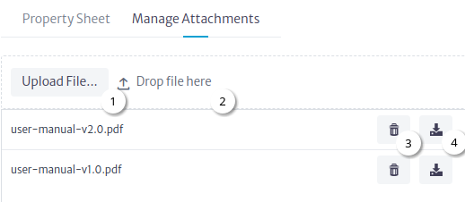

# List Type Manager

Most of the attributes are primitive types (String, Integer, Booleans, etc), however, there are some more complex that are actually another object in the database. This is the case of attributes such as vendor, which points to an object holding the information about the vendor of that equipment (support lines, account manager, etc) or state, that refers to the current operational state of the equipment (Working, Not Working, Stored, etc) and the state itself is an object, because it may hold information about what are the next allowed states, for example. Many objects in the database will have the same vendor, and many other will have the same state. In short, list types are those kind of attributes that point to an element in a limited set of objects. In terms of relational databases, you can see it as a many-to-one kind of relationship. To manage the existing list types and its instances, use the Data Model Manager and the List Type Manager.

To access the module, click on the administration  category and select the List Type Manager Figure 1.

|  |
|:--:|
| ***Figure 1.** List Type Manager Module* |

There are two relevant concepts in this module [List Type](./#list-type) and [List Type Item](./#list-type-item) in the following sections we will address each of them.

## List Type

A list type is a subclass of `GenericObjectList` or its subclasses and is managed using the Data Model Manager.

### List Type Example

* Using the Data Model Manager create list type `MyOwnListType` Figure 2. The `inDesign` property is changed to `false` and the other properties and attributes are kept by default.

|  |
|:--:|
| ***Figure 2.** MyOwnListType* |

* Create the class `MyOwnClass` and create an attribute with name `newListTypeAttribute` of type `MyOwnListType` Figure 3.

|  |
|:--:|
| ***Figure 3.** newListTypeAttribute* |

1. Select the Classes tab.
2. Create the class `MyOwnClass` as a subclass of `InventoryObject`.
3. Click on the new attribute button.
4. Set the name and type of the attribute and click the OK button.

## List Type Item

A list type item is an instance of a class of list type.

### List Type Item Example

In the previous section, the list type `MyOwnListType` was created; this class will be used to show how this module works.

* Enter the List Type Manager module Figure 1.

* Create a list type item Figure 4.

|  |
|:--:|
| ***Figure 4.** New List Type Item Window* |

1. Click on the New List Type Item Button.
2. Select the List Type.
3. Set the name of the List Type Item.
4. Click on the OK button.

* Select List Type Item.

|  |
|:--:|
| ***Figure 4.** Select List Type Item* |

1. Search List Type.
2. Select the List Type.
3. Select the List Type Item.
4. Button to show more information Figure 5.
5. Button to show the [uses](./#uses) of the selected list type item.
6. Button to delete the selected list type item.
7. Manage properties of the selected list type item.
8. [Manage Attachments](./#attachments) of the selected list type item.

|  |
|:--:|
| ***Figure 5.** More Information Window* |

#### Uses

All objects that have a List Type attribute set use a List Type Item.

##### List Type Item Uses Example

* Using the pools module create a pool Figure 6.

|  |
|:--:|
| ***Figure 6.** New Pool Window* |

1. Click on the new pool button.
2. Set the name.
3. Set the class name.
4. Click on the OK button

* Using the pools module create a pool item Figure 7.

|  |
|:--:|
| ***Figure 7.** New Pool Item Window* |

1. Click on the new pool item button.
2. Set the class name.
3. Set the name.
4. Click on the OK button.

* Using the pools module set the list type attribute to the pool item Figure 8.

|  |
|:--:|
| ***Figure 8.** Set attribute newListTypeAttribute* |

1. Select pool.
2. Select pool item.
3. Double click on the property.
4. Select the list type item.
5. Click on the Accept button.

* Return to the List Type Manager module.

* Find the list type item that was set in the attribute and click on the uses button.

Figure 9 shows all the uses or objects that have the selected list type item as the attribute value.

|  |
|:--:|
| ***Figure 9.** List Type Item Uses* |

> **Warning:** The `Release all Usages` button sets the attribute of all objects that use the list type item to null, is used when you want to delete a list type item.

#### Attachments

For some list type items it may be necessary add attachments for example for EquipmentModels to manage manuals, Figure 10 shows in more detail how it works.

|  |
|:--:|
| ***Figure 10.** Manage Attachments* |

1. Upload File button.
2. Drag and drop file section.
3. Delete attachment button.
4. Download attachment button.
