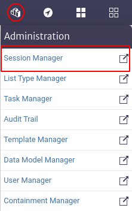
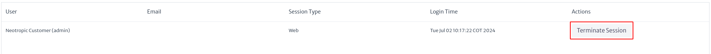

# Session Manager

Provides users with the ability to view and manage active sessions in the application. To access this module, go to the top menu of the screen and click on the icon . This will display a vertical menu where you can select the `Session Manager` option.

> **Warning** This functionality is essential for administrators to monitor and control active sessions, thus ensuring security and efficiency in the use of the application. Therefore, it is recommended that access to this module be restricted to users with administrative permissions only.

|  |
| :--: |
| ***Figure 1.** Access to the session manager module.* |

|  |
| :--: |
| ***Figure 2.** Session manager module.* |

When accessing the module, an interface like the one shown in Figure 2 appears, with a list of all active sessions. The columns and actions available in this interface are described below:

* **User.** This column shows the user's name.
* **Email.** This column shows the e-mail address associated with each user if it has been defined by the user.
* **Session Type.** Indicates the type of session started.
* **Login Time.** Displays the date and time the session was started.
* **Actions.** This column provides options for managing the session. In the image, a button labeled `Terminate Session` is shown, which allows the administrator to terminate the active session of the corresponding user.

It is not possible for a user to end his own session using the `Session Manager` module. Instead, the user must logout by clicking the `Logout` button.
