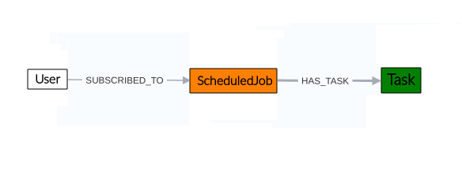
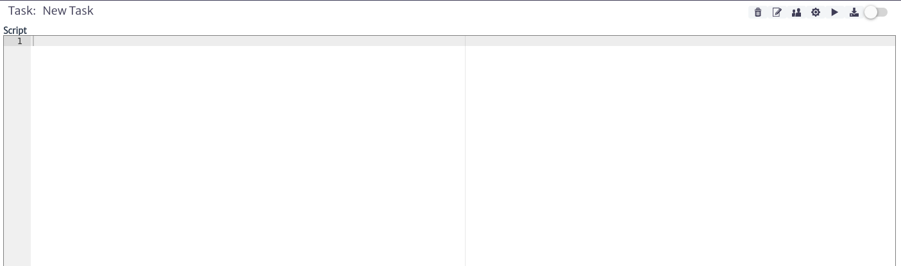

# Tasks Manager
At times, it will be necessary to carry out certain repetitive procedures in the application, such as checking rack usage in the inventory or retrieving users from an OLT. To facilitate the execution of these recurring tasks, the application includes a *Task Manager* module. This module allows for the flexible creation and execution of tasks by defining scripts that can run under various conditions. Additionally, tasks created in this module can be scheduled for execution as needed by the user, using the [Job Scheduler](../scheduling/README.md) Module.

Figure 1 illustrates the module's structure. In the application, when creating a task, it can be linked to a *Job* through the *HAS_TASK* relationship, indicating that the task will be executed according to the schedule defined in the Job using the *Job Scheduler* module. Similarly, users can be assigned to the task, represented by the SUBSCRIBED_TO relationship. In the current version of the application, these users are for informational purposes only; however, their functionalities will be implemented in future versions of the application.

||
|:--:|
| ***Figure 1.** Task manager module* |

This module is part of the *Administration* category, as shown in Figure 2.

||
|:--:|
| ***Figure 2.** Task manager module* |

Once opened, we will see the main window of the module, as shown in Figure 3. From here, we can view the tasks currently created in the application.

||
|:--:|
| ***Figure 3.** Tasks manager main window* |

## Task

A task consists of the following properties: 

| Property           | Description |
|--------------------|----------------------------------------|
| **Name**           | Name of the task |
| **Description**    | Description of the task |
| **Enable**         | Flag to enable or disable the execution of the task |
| **CommitOnExecute**| Flag to enable or disable if this task commit the changes in data base (if any) after its execution |
| **Script** | The Groovy script to be executed by this task. |
| **Parameters**    | List of parameters as a set of parameter name/value pairs used in the script |
| **StartTime** | The exact time and date the task should be executed.(Optional) |
| **EveryXMinutes** | Interval should this task be executed.(Optional) |
| **ExecutionType** | How the task should be executed.(Optional) |
| **Email** | The email of the person or group that will receive the notification (Optional). |
| **NotificationType** | What type of notification should the subscribed.(Optional) |

### Tasks Action 
#### Create Tasks
To create a task, use thebutton in the main window of the module. The task creation window shown in Figure 4 will open. You will need to enter the name and description of the task. It is advisable to use a descriptive name, as this will be the name displayed in the list of available task. Click *OK* to create the task or *CANCEL* if you do not wish to proceed.

||
|:--:|
| ***Figure 4.** Create task window* |

Once created, the task will appear in the list of available tasks within the application, here you can also search task by name as shown in Figure 5. 

||
|:--:|
| ***Figure 5.** Group list* |

When selecting a task the main module window will display the information and buttons actions as shown in Figure 6.

||
|:--:|
| ***Figure 6.** Task information* |

#### Script
In the script section shown in Figure 6, you can define your own scripts, which can range from custom inventory queries to the perform complex actions.

> **Information**
It is out of the scope of this document to teach how to code scripts, however, you can find more detail and examples in the scripts available in this [repository](https://sourceforge.net/p/kuwaiba/code/HEAD/tree/server/trunk/scripts/tasks/).

##### Script Parameters
It is important to note that most scripts will require input parameters. These parameters can be easily added to the task so that the user can fill them in before executing the task. To manage the parameters, click on thebutton. The parameter management window shown in Figure 7 will open, allowing you to create, edit, and delete parameters.

||
|:--:|
| ***Figure 7.** Manage parameters window* |

To create a parameter, use thebutton in the main parameter management window. The window to add a new parameter, shown in Figure 8, will open. Enter the name of the parameter to be used in the script and its value. Click *OK* to create it or *Cancel* if you decide not to proceed.

||
|:--:|
| ***Figure 8.** New parameters window* |

Once created, the parameter will be visible in the parameter management window, as shown in the example in Figure 8. You can edit its properties using thebutton or delete it with thebutton seen in Figure 9.

||
|:--:|
| ***Figure 9.** Parameter example* |

##### Save And Execute Script
Once the script and its parameters have been created, as shown in the example in Figure 10, you can save the script changes using thebutton seen in Figure 5.  

||
|:--:|
| ***Figure 10.** Basic example of script and parameters* |

Or use thebutton seen in Figure 5 to save the script changes and execute your script.The execution result will be displayed in the popup window, si la ejecución fue exitosa el resaltado sera resaltado en color verde como se muestra en la Figura 11.

||
|:--:|
| ***Figure 11.** Script execution* |

If errors occur during the script execution, the result will be highlighted in red, as shown in Figure 12.

||
|:--:|
| ***Figure 12.** Failed script execution* |

##### Commit On Execute
If you want the changes made by the script to be saved in the database after it is executed, enable *CommitOnExecute* by toggling the switch seen in Figure 6. from disabledto enabled

> **Warning**
> The changes made by tasks in the database can break things if your code is wrong. Ensure that the script execution was successful before enabling this feature. By default, CommitOnExecute is set to false.

#### Update Task Properties
To edit the properties of a task, use thebutton seen in Figure 6. The task update window shown in Figure 13 will open. Edit the desired properties and click *OK* to update them or *CANCEL* if you do not wish to proceed.

||
|:--:|
| ***Figure 13.** Update task properties window* |

#### Delete Task 
To delete a task, use thebutton seen in Figure 6. The confirmation window shown in Figure 14 will open. Click *OK* to delete it or *Cancel* if you decide not to proceed.

||
|:--:|
| ***Figure 14.** Delete task confirmation window* |

#### Schedule Task
It is possible to schedule task execution using the scheduling module, explained in detail in the [Scheduling module](../scheduling/README.md) section.  