# Users Manager
The *User Manager* is a module designed for managing users and groups within the application. Its features include creating new users and groups, associating or disassociating users with groups, and managing permissions for the different modules of the application.

This module is part of the *Administration* category, as shown in Figure 1.

|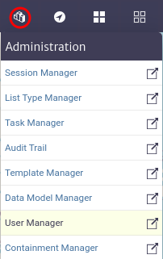|
|:--:|
| ***Figure 1.** User manager module* |

Once opened, we will see the main window of the module, as shown in Figure 2. From here, we can view the groups currently created in the application.

|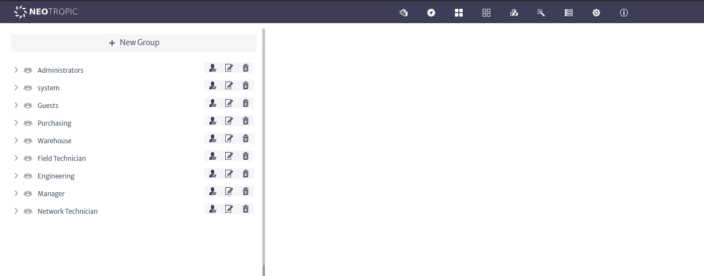|
|:--:|
| ***Figure 2.** User manager main window* |

## Groups

Groups allow for the aggregation of users to simplify their management and administration.

### Groups Actions

#### Creating new groups

To create a new group, use thebutton in the main window of the module. This will open the group creation window, as shown in Figure 3. Here, you will need to enter the name and description of the group. It is advisable to use a descriptive name, as this will be the name displayed in the list of available groups.

|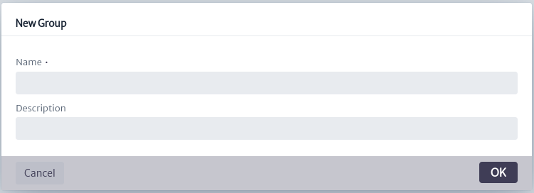|
|:--:|
| ***Figure 3.** Create group window* |

Once created, the group will appear in the list of available groups within the application, as shown in Figure 4. From here, you can also view the users assigned to each group by clicking on it, in addition to accessing group actions.

|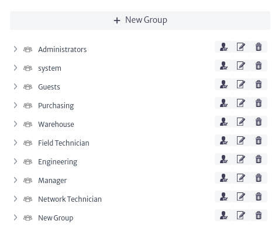|
|:--:|
| ***Figure 4.** Group list* |

#### Deleting groups
To delete a group, use thebutton found in the group actions as shown in Figure 4. This will open the group deletion window in Figure 5. Click *OK* to proceed with deletion or *Cancel* to abort.
> **Note** Users assigned exclusively to the group being deleted will also be removed unless they are assigned to other groups.

| 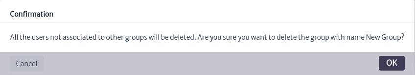 |
|:--:|
| ***Figure 5.** Groups delete window* |

#### Updating Groups
To edit the properties of a group, use thebutton found in the group actions as shown in Figure 4. This will open the edit window in Figure 6, where you can enter the new values. Click *OK* to update the group or *Cancel* if you decide not to proceed.

|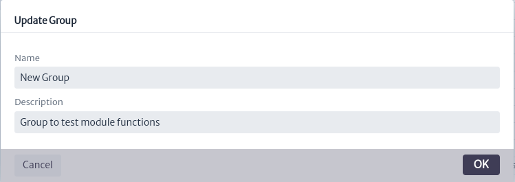|
|:--:|
| ***Figure 6.** Groups update window* |

## Users
### Users Actions
#### Creating Users
A user consists of the following properties: 

| Property           | Description |
|--------------------|----------------------------------------|
| **User Name**      | The unique identifier for the user within the application. |
| **Password**           | The unique identifier for the user within the application. |
| **First Name**    | The user's given name. |
| **Last Name**          | The user's family name. |
| **Email**           | The user's email address. |
| **User Type** | The user's type, the available types are described below |
| **Privileges**    | Privileges a user in Kuwaiba. | 
| **Enabled**    | Flag to enable or disable the user. |

##### User Types
>- **GUI User**: Users that will access the system via desktop client or web interface.
>- **Web Service Interface User**: Users that will access the system via web service.
>- **Southbound Interface User**: Users that will access the system via automated interfaces, such as southbound interfaces or scheduled tasks.
>- **System**: users used by application modules to automate tasks.
>- **External application**: Users that will make process in externals applications.

To create a new user, they must be assigned to a group. Use thebutton to create and assign the user to the desired group. This will open the user creation window shown in Figure 7. Fill in the fields and click *OK* to proceed or *Cancel* to abort.

|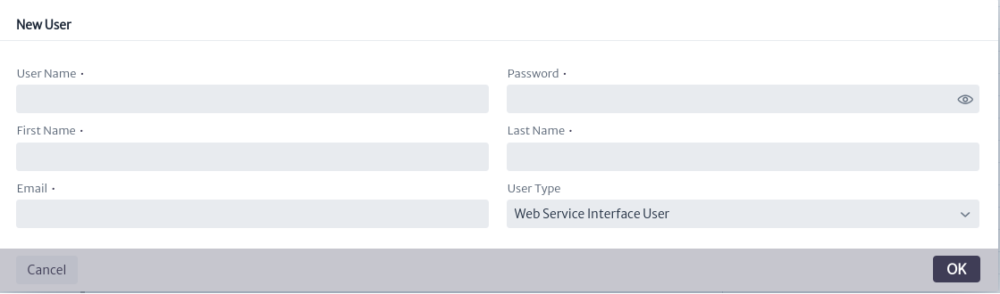|
|:--:|
| ***Figure 7.** Create user window* |

Once created, the user will be visible in the assigned users section of the group where they were created, as shown in Figure 8.

|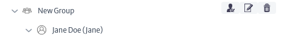|
|:--:|
| ***Figure 8.** Example new user* |

When selecting a user, the main module window will display the information, actions, and privileges related to the user, as shown in Figure 9.

|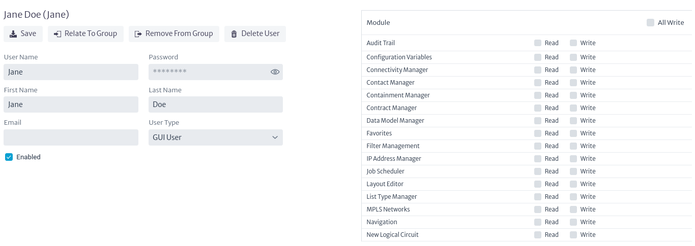|
|:--:|
| ***Figure 9.** User information* |

#### Updating Users
To update user properties, modify them using the fields shown in Figure 9. Once the desired properties have been updated, use thebutton to save the changes.

#### Related User To Group
It is possible to relate a user with multiple groups simultaneously. To do this, use thebutton seen in Figure 9. This will open the user relate window shown in Figure 10. In this window, select the group you wish to relate with the user and click *OK*. If you do not wish to proceed, click *Cancel*.

|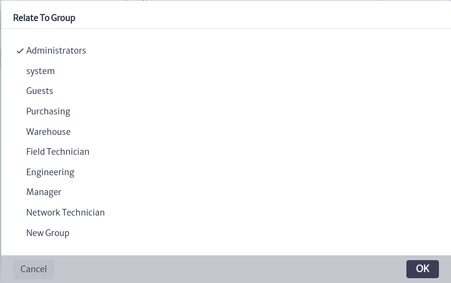|
|:--:|
| ***Figure 10.** Related user window* |

Once this action is completed, the user will be visible among the assigned users of the group, as seen in Figure 11.

|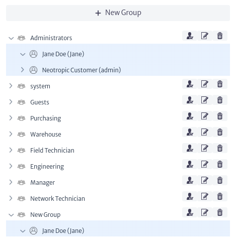|
|:--:|
| ***Figure 11.** User related to new group* |

#### Remove User From Group
To remove users from a group, the user must be assigned to at least two groups, as users cannot exist without a group in the application. To perform this action, use thebutton seen in Figure 9. This will open the window to remove users from a group, as shown in Figure 12. In this window, you will see the groups to which the user is assigned. Select the group from which you want to remove the user and click *OK*. If you do not wish to proceed, click *Cancel*.

|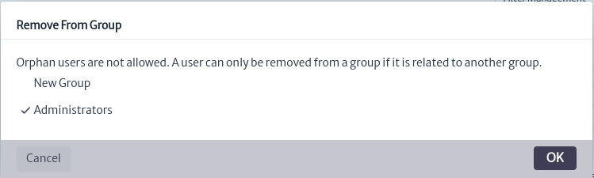|
|:--:|
| ***Figure 12.** Remove user to group window* |

#### Privileges
Privileges for each module assigned to the user can be viewed and managed on the right-hand side of the user information, as shown in Figure 9. When creating a new user, no privileges are assigned by default. To assign or remove privileges, check or uncheck the privilege type in the desired module. Note that the write privilege automatically includes the read privilege. Changes take effect immediately, as show in Figure 13.

|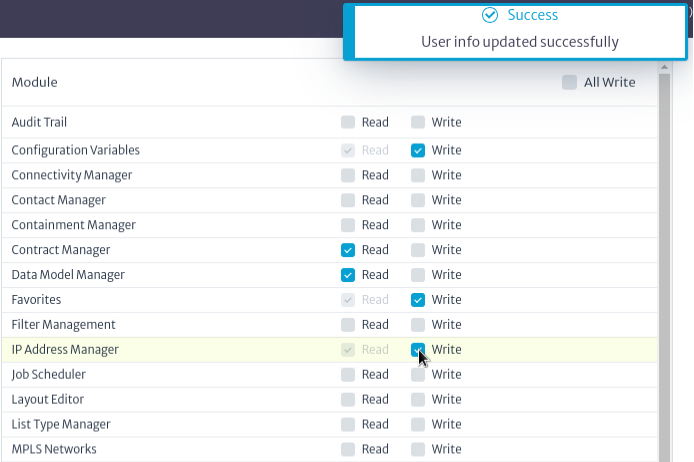|
|:--:|
| ***Figure 13.** Privileges* |

To quickly assign write privileges to a user across all modules, check the *All Write* checkbox in Figure 14.

|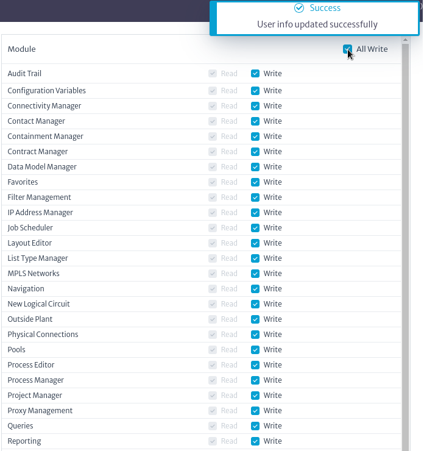|
|:--:|
| ***Figure 14.** All privileges* |

> **Warning** 
> When assigning permissions to inexperienced users, exercise caution with the modules to which you grant privileges; improper use can potentially corrupt the database.

#### Deleting Users
To delete a user, use thebutton shown in Figure 9. This will open the confirmation window in Figure 15. In this window, click *OK* to delete the user. If you do not wish to proceed, click *Cancel*.
> **Note** Deleting a user will also remove them from all assigned groups, so proceed with caution.

|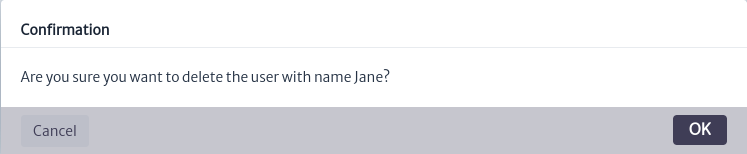|
|:--:|
| ***Figure 15.**Delete user confirm window* |