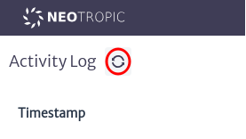
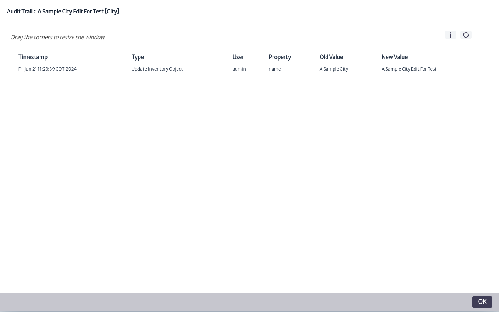
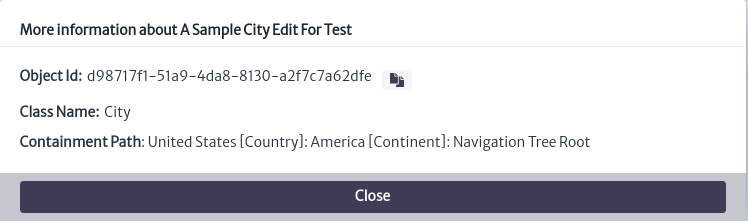

# Audit Trail

The Audit trail module in Figure 1 belongs to the **Administration** category and is capable of tracking the changes performed by the users in the database for audit purposes.

|  |
|:--:|
| ***Figure 1.** Audit trail module* |

These changes can be made to inventory objects (equipment, locations, etc) or application objects (pools, tasks, user properties). There are two types of events that are logged: **General events**, that is, those that are not related to any object in particular, like new logins or creation of application objects. **Object-related events**, like property changes or move operations.

## General events
Once the module is open, we can see the main window of **General events** as shown in Figure 2.

|  |
|:--:|
| ***Figure 2.** General events main window* |

To refresh the changes made in the application since entering the module, you can use the refresh button located in the main window of the module, as shown in Figure 3.

|  |
|:--:|
| ***Figure 3.** Refresh button* |

The module presents us with information divided into several columns, among which we find:

> - **Timestamp** Field that contains the date when the record was made.
> - **Type** Field that contains the type of action performed.
> - **User** Field that contains the user who performed the action.
> - **Property** When the event type is Object-related events, this field presents the name of the modified property of the object. Otherwise, it will be empty.
> - **Old Value** When the event type is Object-related events, this field presents the old value previously set in the modified property of the object. Otherwise, it will be empty.
> - **New Value** When the event type is Object-related events, this field presents the new value assigned to the modified property of the object. Otherwise, it will be empty.
> - **Notes** Field that contains additional notes about the action, if any.

### Filters

The module offers filters to facilitate the search for information. These filters can be found as indicated in Figure 4. If no filter is selected, the default behavior is to show all records

|  |
|:--:|
| ***Figure 4.** Audit trail filters* |

The types of filters are:

* Type Filter: Allows you to obtain records based on the type of action performed, such as the creation, updating, or deletion of objects, session start or end, among others.
* User Filter: Allows you to view only the records associated with actions performed by a user.

### Pagination

The module presents the records in a paginated format, allowing you to navigate through the available records. The navigation controls are located at the bottom of the records, as shown in Figure 5.

|  |
|:--:|
| ***Figure 5.** Pagination* |

## Object-related events

The Object-related events can be found in any Kuwaiba module that has the **object options panel** as shown in Figure 6, explained in detail in the section [Object Dashboard](../dashboards/object/README.md). This functionality is available in modules such as navigation, pool, etc.

|  |
|:--:|
| ***Figure 6.** Object options panel* |

In the **Explorers** option section of the **Object Options Panel** you will find the options **Audit Trail** as shown in Figure 7.

|  |
|:--:|
| ***Figure 7.** Audit trail option* |

When using, the Object-related window, shown in Figure 8, will appear.

|  |
|:--:|
| ***Figure 8.** Object-related window* |

The information presented is the same as in **General events** except for the absence of the *Notes* field. Additionally, it includes the  button, not present in **General events** which allows viewing more information about the selected object, as shown in Figure 9.

|  |
|:--:|
| ***Figure 9.** Information window* |