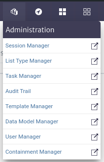
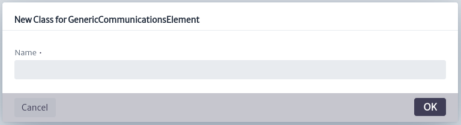
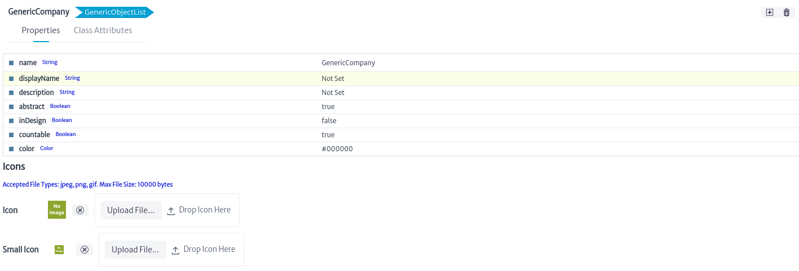
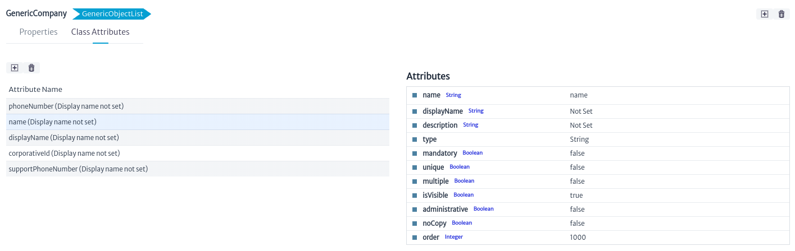

# Data Model Manager

One of the key features of Kuwaiba is that it is completely object-oriented[^1]. It means that each business element (router, city, port) and application (users, types) is represented by an **Object** in the application and these objects are in turn a product of an abstraction of reality called Class.

Likewise, each attribute is a **Field** in a class. The set of classes, attributes and relationships between them is called **Data Model**. There is a default data model, but you can customize it depending on your needs by adding, removing, and modifying classes. To achieve this, use the *Data Model Manager* module.

To open the Data Model Manager module, I selected *Options -> Data Model Manager* from the options menu.
||
|:--:|
| **Figure 1.** Data Model Manager module selection in the general menu |

## Class tree

The data model is represented as a tree due to its hierarchical structure. Technically, this is known as a class hierarchy[^2]. At the top of this hierarchy is **InventoryObject**, the most general item type in the data model. Its subclasses represent all possible items that will be considered inventory assets.

||
|:--:|
| **Figure 2.** Inventory object tree |

As you go deeper into the tree, classes become increasingly specialized and each level inherits the attributes of the classes above it. This structure serves two main purposes: first, it helps organize classes based on their common characteristics. Second, as will be seen later in this manual, it allows operations to be applied to top-level classes, which will be propagated to all subclasses.

||
|:--:|
| **Figure 3.** Expanded inventory item tree|

### Create a new class

When selecting an item from the *Class Tree*, on the right side you can see two tabs. This section also allows you to **Create a new class** that inherits from the selected class, through the action of the button , which will launch the following dialog . In this example, *AdministrativeItem* has been selected in the Class Tree.

||
|:--:|
| **Figure 5.** Create new class|

The tabs that can be seen are:

* **Properties:** The Properties window contains the intrinsic properties of the class, such as name, description, etc. These can contain any type of UTF-8 character without special characters or whitespace. In addition, it allows you to assign a specific icon that will be displayed in the inventory for said object.
 If the class is abstract (instances of abstract classes cannot be created, they are only used to provide consistency to the data model). The **countable** attribute is not currently used, but should be used to mark classes whose instances may have graphical representations, but are not actually part of the inventory, such as **Slots**. **In Design** is just a way to mark a class as part of an ongoing data model intervention, and therefore classes with that attribute marked *TRUE* cannot be instantiated. The **color** is the color of the default square icon used to display the object in a tree or view. This icon will be used whenever the **Small Icon** attribute is null. **Small Icon** is the icon that will be used on the trees and its size cannot exceed 16x16 pixels. **Icon** is the icon used in views and has a maximum size of 32x32 pixels.
  ||
  |:--:|
  | **Figure 6.** Properties of the selected object|

  > **Important**
  > * All user-created classes have **In Design** status set to *TRUE* by default. Objects cannot be created from these classes until they are changed to *FALSE*. This is a preventive measure to facilitate testing of changes when creating multiple classes before moving to production.
  > * As a convention, all abstract classes are prefixed with **Generic**. However, some core classes (such as *InventoryObject* or *AdministratorItem*) are abstract and do not follow this convention. It is recommended to adhere to this rule whenever possible. Unless you have deep knowledge of the system, avoid renaming or deleting parent classes, especially abstract ones.
  > * To name the classes and attributes, we follow the camel case convention. For class names, the first letter is capitalized, as in *MyNewClass*. On the other hand, for attributes, the first letter is written in lowercase, as in *myNewAttribute*. This practice helps improve the readability of the code and maintain a consistent structure in the naming of elements within our program.

* **Class Attributes:** This section contains the class fields (attributes). In the figure below, the *AdministrativeItem* class has two attributes: creationDate and name.

  ||
  |:--:|
  | **Figure 7.** Attributes of the selected class|

  Click the button next to the attribute name to customize it as shown in the figure below.
  In this window, you can modify:
  * **name**: Change the name of the attribute.
  * **displayName**: Change how the name is displayed.
  * **Description**: Provide a description for the attribute.
  * **Type**: Select the type of the attribute (the drop-down list will show primitive types such as String, Integer, Float, Long, etc., and all available non-abstract list types). When the type of an attribute changes, all existing instances will be updated to reflect the change. This means that the values ​​of the modified attribute will be converted to the new type if possible (for example, from integers to strings). If the conversion is not possible, the new value will be set to null.

  You can also manage the following options for the attribute:
  * **Mandatory**: If you select this option, each object of this class must have a value for this attribute. If you enable this option and there are already created objects of this class without a non-null value for this attribute, an error will occur.
  * **Unique**: If checked, the value of this attribute cannot be repeated in all objects created of this class or its subclasses. Before you can set a class attribute as unique, you must verify that the value of this attribute on each object created from this class or its subclasses is unique.
  * **isVisible**: Enables or disables the visibility of the attribute. If unchecked, the attribute will not be displayed in the property sheets of objects created from this class.
  * **Administrative**: Attributes marked "Administrative" will be displayed in a separate tab on the object's property sheet. This is useful for attributes that are used only for administrative purposes and that could confuse the end user if mixed with normal attributes.
  * **NoCopy**: You can choose which attributes should not be transferred from one object to another in a copy operation.
  * **order**: Refers to the order in which this attribute will appear in the property sheet.

  ||
  |:--:|
  | **Figure 8.** Properties of the selected attribute |

  > **Important**
  > * You may lose information when changing the type of an attribute. Make sure that conversion to the new type is possible before making the change.
  > * If attributes are added, removed, or renamed, the changes will only be reflected in the property sheets of previously opened inventory items once the page displaying the item is reloaded.
  > * It is strongly recommended **not to rename** core abstract classes, as some of them are used internally to support many functions. Renaming them can destabilize the system.

  You can also create  and delete  attributes by clicking the corresponding buttons. In the case of creating a new attribute, a dialog box like the one shown below will be displayed, where the *Name*, *DisplayName* and *Type* will be requested, the description of which is detailed in the previous paragraph.

  ||
  |:--:|
  | **Figure 9.** New attribute of the selected class|

## List types

List types are attributes that point to an element within a limited set of objects. Unlike most attributes, which are of primitive types such as String, Integer, Boolean, etc., some are more complex, being actually additional objects in the database. An example of this are attributes such as supplier, which points to an object that contains information about the equipment supplier (support lines, account manager, etc.), or status, which describes the current operational state of the equipment (Working, Not Working , Stored, etc.). The state itself is an object since it can contain information about the next allowed states.

Many objects in the database will share the same provider, just as many others will share the same state. In relational database terms, this can be thought of as a many-to-one relationship.

|[dmman list types](images/dmman-lyst-types-expanded.png)|
|:--:|
| **Figure 10.** List types |

### Create a new type of list

Select a subclass in *GenericObjectList* or in one of its utility subclasses, on the right side you can see two tabs. This section also allows you to **Create a new type of lists**, through the action of the  button, which will launch the following dialog. In this example, *GenericObjectList* is selected.

||
|:--:|
| **Figure 11.** Create new type of list |

The tabs that can be seen are:

* **Properties:** The Properties window contains the intrinsic properties of the class, such as name, description, etc. These can contain any type of UTF-8 character without special characters or whitespace. In addition, it allows you to assign a specific icon that will be displayed in the inventory for said object.
 If the class is abstract (instances of abstract classes cannot be created, they are only used to provide consistency to the data model). The **countable** attribute is not currently used, but should be used to mark classes whose instances may have graphical representations, but are not actually part of the inventory, such as **Slots**. **In Design** is just a way to mark a class as part of an ongoing data model intervention, and therefore classes with that attribute marked *TRUE* cannot be instantiated. The **color** is the color of the default square icon used to display the object in a tree or view. This icon will be used whenever the **Small Icon** attribute is null. **Small Icon** is the icon that will be used on the trees and its size cannot exceed 16x16 pixels. **Icon** is the icon used in views and has a maximum size of 32x32 pixels.
  ||
  |:--:|
  | **Figure 12.** Properties of the selected list type |

  > **Important**
  > * All user-created classes have **In Design** status set to *TRUE* by default. Objects cannot be created from these classes until they are changed to *FALSE*. This is a preventive measure to facilitate testing of changes when creating multiple classes before moving to production.

* **Class Attributes:** This section contains the class fields (attributes). In the figure below, the *AdministrativeItem* class has two attributes: creationDate and name.

  ||
  |:--:|
  | **Figure 13.** Attributes of the selected list type|

  Click the button next to the attribute name to customize it as shown in the figure below.
  In this window, you can modify:
  * **name**: Change the name of the attribute.
  * **displayName**: Change how the name is displayed.
  * **Description**: Provide a description for the attribute.
  * **Type**: Select the type of the attribute (the drop-down list will show primitive types such as String, Integer, Float, Long, etc., and all available non-abstract list types). When the type of an attribute changes, all existing instances will be updated to reflect the change. This means that the values ​​of the modified attribute will be converted to the new type if possible (for example, from integers to strings). If the conversion is not possible, the new value will be set to null.

  You can also manage the following options for the attribute:
  * **Mandatory**: If you select this option, each object of this class must have a value for this attribute. If you enable this option and there are already created objects of this class without a non-null value for this attribute, an error will occur.
  * **Unique**: If checked, the value of this attribute cannot be repeated in all objects created of this class or its subclasses. Before you can set a class attribute as unique, you must verify that the value of this attribute on each object created from this class or its subclasses is unique.
  * **isVisible**: Enables or disables the visibility of the attribute. If unchecked, the attribute will not be displayed in the property sheets of objects created from this class.
  * **Administrative**: Attributes marked "Administrative" will be displayed in a separate tab on the object's property sheet. This is useful for attributes that are used only for administrative purposes and that could confuse the end user if mixed with normal attributes.
  * **NoCopy**: You can choose which attributes should not be transferred from one object to another in a copy operation.
  * **order**: Refers to the order in which this attribute will appear in the property sheet.

  ||
  |:--:|
  | **Figure 14.** Properties of the selected list type |

  > **Important**
  > * You may lose information when changing the type of an attribute. Make sure that conversion to the new type is possible before making the change.
  > * If attributes are added, removed, or renamed, the changes will only be reflected in the property sheets of previously opened inventory items once the page displaying the item is reloaded.
  > * It is strongly recommended **not to rename** core abstract classes, as some of them are used internally to support many functions. Renaming them can destabilize the system.

  You can also create  and delete  attributes by clicking the corresponding buttons. In the case of creating a new attribute, a dialog box like the one shown below will be displayed, where the *Name*, *DisplayName* and *Type* will be requested, the description of which is detailed in the previous paragraph.

  ||
  |:--:|
  | **Figure 15.** New attribute of the selected list type|

[^1]: Object-oriented programming [https://en.wikipedia.org/wiki/Object-oriented_programming](https://en.wikipedia.org/wiki/Object-oriented_programming)
[^2]:Class hierarchy [https://en.wikipedia.org/wiki/Class_hierarchy](https://en.wikipedia.org/wiki/Class_hierarchy)
