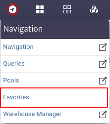
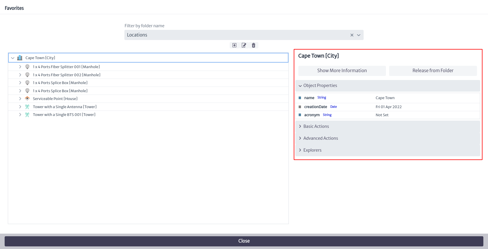
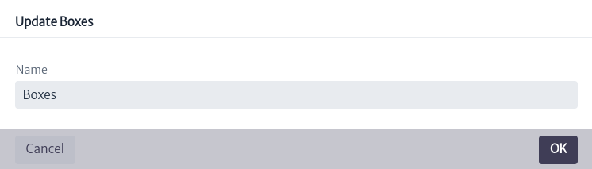

# Favorites

The Favorites module allows you to easily organize frequently accessed items without having to navigate deeply between objects. To access this module, go to the Navigation section, identified by the symbol  at the top of the screen, and then select the `Favorites` option.

|  |
| :--: |
| ***Figure 1.** Access to favorites module.* |

A pop-up window as shown in Figure 2 appears.

|  |
| :--: |
| ***Figure 2.** Favorites module.* |

You can select an existing folder or create a new one. To select an existing one, use the search bar marked `Filter by Folder Name`, where you can enter the desired folder name. Alternatively, you can click on the icon  to display a list of existing folders, as illustrated in Figure 3.

|  |
| :--: |
| ***Figure 3.** Folder search.* |

When you select an existing folder, the objects belonging to that folder are displayed along with their hierarchical structure, as indicated in Figure 4. When you click on a specific object, the Object Options Panel appears with the object's information, located on the right side of the screen and explained in detail in the [Navigation][navman] chapter. In addition, you will find the `Release From Folder` option, which allows you to delete the object from the selected folder.

|  |
| :--: |
| ***Figure 4.** Selected folder display.* |

You can create a new folder by selecting the  button where a new window appears requesting the name of the new Folder, as shown below.

|  |
| :--: |
| ***Figure 5.** Create new folder.* |

You can edit the name of a folder by selecting it from the filter shown in Figure 3 and then clicking on the icon . This will display a window similar to the one shown in Figure 6, where you can enter the new folder name. Similarly, you can delete a folder by selecting the icon . It is important to note that these buttons to edit and delete a folder will only be available after selecting a specific folder; otherwise, they will remain disabled.

|  |
| :--: |
| ***Figure 6.** Edit folder.* |

To add an object to a favorite folder, go to the `Object Options Panel` (explained in the [Navigation][navman] chapter) and find the `Add to Folder` option under `Basic Actions`. Then, select the folder where you want to add the object, as shown in Figure 8.

|  |
| :--: |
| ***Figure 7.** Option to add to favorites.* |

|  |
| :--: |
| ***Figure 8.** Add object to favorites.* |

[navman]: ../navman/index.html