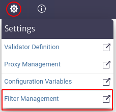
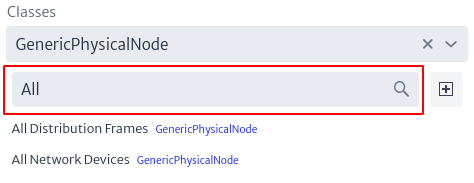
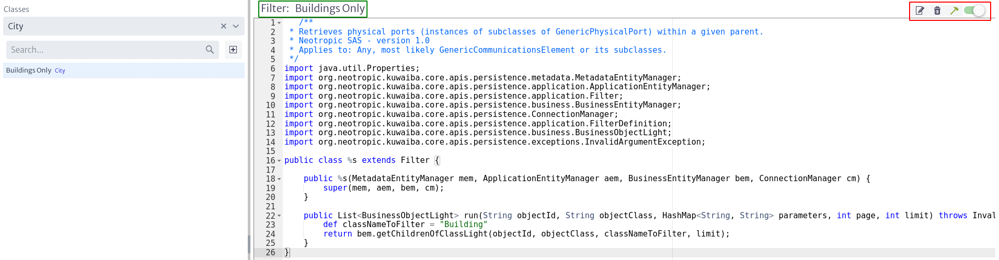

# Filters

Filters, as the name implies, filter inventory objects according to a criterion based on a previously selected object.

To access the filter module, locate the icon  in the menu at the top of the screen. Then, a new horizontal menu will appear where you must select the Filter Management option, as shown in Figure 1.

|  |
| :--: |
| ***Figure 1.** Access to the filter module.* |

When accessing the filters module, the initial interface is displayed, as shown in Figure 2, where all the filters existing in the application are listed. The red boxes next to the name of each filter refer to the classes to which the filters belong.

|  |
| :--: |
| ***Figure 2.** Initial interface of the filter module.* |

At the top of Figure 2, a search filter identified with `Classes` appears, where the user can search for filters that belong to a given class by entering or selecting the class, as shown in Figure 3. Marked in the red circle in the last mentioned figure is the symbol , which displays a list of existing classes for the user to select the one of interest. Alternatively, you can type the name of the class in the search box and, as you type, the classes matching the search will appear.

|  |
| :--: |
| ***Figure 3.** Selection of the class of interest.* |

When the user selects a class, the filters belonging to that class are displayed on the screen, as shown in Figure 4.

|  |
| :--: |
| ***Figure 4.** Filters of a class.* |

Additionally, there is a second search box, which allows you to search for filters by name match, as illustrated in Figure 5.

|  |
| :--: |
| ***Figure 5.** Search filters by name.* |

To create a new filter, select the icon , which will open a new pop-up window where the user can enter the name and a description of the new filter. If you have previously used the filter search by classes, the pop-up window will already contain the class with which the search was performed, that is, the new filter created will be associated to the previously selected class, as shown in Figure 6, in this new window this value cannot be modified. Otherwise, if you have not selected a class in the filter in Figure 3, the new pop-up window to create a new filter will allow you to select the class to which the filter will belong, as shown in Figure 7.

> **Note.** Filters belonging to abstract classes are applicable to the subclasses of that class.

|  |
| :--: |
| ***Figure 6.** Create filter with previously selected class.* |

|  |
| :--: |
| ***Figure 7.** Create filter without previously selected class.* |

When you select a specific filter, the content of the filter appears on the right side of the screen. In addition, four buttons marked with a red box in Figure 8 are displayed on the upper right side of the screen.

|  |
| :--: |
| ***Figure 8.** Filter content.* |

The Figure below shows a larger view of the four buttons mentioned above.

|  |
| :--: |
| ***Figure 9.** Filter options.* |

* The icon  allows you to modify the filter name and description.

  |  |
  | :--: |
  | ***Figure 10.** Edit a filter.* |

* The icon  deletes the filter.
* The icon  saves and compiles the filter (in case there are changes in the script).
* The icon  allows the user to enable or disable a filter.

## Filter Content

First of all, it should be noted that the content of a filter is represented in a class that is added to the `classpath` of the application, therefore, **it is recommended that the logic of the script be simple, otherwise, it may have significant performance impacts**.

The content of the filter is a `Groovy`[^Groovy] script, which is briefly explained below.

Figure 8 presents the filter script, which contains the logic that defines the purpose of the filter.

|  |
| :--: |
| ***Figure 11.** Filter script.* |

* All filters created must extend the Filter class, i.e. line 16 in Figure 11 must be exactly the same in all filters created.
* The filters have a constructor that injects the Entity Managers (BussinesEntityManager, ApplicationEntityManager and MetadataEntityManager) together with the ConnectionManger. This constructor **should not be modified by the user**.
* All filters contain a `run` method that receives the class and object identifier, along with some filter parameters. The signature of this method must not be modified, but its contents can be altered. It is within this method that the user inserts the logic of what he wants the filter to do. It is here that you can make use of the methods of the various EntityManagers mentioned above. To do this, refer to the Kuwaiba Persistence API [^API_Kuwaiba]. Also, using the ConnectionManager you can perform cypher[^cypher] statements directly on the filter, although this practice is not recommended.

In the Navigation module, when selecting an object that has associated filters, a bar appears at the top, as shown in Figure 12. By default, this bar displays the message No Filter Selected. Clicking on the  icon displays a list with all the available filters associated to the class. When one of these filters is selected, it is executed and the result is reflected in the objects, updating the initial list according to the filter result, as shown in Figure 13.

|  |
| :--: |
| ***Figure 12.** Selected object.* |

|  |
| :--: |
| ***Figure 13.** Result of filter applied.* |

Examples of filters can be found at <https://sourceforge.net/p/kuwaiba/code/HEAD/tree/server/trunk/scripts/>. Filter scripts contain the prefix `FT` in their name.

[^Groovy]: Groovy language: http://www.groovy-lang.org/
[^API_Kuwaiba]: Persistence API: https://kuwaiba.org/docs/dev/javadoc/current/
[^cypher]: No4J graph query language: https://neo4j.com/docs/cypher-manual/3.5/introduction/