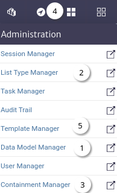

# Getting Started

The login is the first view you have of the system Figure 1.

|  |
|:--:|
| ***Figure 1.** Login* |

> **Information** Use the user `admin` and password `kuwaiba`.

Once the login is done, the system will be redirected to home Figure 2.

|  |
|:--:|
| ***Figure 2.** Home* |

1. It shows the company logo[^1] and is also used to return to home.
2. [Menu list](./#menu-list).
3. Shows Kuwaiba information such as version, licenses, etc.
4. Show user information and logout.
5. Home dashboard[^2] shows a map with all the `GenericLocation` that has a geographic location set.

## Menu List

In kuwaiba, a module defines or groups system features, and the modules are grouped into categories.

| Icon | Menu | Description |
|:--:|--|--|
|  | Administration |  Modules to manage the data model. |
|  | Navigation | Modules that are used to explore, navigate and search inventory assets. |
|  | Physical | Modules that allow to manipulate L1 assets, such as physical connections and outside plant infrastructure. |
|  | Logical | Modules to manipulate L2/L3 assets, like MPLS, SDH, IP, ISDN, etc. |
|  | Services | Modules to manage administrative aspects of the inventory such as services (as in billed services), customers, contracts. etc. |
|  | Planning | Modules dedicated to network planning. |
|  | Other | General system settings such as validators and configuration variables. |
|  | Settings | Any module not fitting the categories above. |

## Essential modules

The recommended order to start exploring the inventory system is shown in Figure 3, follow the links to get started.

|  |
|:--:|
| ***Figure 3.** Essential modules* |

1. [Data Model Manager](../dmman/index.html).
2. [List Type Manager](../administration/ltman/index.html).
3. [Containment Manager](../administration/containment/index.html).
4. [Navigation](../navman/index.html).
5. [Template Manager](../templateman/index.html).

> **Note** Depending on the restrictions that the system administrator has defined for the users in the [User Manager](../userman/index.html), the options in each menu will change.

[^1]: The company logo can be customized.
[^2]: The home dashboard can be customized.
