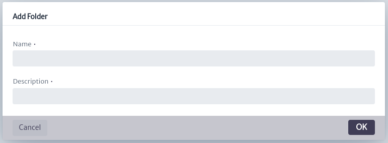
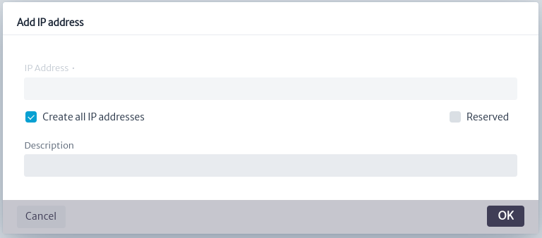

# IP Address Manager

The *IP Address Manager* is a tool designed to manage IP addresses efficiently. It allows storing both individual IP addresses and entire sub-networks along with their associated IPs. Through this tool, users can easily view which IP addresses are busy and which are available on a given network. In summary, the IP address manager facilitates the organization and control of the assignment of IP addresses, contributing to more effective management of the network infrastructure.

To open the *IP Address Manager* module, select *Options -> IP Address Manager* from the options menu.
||
|:--:|
| **Figure 1.** IP Address Manager module selection in the general menu |

Once the *IP Address Manager* module is opened you can distinguish:
||
|:--:|
| **Figure 2.** Overview of the IP Address Manager |

* **Explore from IPv4 Root:** Explorer for IPv4 address management.

||
|:--:|
| **Figure 3.** Explorer button for IPv4 address management |

* **Explore from IPv6 Root:** Explorer for IPv6 address management.

||
|:--:|
| **Figure 4.** Explorer button for IPv6 address management |

* **Search bar:** In the central part of the screen there is a search bar that allows you to search for a specific IP address or folder within the IPv4 and IPv6 collections.

||
|:--:|
| **Figure 5.** Search bar |

* **IP Management:** Allows you to create new sub-networks or collections of sub-networks.

||
|:--:|
| **Figure 6.** IP Management |

* **IP Explorer:** Allows you to view the elements related to a collection of IP addresses, including subnets and other collections of subnets.

||
|:--:|
| **Figure 7.** IP Explorer |

* **Properties of the selected element:** Allows you to view the properties or characteristics of the selected element. By default, the image below is displayed.

||
|:--:|
| **Figure 8.** Selected element properties |

## Create a new folder of subnets

In the IP Management section, select the button shown in the image below to add a new folder of subnets.

||
|:--:|
| **Figure 9.** IP Management |

This action will open the dialog box shown below, where the name of the new folder (collection) and a description of it are requested. The new added item will appear in the *IP Explorer* section.

||
|:--:|
| **Figure 11.** Dialog for creating a new folder of subnets |

## Create a new subnet

In the IP Management section, select the button shown in the image below to add a new subnet.

||
|:--:|
| **Figure 12.** IP Management |

This action will open the dialog box shown below, where the subnet base address and subnet prefix in CIDR format will be requested, along with a brief description. The same dialog will provide a description of the items to be configured, including the broadcast address, network address, number of hosts, and subnet mask, as shown in the dialog below. The new added item will appear in the *IP Explorer* section.
||
|:--:|
| **Figure 13.** Dialog for creating a new sub-network |

## IP Explorer

In this segment we can manipulate both the collections of sub-networks and the added sub-networks. The available options are described below:

* **Options for subnet folder** :
  * **Add a new subnet folder** : Creates a new subnet folder
  within the current folder.
  * **Remove subnet folder** : Remove the folder.
  * **Add a new subnet folder** : Creates a new subnet within the folder.
  * **Add a new IP** : Create an IP address within a sub-network. This will open a dialog like the one shown in the figure below, where the IP to enter and a description are requested.
    ||
    |:--:|
    | **Figure 14.** New IP |
  * **Add to favorites** :This functionality will be available in future versions.

* **Options for subnet** :
  * **Add a new subnet** : Create a new subnet within the current subnet, example shown in *Figure 13*.
  * **Delete subnet** : Delete the subnet.
  * **Split a subnet** : Split a subnet based on the network prefix as shown below.
    ||
    |:--:|
    | **Figure 15.** Split a sub-network |
  * **Add a new IP** : Create an IP address within a sub-network. This will open a dialog like the one shown in *Figure 16*, where the IP to enter and a description are requested.
    ||
    |:--:|
    | **Figure 16.** Create non-reserved IP address |
  * **Create non-reserved IP**: As shown below, an IP is created and it will be *not reserved*. After running this command successfully, the **Divide a subnet** option will be disabled.
  * **Create all IP addresses**: As shown in *Figure 17* the possible IP addresses are created for the selected sub-network, all the IPs created will be *not reserved*.
    ||
    |:--:|
    | **Figure 17.** Create all IPs |
  * **Create Reserved IP**: As shown below, an IP is created and it will be *reserved*. After executing this command successfully, the **Divide a sub-network** option will be disabled.
    ||
    |:--:|
    | **Figure 18.** Create reserved IP address |
  * **Add to favorites** : This functionality will be available in future versions.

## Properties of the selected element

The default image changes depending on the selected element, providing detailed information about it.

* **Selected subnet collection:** The figure below shows the subnets and IP addresses created in the collection. You can also see if these addresses are free, indicated with the icon , and the reserved ones with . Basic information such as name and description is presented.

  ||
  |:--:|
  | **Figure 19.** Properties of a collection of subnets |

* **Selected sub-network:** The figure below shows the sub-network with the created IP addresses. You can also see if these addresses are linked to any network element, indicated with the  icon. Free IPs are distinguished with the icon , and reserved ones with . Other icons correspond to the validator logic used for the module. In addition, basic information is presented such as the name, creation date and quantitative data, such as the percentage of occupancy of the sub-network.

  ||
  |:--:|
  | **Figure 20.** Properties of a sub-network |