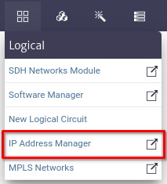
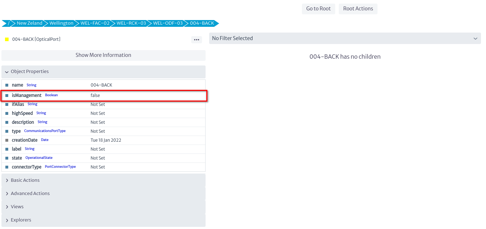

# IP Address Manager

The *IP Address Manager* is a tool designed to manage IP addresses efficiently. It allows storing both individual IP addresses and entire subnets along with their associated IP addresses. Through this tool, users can easily view which IP addresses are busy and which are available on a given network. In summary, the IP Address Manager facilitates the organization and control of the assignment of IP addresses, contributing to more effective management of the network infrastructure.

To open the *IP Address Manager* module, select *Options -> IP Address Manager* from the options menu.
||
|:--:|
| **Figure 1.** IP Address Manager module selection in the general menu |

Once the *IP Address Manager* module is opened you can distinguish:
||
|:--:|
| **Figure 2.** Overview of the IP Address Manager |

* **Explore from IPv4 Root:** Explorer for IPv4 address management.

||
|:--:|
| **Figure 3.** Explorer button for IPv4 address management |

* **Explore from IPv6 Root:** Explorer for IPv6 address management.

||
|:--:|
| **Figure 4.** Explorer button for IPv6 address management |

* **Search Bar:** In the central part of the screen, there is a search bar that allows you to search for a specific IP address or folder within the IPv4 and IPv6 collections.

||
|:--:|
| **Figure 5.** Search Bar |

* **IP Address Management:** Allows you to create new subnets or collections of subnets.

||
|:--:|
| **Figure 6.** IP Address Management |

* **IP Address Explorer:** Allows you to view the elements related to a collection of IP addresses, including subnets and other collections of subnets.

||
|:--:|
| **Figure 7.** IP Address Explorer |

* **Properties of the Selected Element:** Allows you to view the properties or characteristics of the selected element. By default, the image below is displayed.

||
|:--:|
| **Figure 8.** Selected Element Properties |

## Create a New Folder of Subnets

In the IP Address Management section, select the button shown in the image below to add a new folder of subnets.

||
|:--:|
| **Figure 9.** IP Address Management |

This action will open the dialog box shown below, where the name of the new folder (collection) and a description of it are requested. The new added item will appear in the *IP Address Explorer* section.

||
|:--:|
| **Figure 10.** Dialog for Creating a New Folder of Subnets |

## Create a New Subnet

In the IP Address Management section, select the button shown in the image below to add a new subnet.

||
|:--:|
| **Figure 11.** IP Address Management |

This action will open the dialog box shown below, where the subnet base address and subnet prefix in CIDR format will be requested, along with a brief description. The same dialog will provide a description of the items to be configured, including the broadcast address, network address, number of hosts, and subnet mask, as shown in the dialog below. The new added item will appear in the *IP Address Explorer* section.
||
|:--:|
| **Figure 12.** Dialog for Creating a New Subnet |

## IP Address Explorer

In this section we can manipulate both the collections of subnets and the added subnets. The available options are described below:

* **Options for Subnet Folder** :
  * **Add a New Subnet Folder** : Creates a new subnet folder within the current folder.
  * **Remove Subnet Folder** : Remove the folder.
  * **Add a New Subnet Folder** : Creates a new subnet within the folder.
  * **Add a New IP Address** : Create an IP address within a subnet. This will open a dialog like the one shown in the figure below, where the IP address to enter and a description are requested.
    ||
    |:--:|
    | **Figure 13.** New IP Address |
  * **Add to Favorites** :This functionality will be available in future versions.

* **Options for Subnet** :
  * **Add a New Subnet** : Create a new subnet within the current subnet, example shown in *Figure 12*.
  * **Delete Subnet** : Delete the subnet.
  * **Split a Subnet** : Split a subnet based on the network prefix as shown below.
    ||
    |:--:|
    | **Figure 14.** Split a Subnet |
  * **Add a New IP Address** : Create an IP address within a subnet. This will open a dialog like the one shown in *Figure 15*, where the IP address to enter and a description are requested.
    ||
    |:--:|
    | **Figure 15.** Create non-reserved IP address |
  * **Create Non-reserved IP Address**: As shown below, an IP address is created and it will be *not reserved*. After running this command successfully, the **Divide a Subnet** option will be disabled.
  * **Create All IP Addresses**: As shown in *Figure 16* the possible IP addresses are created for the selected subnet, all the IP addresses created will be *not reserved*.
    ||
    |:--:|
    | **Figure 16.** Create All IP Addresses|
  * **Create Reserved IP address**: As shown below, an IP address is created and it will be *reserved*. After executing this command successfully, the **Divide a Subnet** option will be disabled.
    ||
    |:--:|
    | **Figure 17.** Create Reserved IP address |
  * **Add to Favorites** : This functionality will be available in future versions.

## Properties of the Selected Element

The default image changes depending on the selected element, providing detailed information about it.

* **Selected Subnet Collection:** The figure below shows the subnets and IP addresses created in the collection. You can also see if these addresses are free, indicated with the icon , and the reserved ones with . Basic information such as name and description is presented.

  ||
  |:--:|
  | **Figure 18.** Properties of a Collection of Subnets |

* **Selected Subnet:** The figure below shows the subnet with the created IP addresses. You can also see if these addresses are linked to any network element, indicated with the  icon. Free IP addresses are distinguished with the icon , and reserved ones with . Other icons correspond to the validator logic used for the module. In addition, basic information is presented such as the name, creation date and quantitative data, such as the percentage of occupancy of the subnet.

  ||
  |:--:|
  | **Figure 19.** Properties of a subnets |

## Relate a Network Interface to an IP

In the *IP Address Manager* module, it is possible to relate a network interface to a specific IP address. This functionality is found in the action available for the ports of the [Navigation Tree](../navman/README.md) module (Navigation Tree).
||
|:--:|
| **Figure 20.** Optical Port Navigation Tree |

To map a network interface to an IP address, navigate to the desired port in the navigation tree. In the *Advanced Actions* menu, select the *Relate to IP Address* action.

||
|:--:|
| **Figure 21.** Action in the Navigation Tree to Relate Network Interface to IP Address |

In the dialog box, select the IP address you want to associate.
||
|:--:|
| **Figure 22.** Relate Network Interface to IP Dialog |

## Colors and Icons

The colors and icons used in the *IP Address Manager* come from a validator in the configuration module. These help to quickly view the status of IP addresses.

||
|:--:|
| **Figure 23.** Validation Colors and Icons |

### Icons

* **Free IP icon**: Indicates that the IP is free.
* **Reserved IP icon**: Indicates that the IP is reserved.
* **IP Related Icon**: Indicates that the IP is associated with a network element.

### Colors

The colors shown in the IP addresses will be similar to those presented in the graph. In this example, green is used for free addresses, blue for used addresses, and gray for reserved addresses.
||
|:--:|
| **Figure 24.** IP Address Colors |

## Relationship between Network Element and IP Addresses

Each IP address can be associated with different services on the network. By viewing the properties of an IP, you can see the associated services and their statuses.

||
|:--:|
| **Figure 25.** Relationship between Network Element and IP Addresses |

* **IP Address:** IP Address.
* **Service (Service):** Related service.
* **Network Interface (Network):** Network interface related to the IP address. Clicking the  icon will immediately unlink the IP from the item.
* **Device/Location**: Indicates that the IP address is associated with a network element.

## isManagementInterface

The `isManagementInterface` field indicates whether a port is a management interface for a device (such as a router). This designation is crucial to identify the port through which the device is managed, rather than used for regular communications traffic.

||
|:--:|
| **Figure 26.** isManagementInterface attribute |

* **Purpose:** Indicate that this is the router's management port and not a communications port.
* **Importance:** Ensures that an IP address is always assigned to the management interface in order to access and manage the device.
