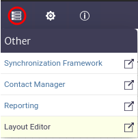

# Layout Editor
The *Layout editor* es un modulo que nos permite diseñar la vista física de los elementos en el inventario.

This module is part of the *Other* category, as shown in Figure 1.

||
|:--:|
| ***Figure 1.** Layout editor module* |

Once opened, we will see the main window of the module, as shown in Figure 2. From here you can create your layouts.

||
|:--:|
| ***Figure 2.** Queries manager main window* |