# Software Manager

This module manages software licenses and associates them to existing inventory objects or keeps them in a temporary location until they are actually used. A software license can only be associated with instances of subclasses of the `GenericApplicationElement` class.

| 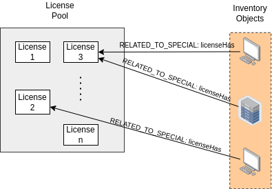 |
| :-----: |
| ***Figure 1.** Software manager structure.* |

The graph in Figure 1 shows the structure of this module. First, licenses are grouped into license pools. That is, a pool stores or groups licenses. The licenses belonging to such a pool have a special relationship (`RELATED_TO_SPECIAL`) called `licenseHas` with inventory objects.

To access this module locate in the menu at the top the logic section, marked with the icon , when you select it a vertical menu is displayed, where you must select the `Software Manager` option.

| 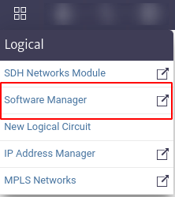 |
| :-----: |
| ***Figure 2.** Access to the module.* |

Subsequently, the selected module will open in a window, as illustrated in Figure 3.

| 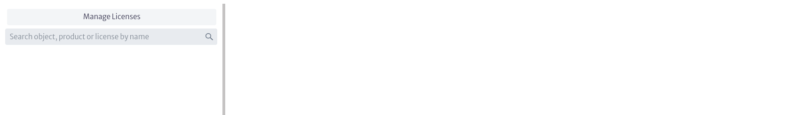 |
| :-----: |
| ***Figure 3.** Software manager module.* |

Figure 3 presents a `Manage Licenses` button and a search engine.

* By selecting the `Manage Licenses` button, a pop-up window similar to the one displayed in Figure 4 opens, in which the existing license pools can be viewed. In addition, it is possible to add new pools by selecting the `New License Pool` button, which will open a new window requesting the necessary information for the creation of the new license pool (see Figure 5).

    | 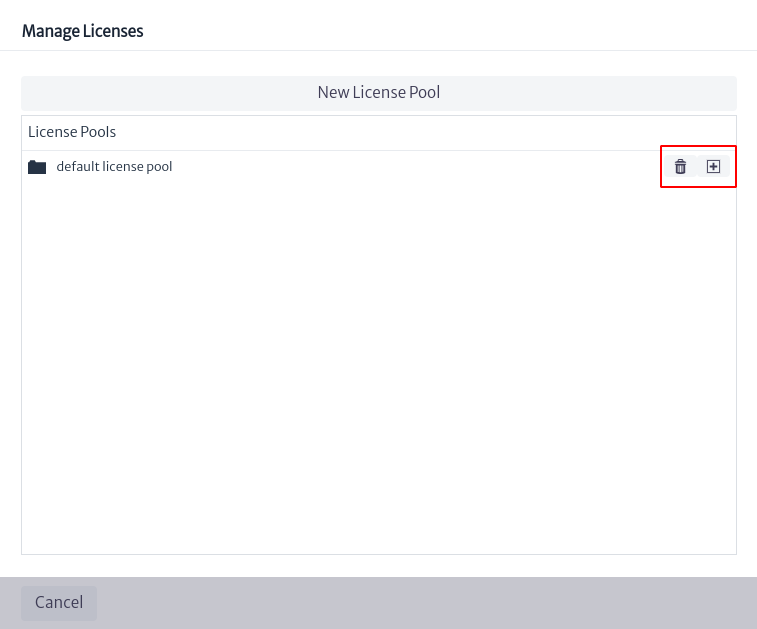 |
    | :-----: |
    | ***Figure 4.** Manage licenses.* |

    | 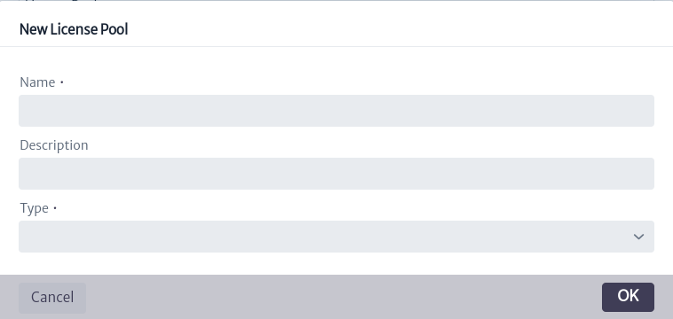 |
    | :-----: |
    | ***Figure 5.** Create license pool.* |

    The data requested for pool creation includes the pool name, a description and the type of pool to create, which can be: `SoftwareLicense`, `USBTokenLicense` or a third type called `GenericSoftwareAsset` which encompasses the two types mentioned above.

    The list of pools in Figure 6 contains the pool created earlier and a default pool called `default license pool`, the latter belonging to the `GenericSoftwareAsset` type.

    | 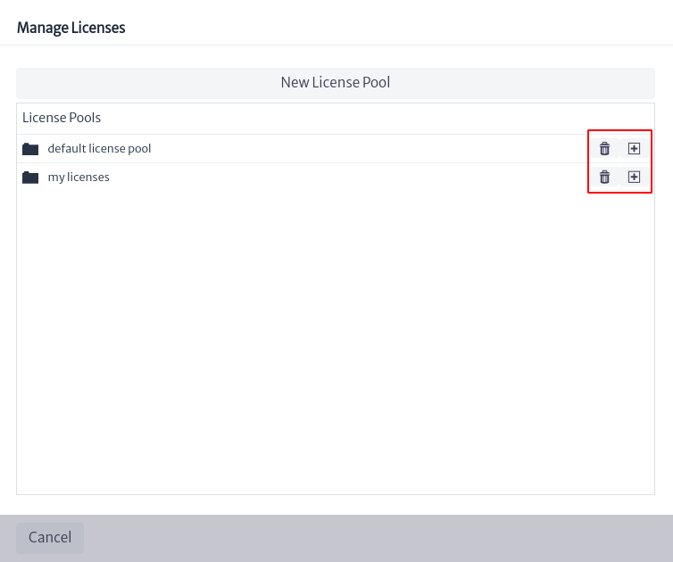 |
    | :-----: |
    | ***Figure 6.** List of pools.* |

    The two options shown in Figure 6 will be available in front of each pool created. The  button deletes the selected pool, while the  button allows you to create a license within the pool, as shown in Figures 7 and 8.

    If the license pool where a new license is going to be created is of the `GenericSoftwareAsset` type, the license creation will allow to choose between the `SoftwareLicense` and `USBTokenLicense` license types (see Figure 7). On the other hand, if the pool type is not generic, the license type will already be defined and cannot be modified (see Figure 8).

    | 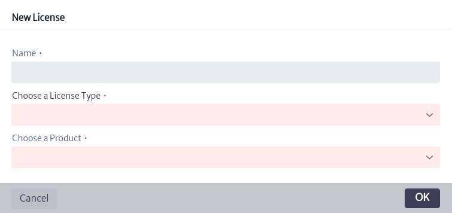 |
    | :-----: |
    | ***Figure 7.** Creation of license in pool of type GenericSoftwareAsset.* |

    | 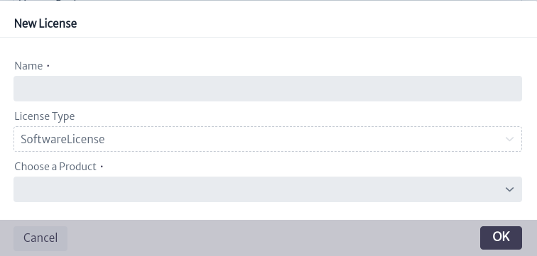 |
    | :-----: |
    | ***Figure 8.** Creation of license in pool of non-generic type.* |

    If in Figure 6 you select a pool of interest, all the licenses contained in that pool will be displayed, along with detailed information about the pool, as indicated in Figure 9.

    | 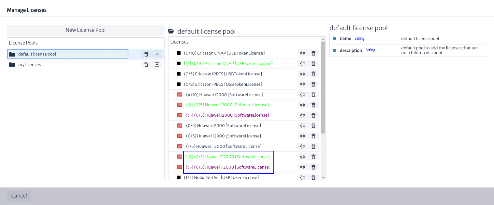 |
    | :-----: |
    | ***Figure 9.** Licenses contained in the selected pool.* |

    > **Note**
    > The licenses shown in different colors, as well as the prefixes observed in each, as indicated in the blue box in Figure 9, are validators associated with the licenses. For more information, please refer to the [Validators][validators] chapter.

    To obtain more information about each license, select one of interest in Figure 9. On the right side of the screen, information related to the selected license will appear, as shown in Figure 10. These properties can be modified by double-clicking on the value of the property you wish to change; then, enter the new value and press the Enter key.

    | 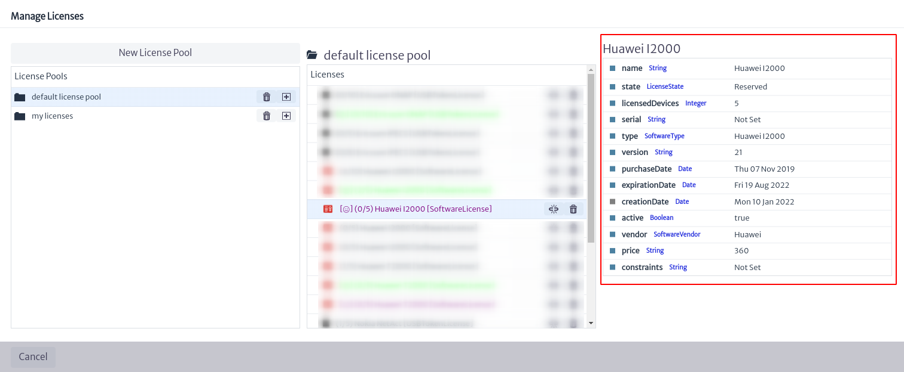 |
    | :-----: |
    | ***Figure 10.** Selected license information.* |

    Below is a brief explanation of the license attributes:

  * **name.** License name.
  * **state** License status. ListType attribute (for more information, see chapter [List Type Manager][ltman]).
  * **licensedDevices.** Number of devices that can be licensed.
  * **serial.** license serial.
  * **type.** Type of license.
  * **version.** License version.
  * **purchaseDate.** Date of license purchase.
  * **expirationDate.** Expiration date of the license.
  * **creationDate.** Date of creation of the license in the inventory.
  * **active.** Indicates if the license is active or not.
  * **vendor.** License provider.
  * **price.** Cost of the license.
  * **constraints.** Restrictions.

    In front of each license is the button  that deletes the license and the button  that deletes the relationship between the license and all inventory objects that use the license.

* In the search engine shown in Figure 3, you can search for licenses by product name, by object or by license name, as shown in Figure 11.

  | 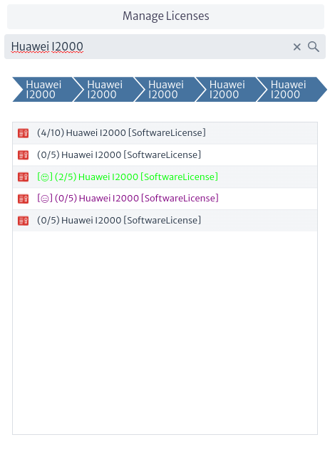 |
  | :-----: |
  | ***Figure 11.** Search for license.* |

  To get more details on a specific license, select it. In the central part of the screen, the inventory objects that use the license will appear, along with some options that will be explained below.

  | 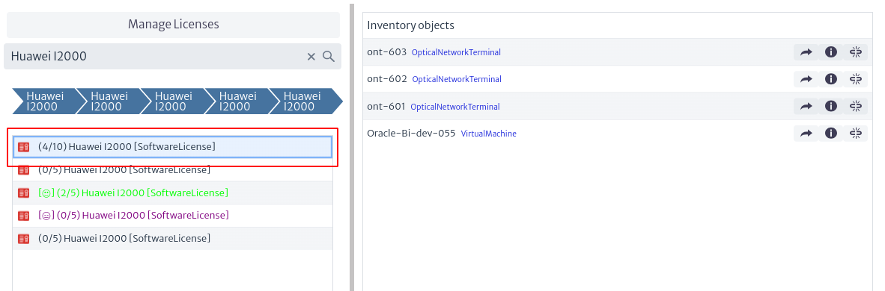 |
  | :-----: |
  | ***Figure 12.** Inventory objects related to a license.* |

  * If you select one of the inventory objects listed in the figure above, the licenses to which the selected object is related will be displayed.
  
    | 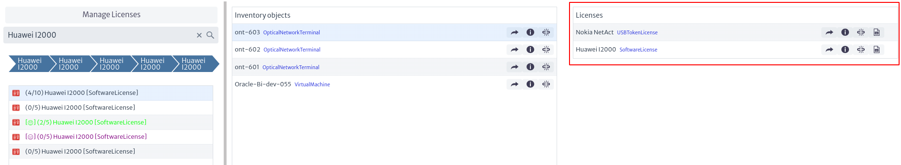 |
    | :-----: |
    | ***Figure 13.** Licenses related to an inventory object.* |

    The options presented in Figure 13 are detailed below:

    |  |
    | :-----: |
    | ***Figure 14.** License options related to an inventory object.* |

    * To view the Object Options Panel of a specific license, select , this will open a new tab with the Object Options Panel of the selected license. For more information, see the [Navigation][navman] chapter.
    * The  button displays additional license information.

        | 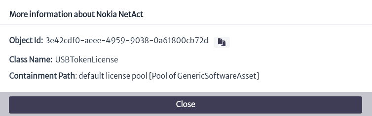 |
        | :-----: |
        | ***Figure 15.** Additional license information.* |

    * To remove the existing relationship between the inventory object and the license, I selected the button .
    * You can view existing reports related to a license through the icon  (See more in [Reports][reports] chapter).

  * You can open the Object Options Panel of the selected inventory object, through the button  presented in Figure 12.
  * To view additional information about the inventory object, select , which opens a window similar to the one shown in Figure 15, indicating the object's identifier, the class it belongs to and the path to its containment.
  * The button  removes the existing relationship between the inventory object and the license selected in Figure 11.

To relate an inventory object to an existing license, locate the Object Options Panel of the inventory object (you can access it through the [Navigation][navman] module) and go to the advanced actions of the object, where you will find an action named `Relate to License`.

| 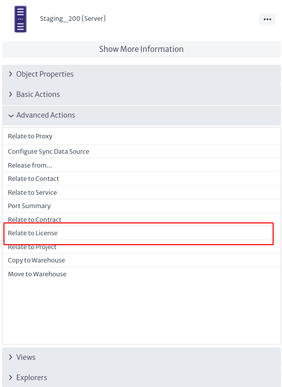 |
| :-----: |
| ***Figure 16.** Advanced object actions.* |

Subsequently, a window will open where you can select the license pool to which the license you are interested in belongs and then choose the specific license. When you click on the `OK` button, the license will be linked to the object.

| 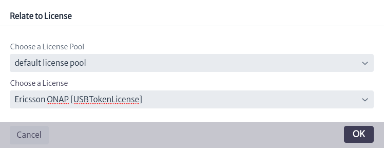 |
| :-----: |
| ***Figure 17.** Related license to inventory object.* |

[validators]: ../../settings/validators/index.html
[reports]: ../../other/reports/index.html
[ltman]: ../../administration/ltman/index.html
[navman]: ../../navigation/navman/index.html
