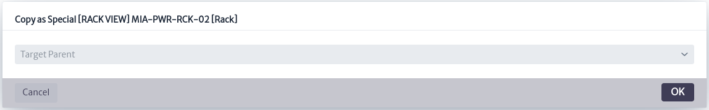
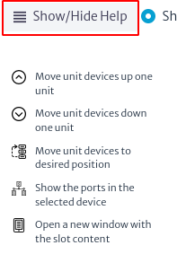

# Navigation

This module is the main navigation tool of the application, as it presents the physical objects of the inventory organized in a hierarchical containment structure explained in the [Containment Manager][containment-manager] chapter.

To access the navigation module in the top bar of the screen, locate the compass symbol shown in Figure 1. Then go to the Navigation section.

|  |
|:--:|
| ***Figure 1**. Navigation module.* |

All physical layer objects created start from the same root called Dummy Root which is the first level of containment.
The image below shows the main view of the navigation module. The objects observed when clicking on the ***Go To Root*** button are the direct children of Root. That is, the objects created at the top of the hierarchy.

|  |
|:--:|
|***Figure 2**. Navigation module interface.* |

Clicking on the `Root Actions` button displays a menu with the available options for object creation. As shown below. These options are explained in detail in the [Object Options Panel](#object-options-panel) section.

|  |
|:--:|  
| ***Figure 3**. Root actions.* |

The top bar that appears in the Navigation module allows you to perform a search to find inventory objects more easily. You can search for an object by its name, displayName or by the class it belongs to. For example, to search for a Rack, you can search by the Rack class or by the Rack name. Before clicking to return the complete search results, the application provides 5 suggestions grouped by type of item to facilitate the search.
Search results are paginated, with a maximum of 20 results per page.

|  |
|:--:|
| ***Figure 4**. Search objects by className.* |

Next to each object that appears as a search result, the  button is displayed, allowing quick access to the most frequently used actions in the inventory.
After performing the search, a second search bar appears with which you can filter according to the results found, as shown below.

|  |
|:--:|
| ***Figure 5**. Filter.* |

By accessing any physical object in the inventory, you can view information specific to the selected object. As shown in Figure 6.

|  |
| :--: |
| ***Figure 6**. Inventory object navigation.* |

In Figure 6, the section marked in red corresponds to the Object Options Panel, explained in detail in the section [Object Options Panel](#object-options-panel).

In the upper part of Figure 6 (detailed in Figure 7) the path or containment hierarchy of the selected object is shown. This means that the `New Zeland` object contains the `Wellington` object, which in turn contains the `WEL-FAC-02` object, which contains the object of interest: the selected Rack (`WEL-RCK-03`).
The hierarchy shown in Figure 7 is interactive. By selecting any of the elements within the containment hierarchy, you will be redirected to the detailed information of that object.

|  |
| :--: |
| ***Figure 7**. Object containment hierarchy.* |

Clicking on the `Show More Information` button shown at the top of Figure 8 opens a pop-up window like the one shown in Figure 9, which contains basic information about the selected inventory object.

* **Object Id**. It is the identifier of the object in the database.  It is useful for troubleshooting. It is often used in the **Query Manager** to create queries.
* **Class Name**. The class to which the inventory object belongs.
* **Containment Path**. Indicates the complete containment structure of the object.
  
|  |
| :--: |
| ***Figure 8**. Object Information.*|

|  |
| :--: |
| ***Figure 9**. Object Information.*|

On the right side of Figure 6, shown in more detail in Figure 10, there is a filter bar at the top. This bar is used if the Rack has filters associated with it. Filters, as the name implies, filter the children of an object according to the conditions evaluated in the filter. For more information, see the [Filters][filters] section. Below the filter field, the descending hierarchy of the class of interest is displayed, i.e. the inventory objects contained in the selected Rack. When selecting any of the objects in Figure 10, the interface will display similar content as in Figure 6, but with the information of the newly selected object.
Next to some objects shown in Figure 8, some percentages are observed. These represent the results of the validators associated with the object class. For more information, see chapter [Validator Definition][validators].

|  |
| :--: |
| ***Figure 10**. Children of the selected object.* |

## Object Options Panel

The Object Options Panel is a central component that manages the functionality of the objects in the inventory. It can be accessed from several areas such as the navigation module, pools and when executing queries, among other access points, as opposed to being limited to a specific module.

|  |
| :--: |
| ***Figure 11**. Object Options Panel.*|

Figure 11 shows the components that make up the Object Options Panel. Each of them will be explained in detail below.

### Object Properties

Displays the values of the attributes of an inventory object. These attributes match the visible attributes defined in the Containment Manager. All changes are automatically entered into the database when the Enter key is pressed.

The `F2` key on your keyboard allows you to quickly change the name of the selected object.

|  |
| :--: |
| ***Figure 12**. Object Properties.*|

There are different types of attributes.

* **Read Only**. These are attributes that cannot be modified. In Figure 12, you can see that the creationDate attribute is grayed out, indicating that its value is not modifiable.
* **Unique**. These are attributes whose value must be unique in the inventory and are indicated with purple color.
  
  |  |
  | :--: |
  | ***Figure 13**. Unique attribute.*|

* **Mandatory**. These are attributes whose value must be defined as mandatory. Mandatory attributes are indicated in red, as shown in the figure below.
  
  |  |
  | :--: |
  | ***Figure 14**. Mandatory attribute.*|
  
* **List Type Items**. These are attributes whose value must be selected from a specific list of particular object types. For more details see chapter [List Type Manager][ltman].
In Figure 15 you can see, when you select an attribute of a specific list type, it opens an editor containing the list of possible values that can be defined. If you do not want to select any, use the first option from the list (`None`).
  
  |  |
  | :--: |
  | ***Figure 15**. List type items.*|

### Basic Actions

The basic actions of each inventory object are shown in Figure 16 and are described below.

|  |
| :--: |
| ***Figure 16**. Basic Actions.*|

#### New Object

Creates a single object as a child of Root using the standard containment hierarchy.

|  |
| :--: |
| ***Figure 17**. Create Object.*|

#### New Multiple Objects

Creates a defined number of objects at a time using a given [naming pattern][appendix_a].

|  |
| :--: |
| ***Figure 18**. Create Multiple Objects.*|

#### New Object from Template

Creates an object (and possibly a complex containment structure under it) from a previously defined template. See more details in chapter [Template Manager][templates].

#### New Special Object

Creates an object in the Special Containment Hierarchy (see [Containment Manager][containment-manager]).
  
|  |
| :--: |
| ***Figure 19**. Create Special Object.*|

#### New Multiple Special Objects

Creates several objects of the special containment hierarchy [using a pattern][appendix_a].

|  |
| :--: |
| ***Figure 20**. Create multiple special objects.*|

#### New Special Object from Template

Creates a special containment hierarchy object from a Template defined in the [Template Manager][templates].
  
#### Copy to

A plain copy operation.

|  |
| :--: |
| ***Figure 21**. Copy object to another object.*|

#### Move to

Moves the object respecting the containment hierarchy.

|  |
| :--: |
| ***Figure 22**. Move object to another object.*|

#### Copy as Special to

Copies the object respecting the special containment hierarchy.

|  |
| :--: |
| ***Figure 23**. Copy as special object to another object.*|

#### Move as Special to

Moves the object respecting the special containment hierarchy.
  
|  |
| :--: |
| ***Figure 24**. Move as special object to another object.* |

#### Manage Attachments

Handles attachments directly related to the object, as well as attachments associated with list-type items linked to the object. Figure 25 shows how attachments directly related to the object can be viewed, added, deleted or downloaded. In this case, an MPLS Router has an attachment directly related to the object.

|  |
| :--: |
| ***Figure 25**. Manage direct attachments.* |

On the other hand, in Figure 26, it is observed that the attachments indirectly related to the object can only be viewed and downloaded, but not modified. In this case, the MPLS Router has an attachment indirectly related to the object.

|  |
| :--: |
| ***Figure 26**. Manage other attachments.* |

#### Manage Special Relationships

Allows you to create arbitrary relationships between objects.
> **Warning** This action should be handled with extreme caution, as it may cause damage to the model.

Figure 27 shows the pop-up window that displays the special relationships that an object has. The  button allows you to delete a relationship.

|  |
| :--: |
| ***Figure 27**. Manage special relationships.* |

To create a new special relationship, select the New Special Relationship button. This will open a new window where you can define the name of the relationship and specify the object with which this special relationship will be established.

|  |
| :--: |
| ***Figure 28**. Manage special relationships.* |

#### Reports

Displays the reports associated to the objects of this class. In this case, Rack has three associated reports, as shown in Figure 29.
Selecting a specific report opens a new HTML window with the result of the report execution. This section is explained in detail in the [Reports][reports] chapter.

> Note: It is necessary to enable popups in the browser so that the report can be executed.

|  |
| :--: |
| ***Figure 29**. Reports.*|

#### Copy to Pool

Copy the inventory object to a pool containing elements of the same type as the object to be copied. See more details in [Pools][pools].

#### Move to Pool

Move the inventory object to a pool containing elements of the same type as the object of interest. For more details see [Pools][pools] chapter.
  
#### Add to Folder

All inventory objects can be added to an existing Favorites Folder. See more details in [Favorites][favorites]  chapter.
  
#### Delete Object

Deletes the object. This will fail if the object has an incoming relationship, for example, a Port connected to a cable.

### Advanced Actions

The advanced actions of the inventory objects differ from the type of object of interest. They are injected by other modules where they will be detailed.

|  |
| :--: |
| ***Figure 30**. Advanced actions.*|

### Views

A view is a graphical representation of a selected object that can be displayed from different perspectives by different modules.

|  |
| :--: |
| ***Figure 31**. Views.*|

#### Object View

> Applies to objects of the `ViewableObject` subclasses

A view is a graphical representation of what is inside an object. All instances (objects) of subclasses of `ViewableObject` have an ObjectView that shows the direct children of the selected node.
Most objects, except for logical and administrative assets and a few physical ones such as slots and ports, are subclasses of `ViewableObject`.
An example of the object view is shown in Figure 32, where the selected object is a country and in the object view are the cities and states that are direct children of the selected country.

  |  |
  | :--: |
  | ***Figure 32**. Object view.*|

  Figure 33 shows the toolbar at the top of Figure 32.

  |  |
  | :--: |
  | ***Figure 33**. Object view toolbar.*|

  In the upper left part of Figure 33 a search box appears, where you can search for a specific object that is a direct child of the selected object.

  |Icon| Description |
  | :--:|--|
  | | Save view|
  | | Update view|
  | | Connect two nodes (See [Physical Connections][physical-connections] for more details on how to use it)|
  | | Add a background image|
  | | Hide/show the labels next to the connections|
  | | Change labels color|
  | | Export as image |

#### **Rack View**

> Applies to objects of class or subclass `Rack`

This view only works with objects of the Rack class or its subclasses. It shows how the elements contained in the selected object are organized, according to their position and the number of rack units used.
  
  |  |
  | :--: |
  | ***Figure 34**. Rack view.*|

  > To build this view correctly, three conditions must be met:
  >
  > * The rack must have its `rackUnits` attribute set to a valid integer value. This attribute stores the total number of rack units supported by the rack. Typical values are 20, 28, 34, 40 or 45.
  > * The `rackUnitsNumberingDescending` attribute must exist, if the order of the rack units has not been set, ascending numbering is assumed. This attribute instructs the view to display the rack units in ascending (if false) or descending (if true) order.
  > * The `rackUnits` and `position` attributes must exist and have valid values on the contained elements within the rack. `rackUnits` in this case, refers to the number of rack units occupied by the contained element, while `position` is the starting position of the contained element, based on 1, numbered from top to bottom. This value is usually provided by your equipment supplier. If the value of `rackUnits` is 0, the element will not be displayed in the view.

  |  |
  | :--: |
  | ***Figure 35**. Rack properties.*|
  
  |  |
  | :--: |
  | ***Figure 36**. Rack children properties.*|

  A menu is shown at the top of Figure 34.

  |  |
  | :--: |
  | ***Figure 37**. Rack view menu.*|

* The `Show/Hide Help` button provides the user with a short guide to the use of the tool, as shown in Figure 38.

  |  |
  | :--: |
  | ***Figure 38**. Rack view help.*|

* The tool offers a more detailed view of the rack and its components, by clicking on the `Show Detailed View` option as shown below.

  |  |
  | :--: |
  | ***Figure 39**. Detailed rack view.*|

* The icon  opens a new window with the connected devices and their status, as shown in Figure 40.

  |  |
  | :--: |
  ***Figure 40**. Device summary.*|

* The icon  opens a window with the connections between the devices, as shown in Figure 41.

  |  |
  | :--: |
  | ***Figure 41**. Connection list.*|

* The icon  is used to edit the attributes of the selected rack, as shown in Figure 42.

  |  |
  | :--: |
  | ***Figure 42**. Rack properties.*|

Finally, in Figure 34, on the left side of the view, there are two options that appear next to each of the devices:

* The icon  opens a new window with the port information for each device, as shown in Figure 43.

  |  |
  | :--: |
  | ***Figure 43**. Port summary by device.*|

* The icon  allows you to move the device to a different position within the rack.

  |  |
  | :--: |
  | ***Figure 44**. Move device in the rack.*|

#### **Splice Box View**

> Applies to objects of class or subclass `SpliceBox`

This view represents the splices made by a splice box, using the `mirror`, `endpointA` and `endpointB` relationships. In the example in Figure 45, a splice box with 4 input ports (IN-001, IN-002, IN-003 and IN-004) and 4 output ports (OUT-001, OUT-002, OUT-003 and OUT-004) is shown, where each input port is connected to a corresponding output port using a `mirror` relationship. Also visible is a fiber path labeled 001 (related to the splice box ports via the `endpointA` and `endpointB` relationships), which enters the splice box through port IN-001 and exits through output port OUT-001. The figure also shows the organization of the connections and the internal structure of the splice box, highlighting the splices currently in use (marked in blue) versus those available (marked in gray).
  
  |  |
  | :--: |
  | ***Figure 45**. Splice box view.*|

#### **Fiber Splitter View**

> Applies to objects of class or subclass `FiberSplitter`

It shows the operation of a fiber splitter, illustrating how a single fiber signal is distributed to multiple outputs. The fiber splitter view is based on the `multipleMirror`, `endpointA` and `endpointB` relationships.
The `endpointA` and endpointB relationships identify the ports where the fiber path enters and exits, while the `multipleMirror` relationship is the relationship between the single fiber splitter input port and the N output ports.

  In the view presented in Figure 46, a fiber splitter called 1x16 Secondary Splitter was selected, which has 16 output ports (001-OUT to 016-OUT) connected to the splitter's input port (IN-001) where the fiber optic cable enters.

  The splitter has only one of the occupied outputs (001-OUT), which connects to another device. In the figure, this connected output is shown in blue, while the other 15 output ports, which are not yet in use, are shown in gray.
  
  |  |
  | :--: |
  | ***Figure 46**. Fiber splitter view.*|

#### **Physical Path View**

> Applies to objects of the `GenericPort` subclasses

Calculates and plots the longest path from a source port to another port, considering `mirror`, `mirrorMultiple`, `endpointA` and `endpointB` relationships. This view represents hierarchically the components that are part of the route, showing clearly their interconnections and the order in which they are arranged. See more in [Outside Plant Management][ospman].

  |  |
  | :--: |
  | ***Figure 47**. Physical path view.*|

  The example in Figure 47 shows the connection of an optical fiber from a port of a selected ONT to an OLT, passing through two intermediate fiber splitters.
  The port of the selected ONT is `IN-01`, and the OLT port where the connection terminates is `PON-001`.
  This representation allows to visualize and understand the exact path of the optical signal, facilitating the tasks of diagnosis, maintenance and network planning.

  Figure 48 illustrates clearly the options presented by this view, shown in Figure 47 in the red box.

  |  |
  | :--: |
  | ***Figure 48**. Physical path options.*|

  Selecting the option `Relate Segments/Devices to Service`, as shown in Figure 47, opens a new pop-up window as seen in Figure 49. In this window, the user can relate a service to the elements that are part of the selected network.
  At the top of Figure 49, there is a search box that allows the user to select the service to which the device or network segment is to be associated. To finalize the process and create the relationship, choose the `Relate Selection to Service` option.

  |  |
  | :--: |
  | ***Figure 49**. Relate device to service.*|

  The view can be downloaded as a jpg image by selecting the `Export as Image` option listed in Figure 48.
  The box at the bottom of Figure 48 allows the user to move more easily through the view in case its size is considerably large.

#### **Physical Tree View**

> Applies to objects of the `GenericPort` subclasses.

Using the `endpointA`, `endpointB`, `mirror` and `mirrorMultiple` relationships from a source port, all paths to other ports are calculated and plotted in the view. In the example illustrated in Figure 50, port `PON-001` of an OLT has been selected. The view shows all physical connections associated with this port (in this case, a single connection) and the devices that are part of these routes. See more in [Outside Plant Management][ospman].
  
  |  |
  | :--: |
  | ***Figure 50**. Physical tree view.*|

  The red box shown in Figure 50 allows the user to adjust the size of the graph in case the diagram is too large.

### Explorers

This component, as its name suggests, explores the structures of a model, including relationships, attachments and containment hierarchies. In the navigation module, there are three subcomponents, which are explained below.

|  |
| :--: |
| ***Figure 51**. Explorers.*|

#### Special Children

Special children are elements that, while following the concept of containment hierarchy, are used in domain-specific models. This gives them a particular behavior depending on the situation. They cannot be treated as simple objects in the navigation tree since, for example, their removal may require additional tasks beyond simply deleting them from the database, because they are part of a complex workflow. These children respect the special containment hierarchy detailed in the [Special Containment Hierarchy][special-containment-hierarchy] chapter.
As shown in Figure 52, selecting an object displays a pop-up window with its special children. If any of these special children are selected, its own special children, if any, will be displayed. When selecting any special child, the corresponding object information appears in the Object Options Panel on the right side of the screen.

  |  |
  | :--: |
  | ***Figure 52**. Special children explorer.*|

#### Relationships

Allows you to view the special relationships of the selected object. When an object is part of a specific domain model (such as SDH, Physical Connections, MPLS, Services, etc.), there are special links to other objects called **relationships**. These relationships, with documented names according to the model, can be displayed using this explorer.
Figure 53 shows the relationships of an Optical Link, where three types of relationships are observed. The `parent` relationship, which is common to all inventory objects and is used to navigate upwards in the containment structure, and the `endpointA` and `endpointB` relationships, which are used in the Physical Connections model. Selecting either of the latter two relationships expands the displayed tree, indicating the object with which the relationship exists and, in turn, displaying the relationships of that object.
On the right side of Figure 53 is the Object Options Panel, which displays information and actions related to the specific object selected.

  |  |
  | :--: |
  | ***Figure 53**. Relationships explorer.*|

#### Audit Trail

It is a sequence of records that documents changes in inventory objects. For more details, see chapter [Audit Trail][auditTrail].

[auditTrail]: ../../administration/audit-trail/index.html

[reports]: ../../other/reports/index.html

[validators]: ../../settings/validators/index.html

[favorites]: ../favorites/index.html

[filters]: ../../settings/filters/index.html

[special-containment-hierarchy]: ../../administration/containment/index.html#special-containment-hierarchy

[containment-manager]: ../../administration/containment/index.html

[ltman]: ../../administration/ltman/index.html

[appendix_a]: ../../appendixes/appendix_a.md

[templates]: ../../administration/templateman/index.html

[pools]: ../pools/index.html

[physical-connections]: ../../physical/physcon/index.html

[ospman]: ../../physical/ospman/index.html