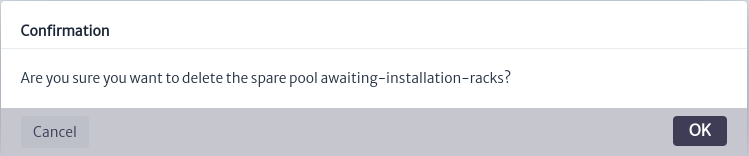
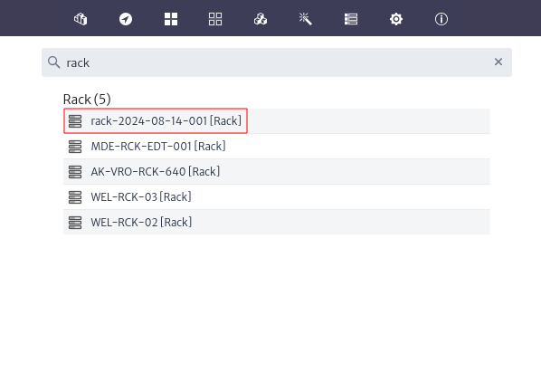

# WareHouse Manager
The warehouse module allows for the management and organization of equipment and items that are not currently in use within the network. This module not only enables the representation of physical inventory objects but also their states, such as equipment under maintenance, awaiting installation, or in transit.

Figure 1 shows the structure of the module, where all warehouses are organized into a *pool*. *Pools* are groupings of similar objects in this case, warehouses and can contain one or more elements. The warehouses, which are inventory objects, are related to one or more pools using the *CHILD_OF_SPECIAL* relationship. This allows for the grouping of similar items within the warehouse, such as bags of screws, loose screws, etc. The creation of pools facilitates the organization and management of inventory by allowing items to be grouped and sorted according to specific criteria, such as brand, type, or any other relevant attribute.

||
|:--:|
| ***Figure 1.** Warehouse manager structure* |

This module is part of the *Navigation* category, as shown in Figure 2.

||
|:--:|
| ***Figure 2.** WareHouse manager* |

Once opened we will see the main window of the module, as shown in Figure 3. From here we can see the warehouses currently created in the application. 

||
|:--:|
| ***Figure 3.** Warehouse manager main window* |

## Physical Warehouses
Physical warehouses are mechanisms for representing inventory objects that are not currently in use within the network, such as equipment awaiting installation, tools, etc. To create a physical warehouse, select its tab; your selection will be indicated by a horizontal blue line, as shown in Figure 4.

||
|:--:|
| ***Figure 4.** Physical warehouse* |

Once the tab is selected, use thebutton. The window to create physical warehouses will open, as shown in Figure 5. Enter a name and click OK.

||
|:--:|
| ***Figure 5.** New physical warehouse window* |

When a new warehouse is created, it will appear in the list of physical warehouses currently created in the application, as highlighted in Figure 6.

||
|:--:|
| ***Figure 6.** List physical warehouses* |

As mentioned in the module's structure, warehouses can contain various types of inventory items, which are organized into pools to facilitate their management. This organization allows for the simulation of drawers, shelves, etc, in a real warehouse, accurately reflecting the state of the inventory. To create pools within a warehouse, select it, and you will see the warehouse's property sheet, where you can edit its properties by double-clicking on the property to update and pressing enter. You will also see the pool search bar and the actions to manage pools, as shown in Figure 7.

||
|:--:|
| ***Figure 7.** Warehouses pools actions* |

Next, use thebutton, which will open the window to create pools, as seen in Figure 8. In this window, you must select the inventory class from which you want to create objects to be stored in the pool. Note that you can only store objects of that type; for our example, we'll use *Rack*. Enter the name and description, ensuring that the name is descriptive, which will help you quickly identify the type of objects stored in the pool. Click *OK* to create the pool or *Cancel* if you do not wish to proceed.

> **Note**
> If you wish to create multiple types of objects in a pool to represent a specific situation in your warehouses, use the available superclasses. Refer to the [Containment](../../administration/containment/README.MD) section for more details on superclasses.

||
|:--:|
| ***Figure 8.** Add pools window* |

Once the pool is created, it can be selected in the pool search bar, as shown in Figure 9. When a pool is selected, the options to update its information and delete it, as well as the option to add objects to the pool, will be enabled, as shown in Figure 10.

||
|:--:|
| ***Figure 9.** Select pool* |

||
|:--:|
| ***Figure 10.** Pool options* |

To update the information of a pool, use thebutton, which will open the window to update pools, as shown in Figure 11. Edit the properties and click *OK* or *Cancel* if you do not wish to continue. Note that it is not possible to change the type of objects stored in the pool. For example, if you have a pool with 100 objects of the type *Router* and you change the pool type, these objects cannot be stored in the new pool. If you need to change the pool type for any reason, create a new pool with the desired type and move the objects to it; this action is detailed in the [Move Objects](#move-objects) section.

||
|:--:|
| ***Figure 11.** Update pool window* |

Similarly, you can delete the pool using thebutton or delete the warehouse by selecting it and clicking thebutton. In both cases, a confirmation window will open, as shown in Figure 12.

||
|:--:|
| ***Figure 12.** Delete pool window* |

> **Note**
> Proceed with caution when removing a warehouse or pool, as the items inside will also be removed from inventory. This action is irreversible.

To add objects to the pool use thebutton which will open the window to add objects in the pool seen in Figure 13, enter name and description and press *OK*.

||
|:--:|
| ***Figure 13.** Add parts window* |

By doing so, an object of the type assigned to the pool will be created in the application's inventory and assigned to the pool. For our example, this will be a pool representing the storage room for racks awaiting installation. Once the object is created, it will appear in the list of objects in the pool, as shown in Figure 14.

||
|:--:|
| ***Figure 14.** New object* |

When selecting the rack, the **Object Options Panel** will appear, as shown in Figure 15. All its options and menus are explained in detail in the Object *Options Panel section* of the [Navigation](../navman/README.md) module.

||
|:--:|
| ***Figure 15.** Object available actions* |

Suppose one of the racks you have stored contains a battery in one of its slots. You can represent these situations by creating such objects in the rack. To do this, use the **New Object** option from the **Basic Actions** menu. After creating these objects, you can view them by clicking thebutton. This will display all the objects created in the rack, as shown in Figure 16. This way, you can detail the situation of your warehouses.

||
|:--:|
| ***Figure 16.** Rack child* |

## Logical Warehouses
As mentioned earlier, warehouses not only represent physical inventory objects but also their states. Virtual warehouses represent the states or stages of equipment. For example, a batch of equipment purchased but currently in transit can be represented by a virtual warehouse. These warehouses allow you to model the flow of objects within a process, such as the purchase, maintenance, or installation of equipment.

The steps to create warehouses, pools, and objects are the same as those previously described for physical warehouses. However, in this case, select the tab corresponding to **Virtual Warehouses**, as shown in Figure 17.

||
|:--:|
| ***Figure 17.** Virtual warehouse* |

Repeat the previous steps to create a warehouse that will contain the elements of your inventory waiting for some process. For the example, we will create a pool for items undergoing maintenance within that warehouse, as shown in Figure 18.

||
|:--:|
| ***Figure 18.** New pool* |

As previously mentioned, we will use the superclass *GenericCommunicationElement*, which will allow us to store objects from its hierarchy in the pool. This enables us to represent multiple types of communication objects, such as UPS, printers, etc, as shown in Figure 19. The containment and hierarchy are explained in detail in the [Containment](../../administration/containment/README.MD) section.

||
|:--:|
| ***Figure 19.** Objects example* |

## Warehouses Operations
### Move Objects
Suppose one of the items has completed the maintenance process and is being transported back to its operational site. You can move objects housed in one pool to another pool in any warehouse that accepts the same type of items. For this example, we will move the *printer* that has completed its maintenance and is in transport to its usage location, to the default *In Transport* warehouse available in the application. To do this, select the object and in the **Object Options Panel**, use the **Move To Warehouse** option from the **Advanced Actions** menu. This will open the window for moving objects, as shown in Figure 20.

||
|:--:|
| ***Figure 20.** Move object window* |

When selecting a warehouse, the field to choose the destination pool will appear, as shown in Figure 21. By clicking *OK*, the object will be moved to the selected warehouse and pool. If you attempt to move the object to a warehouse that does not have a pool with the type of object you want to move, you will be notified, as shown in Figure 22.

||
|:--:|
| ***Figure 21.** Select pool to move object* |

||
|:--:|
| ***Figure 22.** Invalid pools to move object* |

You can move objects from the warehouses to any other object in the application where they can be contained, repeat the previous steps in order to represent the removal of an object from your inventory. 

### Delete Objects
If you want to delete an object from the warehouse, you can do so from the **Object Options Panel** by using the **Delete Object** option located in the **Basic Actions** menu. A confirmation window will appear; click *OK* to proceed or *Cancel* if you do not wish to continue.

### Explore Objects
As mentioned earlier, when creating an object, it can also be accessed through the application’s inventory. To do this, go to the *Navigation* module and search by name or class, in this case Rack, as shown in Figure 23.

||
|:--:|
| ***Figure 23.** New rack* |

From here, and through the **Object Options Panel**, you can perform any of the available options explained in detail in the **Object Options Panel** section of the [Navigation](../navman/README.md) module.

## Integration with External Tools
The previously mentioned steps can be tedious when you need to register a large number of items in your warehouses. To simplify this process, the warehouse module can be integrated with external tools and leverage the Kuwaiba API, allowing for task automation. Thanks to this orchestration capability with other systems built on top of Kuwaiba, warehouse movements can be recorded without manual intervention. This not only optimizes inventory management but also facilitates information flow and record updating, acting as an efficient and accurate data repository for your purposes.

