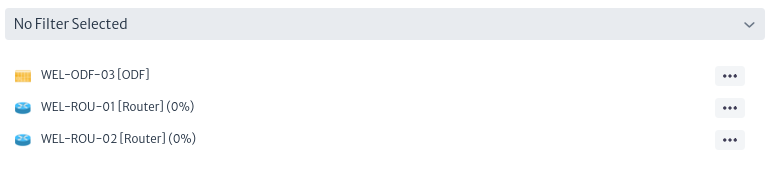

# Navigation

This module presents in tree form the physical objects of your inventory organized according to the defined standard containment hierarchy presented in the previous chapter (see Containment Manager).

To access the navigation module. On the top bar of the screen, locate the symbol shown in Figure 1. Then go to the Navigation section.

|  |
|:--:|
| ***Figure 1**. Navigation module.* |

The image below shows the main view of the navigation module. The objects observed when clicking on the ***Go To Root*** button are the direct children of Root. That is, the objects created at the top of the tree hierarchy.

|  |
|:--:|
|***Figure 2**. Navigation Module Interface.* |

Clicking on the `Root Actions` button displays a menu with the available options for object creation. As shown below. These options are explained in detail in the [Object Dashboard](../dashboards/object/README.md) chapter.

|  |
|:--:|  
| ***Figure 3**. Root Actions.* |
    
The top bar that appears in the Navigation module is a search engine that allows you to find inventory items more easily. You can search for an object by its name or by the class it belongs to. For example, to search for a Rack, you can search by the Rack class or by the name of the Rack.

|  |
|:--:|
| ***Figure 4**. Search Objects By ClassName.* |

After performing the search, a second search bar appears with which you can filter according to the results found, as shown below.

|  |
|:--:|
| ***Figure 5**. Filter.* |

By accessing any physical object in the inventory, you can view information specific to the selected object. As shown in Figure 6.

|  |
| :--: |
| ***Figure 6**. Inventory Object Navigation.* |

En la Figura 6, la sección señalada en el recuadro rojo corresponde al Object Dashboard, explicado de forma detallada en la sección [Object Dashboard](../dashboards/object/README.md).

En la parte superior de la Figura 6 (detallado en la Figura 7) se muestra la ruta o jerarquía de contención del objeto seleccionado. Esto significa que el objeto New Zealand contiene al objeto Wellington, que a su vez contiene al objeto WEL-FAC-02, el cual contiene el objeto de interés: el Rack seleccionado (WEL-RCK-03).

|  |
| :--: |
| ***Figure 7**. Object Containment Hierarchy.* |

En la parte derecha de la Figura 6, mostrada con más detalle en la Figura 8, se observa una barra de filtros en la parte superior. Esta barra se utiliza si el Rack tiene filtros asociados; para más información, consulte la sección "Filters". Debajo del campo del filtro, se muestra la jerarquía descendente de nuestra clase de interés, es decir, los objetos del inventario contenidos en el Rack seleccionado. Si selecciona alguno de los objetos en la Figura 8, la interfaz mostrará nuevamente un contenido similar al de la Figura 6, pero con la información del nuevo objeto seleccionado.

|  |
| :--: |
| ***Figura 8**. Navigation between Objects.* |