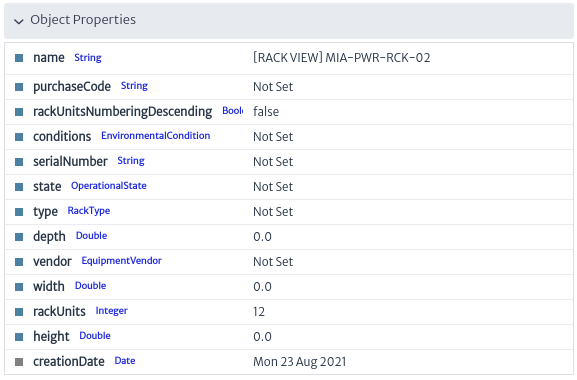

# Navigation

This module presents in tree form the physical objects of your inventory organized according to the defined standard containment hierarchy presented in the previous chapter (see Containment Manager).

To access the navigation module. On the top bar of the screen, locate the symbol shown in Figure 1. Then go to the Navigation section.

|  |
|:--:|
| ***Figure 1**. Navigation module.* |

The image below shows the main view of the navigation module. The objects observed when clicking on the ***Go To Root*** button are the direct children of Root. That is, the objects created at the top of the tree hierarchy.

|  |
|:--:|
|***Figure 2**. Navigation Module Interface.* |

Clicking on the `Root Actions` button displays a menu with the available options for object creation. As shown below. These options are explained in detail in the [Object Dashboard](../dashboards/object/README.md) chapter.

|  |
|:--:|  
| ***Figure 3**. Root Actions.* |
    
The top bar that appears in the Navigation module is a search engine that allows you to find inventory items more easily. You can search for an object by its name or by the class it belongs to. For example, to search for a Rack, you can search by the Rack class or by the name of the Rack.

|  |
|:--:|
| ***Figure 4**. Search Objects By ClassName.* |

After performing the search, a second search bar appears with which you can filter according to the results found, as shown below.

|  |
|:--:|
| ***Figure 5**. Filter.* |

By accessing any physical object in the inventory, you can view information specific to the selected object. As shown in Figure 6.

|  |
| :--: |
| ***Figure 6**. Inventory Object Navigation.* |

In Figure 6, the section marked in red corresponds to the Object Dashboard, explained in detail in the section [Object Dashboard](../dashboards/object/README.md).

In the upper part of Figure 6 (detailed in Figure 7) the path or containment hierarchy of the selected object is shown. This means that the New Zealand object contains the Wellington object, which in turn contains the WEL-FAC-02 object, which contains the object of interest: the selected Rack (WEL-RCK-03).

|  |
| :--: |
| ***Figure 7**. Object Containment Hierarchy.* |

On the right side of Figure 6, shown in more detail in Figure 8, there is a filter bar at the top. This bar is used if the Rack has associated filters; for more information, see the "Filters" section. Below the filter field, the top-down hierarchy of our class of interest is displayed, i.e. the inventory objects contained in the selected Rack. If you select any of the objects in Figure 8, the interface will again display similar content to Figure 6, but with the information of the newly selected object.

|  |
| :--: |
| ***Figura 8**. Navigation between Objects.* |