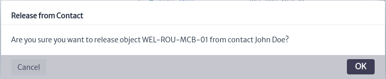

# Contact Manager
The Contact Management Module enables the creation and administration of individuals or organizations within the application, which may or may not be linked to any type of inventory item. This feature streamlines access to support, sales, manufacturers, contractors, and other relevant information directly from inventory elements.

Figure 1 illustrates the module’s structure. In the application, each created contact must be assigned a type and linked to a company. In this example, the contact is classified as a technician, represented by the *INSTANCE_OF* relationship, and is associated with a company through the *RELATED_TO_SPECIAL* relationship, named *contacts*, indicating that the individual is a contact for that company. The application supports various types of companies; in this case, the company is categorized as a *TelecommunicationsOperator*, also represented by the *INSTANCE_OF* relationship. Contacts are linked to inventory objects using the *RELATED_TO_SPECIAL* relationship, labeled *hasContact*, to indicate that a specific object has an assigned contact.

||
|:--:|
| ***Figure 1.** Contact manager structure* |

This module is part of the *Other* category, as shown in Figure 2.

||
|:--:|
| ***Figure 2.** Contact module* |

Once opened we will see the main window of the module, as shown in Figure 3. From here we can see the contacts currently created in the application. 

||
|:--:|
| ***Figure 3.** Queries manager main window* |

A contact or organization is made up of the following properties:

| Property           | Description |
|--------------------|----------------------------------------|
| **Company**        | The organization or company the contact is affiliated with. |
| **Type**           | The general type of the contact in the application (e.g., billing, commercial, technical). |
| **Name**          | The full name of the contact. |
| **Email 1 / 2**    | The primary email address for official communication and secondary email address for backup or specific purposes.. |
| **Cellphone**      | The contact’s mobile phone number. |
| **Role**           | The specific position or function of the contact within the company. |
| **Skype**          | The contact’s Skype ID for virtual meetings or messaging. |
| **Fax**            | The contact’s fax number for sending or receiving documents. |
| **Telephone 1 / 2**| The primary  and secondary landline phone number. |
| **Availability**   | The contact’s availability for communication. |
| **Language**       | The preferred language for communication with the contact. |

To create a contact in the application, click the   button, located in the main module window. This action will open the contact creation window shown in Figure 4. In this window, you will need to enter the name, contact type, and company, then click *OK*.

> **Note**
> You can add custom types and companies in the app according to your needs. These steps will be explained in detail later.

||
|:--:|
| ***Figure 4.** Add contact window* |

When a new contact is created, it will appear in the list of available contacts. Additionally, you can use the filters in the list to search by company, contact type, name, and email addresses as needed, as shown in Figure 5. If you wish to clear the filters and view all contacts again, use thebutton located in the main module window.

||
|:--:|
| ***Figure 5.** List of contacts* |

Once the contact is created, you can add the required information by selecting it from the list and clicking thebutton to update its properties. This will open the update window shown in Figure 6. Double-click the property you wish to edit, make your changes, and press Enter to update. When you’re done, click *Close*.

||
|:--:|
| ***Figure 6.** Update contact properties* |

Similarly, if you want to delete a contact, select it and click thebutton. This will open the contact deletion window shown in Figure 7. Click *OK* to delete the contact or *Cancel* if you do not wish to proceed.

||
|:--:|
| ***Figure 7.** Delete contacts window* |

## Manage Resources

To link contacts with any type of inventory item, whether administrative, logical, or physical, go to the **Navigation** module and search for the item you want to link. For this example, we will use a router. Locate the **Advanced Actions** menu and select the **Relate to Contact** option as shown in Figure 8. For more information on how to navigate inventory objects, consult the [Navigation](../../navigation/navman/README.md) module section

||
|:--:|
| ***Figure 8.** Relate to Contact* |

The window will open to relate the object as seen in Figure 9, enter the contact name, select it and press *OK*.

||
|:--:|
| ***Figure 9.** Select contact* |

You will be notified that the object was related correctly as seen in Figure 10.

||
|:--:|
| ***Figure 10.** Successful related* |

Once the item is linked, you can verify the contacts associated with it. To do this, go to the **Explorers** menu and select the **Relationships** option as shown in Figure 11.

||
|:--:|
| ***Figure 11.** Explorers* |

The relationships window will open showing all the relationships that the object has in the application, as seen in Figure 12.

||
|:--:|
| ***Figure 12.** Relationships window* |

Relationships with contacts can be found under **hasContact**. By selecting the contact, you can view all of its details. In this example, we assigned another contact to the item, as shown in Figure 13. It is possible to link multiple contacts to a single item, which is useful for representing various contact roles, such as sales representatives, technicians, etc.

||
|:--:|
| ***Figure 13.** Related contacts* |

Similarly, from the *Contacts* module, you can view and manage the items associated with a contact. In the main module window, select the desired contact and click the button. This will open the resource management window, as shown in Figure 14.

||
|:--:|
| ***Figure 14.** Manage contacts resources window* |

From here, you can view and search among the inventory items associated with the contact. You can also unassign items from the contact by clicking the  button next to the item you wish to unassign. This will open a confirmation window, as shown in Figure 15. Click *OK* to unassign the item or *Cancel* if you do not wish to proceed.

||
|:--:|
| ***Figure 15.** Release confirmation window* |

It will be confirmed that the item has been unassigned from the contact, as shown in Figure 16.

||
|:--:|
| ***Figure 16.** Successful release* |

## Add Contact Types and Companies

You can add your own contact types and companies, which allows the system to be tailored to your organization's specific needs. To do this, go to the *Data Manager Module*. Once there, to modify the class hierarchy related to contacts, search for the superclass *GenericContact*.

*GenericContact* is the superclass used to define all contacts in the application, as shown in Figure 17. From here, you can add, modify, or delete subclasses that represent the available contact types in the application.

||
|:--:|
| ***Figure 17.** Manage contact superclass* |

For our example, we added the type *Support Contact*, as shown in Figure 18. For more details on creating and modifying the application hierarchy, please refer to the [Data manager](../../administration/dmman/README.MD) section.

||
|:--:|
| ***Figure 18.** New contact type* |

Similarly, the *GenericCustomer* superclass is used to define customer types in the application, representing the companies assigned to contacts. To create new options, navigate to the *Service Manager* module. Once in the module, you can create new customers as shown in Figure 19. For more details on creating new customers, please refer to the [Service Manager](../../services/serviceman/README.md) section.

||
|:--:|
| ***Figure 19.** New customer* |

## Reports

In addition to viewing contacts assigned to an item through the *Navigation* or *Contacts* module, you can also generate reports on contacts assigned to inventory items to obtain information related to support, sales, etc. In this example, we will create a report that displays information about contacts assigned to items located in a room. To do this, go to the *Reports* module. Once there, create a *class-level report* for the Room class, as shown in Figure 20. For more information on creating reports and the different types of reports, please refer to the [Report module](../reports/README.md) section.

||
|:--:|
| ***Figure 20.** Created report* |

Once the report for the *Room* class is created, go to the *Navigation* module and search for a class of this type. In this case, navigate to the room containing the router to which we previously assigned contacts. In the **Basic Actions** menu, use the **Reports** option as shown in Figure 21.

||
|:--:|
| ***Figure 21.** Report option* |

By doing so, you will see the available reports for the *Room* class, including the report previously created for this class, as shown in Figure 22.

||
|:--:|
| ***Figure 22.** Available reports for class Room* |

When the report is selected, a new tab will open with the report corresponding to the selected room. In this report, you will see the objects within the room that have assigned contacts, along with their information, as shown in Figure 23. You can find this report as an example in the following [repository](https://sourceforge.net/p/kuwaiba/code/HEAD/tree/server/trunk/scripts/reports/).

||
|:--:|
| ***Figure 23.** Report generated* |
