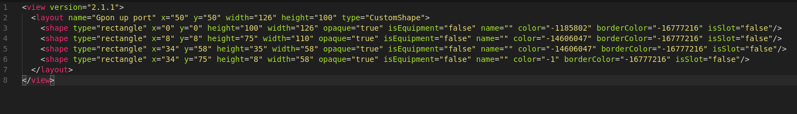
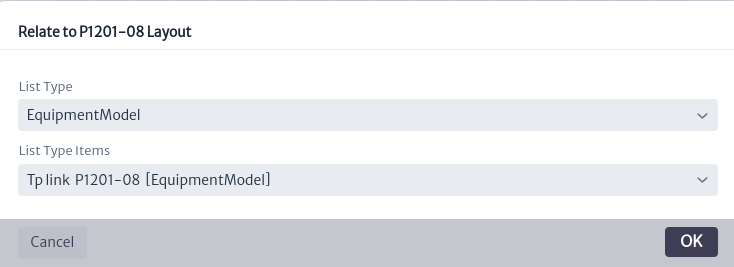

# Layout Editor
The *Layout editor* is a module that allows us to design the physical view of the elements hosted in a Rack used in the [Rack view](../../navigation/navman/README.md/#rack-view)

This module is part of the *Other* category, as shown in Figure 1.

||
|:--:|
| ***Figure 1.** Layout editor module* |

Once opened, we will see the main window of the module, as shown in Figure 2. From here we can see the canvas to create layouts.

||
|:--:|
| ***Figure 2.** Queries manager main window* |

To design layouts, the module offers various tools, which can be found in the toolbar located at the top of the canvas, as shown in Figure 3.

||
|:--:|
| ***Figure 3.** Layout designer tools* |

You will also find the properties panel on the right side of the canvas, which allows you to interact with the topology objects, as shown in Figure 4.

||
|:--:|
| ***Figure 4.** Properties panel* |

## Creating A Layout
As an example, let's recreate the design of the [GPON OLT P1201-08](https://service-provider.tp-link.com/gpon/p1201-08/) from TPLINK used in a GPON network as shown in Figure 5. In this network, we have the central office where our OLT is located. A primary splitter is used to connect the ONTs located in customers' homes. In this case, we will focus on the design of the OLT hosted in the rack. If you want to create full representations of a network, please refer to the [Topology Designer](../../planning/topoman/README.md) module for more details.

||
|:--:|
| ***Figure 5.** Red GPON diagram* |

To start, you must create a **new layout** using the  button. The window shown in Figure 6 will open. Enter the name and description, then click *OK*.

||
|:--:|
| ***Figure 6.** Window create layout* |

When you create a layout, you can see and edit its properties in **View Properties** in the properties panel, as shown in Figure 7.

||
|:--:|
| ***Figure 7.** View properties* |

Once the layout is created, we proceed to add the elements on the canvas, as shown in Figure 8. The canvas has 14 delimited spaces to represent the rack units in order to facilitate the placement and sizing of the elements.

||
|:--:|
| ***Figure 8.** Canvas division* |

### Custom Shapes
To start designing the GPON OLT P1201-08 shown in Figure 9, we can use the *custom shapes* available in the application. Custom shapes are templates of common elements such as electrical ports, internet ports, etc. To access them, click on **Custom Shapes** in the properties panel shown in Figure 10.

||
|:--:|
| ***Figure 9.** GPON OLT P1201-08* |

||
|:--:|
| ***Figure 10.** Custom Shapes* |

By default, a wide variety of templates are available; however, you can create your own templates according to your needs. In this case, we will create the templates. Use the buttonshown in Figure 10. The window in Figure 11 will open. Enter a name and click OK.

||
|:--:|
| ***Figure 11.** Create custom shape window* |

The created template will appear in the list of available templates as shown in Figure 12; however, at this moment it is not possible to use it because it is empty.

||
|:--:|
| ***Figure 12.** New Custom shape* |

To create its content, we need to open it using the buttonlocated in the design toolbar shown in Figure 3. When used, the custom shapes selection window will open. We search for the created template and *Click* on it as shown in Figure 13.

||
|:--:|
| ***Figure 13.** Select custom shape window* |

When doing so, you will notice that several tools on the toolbar seen in Figure 3 will be enabled, as shown in Figure 14.

||
|:--:|
| ***Figure 14.** Enabled layout designer tools* |

Next, we will proceed to create the custom shapes that will represent the GPON ports of our OLT. To do this, we use the shapes provided by the module, as shown in Figure 15. We have rectangles and circles available; in our case, we will add a rectangle usingas shown in Figure 16.

||
|:--:|
| ***Figure 15.** Add shapes actions* |

||
|:--:|
| ***Figure 16.** Add shape* |

By clicking on the shape we added, the properties panel will display available actions to customize the properties of the shapes according to our needs. Among these actions, you can modify the background color, outline color, font color, font size, width and height and more, as shown in Figure 17.

||
|:--:|
| ***Figure 17.** Shape properties* |

In addition to this, you can see guides appear to change the dimensions of the shape. When you hover over the element, it will change as shown in Figure 18. Click and drag to adjust it to the desired size. However, it is recommended to use the highlighted tools in the properties panel to adjust the width, height and position of the shapes.

||
|:--:|
| ***Figure 18.** Change shape size* |

After finishing modeling the OLT port as shown in Figure 19, you can use the button  to save your design.

||
|:--:|
| ***Figure 19.** OLT GPON port * |

#### Import/Export Layout/Custom Shape
With the template for the upper ports ready, we can now proceed to create the template for the lower ports. To do this, we can use the recently created template as a base by exporting its design using the button . This will generate an XML document for download, as shown in Figure 20.

||
|:--:|
| ***Figure 20.** Export shape* |

The generated XML file contains tags that represent the custom shape, as shown in Figure 21. We can modify it to create a new template. To do this, change the value of the *name* attribute in the *layout* tag from *Gpon up port* to *Gpon down port*, as seen in the second line of Figure 21.

||
|:--:|
| ***Figure 21.** XML shape file* |

Once the file is modified, use the button  to open the window for importing layouts, as shown in Figure 22. Press Upload File, select the previously modified *view* file, and click *OK*.

||
|:--:|
| ***Figure 22.** Import layout/shape window* |

You will be notified that the custom shape was imported successfully, as shown in Figure 23. It will appear in the list of available custom shapes, as seen in Figure 24.

||
|:--:|
| ***Figure 23.** Imported shape* |

||
|:--:|
| ***Figure 24.** Shape imported available* |

Once the template is modified to represent the lower ports of the OLT, save the changes. The result can be seen in Figure 25.

||
|:--:|
| ***Figure 25.** Gpon down port* |

Once the custom shapes for the OLT ports are completed, proceed with its design by opening the previously created layout. To do this, click the button , which will open the layout selection window as shown in Figure 26. *Click* on the layout to open it.

||
|:--:|
| ***Figure 26.** OPen layout window* |

Once opened, we start by creating the chassis for our OLT in the desired rack slot, represented by the divisions on the canvas as shown in Figure 27. For our example, we use the second space on the canvas, which represents the second slot of the rack.

||
|:--:|
| ***Figure 27.** Olt Chasis* |

Next, we proceed to place the OLT ports according to the design in Figure 9, where we find the upstream Gigabit ports, management ports, GPON ports, etc. We will use the custom shapes previously created and those available in the application. To do this, use the buttonfor the custom shape you want to use, to add elements to the layout as shown in Figure 28.

||
|:--:|
| ***Figure 28.** Add custom shape* |

When adding the ports, assign the names of the custom shapes, placing the odd-numbered elements on the top and the even-numbered elements on the bottom, as shown in Figure 29.

> **Note**
> Pay close attention to the names assigned to the elements, as these will be used in the rack views for connection assignment, explained in detail in the [Rack View](../../navigation/navman/README.md/#rack-view) section.

||
|:--:|
| ***Figure 29.** Add GPON ports* |

At the end, you will get something similar to what is shown in Figure 30.

||
|:--:|
| ***Figure 30.** OLT P1201-08* |

## Rack View
Finally, to visualize how the designed device would be contained in the rack, use the [Rack View](../../navigation/navman/README.md/#rack-view) (Refer to the Rack view section in the navigation module for more details on its use). To view the design in this view, it must be possible to link it to an inventory object. To achieve this, we use the [List Types](../../administration/ltman/README.MD), a type of attribute for objects in the application such as model, supplier, etc. We will assign the design to a list type using the **set list type item** button, as shown in Figure 31.

||
|:--:|
| ***Figure 31.** Set list type item* |

A window will open to associate a list type with a layout, as shown in Figure 32. In this window, select *EquipmentModel* in **List Type**, which represents the type of attribute, in this case, the model of an inventory object. In **List Type Items**, which represents the model, select Tp link P1201-08, which was created earlier. Visit [List Types](../../administration/ltman/README.MD) for more details on how to create new List Types.

||
|:--:|
| ***Figure 32.** Related list type item to layout* |

Once the layout is assigned to the list type, go to the navigation module and search for a *Rack* containing an *OLT* with the model *Tp link P1201-08*, as shown in Figure 33. If an OLT of this model does not exist, create one within one of the available *Racks* in the application. For instructions on how to create elements, visit [Navigation](../../navigation/navman/README.md).

||
|:--:|
| ***Figure 33.** OLT example* |

Next, to visualize the physical view of the distribution of the elements, go to the menu view and select **Rack View**, as shown in Figure 34.

||
|:--:|
| ***Figure 34.** Rack view option* |

Upon doing this, the window in Figure 35 will open, where you can see how the elements are placed in the *Rack*. The distribution of the elements depends on the *position* and *rack units* assigned. Visit [Rack View](../../navigation/navman/README.md/#rack-view) for more details on these configurations.

||
|:--:|
| ***Figure 35.** Rack view window* |

In the previous figure, you can see the elements assigned to the rack. However, this view only allows you to observe the rack slot assigned to the elements and the number of slots they occupy. As shown, the OLT is represented in green in the first unit of the Rack. The Rack View offers a more detailed view of the elements. To access this, select the *Show Detailed View* option, which will display the designs assigned that have been created in the *Layout Editor*r, as shown in Figure 36.

||
|:--:|
| ***Figure 36.** Detailed view* |

With this, we have completed the design of the OLT in the application. Additional functions and configurations available in the *Rack View* can be consulted in the [Rack View](../../navigation/navman/README.md/#rack-view) section.
