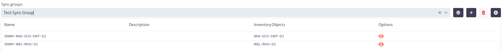

# Synchronization Framework

The synchronization framework defines the components that allow Kuwaiba to obtain data from the actual network to keep the inventory up to date[^synchronization_framework].

To access the synchronization module, locate the  icon in the menu at the top, when you select it, a vertical menu will be displayed as shown in Figure 1, where you must select the `Synchronization Framework` option.

|  |
| :--: |
| ***Figure 1.** Access to the synchronization module.*|

Figure 2 presents the interface of the module. At the top, there are three options, marked in the red box, which are described below as a series of steps to follow in order to use the module effectively.

|  |
| :--: |
| ***Figure 2.** Synchronization module.*|

* The `Data Source Templates` option allows the user to view, create or delete templates for loading source data. Selecting this option displays the view seen in Figure 3.
  
  |  |
  | :--: |
  | ***Figure 3.** Data Source Templates.*|

  To create a template, select the  icon. When doing so, the information that allows the user to create a new template will appear, as illustrated in Figure 4. In this step, it is necessary to define the template name, description and properties.

  |  |
  | :--: |
  | ***Figure 4.** Create template.*|

  To add properties, select the icon . Once the property name is set, press Enter to save the value. To delete a property, click on the icon  next to each added property. Finally, to save the template, select the icon .

  |  |
  | :--: |
  | ***Figure 5.** Create properties in template.*|

  The templates created are displayed in the list of templates, shown in Figure 3 (initially empty). This list is represented as a table including the name of the template, its description and the associated options. In this context, the only available option is indicated by the icon , which allows you to delete the template. If you select a template from the list, you can view its contents and modify it, as illustrated in Figure 7.

  |  |
  | :--: |
  | ***Figure 6.** List of templates.*|

  |  |
  | :--: |
  | ***Figure 7.** Update template.*|

Once you have defined your templates, you can proceed with the synchronization process by object group or by a particular object.

* To define a synchronization process for a specific inventory object, locate and select the `Data Sources` button. This will take you to the view shown in Figure 8, where you will find a table (initially empty) with the data sources created. The data sources contain the specific information to retrieve the data from a particular device.

  |  |
  | :--: |
  | ***Figure 8.** Data sources.*|

  To create a new data source, click on the  button. Subsequently, a search bar will appear where you can find the inventory object by its name or by the class it belongs to.

  |  |
  | :--: |
  | ***Figure 9.** Data sources by object.*|

  After selecting an object, the data sources associated with that object will appear in the table mentioned above. Because the selected object has no data sources, the list appears empty. To add a new data source, select button the  again. On the right side of the screen, a form with the necessary information for its creation will appear. First, you must select an existing template. You can view the existing templates by clicking on , which will display a list.

  |  |
  | :--: |
  | ***Figure 10.** Select template.*|

  After selecting the template, the properties defined in it will be displayed. To assign a value to them, double click on the property and define the desired value. Then press the Enter key to set it.

  |  |
  | :--: |
  | ***Figure 11.** Configure common properties values.*|

  In addition, you can add specific properties for an object by selecting specific properties. Similar to creating properties in templates, select  to add them.

  |  |
  | :--: |
  | ***Figure 12.** Configure specific properties values.*|

  Finally, to save the data source I selected  and the data source appears in the list mentioned in Figure 9.

  |  |
  | :--: |
  | ***Figure 13.** List of data sources.*|

  The table in Figure 13 has four columns.

  * **Type** The type of data source (set by the template).
  * **Name** The name of the data source.
  * **Description** The description added to the data source.
  * **Options** Different actions that can be performed for the data source. It has four options which are detailed below.
    * The icon  executes the synchronization set for the selected object.
    * The icon  allows you to add the data source to an existing synchronization group.

        |  |
        | :--: |
        | ***Figure 14.** Add data source to group.*|

    * The icon  removes the data source from a synchronization group.
    * The icon  removes the data source.

* Synchronizations by group are managed in `Sync Groups`, where you can search for the data sources of a previously created group or create a new synchronization group. Sync groups allow you to run a synchronization process for several inventory objects. For this, it is necessary to have data sources created, as explained above.
  
  |  |
  |  :--: |
  | ***Figure 15.** Synchronization groups.*|

  To create a new group select the  button, which opens a pop-up window like the one shown in Figure 16, where you can add the group name, a description and add data sources.

  |  |
  |  :--: |
  | ***Figure 16.** Create a synchronization group.*|

  To view the data sources associated with a group, use the search bar on the sync groups screen. You can search for the group of interest by typing the group name in the search bar or by selecting it from the drop-down list by clicking ![show_groups_icon]. When you select a group, the associated data sources will appear in the table in Figure 17. This table has four columns:

  |  |
  |  :--: |
  | ***Figure 17.** Data sources by group.*|

  * **Name** Name of data source.
  * **Description** Description of the data source.
  * **Inventory Objects** Inventory object associated with the data source.
  * **Options** The actions that can be performed for each data source. It has only one option which is  which removes the data source from the group.
  
  To modify a group's information, select the icon , which will open the window shown in Figure 18. In this window, the user can modify the group name, description and associated data sources, adding or deleting them as needed.

  |  |
  |  :--: |
  | ***Figure 18.** Update group.*|

  To delete a group, select the icon .

  Finally, you can execute the whole synchronization group by clicking on  which executes all the data sources associated to the group. At the end of its execution, a window appears with the results obtained in the synchronization process.

## List of Parameters by Protocols

Currently, the synchronization module supports Simple Network Management Protocol (SNMP) and Secure Shell (SSH) protocols. The parameters that can be defined for the above protocols are shown below.

* **SNMP**
  
  | Parameter | Description |
  | ----------|------|
  | ipAddress | IP address of the system that will manage the SNMP devices. |
  | port | Port for SNMP.|
  | version | SNMP version. The possible values are: `2c`, `3`. The default value is `2c`. |
  | community | SNMP Version `2c` attribute community. Default value public. |
  | authProtocol | SNMP version `3` attribute authentication protocol. Possible values: `MD5`, `SHA`. |
  | authPass | SNMP version `3` attribute  authentication protocol pass phrase. |
  | securityLevel | SNMP version `3` attribute security level. Possible values: `noAuthNoPriv`, `authNoPriv`, `authPriv`. |
  | securityName | SNMP version `3` attribute security name. |
  | contextName | SNMP version `3` attribute context name. |
  | privacyProtocol | SNMP version `3` attribute privacy protocol. Possible values: `DES`, `AES`. |
  | privacyPass | SNMP version `3` attribute privacy protocol pass phrase. |

* **SSH**
  
  | Parameter  | Description |
  | ----------|------|
  | sshPort | SSH port. |
  | sshUser | Username used to log in to a remote server via SSH. |
  | sshPassword | Password associated with the `sshUser`. |

  [^synchronization_framework]: Synchronization Framework Overview: https://www.kuwaiba.org/docs/dev/sync/
