# Outside Plant Management

The outside plant module manages the OSP views which are composed of nodes and connections and are used to represent a network.

|  |
|:--:|
| ***Figure 1.** Outside plant module* |

In this chapter the following topics will be addressed:

* [Creating an FTTH OSP view](#creating-an-ftth-osp-view)
  * [Adding Nodes](#adding-nodes)
  * [Adding Connections](#adding-connections)
* [Node Tools](#node-tools)
* [Connection Tools](#connection-tools)
* [Map Tools](#map-tools)
* [OSP View Tools](#osp-view-tools)
* [Geographical Queries](#geographical-queries)
* [View Content Tool](#view-content-tool)
  * [Filters](#filters)
* [Splicing Tool](#splicing-tool)
* [Customize the Map](#customize-the-map)
  * [Map Provider](#map-provider)
  * [Map Center and Zoom](#map-center-and-zoom)
  * [Map Labels](#map-labels)

## Creating an FTTH OSP view

To build the osp view we are going to use as a reference the diagram in Figure 2 in which we have a central office where the OLT will be located, a primary splitter and a secondary splitter, to which the client's ONT will be connected.

| 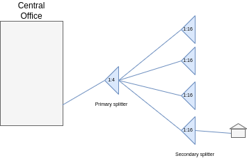 |
|:--:|
| ***Figure 2.** FTTH Diagram* |

* Click on the create an osp view button 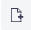, in the window Figure 3 enter the name and description and click on the OK button.

| 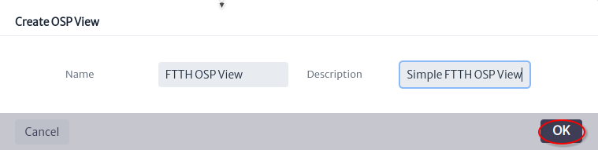 |
|:--:|
| ***Figure 3.** Create OSP view window* |

* Click on the open properties panel button  to see the view properties Figure 4.

| 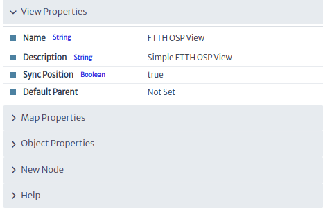 |
|:--:|
| ***Figure 4.** View properties* |

* Center the map where the network will be located. Figure 5 shows the updated map properties.

| 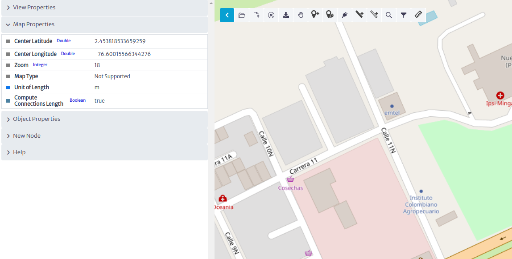 |
|:--:|
| ***Figure 5.** Map Properties* |

## Adding Nodes

* Select the new panel node as shown in Figure 6.

| 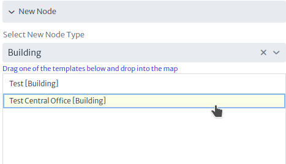 |
|:--:|
| ***Figure 6.** New Node Panel* |

* Drag and drop to map the `Test Central Office` building template then the window shown in Figure 7 will appear, select the parent of the node and click the next button.

| 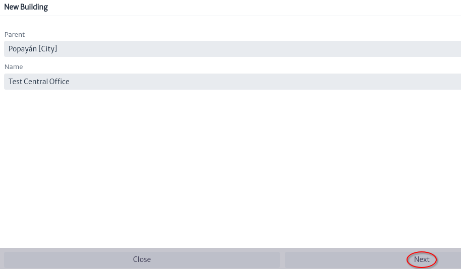 |
|:--:|
| ***Figure 7.** New Building* |

* Using the object properties rename `Test Central Office` as `POP Central Office` Figure 8.

| 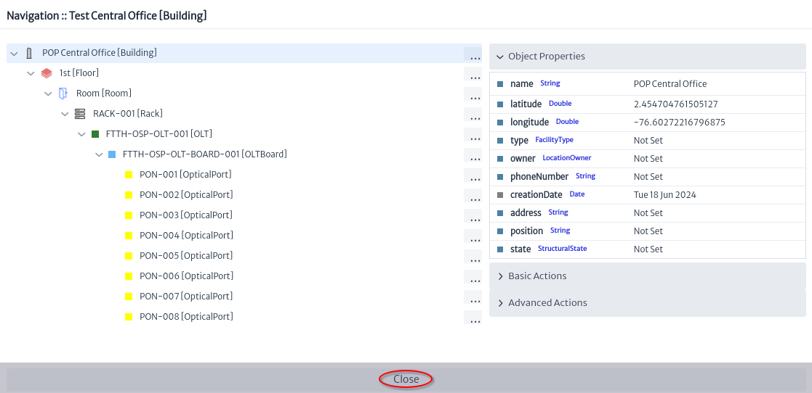 |
|:--:|
| ***Figure 8.** Navigation Central Office* |

* The two previous steps are repeated to add the first and second level splitters Figure 9, and to add a house Figure 10.

| 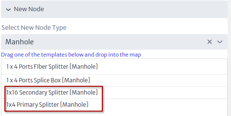 |
|:--:|
| ***Figure 9.** New splitters* |

| 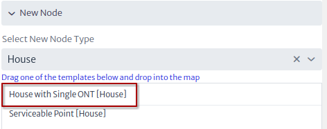 |
|:--:|
| ***Figure 10.** New house* |

The OSP view should be similar to that shown in Figure 11.

| 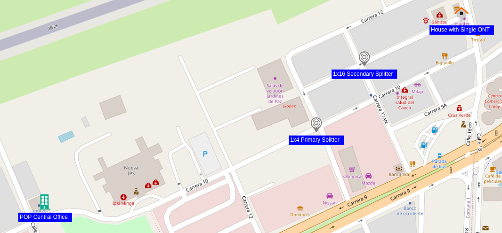 |
|:--:|
| ***Figure 11.** OSP view nodes only* |

## Adding Connections

Once the view nodes are created, they are connected using the connection tools.

* Selecting the connection tool 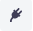 creates a cable between the `POP Central Office` and the manhole that contains the `1x4 Primary Splitter` Figure 12. Then a window will appear to define the name and type of the new cable Figure 13. Click on the OK button

| 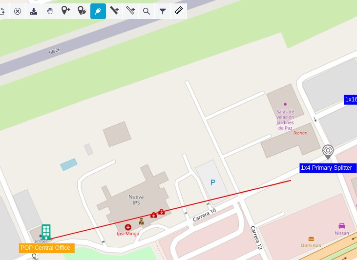 |
|:--:|
| ***Figure 12.** New cable* |

| 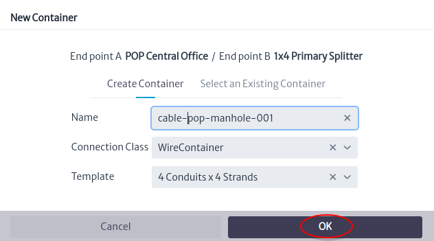 |
|:--:|
| ***Figure 13.** New container window* |

* In the window that asks whether to edit connections, click the Yes button Figure 14.

| 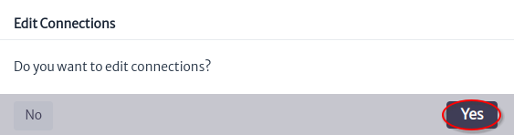 |
|:--:|
| ***Figure 14.** Do you want edit connections? window* |

* A window will appear to edit the connections, it will be used to create the connection between the OLT port and the primary splitter as shown in Figure 15.

| 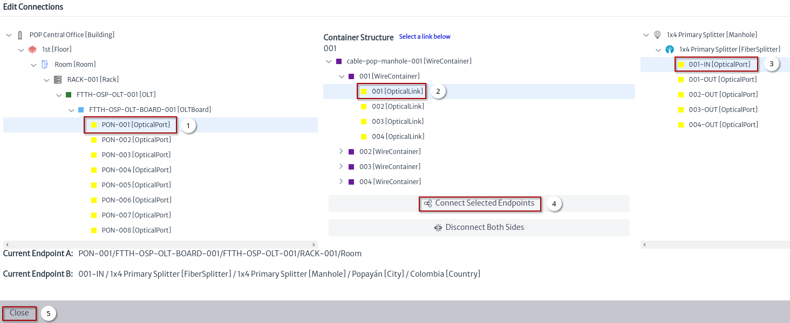 |
|:--:|
| ***Figure 15.** Edit connections window* |

  1. Select OLT port.
  2. Select fiber.
  3. Select IN port in primary splitter.
  4. Click the button Connect Selected Endpoints.
  5. Close edit connection window.

* Once the connections have been edited the OSP view looks as shown in Figure 16

| 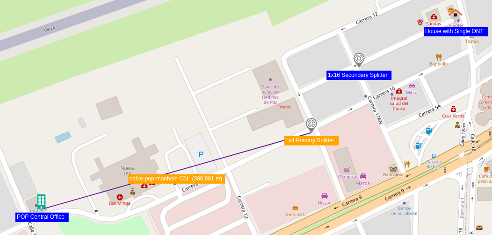 |
|:--:|
| ***Figure 16.** OSP view with one connection* |

* Repeat the steps to create the connection between the primary splitter and the secondary splitter, and between the secondary splitter and the house Figure 17.

| 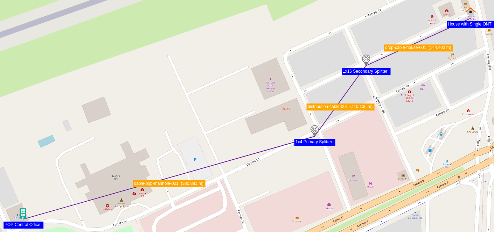 |
|:--:|
| ***Figure 17.** Simple OSP View* |

For more details on the connections edition see [Edit Connections][edit-connections].

[edit-connections]: ../physcon/index.html#edit-connections

## Node Tools

| 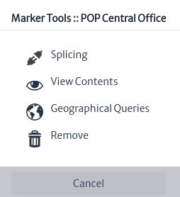 |
|:--:|
| ***Figure 19.** Node tools* |

Figure 19 shows the node tools window that appears when you right click on a node.

| Tool | Description |
| -- | -- |
|  | This tool is used to do fiber optic splicing of the cables that reach the selected node. See [splicing tool](#splicing-tool) |
|  | Used to view the devices within the node, you can list all or use filters. See [view content tool](#view-content-tool) |
|  | Using the node coordinates, [geographical queries][geographical-queries] filter the network elements within a search radius. |
|  | Remove the node from the view only, to remove the node from the inventory it is necessary to do so from the navigation module |

[geographical-queries]: #geographical-queries

## Connection Tools

| 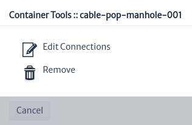 |
|:--:|
| ***Figure 20.** Connections tools* |

Figure 20 shows the connection tools window that appears when you right click on a connection.

| Tool | Description |
| -- | -- |
|  | The edit connection tool was covered in the [adding connections](#adding-connections) section Figure 15. |
|  | Remove the node from the view only, to remove the node from the inventory it is necessary to do so through the navigation module |

## Map Tools

| 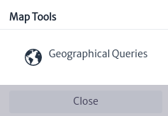 |
|:--:|
| ***Figure 18.** Map tools* |

Figure 18 shows the map tools window that appears when you right click on map.

| Tool | Description |
| -- | -- |
|  | Using the coordinates where you right clicked on the map, [geographical queries][geographical-queries] filter the network elements within a search radius. |

## OSP View Tools

| 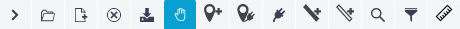 |
|:--:|
| ***Figure 19.** Osp View tools* |

Figure 19 shows the tools to manage the OSP views.

| Tool | Description | Keyboard Shortcut |
| :--: | -- | -- |
|  | Open properties panel |  |
| 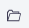 | Open an existing OSP View | Alt-O |
|  | Create an OSP View | Alt-N |
| 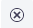 | Delete OSP View | Alt-D |
| 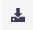 | Save OSP View | Alt-U |
|  | Select a node or connection | Alt-H |
| 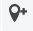 | Add node | Alt-M |
| 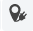 | Add connections between two nodes using the existing containers |  |
|  | Connect two nodes using a container | Alt-E |
| 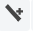 | Run a container through a single or multiple containers | Alt-C |
| 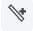 | Run a link through a single or multiple containers | Alt-L |
| 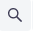 | Searches for a node or connection within the view | Alt-S |
|  | Filter the nodes by class | Alt-F |
| 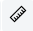 | Measure distance |  |

## Geographical Queries

A geographic query is a [scripted query][using-scripted-queries] from the `ospman.geo` pool [Figure 20][figure-20], this query must have the parameters `latitude`, `longitude`, `viewNodes` and `radius` plus other additional parameters that the query may require.

| ![Geographical Query Pool][figure-20] |
|:--:|
| ***Figure 20.** Geographical Query Pool* |

[figure-20]: images/figure-scripted-queries.png

The `latitude`, `longitude` and `viewNodes` parameters are set when the query is selected [Figure 21][figure-21]. If the action was launched from a node (see [Node Tools][node-tools]) the latitude and longitude will be equal to that of the node. But if the action is launched from the map (see [Map Tools][map-tools]) the values ​​are set by calculating the latitude and longitude where the right click was made. The `viewNodes` parameter is the list of nodes in the view.

[node-tools]: #node-tools
[map-tools]: #map-tools

[using-scripted-queries]: ../../navigation/queries/index.html#using-scripted-queries

| ![Geographical Queries][figure-21] |
|:--:|
| ***Figure 21.** Geographical Queries* |

[figure-21]: images/figure-geographical-queries.png

The `radius` parameter is a positive number in meters of a circle with center in latitude and longitude, and must be set by the user before executing the query [Figure 22][figure-22] as well as the additional parameters to those already mentioned.

> **Note**
>
> The Outside Plant module lists and executes the scripted queries [Figure 21][figure-21] created in the [Queries][using-scripted-queries] module [Figure 20][figure-20]

| ![Geographical Query][figure-22] |
|:--:|
| ***Figure 22.** Geographical Query* |

[figure-22]: images/figure-geographical-query.png

[Figure 22][figure-22] shows the flow to execute a geographic query:

1. Set the radius in meters and other parameters if they exist.
2. Click on the `Execute` button.
3. Filter nodes by name or class name.
4. Select the node.
5. Click on the `Locate on Map` button to center the view on the selected node.
6. Check nodes to create a heat map.
7. Click the `Details...` button to open an [Object Options Panel][object-options-panel] [Figure 23][figure-23].
8. Click on the [`View Content`][view-content] button.
9. Click the `Close` button.

[object-options-panel]: ../../navigation/navman/index.html#object-options-panel
[view-content]: #view-content-tool

| ![1x16 Secondary Splitter details][figure-23] |
|:--:|
| ***Figure 23.** 1x16 Secondary Splitter details* |

[figure-23]: images/figure-geographical-query-details.png

## View Content Tool

The view content tool helps you navigate the children of devices and physical connections [Figure 24][figure-24].

| ![View content window][figure-24] |
|:--:|
| ***Figure 24.** View content window* |

[figure-24]: images/figure-view-content.png

1. Select filter. See [Filters](#filters).
2. Select device.
3. Select any of the children of the device that contains ports.
4. Search for a port.
5. Click the `Physical Path` button [Figure 25][figure-25].
6. Click the `Physical Tree` button [Figure 26][figure-26].
7. Click the `Close` button.

| ![Physical path view][figure-25] |
|:--:|
| ***Figure 25.** Physical path view* |

[figure-25]: images/figure-physical-path-view.png

For more details on the physical path view see the [navigation][physical-path-view] module.

[physical-path-view]: ../../navigation/navman/index.html#physical-path-view

| ![Physical tree view][figure-26] |
|:--:|
| ***Figure 26.** Physical tree view* |

[figure-26]: images/figure-physical-tree-view.png

For more details on the physical tree view see the [navigation][physical-tree-view] module.

[physical-tree-view]: ../../navigation/navman/index.html#physical-tree-view

### Filters

> **Note** This is a brief introduction to filters, for more details see the [Filters][filters] module.

[filters]: ../../settings/filters/index.html

[Figure 24][figure-24] shows the content of a building. The filters that appear in the filter selector are the filters defined for the `Building` class. [Figure 27][figure-27] shows the extensions for the Building class. See the [data model manager][dmman].

[dmman]: ../../administration/dmman/index.html

| ![Extensions for the Building class][figure-27] |
|:--:|
| ***Figure 27.** Extensions for the Building class* |

[figure-27]: images/figure-extends-building.png

[Figure 28][figure-28] shows all the filters that apply to the Building class. In general, the filters of a class are the filters of the same class and the classes that it extends.

| ![Filters][figure-28] |
|:--:|
| ***Figure 28.** Filters* |

[figure-28]: images/figure-filters.png

## Splicing Tool

For Kuwaiba, splicing a fiber is creating the relationship `endpointA` or `endpointB`. For example using manholes that contain the primary splitter, splicing of the fibers that are not yet connected to the splitter will be done.

In [Figure 29][figure-29] there are three fields that must be set: the location, the cable, and a device. In the field to select the location, all the nodes in the view are listed; the value that appears by default is that of the node that opened the tool.

| ![Splicing window][figure-29] |
|:--:|
| ***Figure 29.** Splicing window* |

[figure-29]: images/figure-splicing-window.png

Click on the `Select Cable` button, [Figure 29][figure-29], a window will open that lists the cables that enter and leave the node, select the cable and then one of the tubes on which the splice will be made [Figure 30][figure-30].

| ![Select cable][figure-30] |
|:--:|
| ***Figure 30.** Select cable* |

Click on the `Select Device` button, [Figure 29][figure-29], a window appears and will list the devices in the node, select the device on which the splice will be made [Figure 31][figure-31].

[figure-30]: images/figure-select-cable-window.png

| ![Select device][figure-31] |
|:--:|
| ***Figure 31.** Select device* |

[figure-31]: images/figure-select-device-window.png

Once the cable and device are selected, the location view is loaded [Figure 32][figure-32].

| ![Location view][figure-32] |
|:--:|
| ***Figure 32.** Location view* |

[figure-32]: images/figure-location-view.png

The location of the device can be changed using the button 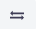 [Figure 33][figure-33]

| ![Changed location view][figure-33] |
|:--:|
| ***Figure 33.** Changed location view* |

[figure-33]: images/figure-changed-location-view.png

The location view have some tools for management to access them, right click on the port or fiber.

[Figure 34][figure-34] shows the port tools, most of them have already been explained in other chapters, the links are listed below:

| ![Port tools][figure-34] |
|:--:|
| ***Figure 34.** Port tools* |

[figure-34]: images/figure-port-tools.png

1. [Property Sheet][object-properties].
2. [Manage Port Mirroring][manage-port-mirroring].
3. [Show Physical Path][physical-path-view].
4. [Show Physical Tree][physical-tree-view].

[object-properties]: ../../navigation/navman/index.html#object-properties
[manage-port-mirroring]: ../physcon/index.html#manage-port-mirroring

[Figure 35][figure-35] shows the fiber tools, all have been covered in other chapters, the list of links is shown below:

| ![Fiber tools][figure-35] |
|:--:|
| ***Figure 35.** Fiber tools* |

[figure-35]: images/figure-fiber-tools.png

1. [Property Sheet][object-properties].
2. [Show Physical Path Endpoint A/B][physical-path-view].
3. [Show Physical Tree Endpoint A/B][physical-tree-view].

[Figure 36][figure-36] shows an example of using the fiber property sheet tool to set its color.

| ![Set fiber color][figure-36] |
|:--:|
| ***Figure 36.** Set fiber color* |

[figure-36]: images/figure-set-fiber-color.png

1. Right click on the fiber, click on the property sheet tool.
2. Double click on the value of the `color` property.
3. Select fiber color.
4. Click on the `Accept` button.
5. Click on the `Close` button.

To update the fiber color in the location view click the refresh button 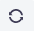 [Figure 37][figure-37].

> **Note:** following fiber optic cable color codes[^note1] define the colors for the other fibers.

[col-codes]: https://www.thefoa.org/tech/ColCodes.htm

| ![Location view refreshed][figure-37] |
|:--:|
| ***Figure 37.** Location view refreshed* |

[figure-37]: images/figure-refresh-location-view.png

There are two ways to splice from a port to fiber [Figure 38][figure-38] or from fiber to port [Figure 39][figure-39].

| ![Splicing from port to fiber][figure-38] |
|:--:|
| ***Figure 38.** Splicing from port to fiber* |

[figure-38]: images/figure-splicing-from-port-to-fiber.png

| ![Splicing from fiber to port][figure-39] |
|:--:|
| ***Figure 39.** Splicing from fiber to port* |

[figure-39]: images/figure-splicing-from-fiber-to-port.png

[Figure 40][figure-40] shows the splicing of fibers 2, 3 and 4.

| ![Fiber splicing][figure-40] |
|:--:|
| ***Figure 40.** Fiber splicing* |

[figure-40]: images/figure-splicing-fibers.png

[Figure 41][figure-41] shows the [relationships explorer][relationships] for fiber 2.

[relationships]: ../../navigation/navman/index.html#relationships

| ![Fiber relationships][figure-41] |
|:--:|
| ***Figure 41.** Fiber relationships* |

[figure-41]: images/figure-fiber-relationships.png

## Customize the Map

Some characteristics of the map can be changed using the [configuration variables][settings-configuration-variables] below are the changes enabled for the user.

> **Note:** the [default values][settings-configuration-variables-default-values-ospman] ​​are listed in the configuration variables module.

[settings-configuration-variables]: ../../settings/variables/index.html
[settings-configuration-variables-default-values-ospman]: ../../settings/variables/index.html#outside-plant-management

### Map Provider

By default the map is displayed using [OpenLayers](https://openlayers.org/) and the Open Street Map (OSM) tiled layer, to use a different map provider you must update the value of the configuration variable `general.maps.provider` to one of the following allowed values:

* `com.neotropic.kuwaiba.modules.commercial.ospman.providers.ol.osm.OsmProvider`
* `com.neotropic.kuwaiba.modules.commercial.ospman.providers.ol.bmaps.BmapsProvider`
* `com.neotropic.kuwaiba.modules.commercial.ospman.providers.google.GoogleMapsMapProvider`

> **Notes**
>
> * `com.neotropic.kuwaiba.modules.commercial.ospman.providers.google.GoogleMapsMapProvider` require the value of the configuration variable `general.maps.apiKey` to be set.
> * `com.neotropic.kuwaiba.modules.commercial.ospman.providers.ol.bmaps.BmapsProvider` require the value of the configuration variables `general.maps.apiKey` and `general.maps.provider.bmaps.imagerySet` the possible values ​​of the last one are:
>   * `Aerial`
>   * `AerialWithLabels`
>   * `AerialWithLabelsOnDemand`
>   * `Streetside`
>   * `BirdsEye`
>   * `BirdsEyeWithLabels`
>   * `Road`
>   * `CanvasDark`
>   * `CanvasLight`
>   * `CanvasGray`

In addition to the listed providers, it is possible to extend the functionality of this module to use other providers such as [Leaflet](https://leafletjs.com/).

### Map Center and Zoom

When you enter the module, the map has a center and zoom by default, this behavior can be changed by updating the configuration variables:

* `widgets.simplemap.centerLatitude` The default center latitude.
* `widgets.simplemap.centerLongitude` The default center longitude.
* `widgets.simplemap.zoom` The default map zoom.

### Map Labels

To change the color or fill color of the labels of the nodes or edges, the following configuration variables are used:

* `module.ospman.colorForLabels` The color for the map labels.
* `module.ospman.fillColorForEdgeLabels` The fill color for the map edge labels.
* `module.ospman.fillColorForNodeLabels` The fill color for the map node labels.
* `module.ospman.fillColorForSelectedEdgeLabels` The fill color for the map selected edge labels.
* `module.ospman.fillColorForSelectedNodeLabels` The fill color for the map selected node labels.
* `module.ospman.fontSizeForLabels` The font size for the map labels.
* `module.ospman.minZoomForLabels` The minimum zoom level for the map when displaying.

[^note1]: [Fiber Optic Cable And Connector Color Codes][col-codes]
