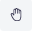
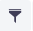

# Outside Plant Management

The outside plant module manages the OSP views which are composed of nodes and connections and are used to represent a network.

|  |
|:--:|
| ***Figure 1.** Outside plant module* |

## Creating an FTTH OSP view

To build the osp view we are going to use as a reference the diagram in Figure 2 in which we have a central office where the OLT will be located, a primary splitter and a secondary splitter, to which the client's ONT will be connected.

|  |
|:--:|
| ***Figure 2.** FTTH Diagram* |

* Click on the create an osp view button , in the window Figure 3 enter the name and description and click on the OK button.

|  |
|:--:|
| ***Figure 3.** Create OSP view window* |

* Click on the open properties panel button  to see the view properties Figure 4.

|  |
|:--:|
| ***Figure 4.** View properties* |

* Center the map where the network will be located. Figure 5 shows the updated map properties.

|  |
|:--:|
| ***Figure 5.** Map Properties* |

## Adding Nodes

* Select the new panel node as shown in Figure 6.

|  |
|:--:|
| ***Figure 6.** New Node Panel* |

* Drag and drop to map the `Test Central Office` building template then the window shown in Figure 7 will appear, select the parent of the node and click the next button.

|  |
|:--:|
| ***Figure 7.** New Building* |

* Using the object properties rename `Test Central Office` as `POP Central Office` Figure 8.

|  |
|:--:|
| ***Figure 8.** Navigation Central Office* |

* The two previous steps are repeated to add the first and second level splitters Figure 9, and to add a house Figure 10.

|  |
|:--:|
| ***Figure 9.** New splitters* |

|  |
|:--:|
| ***Figure 10.** New house* |

The OSP view should be similar to that shown in Figure 11.

|  |
|:--:|
| ***Figure 11.** OSP view nodes only* |

## Adding Connections

Once the view nodes are created, they are connected using the connection tools.

* Selecting the connection tool  creates a cable between the `POP Central Office` and the manhole that contains the `1x4 Primary Splitter` Figure 12. Then a window will appear to define the name and type of the new cable Figure 13. Click on the OK button

|  |
|:--:|
| ***Figure 12.** New cable* |

|  |
|:--:|
| ***Figure 13.** New container window* |

* In the window that asks whether to edit connections, click the Yes button Figure 14.

|  |
|:--:|
| ***Figure 14.** Do you want edit connections? window* |

* A window will appear to edit the connections, it will be used to create the connection between the OLT port and the primary splitter as shown in Figure 15.

|  |
|:--:|
| ***Figure 15.** Edit connections window* |

  1. Select OLT port.
  2. Select fiber.
  3. Select IN port in primary splitter.
  4. Click the button Connect Selected Endpoints.
  5. Close edit connection window.

* Once the connections have been edited the OSP view looks as shown in Figure 16

|  |
|:--:|
| ***Figure 16.** OSP view with one connection* |

* Repeat the steps to create the connection between the primary splitter and the secondary splitter, and between the secondary splitter and the house Figure 17.

|  |
|:--:|
| ***Figure 17.** Simple OSP View* |

## Node Tools

|  |
|:--:|
| ***Figure 19.** Node tools* |

Figure 19 shows the node tools window that appears when you right click on a node.

| Tool | Description |
| -- | -- |
|  | This tool is used to do fiber optic splicing of the cables that reach the selected node. |
|  | Used to view the devices within the node, you can list all or use filters. |
|  | Using the node coordinates, geographic queries filter the network elements within a search radius. |
|  | Remove the node from the view only, to remove the node from the inventory it is necessary to do so from the navigation module |

## Connection Tools

|  |
|:--:|
| ***Figure 20.** Connections tools* |

Figure 20 shows the connection tools window that appears when you right click on a connection.

| Tool | Description |
| -- | -- |
|  | The edit connection tool was covered in the adding connections section Figure 15. |
|  | Remove the node from the view only, to remove the node from the inventory it is necessary to do so through the navigation module |

## Map Tools

|  |
|:--:|
| ***Figure 18.** Map tools* |

Figure 18 shows the map tools window that appears when you right click on map.

| Tool | Description |
| -- | -- |
|  | Using the coordinates where you right clicked on the map, geographic queries filter the network elements within a search radius. |

## OSP View Tools

|  |
|:--:|
| ***Figure 19.** Osp View tools* |

Figure 19 shows the tools to manage the OSP views.

| Tool | Description |
| -- | -- |
|  | Open properties panel |
|  | Open an existing OSP View |
|  | Create an OSP View |
|  | Delete OSP View |
|  | Save OSP View |
|  | Select a node or connection |
|  | Add node |
|  | Add connections between two nodes using the existing containers |
|  | Connect two nodes using a container |
|  | Run a container through a single or multiple containers |
|  | Run a link through a single or multiple containers |
|  | Searches for a node or connection within the view |
|  | Filter the nodes by class |
|  | Measure distance |

## Customize the Map

Some characteristics of the map can be changed using the [configuration variables][settings-configuration-variables] below are the changes enabled for the user.

> **Note:** the [default values][settings-configuration-variables-default-values-ospman] ​​are listed in the configuration variables module.

[settings-configuration-variables]: ../../settings/configuration/variables/index.html
[settings-configuration-variables-default-values-ospman]: ../../settings/configuration/variables/index.html#outside-plant-management

### Map Provider

By default the map is displayed using [OpenLayers](https://openlayers.org/) and the Open Street Map (OSM) tiled layer, to use a different map provider you must update the value of the configuration variable `general.maps.provider` to one of the following allowed values:

* `com.neotropic.kuwaiba.modules.commercial.ospman.providers.ol.osm.OsmProvider`
* `com.neotropic.kuwaiba.modules.commercial.ospman.providers.ol.bmaps.BmapsProvider`
* `com.neotropic.kuwaiba.modules.commercial.ospman.providers.google.GoogleMapsMapProvider`

> **Notes**
>
> * `com.neotropic.kuwaiba.modules.commercial.ospman.providers.google.GoogleMapsMapProvider` require the value of the configuration variable `general.maps.apiKey` to be set.
> * `com.neotropic.kuwaiba.modules.commercial.ospman.providers.ol.bmaps.BmapsProvider` require the value of the configuration variables `general.maps.apiKey` and `general.maps.provider.bmaps.imagerySet` the possible values ​​of the last one are:
>   * `Aerial`
>   * `AerialWithLabels`
>   * `AerialWithLabelsOnDemand`
>   * `Streetside`
>   * `BirdsEye`
>   * `BirdsEyeWithLabels`
>   * `Road`
>   * `CanvasDark`
>   * `CanvasLight`
>   * `CanvasGray`

In addition to the listed providers, it is possible to extend the functionality of this module to use other providers such as [Leaflet](https://leafletjs.com/).

### Map Center and Zoom

When you enter the module, the map has a center and zoom by default, this behavior can be changed by updating the configuration variables:

* `widgets.simplemap.centerLatitude` The default center latitude.
* `widgets.simplemap.centerLongitude` The default center longitude.
* `widgets.simplemap.zoom` The default map zoom.

### Map Labels

To change the color or fill color of the labels of the nodes or edges, the following configuration variables are used:

* `module.ospman.colorForLabels` The color for the map labels.
* `module.ospman.fillColorForEdgeLabels` The fill color for the map edge labels.
* `module.ospman.fillColorForNodeLabels` The fill color for the map node labels.
* `module.ospman.fillColorForSelectedEdgeLabels` The fill color for the map selected edge labels.
* `module.ospman.fillColorForSelectedNodeLabels` The fill color for the map selected node labels.
* `module.ospman.fontSizeForLabels` The font size for the map labels.
* `module.ospman.minZoomForLabels` The minimum zoom level for the map when displaying.
