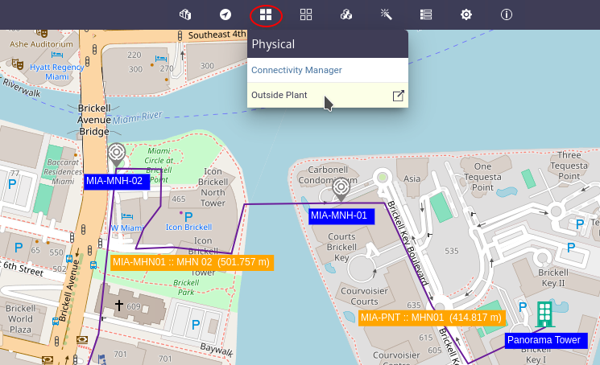

# Outside Plant Management

The outside plant module manages the OSP views which are composed of nodes and connections and are used to represent the network.

|  |
|:--:|
| ***Figure 1.** Outside plant module* |

|  |
|:--:|
| ***Figure 2.** Toolbar* |

| Tool | Description |
| -- | -- |
|  | Open properties panel |
|  | Open an existing OSP View |
|  | Create an OSP View |
|  | Delete OSP View |
|  | Save OSP View |
|  | Select a node or connection |
|  | Add node |
|  | Add connections between two nodes using the existing containers |
|  | Connect two nodes using a container |
|  | Run a container through a single or multiple containers |
|  | Run a link through a single or multiple containers |
|  | Searches for a node or connection within the view |
|  | Filter the nodes by class |
|  | Measure distance |

## Customize the Map

Some characteristics of the map can be changed using the [configuration variables](../../settings/configuration/variables/index.html) below are the changes enabled for the user.

### Map Provider

By default the map is displayed using [OpenLayers](https://openlayers.org/) and the Open Street Map (OSM) tiled layer, to use a different map provider you must update the value of the configuration variable `general.maps.provider` to one of the following allowed values:

* com.neotropic.kuwaiba.modules.commercial.ospman.providers.ol.osm.OsmProvider
* com.neotropic.kuwaiba.modules.commercial.ospman.providers.ol.bmaps.BmapsProvider
* com.neotropic.kuwaiba.modules.commercial.ospman.providers.google.GoogleMapsMapProvider

> **Note:** The *BmapsProvider* and *GoogleMapsMapProvider* require the value of the configuration variable `general.maps.apiKey` to be set.

In addition to the listed providers, it is possible to extend the functionality of this module to use other providers such as [Leaflet](https://leafletjs.com/).

### Map Center and Zoom

When you enter the module, the map has a center and zoom by default, this behavior can be changed by updating the configuration variables:

* `widgets.simplemap.centerLatitude` The default center latitude.
* `widgets.simplemap.centerLongitude` The default center longitude.
* `widgets.simplemap.zoom` The default map zoom.

### Map Labels

To change the color or fill color of the labels of the nodes or edges, the following configuration variables are used:

* `module.ospman.colorForLabels` The color for the map labels.
* `module.ospman.fillColorForEdgeLabels` The fill color for the map edge labels.
* `module.ospman.fillColorForNodeLabels` The fill color for the map node labels.
* `module.ospman.fillColorForSelectedEdgeLabels` The fill color for the map selected edge labels.
* `module.ospman.fillColorForSelectedNodeLabels` The fill color for the map selected node labels.
* `module.ospman.fontSizeForLabels` The font size for the map labels.
* `module.ospman.minZoomForLabels` The minimum zoom level for the map when displaying.

### Default Values of Configuration Variables

The default values ​​of the configuration variables used by this module are listed below by pool:

* General

  * `general.maps.provider` *com.neotropic.kuwaiba.modules.commercial.ospman.providers.ol.osm.OsmProvider*
  * `general.maps.apiKey` *API-KEY*
  * `general.maps.language` *english*

* Widgets
  * `widgets.simplemap.centerLatitude` *30.5632664*
  * `widgets.simplemap.centerLongitude` *-46.6540234*
  * `widgets.simplemap.zoom` *4*

* Outside Plant
  * `module.ospman.colorForLabels` *white*
  * `module.ospman.fillColorForEdgeLabels` *orange*
  * `module.ospman.fillColorForNodeLabels` *blue*
  * `module.ospman.fillColorForSelectedEdgeLabels` *pink*
  * `module.ospman.fillColorForSelectedNodeLabels` *orange*
  * `module.ospman.fontSizeForLabels` *12px*
  * `module.ospman.minZoomForLabels` *12*
