# Physical Connections

The physical connections module registers [basic actions][basic-actions], [advanced actions][advanced-actions] and [views][views] that allow the creation of physical connections (optical, electrical and power-related) using the [Object Options Panel][object-options-panel].

[basic-actions]: #basic-actions
[advanced-actions]: #advanced-actions
[views]: #views
[object-options-panel]: ../../navman/index.html#object-options-panel

## Basic Actions

### Delete Physical Container

> Applies to objects of class or subclass `GenericPhysicalContainer`

A physical container from the perspective of an FTTH network could be an indoor, outdoor or drop cable, in the [Data Model Manager][dmman] Figure 1 it is represented as a `WireContainer`, for a wireless network a `WirelessContainer` contains a set of radio links.

[dmman]: ../../dmman/index.html

| 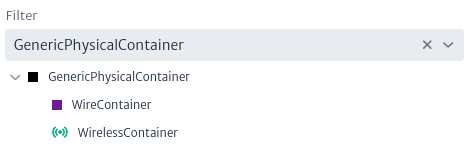 |
|:--:|
| ***Figure 1.** Subclasses GenericPhysicalContainer* |

The delete physical containers action is only available for subclass instances of `GenericPhysicalContainer` as shown in Figure 2.

| 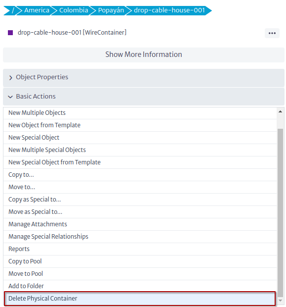 |
|:--:|
| ***Figure 2.** Delete physical container action* |

To delete a physical container click on the action and click on the OK button Figure 3.

| 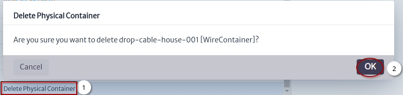 |
|:--:|
| ***Figure 3.** Delete physical container* |

### Delete Physical Link

> Applies to objects of class or subclass `GenericPhysicalLink`

A physical link from an FTTH perspective is the fiber in the [Data Model Manager][dmman] is represented by the `OpticalLink` class Figure 4, for wireless networks the `RadioLink` class is used.

| 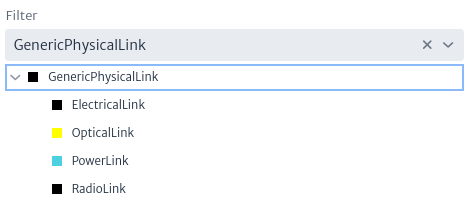 |
|:--:|
| ***Figure 4.** Subclasses GenericPhysicalLink* |

The delete physical link action is only available for subclass instances of `GenericPhysicalLink` as shown in Figure 5.

| 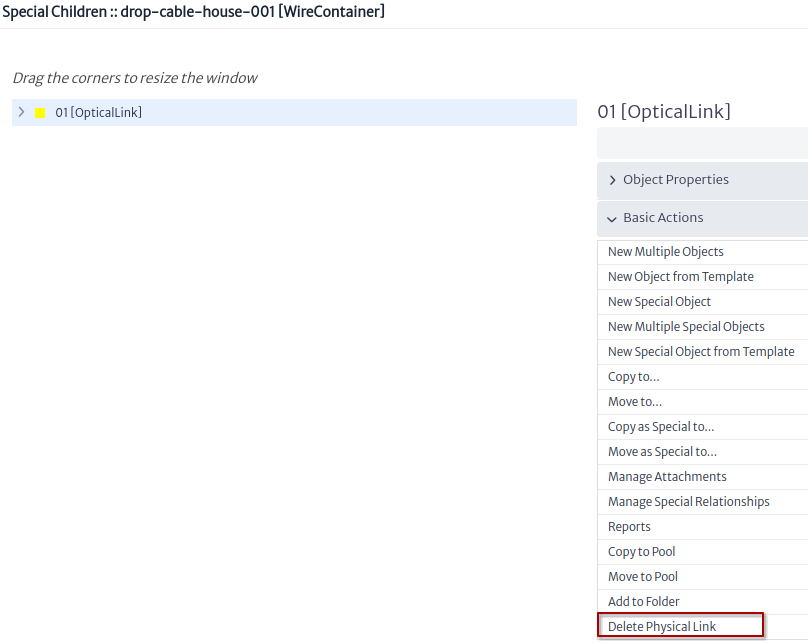 |
|:--:|
| ***Figure 5.** Delete physical link action* |

To delete a physical link click on the action and click on the OK button Figure 6.

| 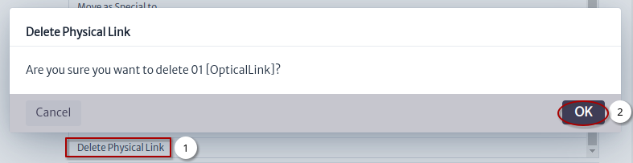 |
|:--:|
| ***Figure 6.** Delete physical link* |

## Advanced Actions

### Manage Port Mirroring

> Applies to objects of class or subclass `GenericPort`, `GenericDistributionFrame`, `GenericSplicingDevice`, `Antenna`

Mirroring in Kuwaiba means creating `mirror` or `mirrorMultiple` relationships between ports, below are some uses of this action for different classes:

* When we execute this action from one of the subclasses of `GenericPort` Figure 7 only a `mirror` or `mirrorMultiple` relationship will be created from one port to another port.

| 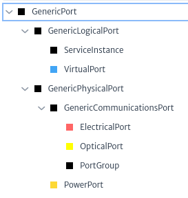 |
|:--:|
| ***Figure 7.** Subclasses GenericPort* |

Figure 8 shows the flow to mirror an `OpticalPort`

| 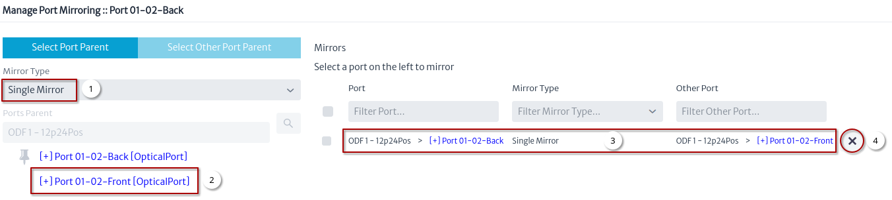 |
|:--:|
| ***Figure 8.** Manage port mirroring OpticalPort* |

1. Select the type of single mirror or multiple mirror.
2. Select the other port.
3. Once the other port is selected it should appear in the mirrors.
4. Used to remove the mirror.

* When we execute this action from one of the subclasses of `GenericDistributionFrame` Figure 9 create `mirror` or `mirrorMultiple` relationships.

| 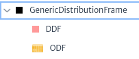 |
|:--:|
| ***Figure 9.** Subclasses GenericDistributionFrame* |

Figure 10 shows the flow to mirror an `ODF`

| 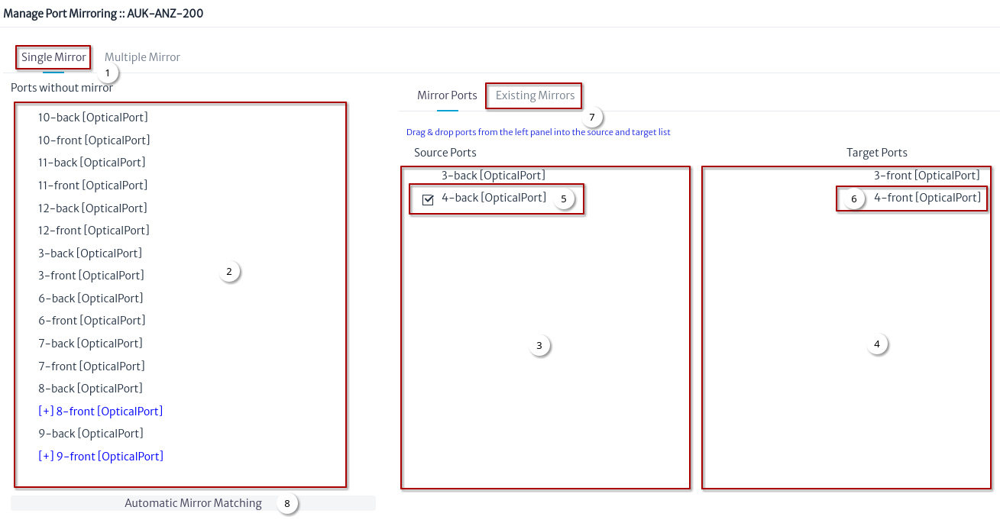 |
|:--:|
| ***Figure 10.** Manage port mirroring ODF* |

1. Select the type of mirror.
2. Drag a port.
3. Drop on source ports.
4. Drag other port and drop on target ports.
5. Select a source port.
6. Select a target port.
7. Click on existing mirror Figure 11.
8. Automatic mirror matching Figure 12.

| 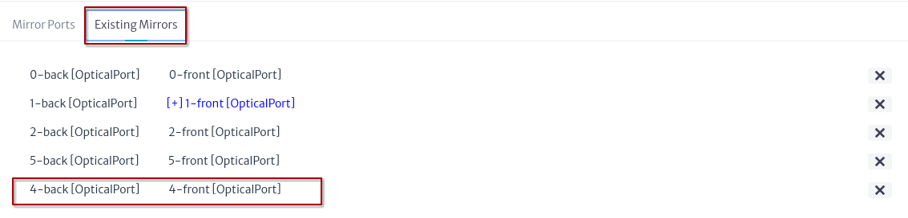 |
|:--:|
| ***Figure 11.** Existing mirrors ODF* |

| 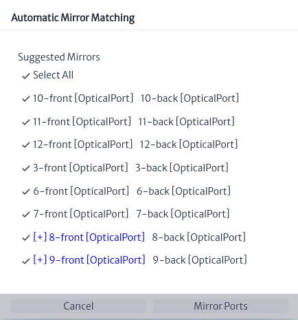 |
|:--:|
| ***Figure 12.** Automatic mirror matching ODF* |

### Port Summary

> Applies to objects of class or subclass `GenericCommunicationsElement`, `GenericDistributionFrame`, `GenericSplicingDevice`

Shows how the ports are connected within the device, the IP address and assigned services if they exist. Figure 13 shows the flow to execute the action.

| 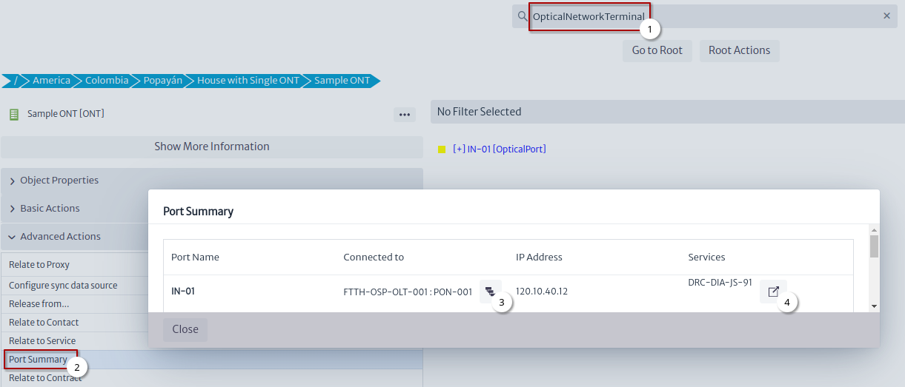 |
|:--:|
| ***Figure 13.** Port summary ONT* |

1. Search for an `OpticalLineTerminal` or any of the classes in which this action can be applied.
2. Click on the Port Summary action.
3. [Physical Path][physical-path-view] ONT port Figure 14.
4. Object dashboard ONT port service Figure 15.

| 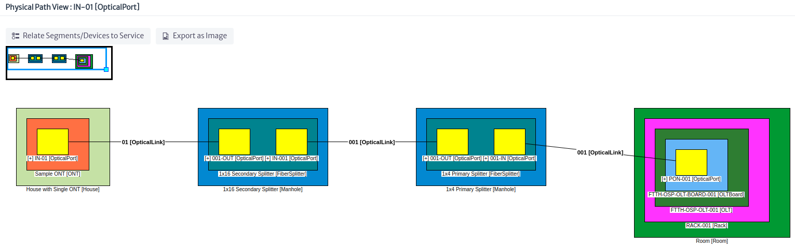 |
|:--:|
| ***Figure 14.** Physical path ONT port* |

| 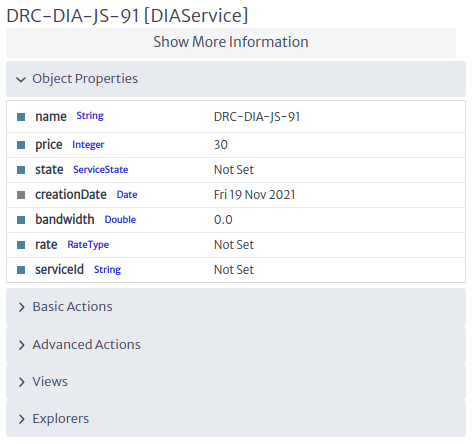 |
|:--:|
| ***Figure 15.** Object dashboard ONT port service* |

### Edit Connections

> Applies to objects of class or subclass `GenericPhysicalConnection`

### Connect Using a Link

> Applies to objects of class or subclass `GenericPort`

### Connect Using a Container

> Applies to objects of class or subclass `GenericLocation`, `GenericDistributionFrame`, `GenericSplicingDevice`

## Views

All views registered by this module were detailed in the navigation module:

* [Object View][object-view]
* [Rack View][rack-view]
* [Fiber Splitter View][fiber-splitter-view]
* [Splice Box View][splice-box-view]
* [Physical Path View][physical-path-view]
* [Physical Tree View][physical-tree-view]

[object-view]: ../../navman/index.html#object-view
[rack-view]: ../../navman/index.html#rack-view
[fiber-splitter-view]: ../../navman/index.html#fiber-splitter-view
[splice-box-view]: ../../navman/index.html#splice-box-view
[physical-path-view]: ../../navman/index.html#physical-path-view
[physical-tree-view]: ../../navman/index.html#physical-tree-view
