# Physical Connections Module

The physical connections module registers basic actions, advanced actions and views that allow the creation of physical connections (optical, wireless, electrical and power-related) using the [Object Options Panel][object-options-panel]. In this chapter the following topics will be addressed:

* [Physical Connections](#physical-connections)
* [Basic Actions](#basic-actions)
  * [Delete Physical Container](#delete-physical-container)
  * [Delete Physical Link](#delete-physical-link)
* [Advanced Actions](#advanced-actions)
  * [Manage Port Mirroring](#manage-port-mirroring)
  * [Port Summary](#port-summary)
  * [Edit Connections](#edit-connections)
  * [Connect Using a Link](#connect-using-a-link)
  * [Connect Using a Container](#connect-using-a-container)
  * [Views](#views)

## Physical Connections

The Physical Connections toolkit is tightly integrated to the Physical Connections module. With Kuwaiba you can create physical layer connections using cables, fiber optics or radio links very easily, navigate through the connections and inspect the resources in use.

Before presenting the tools provided by the application, let’s first clarify and introduce some
concepts. This module deals solely with L1 topologies. It’s only about cables, ports, etc. The data
model provides four types of entities to represent physical layer elements:

* **Links:** These are all physical connections that connect two ports. In the current data model, there are three types of connections: `ElectricalLink` (for electrical connections like coaxial, twisted pairs and the like), `OpticalLink` (for fiber optics), `RadioLink` (for radio links -Microwave links, mostly-) and `PowerLink` (for electrical power connections AC/DC). You can create new types by adding subclasses to the abstract class `GenericPhysicalLink` [Figure 1][figure-1]. See [Data Model Manager][dmman].

| ![Links in data model][figure-1] |
|:--:|
| ***Figure 1.** Links in data model* |

[figure-1]: images/figure-generic-physical-link.png

* **Containers:** All objects that can be used to contain, wrap and protect links (understanding Link as defined above). There are two types of containers: `WireContainer` (used to contain
all kind of cables -wires and fibers-, like pipes, conduits, ditches, etc) and `WirelessContainer` (used to contain radio channels or carriers). You can create new types by adding subclasses to the abstract class `GenericPhysicalContainer` [Figure 2][figure-2].

| ![Containers in data model][figure-2] |
|:--:|
| ***Figure 2.** Containers in data model* |

[figure-2]: images/figure-generic-physical-container.png

* **Nodes:** These objects are endpoints to Containers. In the default data model you will find classes like: `Tower`, `Facility`, `Shelter`, `Building`, `Floor` and `Room`, but in general, any inventory object can be a Node [Figure 3][figure-3].

> **Note:** In versions prior to 1.5, only subclasses of `GenericPhysicalNode` could be nodes.

| ![Nodes in data model][figure-3] |
|:--:|
| ***Figure 3.** Nodes in data model* |

[figure-3]: images/figure-generic-physical-node.png

* **Endpoints:** These objects are endpoints to Links. In practice, they’re always some kind of Port (in the data model context, this means all subclasses of GenericPort) [Figure 4][figure-4].

| ![Endpoints in data model][figure-4] |
|:--:|
| ***Figure 4.** Endpoints in data model* |

[figure-4]: images/figure-generic-physical-port.png

In summary, you can only connect Nodes using Containers and Endpoints using Links. To create new connections, open the [Object View][object-view] of an element and try to connect the desired nodes. For example, [Figure 5][figure-5] shows two nodes objects of the class `Manhole` and a container object of the class `WireContainer`.

| ![Manholes connected by a pipe][figure-5] |
|:--:|
| ***Figure 5.** Manholes connected by a pipe* |

[figure-5]: images/figure-manholes.png

On the left side of [Figure 6][figure-6] shows the interior of the pipe from [Figure 5][figure-5] that contains containers and links where the orange containers are tube bundle, the red containers the tubes and inside the tubes the cables. The right side of [Figure 6][figure-6] shows an enlarged view of the cable that contains the loose tubes that in turn contain the fibers.

| ![Pipe][figure-6] |
|:--:|
| ***Figure 6.** Pipe* |

[figure-6]: images/figure-pipe.png

[Figure 5][figure-5] and [Figure 6][figure-6] show three of the four elements of a physical connection.

There are three options to create physical connections in the inventory:

* [Outside Plant module](../ospman/index.html)
* [Connectivity Manager module](../connectivityman/index.html)
* Using the [basic actions][basic-actions], [advanced actions][advanced-actions] and [views][views] that allow the creation of physical connections (optical, electrical and power-related) using the [Object Options Panel][object-options-panel].

[basic-actions]: #basic-actions
[advanced-actions]: #advanced-actions
[views]: #views
[object-options-panel]: ../../navman/index.html#object-options-panel

For this example, the tools enabled by this module will be used. Using the [navigation module](../../navman/index.html), a city and two manholes are created, which will store splice box each.

| ![New city][figure-7] |
|:--:|
| ***Figure 7.** New city* |

[figure-7]: images/figure-new-city.png

Using the [object view][object-view] the pipe will be created between the two manholes using the connect tool ![Connect tool][tool-connect].

[tool-connect]: images/tool-connect.png

| ![New pipe][figure-8] |
|:--:|
| ***Figure 8.** New pipe* |

[figure-8]: images/figure-new-pipe.png

Select the pipe in the [object view][object-view], using the [object options panel][object-options-panel] create a tube bundle as a special child, open the special children explorer and create the necessary containers and fibers [Figure 9][figure-9].

| ![New pipe special children][figure-9] |
|:--:|
| ***Figure 9.** New pipe special children* |

[figure-9]: images/figure-special-children-new-pipe.png

Select the pipe in the [object view][object-view] and use the [edit connections action](#edit-connections) in the [object options panel][object-options-panel] to connect fibers to endpoints [Figure 10][figure-10].

| ![Connecting endpoints][figure-10] |
|:--:|
| ***Figure 10.** Connecting endpoints* |

[figure-10]: images/figure-endpoints.png

Using the navigation module will mirror the ports in the splice box [Figure 11][figure-11] using the [manage port mirroring](#manage-port-mirroring) action.

| ![Mirroring][figure-11] |
|:--:|
| ***Figure 11.** Mirroring* |

Using the splice box view we can see the connected fibers [Figure 12][figure-12]

[figure-11]: images/figure-mirroring.png

| ![Splice box view][figure-12] |
|:--:|
| ***Figure 12.** Splice box view* |

[figure-12]: images/figure-splice-box-view.png

To view more details of the connection, select one of the splice box ports in the navigation module and open the physical path view [Figure 13][figure-13].

| ![Physical path view][figure-13] |
|:--:|
| ***Figure 13.** Physical path view* |

[figure-13]: images/figure-physical-path.png

Once the port connections are made, we have all the elements of a physical connection: the links (OpticalLinks), containers (WireContainers -pipes, tube bundle, tubes, cables, loose tubes-), the endpoints (OpticalPorts) and the nodes (Manholes).

## Basic Actions

### Delete Physical Container

> Applies to objects of class or subclass `GenericPhysicalContainer`

A physical container from the perspective of an FTTH network could be an indoor, outdoor or drop cable, in the [Data Model Manager][dmman] Figure 14 it is represented as a `WireContainer`, for a wireless network a `WirelessContainer` contains a set of radio links.

[dmman]: ../../dmman/index.html

|  |
|:--:|
| ***Figure 14.** Subclasses GenericPhysicalContainer* |

The delete physical containers action is only available for subclass instances of `GenericPhysicalContainer` as shown in Figure 15.

|  |
|:--:|
| ***Figure 15.** Delete physical container action* |

To delete a physical container click on the action and click on the OK button Figure 16.

|  |
|:--:|
| ***Figure 16.** Delete physical container* |

### Delete Physical Link

> Applies to objects of class or subclass `GenericPhysicalLink`

A physical link from an FTTH perspective is the fiber in the [Data Model Manager][dmman] is represented by the `OpticalLink` class Figure 17, for wireless networks the `RadioLink` class is used.

|  |
|:--:|
| ***Figure 17.** Subclasses GenericPhysicalLink* |

The delete physical link action is only available for subclass instances of `GenericPhysicalLink` as shown in Figure 18.

|  |
|:--:|
| ***Figure 18.** Delete physical link action* |

To delete a physical link click on the action and click on the OK button Figure 19.

|  |
|:--:|
| ***Figure 19.** Delete physical link* |

## Advanced Actions

### Manage Port Mirroring

> Applies to objects of class or subclass `GenericPort`, `GenericDistributionFrame`, `GenericSplicingDevice`, `Antenna`

Mirroring in Kuwaiba means creating `mirror` or `mirrorMultiple` relationships between ports, below are some uses of this action for different classes:

* When we execute this action from one of the subclasses of `GenericPort` Figure 20 only a `mirror` or `mirrorMultiple` relationship will be created from one port to another port.

|  |
|:--:|
| ***Figure 20.** Subclasses GenericPort* |

Figure 21 shows the flow to mirror an `OpticalPort`

|  |
|:--:|
| ***Figure 21.** Manage port mirroring OpticalPort* |

1. Select the type of single mirror or multiple mirror.
2. Select the other port.
3. Once the other port is selected it should appear in the mirrors.
4. Used to remove the mirror.

* When we execute this action from one of the subclasses of `GenericDistributionFrame` Figure 22 create `mirror` or `mirrorMultiple` relationships.

|  |
|:--:|
| ***Figure 22.** Subclasses GenericDistributionFrame* |

Figure 23 shows the flow to mirror an `ODF`

|  |
|:--:|
| ***Figure 23.** Manage port mirroring ODF* |

1. Select the type of mirror.
2. Drag a port.
3. Drop on source ports.
4. Drag other port and drop on target ports.
5. Select a source port.
6. Select a target port.
7. Click on existing mirror Figure 24.
8. Automatic mirror matching Figure 25.

|  |
|:--:|
| ***Figure 24.** Existing mirrors ODF* |

|  |
|:--:|
| ***Figure 25.** Automatic mirror matching ODF* |

### Port Summary

> Applies to objects of class or subclass `GenericCommunicationsElement`, `GenericDistributionFrame`, `GenericSplicingDevice`

Shows how the ports are connected within the device, the IP address and assigned services if they exist. Figure 26 shows the flow to execute the action.

|  |
|:--:|
| ***Figure 26.** Port summary ONT* |

1. Search for an `OpticalLineTerminal` or any of the classes in which this action can be applied.
2. Click on the Port Summary action.
3. [Physical Path][physical-path-view] ONT port Figure 27.
4. Object dashboard ONT port service Figure 28.

|  |
|:--:|
| ***Figure 27.** Physical path ONT port* |

|  |
|:--:|
| ***Figure 28.** Object dashboard ONT port service* |

### Edit Connections

> Applies to objects of class or subclass `GenericPhysicalConnection` Figure 29

| 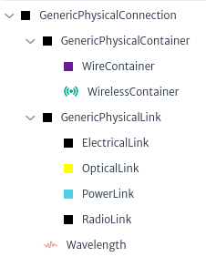 |
|:--:|
| ***Figure 29.** Subclasses GenericPhysicalConnection* |

To execute the action, look for an object that is a subclass `GenericPhysicalConnection` select it and click on the action Edit Connections Figure 30.

| 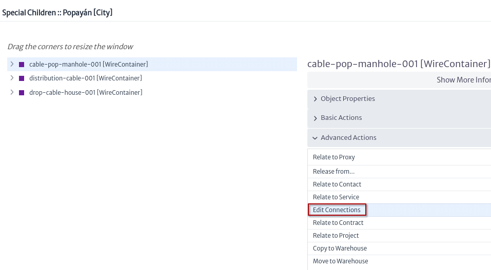 |
|:--:|
| ***Figure 30.** Edit connections action* |

A window appears, the flow to edit a connection is shown in Figure 31.

| 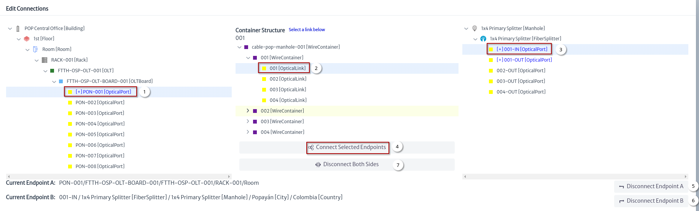 |
|:--:|
| ***Figure 31.** Edit connections window* |

1. Select the endpoint A.
2. Select a link.
3. Select the endpoint B.
4. Click on the button Connect Selected Endpoints to the link.
5. Disconnect only the endpoint A of the link.
6. Disconnect only the endpoint B of the link.
7. Disconnect the endpoint A and the endpoint B of the link.

### Connect Using a Link

> Applies to objects of class or subclass `GenericPort` Figure 32.

|  |
|:--:|
| ***Figure 32.** Subclasses GenericPort* |

To execute the action, look for an object that is a subclass `GenericPort` select it and click on the action `Connect to...` Figure 33.

| 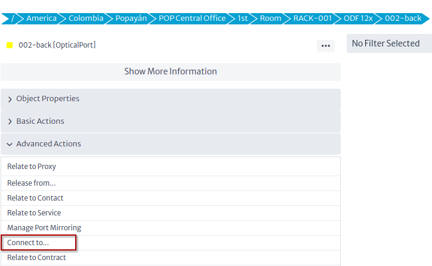 |
|:--:|
| ***Figure 33.** Connect using link action* |

In this example we will connect the port of an ODF with a port of an OLT, for this we must select the target port Figure 34.

| 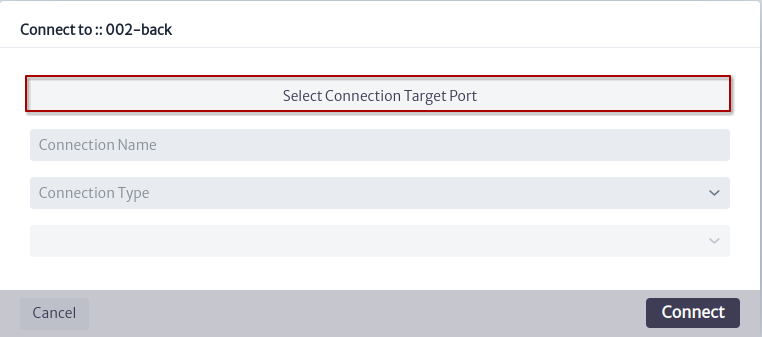 |
|:--:|
| ***Figure 34.** Connect using link new window* |

Figure 35 shows the steps to find the OLT port to connect.

| 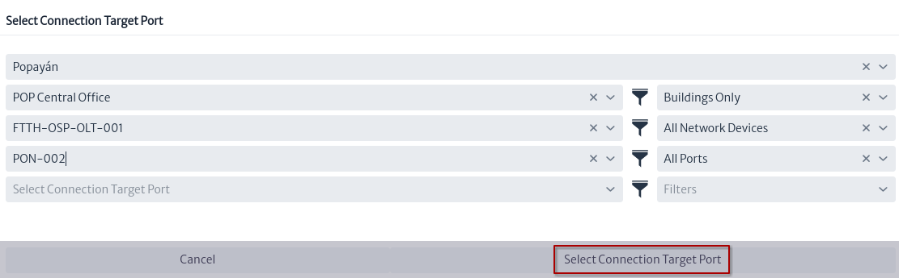 |
|:--:|
| ***Figure 35.** Select connection target port window* |

Once the target port is selected, we use the suggested connection name and click on the `Connect` button.

| 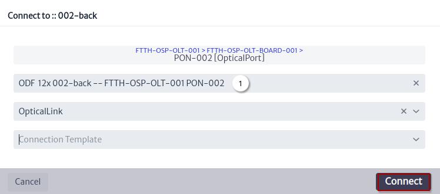 |
|:--:|
| ***Figure 36.** Connect using link window* |

1. Suggested connection name.

Figure 37 shows the new link using the [physical path view][physical-path-view] for the ODF port.

| 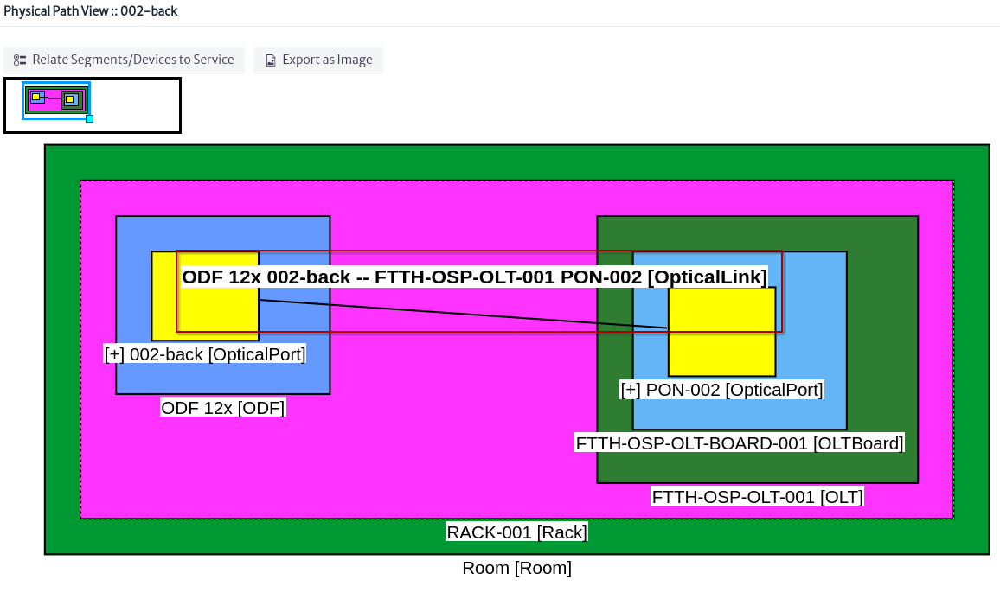 |
|:--:|
| ***Figure 37.** New link in physical path* |

### Connect Using a Container

> Applies to objects of class or subclass `GenericLocation` Figure 38, `GenericDistributionFrame` or `GenericSplicingDevice`

| 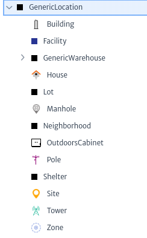 |
|:--:|
| ***Figure 38.** Subclasses GenericLocation* |

To execute the action, look for an object that is a subclass `GenericLocation`, `GenericDistributionFrame` or`GenericSplicingDevice` select it and click on the action `Connect to...` Figure 39.

| 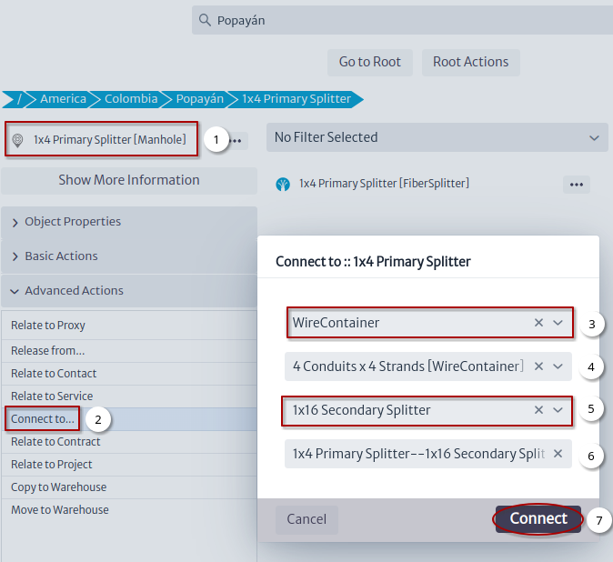 |
|:--:|
| ***Figure 39.** Connect using container action* |

1. Select an object.
2. Click on the `Connect to...` action.
3. Select connection type.
4. Optional select a template for the connection.
5. Select the other end of the connection.
6. Suggested connection name.
7. Click on the `Connect` button that will create the connection and open the window in Figure 40.

| 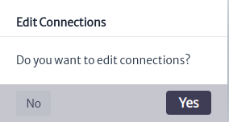 |
|:--:|
| ***Figure 40.** Edit connections new container window* |

If you click on the OK button, the window to [edit connections][edit-connections] will open Figure 41.

[edit-connections]: #edit-connections

| 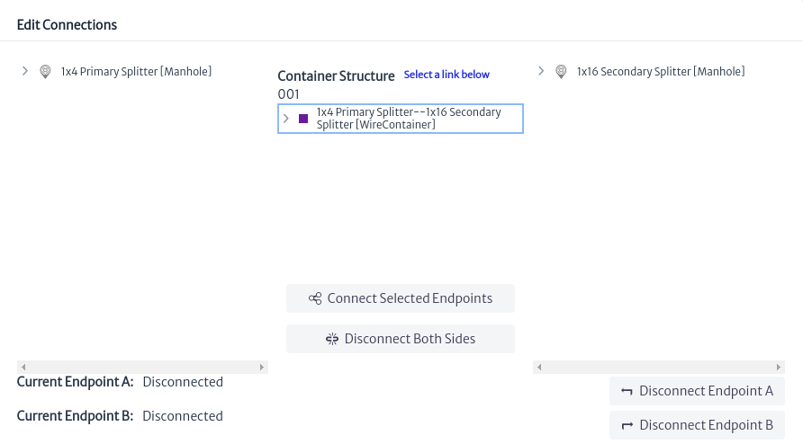 |
|:--:|
| ***Figure 41.** New container in edit connection window* |

## Views

All views registered by this module were detailed in the navigation module:

* [Object View][object-view]
* [Rack View][rack-view]
* [Fiber Splitter View][fiber-splitter-view]
* [Splice Box View][splice-box-view]
* [Physical Path View][physical-path-view]
* [Physical Tree View][physical-tree-view]

[object-view]: ../../navman/index.html#object-view
[rack-view]: ../../navman/index.html#rack-view
[fiber-splitter-view]: ../../navman/index.html#fiber-splitter-view
[splice-box-view]: ../../navman/index.html#splice-box-view
[physical-path-view]: ../../navman/index.html#physical-path-view
[physical-tree-view]: ../../navman/index.html#physical-tree-view
