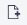
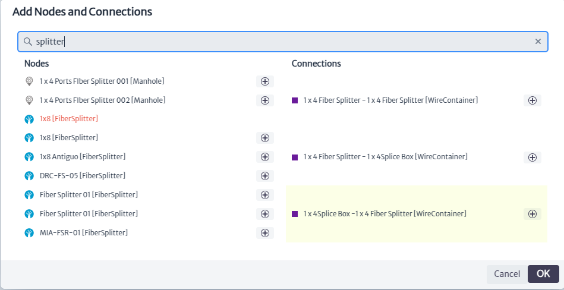
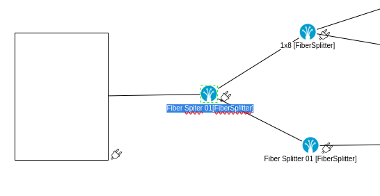
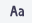

# Topology Designer

The topology designer is an integrated tool in Kuwaiba that allows you to sketch networks using the elements created in the application's inventory.

The topology designer module, shown in Figure 1, belongs to the **Planning** category.

|  |
|:--:|
| ***Figure 1.** Topology designer module* |

Once opened, we will see the main window of the module, as shown in Figure 2. From here we can see the canvas to design topologies.

||
|:--:|
| ***Figure 2.** Tasks manager main window* |

To design topologies, the module offers various tools, which can be found in the toolbar located at the top of the canvas, as shown in Figure 3.

||
|:--:|
| ***Figure 3.** Topology designer tools* |

You will also find the properties panel on the right side of the canvas, which allows you to interact with the topology objects, as shown in Figure 4.

||
|:--:|
| ***Figure 4.** Properties panel* |

## Creating A Topology

To create a topology, we will use a simplified GPON network as a reference, as shown in Figure 5. In this network, we have a central office where the OLT will be located, a primary splitter, and a secondary splitter, to which the client's ONT and internal network will be connected.

||
|:--:|
| ***Figure 5.** Topology view diagram* |

To start, you must create a **topology view using** the  button. The window shown in Figure 6 will open. Enter the name and description, then click *OK*.

||
|:--:|
| ***Figure 6.** Window create topology view* |

When you create a view, you can see and edit its properties in the properties panel, as shown in Figure 7.

||
|:--:|
| ***Figure 7.** View properties* |

Use the  button to add inventory elements to the canvas, as shown in Figure 8.

||
|:--:|
| ***Figure 8.** Add nodes window* |

Enter the name or type of the elements you want to add to the view. The inventory elements that match your search will be displayed. In this case, we will start by searching for fiber splitters seen in the diagram in Figure 5, as shown in Figure 9.

||
|:--:|
| ***Figure 9.** Search elements* |

Click onto add the element to the canvas, as shown in Figure 10.

||
|:--:|
| ***Figure 10.** New element* |

When you hover over the element, it will change as shown in Figure 11. By clicking and dragging, you can position the element anywhere on the canvas you desire.

||
|:--:|
| ***Figure 11.** Cursor action* |

Similarly, when you click on the element, the available actions will be displayed in the properties panel, as shown in Figure 12.

 ||
|:--:|
| ***Figure 12.** Element actions* |

Continuing with the diagram, we add two fiber splitters. It is not possible to add elements that have already been added, which are represented in red, as shown in Figure 13.

||
|:--:|
| ***Figure 13.** Invalid element* |

Now we add the network users from the diagram, represented by houses and the building, searching for `House` and `Building` just as we did earlier with the fiber splitters, as shown in Figure 14.

||
|:--:|
| ***Figure 14.** Add new elements* |

Once all inventory elements are added, we position them on the canvas as seen in Figure 15.

||
|:--:|
| ***Figure 15.** Inventory elements* |

If you want to remove any element from the topology, select the element and click on thebutton to remove it from the canvas.

Next, to represent the central office in the diagram, we use the shapes provided by the module, as shown in Figure 16. There are options such as clouds, ellipses, and rectangles that are useful for representing network elements. For our case, we add a rectangle using, as seen in Figure 17.

||
|:--:|
| ***Figure 16.** Add shapes actions* |

||
|:--:|
| ***Figure 17.** Add shape* |

By clicking on the shape we added, the properties panel will display available actions to customize the properties of the shapes according to our needs. Among these actions, you can modify the background color, outline color, thickness, type of outline, and more, as shown in Figure 18.

||
|:--:|
| ***Figure 18.** Shape properties* |

In addition to this, you can see guides appear to change the dimensions of the shape. When you hover over the element, it will change as shown in Figure 19. Click and drag to adjust it to the desired size.

||
|:--:|
| ***Figure 19.** Change shape size* |

To continue, we proceed to make connections between the elements. To do this, hold down and drag the cursor from the desired element's  icon. You will see a guide appear to make connections, as shown in Figure 20.

||
|:--:|
| ***Figure 20.** Connection guide* |

Drag the guide to the element to which you want to make the connection. The guide will change to indicate that the connection will be made, as shown in Figure 21. Release the cursor, and the connection will be complete.

||
|:--:|
| ***Figure 21.** Add connection* |

||
|:--:|
| ***Figure 22.** Connection done* |

By clicking on the connection, three guides will appear as shown in Figure 23. You can use the blue guides to change the connected elements or the yellow guide to relocate the label.

||
|:--:|
| ***Figure 23.** Connection Actions* |

Repeat the procedure above to make all the connections as shown in the diagram in Figure 5. This will give you the result shown in Figure 24.

||
|:--:|
| ***Figure 24.** Connections* |

To proceed, we edit the content of the labels for the connections and elements, and we add a label to the rectangle used to represent the central office.

To edit the content of the connection labels, double-click anywhere on the connection, which will select it as shown in Figure 24. We can edit its content; in this case, we leave it empty. Repeat this procedure for all connections.

||
|:--:|
| ***Figure 24.** Edit connection label* |

To edit the labels of the elements, double-click on them, which will select them as shown in Figure 25. Edit the labels following the diagram in Figure 5.

||
|:--:|
| ***Figure 25.** Edit element label* |

To add labels to the canvas, use the button . This will create a new label that you can place in the desired location and adjust its dimensions, as shown in Figure 26.

||
|:--:|
| ***Figure 26.** New label* |

Edit its content following the diagram, and finally, we obtain the final network diagram as shown in Figure 27.

||
|:--:|
| ***Figure 27.** Example* |

## Additional tools

Among the tools offered, we find the  button, which allows us to show or hide the grid on the canvas, as seen in Figure 27.

||
|:--:|
| ***Figure 27.** Grid* |

The button allows you to show or hide a thumbnail view of the entire canvas, as seen in Figure 28

||
|:--:|
| ***Figure 28.** Thumbnail* |

You can assign a background image to the topology using the [Create Topology Window](images/btn_background.png) button, which will display the window seen in Figure 29. This window allows you to clear the current background image and upload a new one.

||
|:--:|
| ***Figure 29.** Manage background* |

Once the topology is finished, you can use the  button to export it as an image.

## Topology Actions

You can use the  button to view and select available topologies in the application, as shown in Figure 30.

||
|:--:|
| ***Figure 30.** Topologies view* |

You can make copies of topologies using the  button. The copied topology will appear in the list of available topologies, as shown in Figure 31.

||
|:--:|
| ***Figure 31.** copy of the topology* |

To delete a topology, select it and use the  button, which will open the confirmation window shown in Figure 32. Click *OK* to delete it or *Cancel* if you do not wish to proceed.

||
|:--:|
| ***Figure 32.**delete topology window* |