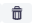
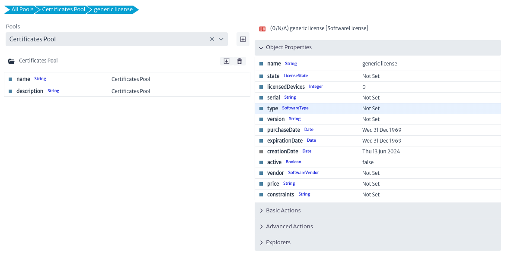

# Pools

The *Pools* module refers to a group of resources managed collectively to optimize their use and availability. In simple terms, a "pool" is a shared repository of similar resources that can be used by different parties or processes within a system and that cannot be placed in the standard navigation tree. Most of these resources are logical or administrative elements, such as VLANs or VPNs. You can imagine a pool as a bag where resources that do not have a specific place in the traditional structure are placed.

To open the *Pools* module, I selected *Options -> Pools* in the options menu.
||
|:--:|
| **Figure 1.** Pools module selection in the general menu |

Once the *Pools* module is opened, a new pool can be added. To do so, locate the *New Pool* button represented by the add symbol , as shown in the figure below.
||
|:--:|
| **Figure 2.** Creation of a new pool |

Once activated, the window will open to create a new pool. In the dialog box, you will be asked to enter the name of the new pool, its description, and the type of objects you want to store inside it. If you choose, for example, "Router", you can only store Router instances. However, if you select an abstract class (anything that begins with "Generic" or one of the parent classes such as InventoryObject or ViewableObject), you will be able to place instances of any of its subclasses.
||
|:--:|
| **Figure 3.** Dialog for creating a new pool |

Once created, you can edit the name and description of the pool attributes in the property sheet.
||
|:--:|
| **Figure 4.** Pool attributes |

To manage the new pool, use the buttons next to the pool name.
You can delete it with the  button or add a new item by clicking the add icon , as shown in the figure next.
||
|:--:|
| **Figure 5.** Creating a new element within a pool |

Once activated, the window will open to create a new item in a pool. In the dialog box, you will be asked to enter the name of the new item and select the type of object it represents.
||
|:--:|
| **Figure 6.** Dialog for creating a new pool item |

The new created item will appear on the right side of the screen as shown in the figure below
||
|:--:|
| **Figure 7.** New item created |

To modify the properties of the new item, click on its name. Its attributes will be displayed, as well as the associated actions and explorers, as shown in the figure below.
||
|:--:|
| **Figure 8.** New item properties |

Basic actions, such as delete to delete the selected item, advanced and explorers are described in the chapter [Object Dashboard](./dashboards/object/README.md). However, the actions shown in the image below are specific to this module and are described below.
||
|:--:|
| **Figure 9.** New item created |

| Action | description |
|--------------|------------------------------ --|
| **Copy to pools**| Copy the selected item to a new pool |
| **Move to pools**| Move the selected item to a new pool |