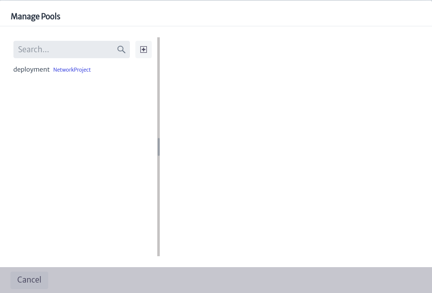
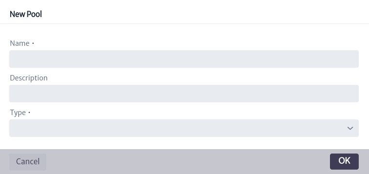
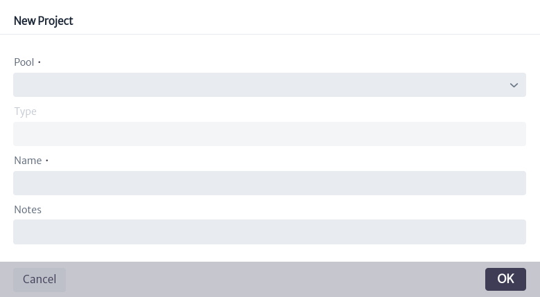
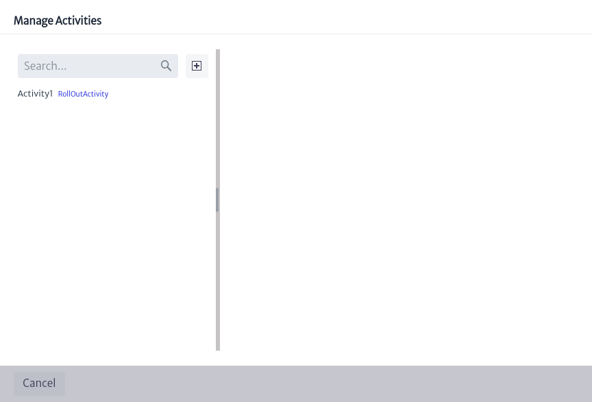
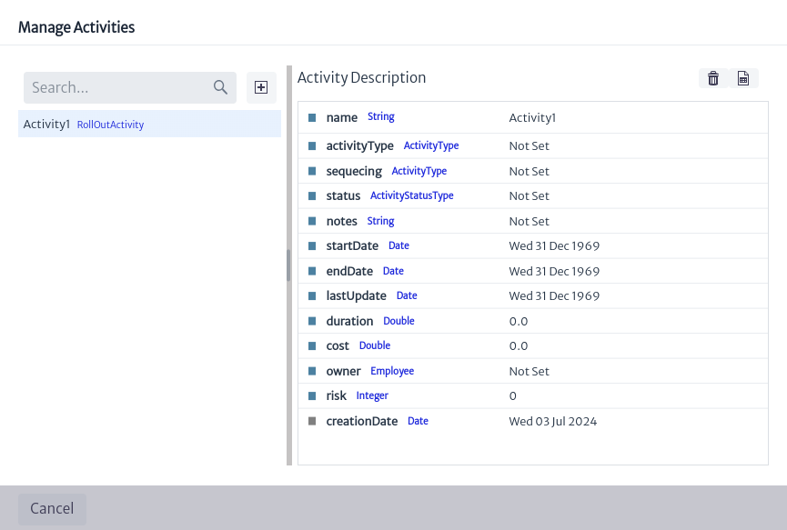
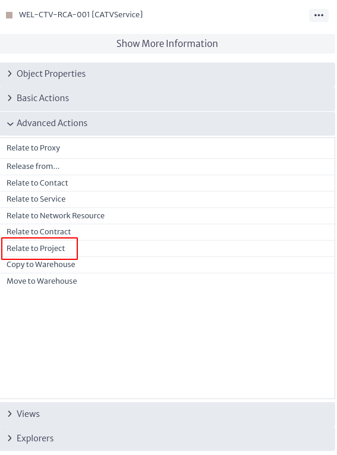

# Projects

The Project module allows you to manage all your projects (planning, maintenance, deployment, etc.), their activities and associated resources in one place. The current version of the module offers basic functionality, which will be extended in the future.

To access the project module, locate the icon  in the menu at the top of the screen. When clicked, a vertical menu will be displayed where the user can select the `Project Manager` option, which will direct the user to the interface shown in Figure 2.

|  |
| :--: |
| ***Figure 1.** Access to the projects module.* |

|  |
| :--: |
| ***Figure 2.** Projects module.* |

In Figure 2, a list of all existing projects should be displayed, as there are currently no projects in the inventory, the message `There are no projects so far` is displayed.

To create a project, you must first identify or create a pool. A pool is like a bag that can contain one or more projects (see more in [Pools chapter][pools]). To create a pool or modify existing pools, select the icon  which will open a new pop-up window like the one shown in Figure 3.

|  |
| :--: |
| ***Figure 3.** Management of project pools.* |

Figure 3 shows a list of all existing project pools. You can use the search bar to find pools matching specific terms. When you select a pool, the related information, such as name, description and list of contained projects, will appear on the right side of the window. Here, you can change the name or description of the pool by double-clicking on the property you want to change. In addition, you can delete the pool by clicking the button , which will also delete the projects contained in the selected pool.

|  |
| :--: |
| ***Figure 4.** Management of selected pool.* |

To create a new pool, select the icon  shown in Figure 3. This will open a window like the one shown in Figure 5, where you can name, describe and select the type of pool to create. There are two types of project pools: `GeneralPurposeProject` and `NetworkProject`.

|  |
| :--: |
| ***Figure 5.** Create a pool.* |

To create a project, select the icon  which opens a pop-up window like the one shown in Figure 6, where you must select an existing Project Pool, the project name and you can add a description to it.

|  |
| :--: |
| ***Figure 6.** Create a project.* |

The created project is added to the list of projects shown in Figure 2. Selecting a specific project in Figure 7 will display the information related to that project, as indicated in Figure 8 and explained below.

* **name.** Project name.
* **startDate.** Project start date. Default is `Wed 31 Dec 1969`.
* **status.** Project status. This attribute is a list type attribute (for more information see chapter [List Type Manager][list_type_manager]).
* **notes.** Additional information that the user adds about the project.
* **projectManager.** Person in charge of the project.
* **creationDate.** Date of creation of the project.

|  |
| :--: |
| ***Figure 7.** List of projects.* |

|  |
| :--: |
| ***Figure 8.** Project information.* |

In the upper right part of Figure 8, there are 6 buttons, which are detailed below.

|  |
| :--: |
| ***Figure 9.** Project options.* |

* The button  deletes a project.
* The icon  controls the project activities. When selecting this button, a window like the one shown in Figure 10 appears.
  
    |  |
    | :--: |
    | ***Figure 10.** Project activity manager.* |

    To create a new project activity, select the  icon displayed in Figure 10. This will open the window illustrated in Figure 11, where you can add the name of the activity and select its type, which can be `AuditActivity`, `DesignActivity`, `GeneralPurposeActivity`, `PlanningActivity` or `RollOutActivity`.

    After creating the activity, all activities will be listed as shown in Figure 11. When selecting an activity, the associated information will be displayed on the right side of the screen. To modify any of the attributes, you can double-click on the attribute you want to change.

    |  |
    | :--: |
    | ***Figure 11.** Project activities.* |

  * **name.** Name of project activity.
  * **activityType.** Type of activity.
  * **sequecing.** Activity number.
  * **status.** Activity status.
  * **notes.** Notes on the activity.
  * **startDate.** Start date of activity.
  * **endDate.** Date of completion of the activity.
  * **lastUpdate.** Date of last activity update
  * **duration.** Duration of the activity.
  * **cost.** Cost of the activity.
  * **owner.** Owner of the activity.
  * **risk.** Activity risk.
  * **creationDate.** Date of creation of the activity.

    In addition, a project activity can be deleted by selecting the icon  shown in Figure 11. You can also check if there are any reports related to that activity by clicking on the button .

* The icon  allows you to visualize the reports available for the projects.
* The button  displays information about the project object, i.e., its identifier, the class it belongs to and its content hierarchy.

    |  |
    | :--: |
    | ***Figure 12.** Project Object Information.* |

* The icon  allows you to copy the project to another project pool. To do this, selecting the button opens the window shown in Figure 13, where you can select the pool to which you want to copy the project.
  
    |  |
    | :--: |
    | ***Figure 13.** Copy project.* |

* The button  moves the project to another project pool by selecting the new pool, as indicated in Figure 14.

    |  |
    | :--: |
    | ***Figure 14.** Move project.* |

In Figures 13 and 14, you have the option to create a new project pool in case you do not want to select an existing one, to do so click on the icon  which opens the window presented in Figure 5.

In Figure 8, under the project information, there is the Related Resources section, which shows the list of objects related to the project. In this case, it is empty since there are no objects related to the project. To relate an object to an existing project, locate the Object Options Panel related to the object. In the Advanced Actions section, you will find the Relate to Project option, as illustrated in Figure 15.

|  |
| :--: |
| ***Figure 15.** Action to relate an object to a project.* |

When selecting the commented option, a new window appears (Figure 16), where the user can type the name of the project or select it from the drop-down list by clicking on the icon .

|  |
| :--: |
| ***Figure 16.** Project selection.* |

If you reload the project module and select the project again, it appears in the `Related Resources` section the related objects. To the right of each object there are 3 buttons.

|  |
| :--: |
| ***Figure 17.** Related resources to project.* |

* The button  opens the Object Dashboard in a new window (For more information see the [Navigation][navigation] chapter).
* The button  opens a window with the object's identifier, the class to which it belongs and its content hierarchy, as demonstrated in Figure 18.

    |  |
    | :--: |
    | ***Figure 18.** Object information.* |

* The icon  removes the relationship between the object and the project.

[pools]: ../pools/index.html
[list_type_manager]: ../administration/ltman/index.html
[navigation]: ../navman/index.html
