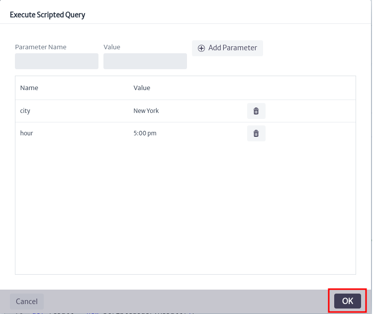

# Queries Manager
The *Query Manager* is a module designed for performing advanced searches based on nodes using the graphical interface. The search criteria can range from properties to relationships.

This module is part of the *Navigation* category, as shown in Figure 1.

||
|:--:|
| ***Figure 1.** Queries manager module* |

Once opened, we will see the main window of the module, as shown in Figure 2. From here you can create your queries and scripts to make queries.

||
|:--:|
| ***Figure 2.** Queries manager main window* |

The module allows us to perform queries in two ways: by creating a query through the graphical interface in **Query Builder** or through scripts in **Scripted Queries**.

## Using Query builder

This option allows us to create queries using the module's graphical interface. To start, locate *Query Builder* in the main window of the module, as shown in Figure 3. This option is selected by default when entering the module.

||
|:--:|
| ***Figure 3.** Query builder* |

To create a query, search for and select the class of the element you want to find, as shown in Figure 4. [Abstract classes](../dmman/README.MD) are supported.

||
|:--:|
| ***Figure 4.** Select class* |

Once the class is chosen, a graphical representation of it will be placed on the canvas, as seen in Figure 5. This search box is a representation of the class node and contains each attribute of the selected class.

||
|:--:|
| ***Figure 5.** Class selected* |

You can search for a wider range of elements by selecting an abstract class (often called *GenericSomething*). In the previous example, it will search for all *Racks* in the database, but if you choose *GenericPhysicalNode*, it will search for all physical nodes, that is, all objects that can be connected via a container (see the Physical Connections chapter for more information about containers). This includes: *buildings*, *rooms*, *floors*, *towers*, *shelters*, and *facilities*.

> **Important**
>- If you want to see all objects in the database (at least all relevant to the inventory) search for *InventoryObject*, which is the root of all classes related to the inventory. To see the complete hierarchy see related chapter [Data Model Manager](../dmman/README.MD)

When you select a class, the **Execute Query** button will be enabled, allowing you to run the query. If you run it at this moment, the system will return all elements of the selected class, paginated in sets of 10 results, showing only the object's name, as seen in Figure 6.

||
|:--:|
| ***Figure 6.** Executed query* |

Pressing the **Explore Object** button will open a pop-up with the object's basic data as seen in Figure 7.

||
|:--:|
| ***Figure 7.** Object properties* |

Setting other attributes in the search box as visible will result in those fields being displayed in the results window, as shown in Figure 8.

||
|:--:|
| ***Figure 8.** Visible properties* |

### Adding conditions

To perform more complex queries, you can add search conditions for any of the class attributes using the  button. There are two types of attributes: those stored directly in the class node, such as *name*, *id*, *creationDate*, etc. Called simple attributes, and attributes whose information is stored in a separate node, called **list type attributes** (See [list type attributes](../administration/ltman/README.MD) for details).

Clicking on the  button for a class attribute will open the window shown in Figure 9. Enter a filter type and the desired value, then click *OK*.

||
|:--:|
| ***Figure 9.** Window to add attribute* |

The available filter types depend on the data type of the attribute (String, Integer, etc.), as seen in the example in Figure 10 for String type attributes like *name*, or in Figure 11 for Integer type attributes like *rackUnits*.

||
|:--:|
| ***Figure 10.** Available string filters* |

||
|:--:|
| ***Figure 11.** Available int filters* |

For our example, we will search for *Racks* in the inventory that contain "01" in their name using the **Contains** filter from Figure 10 on the name attribute, and that have a capacity of 24 units using the **Equals to** filter from Figure 11 on the rackUnits attribute. By setting these conditions for the query, you can see their graphical representation next to the corresponding attribute in the search box, as shown in Figure 12. You can edit the filters using  or remove them using .

||
|:--:|
| ***Figure 12.** Filters selected* |

If we execute the query at this moment, we will not get the desired result as shown in Figure 13 because we need to consider how filters are applied in queries. This is similar to how it's handled in a conventional *SQL statement*. When we have more than two filters, we must select how they will be used in the query. We have logical operators **OR** and **AND**, which are equivalent to those used in SQL.

||
|:--:|
| ***Figure 13.** Query incomplete result* |

To adjust the behavior of the filters, we have the tools shown in Figure 14. From here, you can adjust the logical operator to use in the filters and the number of results the query will display.

||
|:--:|
| ***Figure 14.** Query filters* |

By default, the selected logical operator is **OR**, and the record limit is 10. In the case of our example, we select the logical operator **AND** and execute the query. The expected result can be seen in Figure 15.

||
|:--:|
| ***Figure 15.** Result filters* |

For list type attributes, when you click on the  button, the window shown in Figure 16 will open. For this example, we will use the *Router* class, which has list attributes such as *software version*, *model*, *state*,*vendor*. We will search for routers with the vendor Huawei.

||
|:--:|
| ***Figure 16.** List type attribute filter* |

For list type attributes, we have two filter options, **Select List Type Item** and **Advanced Search**. By default, Select List Type Item is selected. In this filter, we need to choose from the attribute's list types, as shown in Figure 17. For the vendor attribute, we select Huawei, and its result can be seen in Figure 18.

||
|:--:|
| ***Figure 17.** Available list types* |

||
|:--:|
| ***Figure 18.** List type Search result* |

If we select the **Advanced Search** filter, it will not be possible to select from the attribute's list types, as shown in Figure 19. Instead, we click the *OK* button.

||
|:--:|
| ***Figure 19.** Advanced search window* |

We will see that a graphical representation is immediately placed on the canvas, as shown in Figure 20. This search box represents the list type node and contains each of its attributes, similar to the search box for the selected class. As with the class, it is possible to add additional filters to the list type attributes, allowing for the creation of complex queries tailored to different scenarios.

||
|:--:|
| ***Figure 20.** Advanced search filter* |

Finally, when using the   button for the parent attribute, the window shown in Figure 21 will appear. This allows for a search considering the containment of the class. Refer to the [containment manager](../administration/containment/README.MD) for more details.

||
|:--:|
| ***Figure 21.** Select parent filter window* |

As an example, we will search for all *Routers* contained in the *ANZ Center* building, with the vendor *Cisco*, and whose serial number matches *NZV06*. To start, in the Router class, the containment classes *Building*, *Facility*, *Floor*, *Room*, and *Zone* are available according to its containment configuration. We choose the Building class as shown in Figure 22.

||
|:--:|
| ***Figure 22.** Select parent filter* |

We set the filters to *Contains* for both the building name and serial number, with the values *ANZ Center* and *NZV06*, respectively. For the vendor, we select *Cisco* and choose *AND* as the logical connector, as shown in Figure 23.

||
|:--:|
| ***Figure 23.** Advance query* |

When we execute the query, we obtain the desired routers as shown in Figure 24.

||
|:--:|
| ***Figure 24.** Advance query result* |

## Using Scripted Queries

This option allows us to create queries using Groovy scripts the creation of scripts is beyond the scope of this document; however, you can find more detail and examples in the scripts provided by the application. To start, locate **Scripted Builder** in the main window of the module, as shown in Figure 25.

||
|:--:|
| ***Figure 25.** Query builder* |

### Manage scripted query pools

Upon entering this option, you will see the available scripts grouped into pools. To begin, create a pool using thebutton. The window shown in Figure 26 will open; enter a name, description, and click *OK*.

||
|:--:|
| ***Figure 26.** Add pool window* |

Once the pool is created, it will appear in the list of available pools, as shown in Figure 27. Conversely, if you wish to delete a pool,  select it and use thebutton to delete it.

||
|:--:|
| ***Figure 27.** Pool lists* |

To edit the properties of a pool, use thebutton. The window shown in Figure 28 will appear, where you can edit the properties by double-clicking on the desired property.

||
|:--:|
| ***Figure 28.** Edit pool properties window* |

### Manage scripted query

To add a script, locate the desired pool and use thebutton. This will open the window shown in Figure 29. Enter a name, description, and click OK.

||
|:--:|
| ***Figure 29.** Add script window* |

Once the script is created, use thebutton to display the scripts associated with a pool, as shown in Figure 30.

||
|:--:|
| ***Figure 30.** Scripts in pool* |

Clicking on the script will display the editor and actions associated with the script, as shown in Figure 31.

||
|:--:|
| ***Figure 31.** Script editor* |

To edit the properties of a script after it has been created, use thebutton. This will open the window shown in Figure 32, where you can edit the properties by double-clicking on the desired property.

||
|:--:|
| ***Figure 32.** Edit script properties window* |

To delete a script, use thebutton. This will open the confirmation window shown in Figure 33. Click *OK* to proceed with the deletion or *Cancel* if you do not wish to delete it.

||
|:--:|
| ***Figure 33.** Delete script confirmation window* |

To save the changes made to the script, use the button. Similarly, use thebutton to save the changes to the script and open the script execution window, as shown in Figure 34.

||
|:--:|
| ***Figure 34.** Execute scripted query window* |

It's important to note that most scripts will require input parameters. As seen in Figure 34, you can add parameters before executing the script. To do this, enter the parameter name and value, then click . Once you've added the necessary parameters, click *OK* to execute the script, as shown in Figure 35.

||
|:--:|
| ***Figure 35.** Execute script* |

