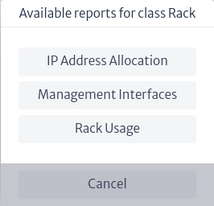

# Reports

In Kuwaiba, reports are HTML documents designed to provide detailed information about the objects that are part of the inventory. Their purpose is to inform and follow up on specific situations.
As of version 1.1, users can create their own reports using groovy scripts[^groovy], usually in three steps:

   1. **Retrieve the data:** Either by performing a query directly on the database or by using the high-level API provided by Kuwaiba. In the first case, the user will have to handle the raw nodes and relationships contained in the graph database and will most likely have to use Cypher[^cypher]. In the second case, he will have to use the documented Java API[^api_kuwaiba].
   2. **Information processing:** Consists of taking the data retrieved in step 1 and performing calculations, filtering and other processing to convert it into meaningful information.
   3. **Formatting and visualization:** This consists of creating a structure of tables, labels and/or graphs to present the information in a way that is clear and easy to read.

To access the reports module, locate in the menu presented at the top of the screen the `Others` section, represented with the list symbol . When accessing this section, a vertical menu will be displayed where you can see the `Reports` module, as shown in Figure 1.

|  |
| :--: |
| ***Figure 1**. Access to reporting module.* |

There are two types of reports: class level reports and inventory level reports. Both are explained in the following subsections.

[^groovy]: Groovy Language: http://www.groovy-lang.org/
[^cypher]: No4J’s Graph Query Language: https://neo4j.com/docs/cypher-manual/3.5/introduction/
[^api_kuwaiba]: Kuwaiba Persistence API: https://kuwaiba.org/docs/dev/javadoc/current/

## Class Level Reports

These reports are linked to the instances of a given class. From the reports module you can view the class level reports by clicking on the `Class Level Reports` option indicated in the red box in Figure 2, where all the existing class level reports are listed.

|  |
| :--: |
| ***Figura 2**. Class level reports.* |

To filter the reports by class, use the search bar indicated with `Choose a Class` in Figure 3. Here you can view all available classes by clicking on the  button and select one, either by searching directly in the drop-down list or by entering the class name. When selecting a specific class, such as `Rack`, only the reports corresponding to that class will appear, as shown in Figure 4.

|  |
| :--: |
| ***Figure 3**. Class selection.* |

|  |
| :--: |
| ***Figure 4**. Reports by class.* |

To create a new report, select the  button shown in Figure 2. Clicking on this button will open a new window (Figure 5) where you can choose the class to which the report belongs, enter the name, a description and choose the type of report, which in this case is available only in HTML format.

|  |
| :--: |
| ***Figure 5**. Create class level report.* |

> **Note.** If you have previously filtered the reports by class before creating a new one, when you open the creation window, the Class Name field will default to the class that was selected in the filter.
> 
> **Important.** In the Type field of Figure 5, when displaying the list of possible types, `CSV`, `PDF`, among others, appear. These formats are not yet natively supported, but you can export to PDF an HTML report from your browser, and it's also possible to generate raw text instead of an HTML document if you need  a CSV format. Likewise, you can copy the tables in your HTML report and paste them on an Excel sheet almost transparently 

To view and modify the contents of a specific report, select it. The contents of the report are displayed on the right side of the screen, as shown in Figure 6.

|  |
| :--: |
| ***Figure 6**. Report content.* |

The right side of Figure 6 shows the Groovy script used for the specific report, which can be edited directly from this window.

In the upper right part of Figure 6, three buttons can be seen. This image is expanded in Figure 7.

|  |
| :--: |
| ***Figure 7**. Report options.* |

* The icon  allows the user to modify the properties of the selected report. Clicking on it opens a new window as shown below, where the user can change the name of the report, modify its description, and enable or disable the report.

  |  |
  | :--: |
  | ***Figure 8**. Edit report properties.* |

    > **Important.** The `Enabled` button allows you to enable or disable the report, which determines whether it can be executed or not. A report can only be run if it is enabled. When a report is created, it is enabled by default.

* The icon  allows you to save the changes made to the script. If the user has modified the Groovy script of the report, it is necessary to select this button for the changes to be saved.
* The icon  deletes a report.

A class-level report is designed to apply to all inventory objects that belong to a specific class. To run this type of report, you can run it from any inventory object that is part of that class. For example, if we select an inventory object that belongs to the `Rack` class, from the Navigation module (detailed in the [Navigation][navman] chapter), we search for a Rack. In the object's options panel, we find the basic actions available, where the option called Reports is included, as shown in Figure 9.

|  |
| :--: |
| ***Figure 9**. Reports option in the object's options panel.* |

When selecting the `Reports` option in Figure 9, a new window appears with the reports associated to the Rack class (reports that can be executed from this object, as shown in Figure 10).

|  |
| :--: |
| ***Figure 10**. Available reports.* |

When a report is selected, a new tab opens in the browser with the HTML output of the report.

|  |
| :--: |
| ***Figure 11**. Report result.* |

> **Note:** Reports belonging to abstract classes are applicable to their subclasses. For example, if a report is created for the `GenericLocation` class, it will be available for its subclasses such as `Building`, `House`, `Neighborhood`, among others.

[navman]: ../navman/index.html

## Inventory Level Reports

These reports are not linked to inventory objects. Instead, they are used to display general purpose information, such as "All support contracts about to expire" or "All inventory objects with operational status Defective". For these reports, custom parameters can be defined, unlike class-level reports that only have the object that starts the report as a parameter. Parameters are always captured as strings, and it is necessary to parse and ensure that they match the correct format at the start of the report.

To view the existing inventory level reports, select the `Inventory Levels Reports` option that appears in the reports module, as shown in Figure 12. This will list all existing inventory level reports.

|  |
| :--: |
| ***Figure 12**. Inventory level reports.* |

You can filter the reports by name, in case you need to search for a particular report, in the `filter` field shown in Figure 13. If you select the  symbol, all the reports listed will appear and, as you type in the search bar, the results shown in the list will be limited to your search.

|  |
| :--: |
| ***Figure 13**. Inventory level report filtering.* |

You can create inventory level reports by clicking on the  button, which will open a new window where you can enter the name, a description and choose the type of report, which in this case is available only in HTML format.

|  |
| :--: |
| ***Figure 14**. Inventory level report filtering.* |

> **Important.** In the Type field of Figure 14, when displaying the list of possible types, `CSV`, `PDF`, among others, appear. These formats are not yet natively supported, but you can export to PDF an HTML report from your browser, and it's also possible to generate raw text instead of an HTML document if you need  a CSV format. Likewise, you can copy the tables in your HTML report and paste them on an Excel sheet almost transparently.

To view and modify the contents of a specific report, select it. The contents of the report are displayed on the right side of the screen, as shown in Figure 15.

|  |
| :--: |
| ***Figure 15**. Content of an inventory level report.* |

The right side of Figure 15 shows the Groovy script used for the specific report, which can be edited directly from this window.

In the upper right part of Figure 15, there are four buttons, detailed below.

|  |
| :--: |
| ***Figure 16**. Inventory level reporting options.*|

* As in the previous case, the  button allows the user to modify the properties of the selected report. Clicking on it opens a new window as shown below, where the user can rename the report, modify its description, enable or disable the report and add or remove parameters.

    |  |
    | :--: |
    | ***Figure 17**. Edit report properties.*|

    > **Important.** The `Enabled` button allows you to enable or disable the report, which determines whether it can be run or not. A report can only be run if it is enabled. When a report is created, it is enabled by default.

* The  icon allows you to save the changes made to the script. If the user has modified the Groovy script of the report, it is necessary to select this button for the changes to be saved.
* The icon  deletes a report.
* The icon  runs the report and opens a new tab in the browser with the HTML report output.

## How to Create Scripts

Creating complex scripts requires some knowledge about the Persistence API and the database structure. It’s out of the scope of this document to deeply explore these topics, but this section will give you a starting point. More documentation and examples will be published in the coming releases; for now, use the reports provided in the directory scripts in the client installation bundle as reference.

* Kuwaiba uses Groovy as scripting language. Its syntax is very similar to Java’s, but it’s optionally typed. We recommend you to use an external editor that supports Groovy syntax recognition such as Notepad++ (Windows) or GEdit (Linux/MacOS) to write your scripts, then copy the text to the corresponding field in the report properties.
* All scripts must return an HTMLReport object. This class and the others that are used to build the report are located in the package `org.neotropic.kuwaiba.modules.optional.reports.html`[^reportRef]. There are wrappers for the most common HTML tags, and constructing a report consists of nesting instances of these classes in the right order.
* The following variables are injected in the script and can be used at any moment:

    | Variable Name | Type | Notes |
    | --------------|------|-------|
    | instanceNode | Neo4jNode |   Only applicable to class level reports. It’s the node in the database that holds the information of the object that triggered the report. |
    | graphDb | Neo4j GraphDatabase | The reference to the connection handler. This gives complete access to the database. Use with caution.
    | className | String | Only applicable to class level reports. The class of the object that triggered the report. | 
    | objectId | Long | Only applicable to class level reports. The id of the object that triggered the report. |
    | parameters | HashMap[String, String] | Only applicable to inventory level reports. The list of parameters provided during the execution of the report. |

* There are some built-in reports that could serve as reference on how to retrieve and manipulate the information from the database. They are a temporary solution and will be converted to actual scripts in future releases, but they can help you get started on how to use the Persistence API.
* Sample Reports can be found in <https://sourceforge.net/p/kuwaiba/code/HEAD/tree/server/trunk/scripts/scripted-reports/>, where report-related scripts have the prefix `RP` in their name.

[^reportRef]: Reports: https://kuwaiba.org/docs/dev/javadoc/current/org/neotropic/kuwaiba/modules/optional/reports/html/package-summary.html
