# Scheduling 

The scheduling module allows users to schedule tasks that have been previously registered in Kuwaiba through the Task Manager module (refer to the documentation). Scheduling allows specifying the time period during which tasks should be executed.

The scheduling module belongs to the **Settings** category as shown in Figure 1.

| 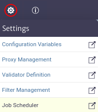 |
|:--:|
| ***Figure 1.** Scheduling module* |

## Scheduling Job pool

 Once the scheduling module is open, you need to create a job pool, which will allow you to create and manage jobs in an organized manner. To do this, locate the pool management button represented by a gear iconas shown in Figure 2.

| 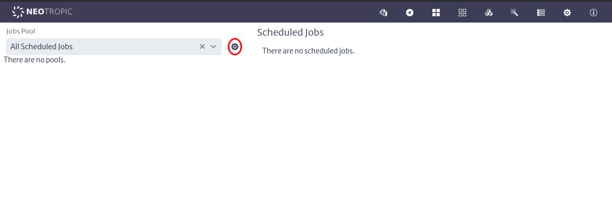 |
|:--:|
| ***Figure 2.** Manage pools button* |

Once clicked, the pool management window will open, as shown in Figure 3.

| 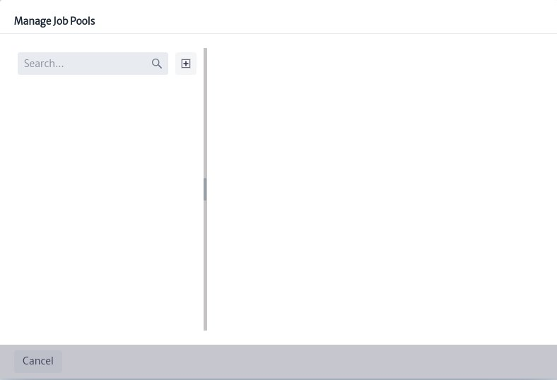 |
|:--:|
| ***Figure 3.** Manage pools window* |

In this window, you can search, create, and delete job pools. Next, create a new job pool using the button seen in Figure 3. The pool creation window shown in Figure 4 will open, where you must enter the name and description and click the OK button.

| 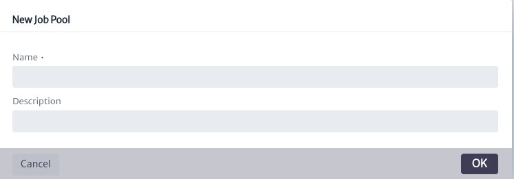 |
|:--:|
| ***Figure 4.** Pool creation window* |

Al crear el pool de job, se pueden visualizar las jobs que tiene asignados, eliminar el pool usando el botón  y editar sus propiedades utilizando la hoja de propiedades de la Figura 5.

When creating the job pool, you can view the jobs assigned to it, delete the pool using the buttonand edit its properties using the properties sheet shown in Figure 5.

| 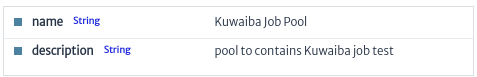 |
|:--:|
| ***Figure 5.** Pool property sheet* |

## Scheduling Job

A job consists of the following properties: 

| Property           | Description |
|--------------------|----------------------------------------|
| **Job pools**      | Pool to which the job will be assigned |
| **Name**           | Name of the job |
| **Description**    | Description of the job |
| **Users**          | Users assigned to the job |
| **Task**           | Task assigned to the job that will be executed |
| **CronExpression** | Expression that designates the time at which the job should be executed |
| **Enable**         | Flag to enable or disable the execution of the job |
| **LogResults**    | Flag to enable or disable logging of execution results in the console |

Once the job pool is created, the button to add jobswill be enabled in the main menu of the module, as seen in Figure 6. 

| 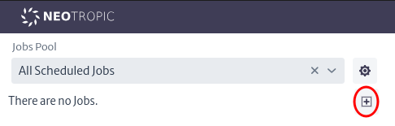 |
|:--:|
| ***Figure 6.** Create jobs button* |

Pressing it will open the job creation window shown in Figure 7.

| 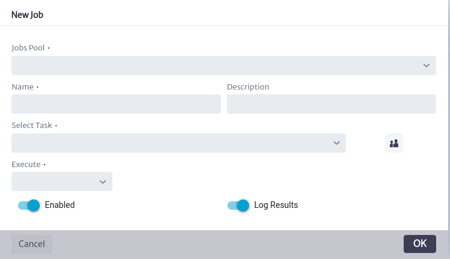 |
|:--:|
| ***Figure 7.** Jobs creation window* |

To create the job, follow these instructions:

* Select a pool in **Jobs Pool** combo box allows you to assign the new job to the desired pool.

* Fill in the text fields for Name and Description.

* Select a tasks in **Select Task** combo box allows you to assign the task to be executed by the job. This task must have been previously registered in Kuwaiba through the Task Manager module.

* Use the buttonallows you to assign users available in Kuwaiba to the job. These users will be notified of the task execution result (this feature will be added in the future and is not yet available).

* Fill **Execute**, this combo box allows you to select the job execution (CronExpression). The scheduling options include the following:

>- **Every**: Enables the execution of the job at short intervals, ranging from seconds to hours.
>- **Daily**: Allows daily execution of the job at the selected time of day.
>- **Weekly**: Enables weekly execution of the job. You must select the desired day of the week and time.
>- **Monthly**: Enables monthly execution of the job. You must select the desired day of the month and time. (If you select the 30th of each month, execution will be skipped in months with fewer than 30 days).

If all mandatory properties marked with * are filled in correctly, the *OK* button in the job creation window from Figure 7 will be enabled.

> **Note**
> Before creating or scheduling a job, ensure that the **scheduler** user is created in the application. If not, create it in group **system** with the name **scheduler** and type **System**. For more details on how to create users, refer to the [User Manger](../userman/README.md), which explains this in detail.

When a new job is created, it will be scheduled and queued to be executed according to the assigned execution interval. It can be viewed in the main window of the module as seen in Figure 8. Upon creating a job, it will **automatically be scheduled** every time the application starts. If for any reason you do not want it to be executed, you can disable its execution by setting the **Enable** property to **False** or by deleting the job.

Once the job is executed, the result of its execution will be logged in the *general events* of the AuditTrail using the name **scheduler**. You can refer to [AuditTrail](../auditTrail/README.md) for more details.

|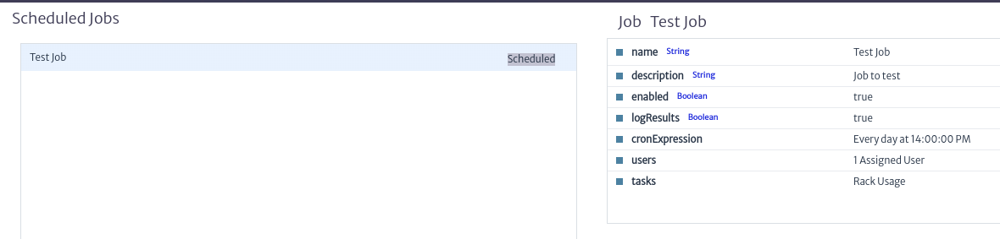 |
|:--:|
| ***Figure 8.** Jobs scheduled* |

When left-clicking on a job, the property sheet shown in Figure 9 will appear. This property sheet allows you to edit the properties of the job after it has been created.

|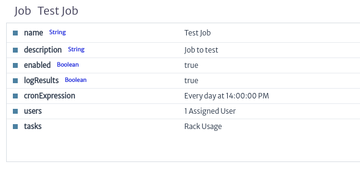 |
|:--:|
| ***Figure 9.** Job property sheet* |

All properties of a job seen previously can be edited by double-clicking the desired property on the property sheet.

To edit the **cronExpression** property, double-click on it. This will prompt the cronExpression editing popup window shown in Figure 10, which behaves similarly to when creating and assigning the execution of a new job. Once you've chosen the new job execution, click *OK* to edit, or *Cancel* if you don't wish to edit this property.

|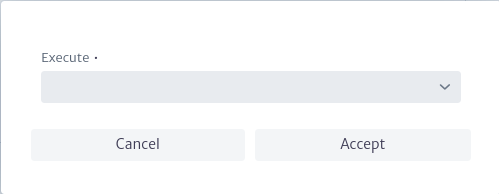 |
|:--:|
| ***Figure 10.** Edit cronExpression property window* |

Similarly, to edit the users assigned to the job, double-click on the **users** property. This will display the selection list of available users in Kuwaiba, as shown in Figure 11. Add or remove the users you want to assign or unassign from the job, then click *OK* to edit or *Cancel* if you don't wish to edit this property.

|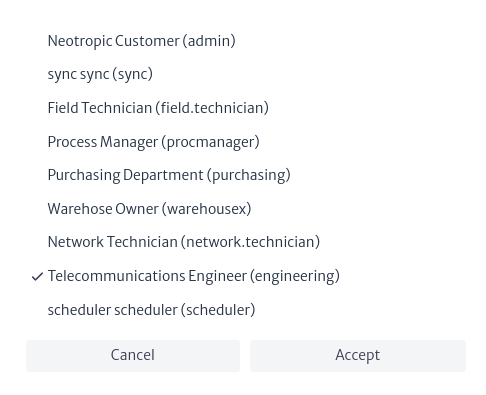 |
|:--:|
| ***Figure 11.** Edit users property window* |

Finally, to edit the task that the job should execute, double-click on the **tasks** property. This will open the task editing window shown in Figure 12, where you can choose any task registered in the Task Manager. Once you've selected the task, click *OK* to edit or *Cancel* if you don't wish to edit this property.

|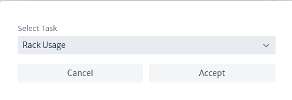 |
|:--:|
| ***Figure 12.** Edit tasks property window* |

Jobs have four possible states, which inform the user about the execution status of the jobs that have been scheduled. The status can be viewed in the central part of the main window of the module. The available states are:

> - Scheduled: Indicates that the job has been scheduled correctly and is waiting to be executed.
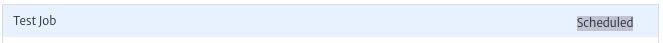
> - Running: Indicates that the job is currently running (it cannot be edited during this time).
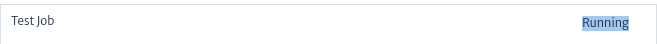
> - Executed:  Indicates that the job executed successfully in its last execution.
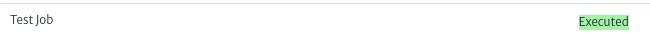
> - Error: Indicates that an error occurred in the last execution of the job.
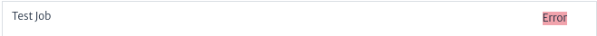

Finally, it's possible to view the list of jobs associated with a pool or all created jobs using the pool selector located on the left side of the main window. It's also possible to filter the results by job name. Additionally, this list allows you to delete a job using the buttonas shown in Figure 13.

|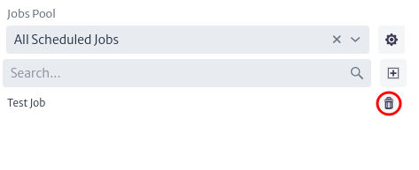 |
|:--:|
| ***Figure 13.** List of jobs* |