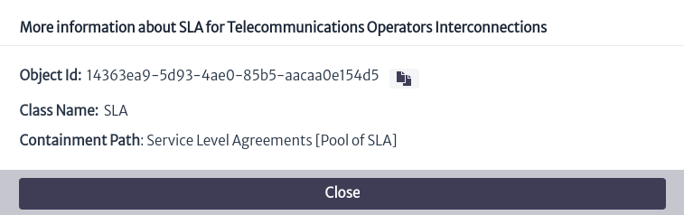

# Contract Manager

This module allows you to organize your contracts in pools and keep track of due dates and service providers.

Figure 1 shows the structure of the module in an example. Contracts are grouped into pools, where each pool can contain one or more contracts. Each contract, in turn, can be related to one or more inventory objects through the `RELATED_TO_SPECIAL` relationship, called `contractHas`, as illustrated in Figure.

|  |
| :-----: |
| ***Figure 1.** Contract management structure.* |

To access the module, click on the icon  located at the top of the screen. This will bring up a vertical menu where you can select the `Contract Manager` option, as illustrated in Figure 2.

|  |
| :-----: |
| ***Figure 2.** Access to the contracts module.* |

|  |
| :-----: |
| ***Figure 3.** Contracts module.* |

To manage the existing pools, select the icon . This will open a pop-up window similar to the one presented in Figure 4, where on the left side there is a list of all the available contract pools. When selecting one of them, the information corresponding to the pool will be displayed on the right side.

|  |
| :-----: |
| ***Figure 4.** Contract pool management.* |

|  |
| :-----: |
| ***Figure 5.** Information from a contract pool.* |

To create a contract pool, I selected the button  displayed in Figure 4, where a new window appears requesting the name, a description of the new pool and the type of pool as shown in Figure 6.

|  |
| :-----: |
| ***Figure 6.** Create new contract pool.* |

> **Note**
> Currently there are 4 types of contract pools in the database: `RentalContract`, `SLA`, `SupportContract` and `GenericContract` which encompasses the three mentioned above. If you want to add a new one, modify the database model (see more in chapter [Data Model Manager][data-model-manager]).

In the box depicted in Figure 3, the list of all existing contracts is initially displayed. You can filter the results using the search boxes located at the top of the box. The first search box allows you to filter the displayed contracts by the pool they belong to, the `All Contracts` option will list all contracts. You can type the name of the pool and the options will appear in a drop-down list or, you can extend the list by using the icon , where all existing pools will appear for you to select one.

|  |
| :-----: |
| ***Figure 7.** Contract search by contract pool.* |

The second search box, highlighted in Figure 8, allows you to filter the contracts in the current list by name.

|  |
| :-----: |
| ***Figure 8.** Search for contracts by name.* |

To create a new contract, select the icon  located in the main view of the module (Figure 3). When doing so, a window will appear asking for the new contract information, such as the pool it will belong to, the type, the contract name and a description.

|  |
| :-----: |
| ***Figure 9.** Creation of new contract.* |

> **Note**
> The contract type in Figure 9 can be selected only if the pool to which the new contract will belong is of type `GenericContract`, otherwise its value will be fixed and is equivalent to the same type to which the pool belongs.

To view the information of a contract, select the contract of interest in the list of contracts shown in Figure 3. The corresponding information will appear on the right side of the screen, as presented in Figure 10.

|  |
| :-----: |
| ***Figure 10.** Contract information.* |

The general information of the contract is shown in Figure 10, where the name, the creation date of the contract and its attributes can be found. These values can be modified by double clicking on the value of the property to be modified and then press enter to save the changes.

Additionally, in the upper right part there are some actions, which are detailed below:

|  |
| :-----: |
| ***Figure 11.** Actions associated with a contract.* |

* To delete a contract, I selected the button .
* By selecting the icon  you will get additional information about the contract, such as its identifier, the class it belongs to and the containment path, as seen in Figure 12.

  |  |
  | :-----: |
  | ***Figure 12.** Additional contract information.* |

* To copy the contract to another contract pool, select  where you can choose in which contract pool you want to generate a copy of the current contract.

  |  |
  | :-----: |
  | ***Figure 13.** Copy contract.* |

* The button  allows to move the contract to another existing contract pool.

  |  |
  | :-----: |
  | ***Figure 14.** Move contract.* |

In the lower part of Figure 10, the inventory objects related to the selected contract are listed. In front of each object, three options are presented.

|  |
| :-----: |
| ***Figure 15.** Inventory objects related to the contract.* |

* The icon  opens a new tab showing the Object Options Panel related to the inventory object (See more in [Object Options Panel][object-options-panel]).
* To view additional information about the inventory object, select the button  which displays a window similar to the one presented in Figure 12 with the object information.
* The icon  removes the relationship between the current contract and the object.

To relate an inventory object to an existing contract, locate the object's Object Options Panel (which you can access through the [Navigation][navman] module) and select the advanced action named `Relate to Contract`, as indicated in Figure 16. A window will then open in which you can search for the contract of interest. By clicking on the `OK` button, the contract will be linked to the object.

|  |
| :-----: |
| ***Figure 16.** Relate to contract advanced action.* |

|  |
| :-----: |
| ***Figure 17.** Relate object to a contract.* |

[navman]: ../../navigation/navman/index.html
[object-options-panel]: ../../navigation/navman/index.html#object-options-panel
[data-model-manager]: ../../administration/dmman/index.html