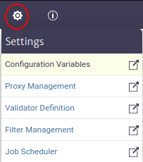
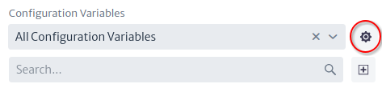
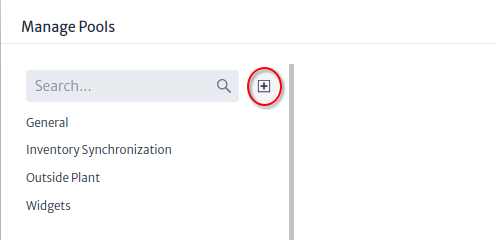
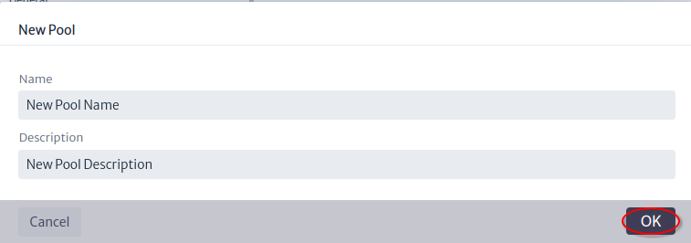
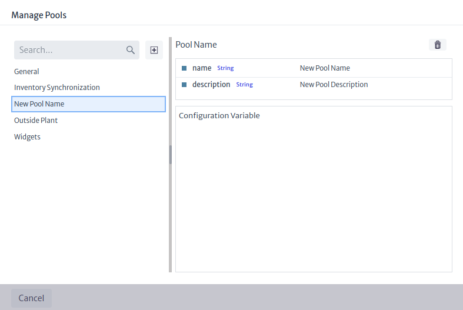
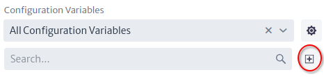
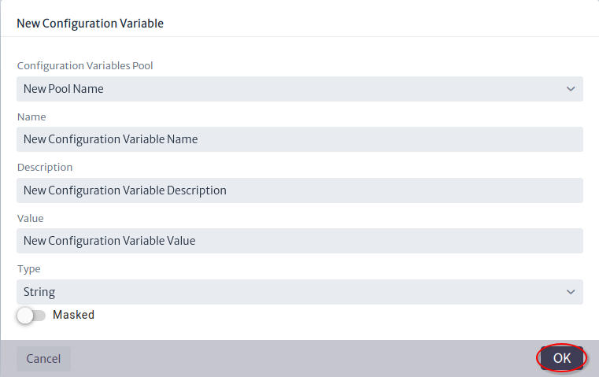
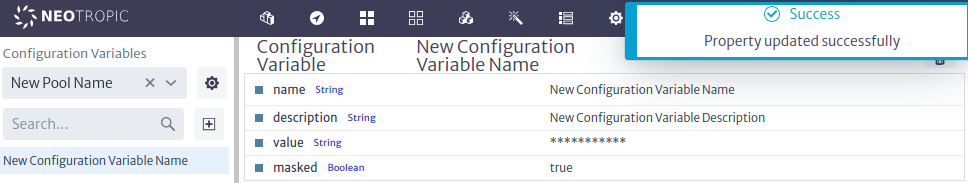

# Configuration Variables

The configuration variables module in Figure 1 belongs to the `Settings` category and manages [configuration variables pools](./#configuration-variable-pool) and [configuration variables](./#configuration-variable).

|  |
|:--:|
| ***Figure 1.** Configuration variables module* |

## Configuration Variable Pool {#configuration-variable-pool}

A configuration variable pool is a group of configuration variables.

The steps to create a pool are as follows:

* Click on the button to manage pools Figure 2.

|  |
|:--:|
| ***Figure 2.** Manage pools button* |

* In the manage pools window click on the new pool button Figure 3.

|  |
|:--:|
| ***Figure 3.** Manage pools window* |

* Enter a name and description for the new pool and click the OK button Figure 4.

|  |
|:--:|
| ***Figure 4.** New pool window* |

* The pool was created and can be edited or deleted from the pool manages window Figure 5.

|  |
|:--:|
| ***Figure 5.** Manage Pools Window* |

## Configuration Variable {#configuration-variable}

A configuration variable is a global variable that can be used in any module or script and the value is accessed via name using the `ApplicationEntityManager API`.

The steps to create a configuration variable are as follows:

* Click on the new configuration variable button Figure 6.

|  |
|:--:|
| ***Figure 6.** New configuration variable button* |

* Set the properties of the configuration variable Figure 7 and click the OK button.

|  |
|:--:|
| ***Figure 7.** New configuration variable window* |

To manage the configuration variable, select the configuration variable pool or search by name, select the variable you want to edit or delete and use the property sheet as shown in Figure 8.

|  |
|:--:|
| ***Figure 8.** Edit configuration variable* |
