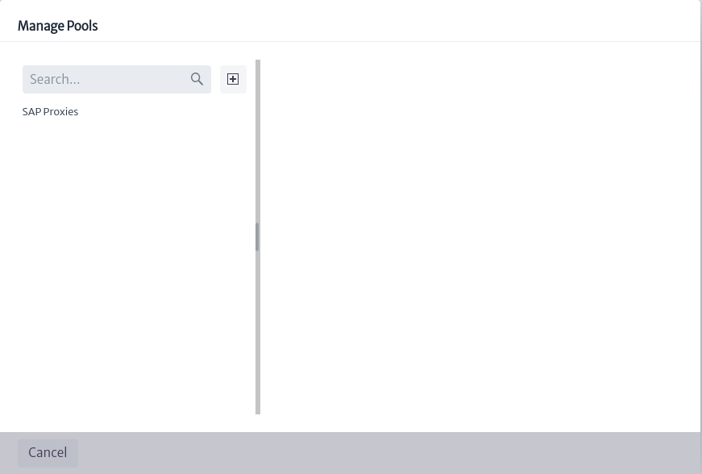
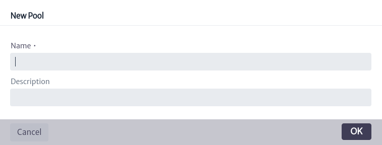

# Proxy Management

Proxies are an integration mechanism that allows to adapt the data model between Kuwaiba and external applications. They act on behalf of the elements of the Kuwaiba inventory and represent an object structure within the application.

Figure 1 shows the structure of the module, where the proxies are organized in pools. A proxy pool can contain one or more proxies. In the example, proxy 3 is related to three inventory objects via the `RELATED_TO_SPECIAL` relationship, named `hasProxy`. Similarly, the router related to the proxy has two cards that are also associated with the same proxy. If at any time either card ceases to have a `CHILD_OF` relationship with the router, it will continue to belong to the proxy.

|  |
| :-----: |
| ***Figure 1.** Proxy management structure.* |

To access the module, click on the configuration icon  located in the top menu of the screen. This will bring up a vertical menu where you can select the `Proxy Management` option, as seen in Figure 2.

|  |
| :-----: |
| ***Figure 2.** Access to the proxy module.* |

|  |
| :-----: |
| ***Figure 3.** Proxies module.* |

As mentioned above, proxies are grouped into pools. To manage existing pools, select the icon . This will open a pop-up window similar to the one illustrated in Figure 4, where on the left side is the list of all available proxy pools. When selecting one of them, the information corresponding to the pool will be displayed on the right side.

|  |
| :-----: |
| ***Figure 4.** Proxy pool management.* |

|  |
| :-----: |
| ***Figure 5.** Information from a pool of proxies.* |

In Figure 5 you can see the detailed information of a proxy pool, which includes the name, description and a list of the proxies belonging to that pool. To delete the selected pool, click the icon  shown in the above Figure.

To create a proxy pool, I selected the button  presented in Figure 4, where a new window appears requesting the name and a description of the new pool, as shown in Figure 6.

|  |
| :-----: |
| ***Figure 6.** Create new proxy pool.* |

In the box marked in Figure 3, the list of all existing proxies is initially displayed. You can filter the results using the search boxes located at the top of the box. The first search box allows you to filter the displayed proxies by the pool they belong to, the `All Proxies` option will list all proxies. You can type the name of the pool and the options will appear in a drop-down list or, you can extend the list using the icon , where all existing pools will appear for you to select one.

|  |
| :-----: |
| ***Figure 7.** Search for proxies by proxy pool.* |

The second search box, noted in Figure 8, allows you to filter the proxies in the current list by name.

|  |
| :-----: |
| ***Figure 8.** Search for proxies by name.* |

To create a new proxy, select the icon  located in the main view of the module (Figure 3). When you do so, a window will appear asking for the new proxy's information, such as the pool it will belong to, the proxy's class and name.

|  |
| :-----: |
| ***Figure 9.** Creation of new proxy.* |

> **Note**
> The class to which the new pool will belong is a subclass of `GenericProxy`. Currently, there is only `SAPProxy`, but the user can add more by modifying the data model. For more information see chapter [Data Model Manager][data-model-manager].

To view proxy information, select the proxy of interest from the list of proxies shown in Figure 3. The corresponding information will appear on the right side of the screen, as shown in Figure 10.

|  |
| :-----: |
| ***Figure 10.** Proxy information.* |

The general information of the proxy is indicated in Figure 10, where the name, the creation date of the proxy and its attributes can be found. These values can be modified by double clicking on the value of the property to be modified and then press enter to save the changes.

Additionally, in the upper right part there are some actions, which are detailed below:

|  |
| :-----: |
| ***Figure 11.** Actions associated with a proxy.* |

* To delete a proxy, I selected the button .
* You can relate the current proxy to a specific project by clicking on the button , where a window like the one shown in Figure 12 appears, in which the user can choose the project to which the proxy will be related.

  |  |
  | :-----: |
  | ***Figure 12.** Link proxy to a project.* |

* To copy the proxy to another proxy pool, select  where you can choose in which proxy pool you want to generate a copy of the current proxy.
  
  |  |
  | :-----: |
  | ***Figure 13.** Copy proxy action.* |

* The button  allows you to move the proxy to another existing proxy pool.
  
  |  |
  | :-----: |
  | ***Figure 14.** Move proxy action.* |

In the lower part of Figure 10, the inventory objects related to the selected proxy are listed, similar to how the projects associated with the proxy are displayed. In front of each object, three options are presented.

|  |
| :-----: |
| ***Figure 15.** Projects and inventory objects related to the proxy.* |

* The icon  opens a new tab showing the Object Options Panel related to the inventory object (See more in [Object Options Panel][object-options-panel]).
* To view additional information about the inventory object, select the button  which displays a window like the one shown below, indicating the object identifier, the class it belongs to and the object's containment path.
  
  |  |
  | :-----: |
  | ***Figure 15.** Additional Information on the object of the inventory.* |

* The icon  removes the relationship between the current proxy and the object.

To relate an inventory object to an existing proxy, locate the object's Object Options Panel (which you can access through the [Navigation][navman] module) and select the advanced action named `Relate to Proxy`, as indicated in Figure 16. A window will then open in which you can search for the proxy of interest. When you click the `OK` button, the proxy will be linked to the object.

|  |
| :-----: |
| ***Figure 16.** Advanced action to relate to proxy.* |

|  |
| :-----: |
| ***Figure 17.** Relate object to proxy.* |

[navman]: ../../navigation/navman/index.html
[object-options-panel]: ../../navigation/navman/index.html#object-options-panel
[data-model-manager]: ../../administration/dmman/index.html