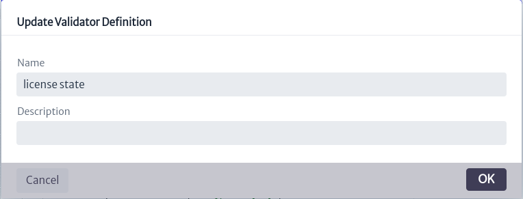

# Validators

Validators are flags that indicate the status, condition or certain characteristics of specific objects. These flags can take the form of percentages, status messages, among others. Validators are used to provide quick and easily interpretable information about the objects of the classes to which they are associated.

To access the validators module, locate in the top menu of the screen the `Settings` category, represented by the symbol . When clicked, a second menu will be displayed. Select the `Validator Definition` option, which will open the validator module interface, as shown in Figure 2.

|  |
| :--: |
| ***Figure 1.** Access to the validators module.* |

|  |
| :--: |
| ***Figure 2.** Validators.* |

As shown in Figure 2, in the initial interface of the module a list appears on the left side with all the existing validators. At the top, in the search box marked `Classes`, the validators can be filtered by the class they belong to. By selecting the  icon, a list of all classes will be displayed. Similarly, you can write the name of the class of interest in the search box, and the list will be updated according to what you enter in the field, as shown in Figure 3.

|  |
| :--: |
| ***Figure 3.** Search of validators by class.* |

As mentioned above, the search only shows the validators belonging to a selected class, as shown in Figure 4.

|  |
| :--: |
| ***Figure 4.** Filter validators by class.* |

Similarly, the module has a second search box, illustrated in Figure 5. This box allows searching for validators that match the terms entered, according to the list of validators already present.

|  |
| :--: |
| ***Figure 5.** Search for validators by name.* |

To add a new validator, select the icon  indicated in Figure 2. This will open a pop-up window, similar to the one shown in Figure 6, where the user can select the class to which the validator belongs, enter its name and add a description.

|  |
| :--: |
| ***Figure 6.** Create a validator.* |

When selecting a validator of interest, the script will be displayed on the right side of the screen, as in Figure 7.

|  |
| :--: |
| ***Figure 7.** Display of the selected validator.* |

For the example in Figure 7, the validator `license state` was selected. The name of the validator is indicated in the red box. Just below, the content of the validator is shown, which will be explained in the subsection [Validator Content](#validator-content). At the top right are four buttons, which are detailed in Figure 8.

|  |
| :--: |
| ***Figure 8.** Validator options.* |

* The icon  deletes a validator.
* The icon  allows modifying the name and description of the validator, displaying a window like the one shown in Figure 9.

    |  |
    | :--: |
    | ***Figure 9.** Validator properties update window.* |

* The icon  saves the changes made in the validator script.
* The icon  allows you to enable or disable the validator. A disabled validator will not be taken into account as an object validator.

## Validator Content

A validator is represented as a class that is added to the `classpath` of the application.

> **Important.** Validators are executed every time an object's information is abstracted, so it is recommendable not to add a very complex logic to the validator as it may generate significant performance impacts.

|  |
| :--: |
| ***Figure 10.** Validator contents.* |

Taking as an example the validator in Figure 7 (whose content is best seen in Figure 10), a validator follows the following rules:

* All validators extend the `ValidatorDefinition` class. This can be seen in line 15 of Figure 10. **It must not be modified by the user.**
* All validators have a constructor that **should not be modified by the user**, in other words, it is always the same.
* It has a `run` method, which injects the application entity managers (ApplicationEntityManager, BusinessEntityManager, MetadataEntityManager), the ConnectionManager and the object identifier and the class to which it belongs. The signature of this method must not be modified. The user can alter its content, since it is within this method where the validator value content is added. This injection allows using the methods of the entity managers to build the filter logic. The documentation can be found in Kuwaiba's documented Java API [^API].
* There are four ways to set up a validator:
  * **Suffix:** Adds a text after the object name. The property is called `suffix`.
  * **Prefix:** Adds a text before the object name. The property is called `prefix`.
  * **Color:** Changes the color of the text. The property is called `color`.
  * **Background color:** Changes the background color. The property is called `fill-color`.
  
  To set the properties of the validator, make use of the Properties, as shown in line 29 of Figure 10. It works as a HashMap, where the key is the property you want to set and the value is the value you want to give it, for example: `Properties.setProperties("color", "#00FF00")`.

In the [Navigation][navman] module, the validators related to an object can be observed, since, as mentioned above, the validators are returned together with the information of a given object.

|  |
| :--: |
| ***Figure 11.** Objects with validators.* |

Figure 11 shows the validators, added as a suffix to the name of the objects, in red.

You can see some examples of validators in SourceForge[^SourceForgeScripts]. Validator scripts start with `VD` in their name.

[navman]: ../../navigation/navman/index.html

  [^API]: Kuwaiba Persistence API: https://kuwaiba.org/docs/dev/javadoc/current/
  [^SourceForgeScripts]: SourceForge Validator Scripts: https://sourceforge.net/p/kuwaiba/code/HEAD/tree/server/trunk/scripts/scripted-validator/
