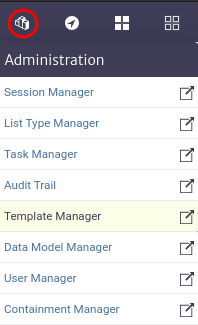
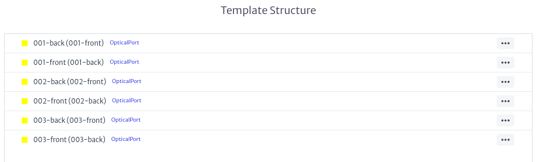

# Template Manager

In many scenarios, there are containment structures (see Containment Manager) that are created repeatedly, such as `Building → Floor → Room → Rack`, or `ODF/DDF` with the same number of ports `(24/12/36/48/72/96/144)`, or simply equipment with the same set of attributes. For example, all routers of a certain model: the provider, slots, etc., will always be the same. Creating these elements from scratch each time would be a tedious task. For this reason, Kuwaiba provides the template manager module, which allows the creation of object templates from real inventory elements.

The template manager module, shown in Figure 1, belongs to the **Administration** category.

|  |
|:--:|
| ***Figure 1.** Template manager module* |

## Creating a Template
Once the module is open, to create a template, select the class for which you want to create the template in the selector located at the top left of the module's main window, as shown in Figure 2.

|  |
|:--:|
| ***Figure 2.** Template manager selecting class* |

You can select any of the classes available in the application, except for abstract and list-type classes, as elements of these classes cannot be created.

Once the class is chosen, proceed to create the template using the button  The template creation window shown in Figure 3 will open. You must select the class if you have not already done so and assign a name to the template. Use a descriptive name, as this will be the one you see in the list of available templates.

|  |
|:--:|
| ***Figure 3.** Template creation window* |

Once the template is created, it will appear in the list of templates created for the selected class along with its actions, as shown in Figure 4.

|  |
|:--:|
| ***Figure 4.** Template list* |

## Template Actions

### Deleting a Template

It is possible to delete templates created for a class. To do so, use the button in the template actions shown in Figure 4. This will open the template deletion window shown in Figure 5. Click *OK* to delete it or *CANCEL* if you do not wish to proceed.

|  |
|:--:|
| ***Figure 5.** Template delete window* |

### Add Elements
You can add **elements** or **special elements** to templates. The elements that can be added are determined by the containment configuration of the class (see Containment Manager).

To add **elements** to the template, use the  button in the template actions shown in Figure 4. If you want to add **special elements**, use the  button. This will display the menu shown in Figure 6, where you must select whether you want to create a single element or multiple elements. If the class does not have any elements or special elements assigned in its containment, you will not be able to add elements of this type to the template.

|  |
|:--:|
| ***Figure 6.** Elements options menu* |

#### Creating a Single Element
If you select to create a single element from the menu in Figure 6, the single element creation window shown in Figure 7 will open. Here, you will need to assign a name to the element and choose the class of the element to add. The available classes depend on the containment configuration of the class to which you are creating the element (see Containment Manager).

|  |
|:--:|
| ***Figure 7.** Single element creation window* |

#### Creating Multiple Elements

If you select to create multiple elements from the menu in Figure 6, the multiple elements creation window shown in Figure 8 will open.

|  |
|:--:|
| ***Figure 8.** Multiple elements creation window* |

Where you must choose the class of the element to add. The available classes depend on the containment configuration of the class to which you are creating the element (see Containment Manager) and enter the **naming pattern** as detailed in Appendix A.

The result of using the **naming pattern** `[sequence(a,c)]`, useful for creating multiple elements like buildings in the *City* class,`[multiple-mirror(1,3)]`, useful for creating ports in the *SpliceBox* class and `[mirror(1,3)]`useful to create mirror ports in *ODF*,*SpliceBox* ** can be seen in Figures 9, 10  and 11 respectively.

|  |
|:--:|
| ***Figure 9.** Result of [sequence(a,c)]* |

|  |
|:--:|
| ***Figure 10.** Result of [multiple-mirror(1,3)]* |

|  |
|:--:|
| ***Figure 11.** Result of [mirror(1,3)]* |

## Template Element Management
Once the template elements are created, they will be added to the **template structure** section of the main module window, as shown in Figure 12.

|  |
|:--:|
| ***Figure 12.** List of elements* |

In this section, you can not only view the **elements** and the containment tree of the **multiple elements**, but also create new elements or special elements on existing ones or delete them using the button of the desired element, which will display the menu shown in Figure 13.

|  |
|:--:|
| ***Figure 13.** Manage elements menu* |

This allows you to create containment structures as complex as needed, following the containment configuration of the class for which the template is created, as shown in Figure 14.

|  |
|:--:|
| ***Figure 14.** Template Example* |

## Editing Properties of a Template or Elements
It is possible to edit the properties or elements of a template once they have been created. To do this, select the template or an element of the template you wish to edit. The properties sheet of the template, shown in Figure 15, or the properties of the template elements, shown in Figure 16, will appear on the right side of the main module window. Use this to edit the desired properties.

|  |
|:--:|
| ***Figure 15.** Example of template property sheet* |

|  |
|:--:|
| ***Figure 16.** Example of element property sheet* |

## Using the Template

You can create objects using the templates created in the template manager from any Kuwaiba module that has the **object options panel** as shown in Figure 17, explained in detail in the section [Object Options Panel](../navman/README.md#object-options-panel) in Navigation module. This functionality is available in modules such as navigation, pools, etc. 

|  |
|:--:|
| ***Figure 17.** Object options panel* |

In the **Basic Options** section of the **Object Options Panel** you will find the options **New Object from Template** and **New Special Object from Template** as shown in Figure 18.s

|  |
|:--:|
| ***Figure 18.** Options to create objects from template* |

When using them, the window for creating objects from a template, shown in Figure 19, will appear. The available classes depend on the containment configuration of the selected class.

|  |
|:--:|
| ***Figure 19.** Object creation window from template* |

For example, we use the *City* class and the previously created template *A sample city*. As a result, we create an object following the template, as observed in Figure 20.

|  |
|:--:|
| ***Figure 20.** Example object created from template* |